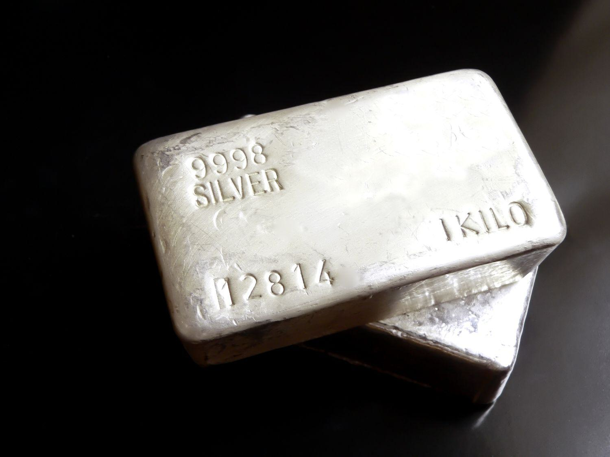

## Table of Contents

## What are silver options and how do they work?

Silver options are contracts that give you the right, but not the obligation, to buy or sell silver at a specific price before a certain date. These options are traded on financial markets and can be used by people who want to invest in silver without actually owning the physical metal. There are two types of silver options: call options, which let you buy silver, and put options, which let you sell silver. The price at which you can buy or sell is called the strike price, and the date by which you must decide is called the expiration date.

When you buy a silver option, you pay a fee called a premium. This premium is the cost of the option and depends on things like how much time is left until the option expires and how much the price of silver is expected to move. If you think the price of silver will go up, you might buy a call option. If the price of silver goes above the strike price before the expiration date, you can buy silver at the lower strike price and make a profit. If you think the price of silver will go down, you might buy a put option. If the price of silver falls below the strike price, you can sell silver at the higher strike price and make a profit. If the price of silver doesn't move in the direction you expected, you can let the option expire and only lose the premium you paid.

## What are the benefits of investing in silver options?

Investing in silver options can be a good way to make money without having to buy and store physical silver. Options let you control a lot of silver for a small amount of money, called the premium. This means you can make big profits if the price of silver moves in the direction you expect. For example, if you think the price of silver will go up, you can buy a call option. If the price does go up, you can buy silver at a lower price and sell it at the higher market price, making a profit.

Another benefit is that options limit how much you can lose. When you buy an option, the most you can lose is the premium you paid. This is different from buying physical silver or silver futures, where you could lose a lot more if the price goes down. Options also give you flexibility. You can choose when to buy or sell, and you can change your mind before the option expires. This makes it easier to react to changes in the market and manage your investment.

## How can someone start trading silver options?

To start trading silver options, you first need to open an account with a broker that offers options trading. Many online brokers let you trade options, but you need to make sure they have silver options available. Once you have an account, you need to fund it with money to buy options. Then, you can use the broker's trading platform to look at different silver options and decide which ones to buy. You can choose between call options if you think the price of silver will go up, or put options if you think it will go down.

After you buy an option, you need to keep an eye on the price of silver and the expiration date of your option. If the price moves in the direction you expected before the option expires, you can make a profit by exercising your option or selling it to someone else. If the price doesn't move the way you thought it would, you can let the option expire and only lose the premium you paid. Trading silver options can be a good way to make money, but it's important to understand the risks and learn how to manage them.

## What are the key differences between buying physical silver and trading silver options?

When you buy physical silver, you are actually getting the metal. You can hold it, store it, and sell it whenever you want. The price of silver can go up or down, and if you sell it for more than you paid, you make a profit. But you need to think about where to keep it safe, and it can be hard to sell quickly. Also, you need a lot of money to buy a big amount of silver.

Trading silver options is different because you are not buying the actual metal. Instead, you are buying a contract that gives you the right to buy or sell silver at a certain price before a certain date. This can be cheaper because you only pay a small fee called a premium. If the price of silver moves the way you expect, you can make a lot of money without needing to buy the silver itself. But if the price doesn't move the way you thought, you can lose the money you paid for the option. Trading options can be riskier, but it also gives you more ways to make money without having to store physical silver.

## What are the risks associated with silver options trading?

Trading silver options can be risky because you might lose all the money you paid for the option if the price of silver doesn't move the way you thought it would. When you buy an option, you pay a fee called a premium. If the price of silver doesn't go up or down enough before the option expires, you lose that money. This means you need to be good at guessing where the price of silver will go, and even experts can get it wrong sometimes.

Another risk is that options can be complicated. There are a lot of things to think about, like the strike price, the expiration date, and how much the price of silver might move. If you don't understand these things well, you might make bad choices and lose money. Also, options are not as easy to trade as physical silver. You need to find a broker who offers them, and the market can be less predictable, making it harder to know when to buy or sell.

## How do market conditions affect silver options pricing?

Market conditions can change the price of silver options a lot. If people think the price of silver will go up soon, the price of call options will go up because more people want to buy them. On the other hand, if people think the price of silver will go down, the price of put options will go up. Things like economic news, changes in interest rates, or even big events like wars can make people want to buy or sell silver, which affects the price of options. If the market is very unsure about what will happen next, the price of options can go up because people are willing to pay more to protect themselves or bet on big changes.

The time left until the option expires also matters. If an option is going to expire soon, it might be cheaper because there's less time for the price of silver to move a lot. But if there's a lot of time left, the option might be more expensive because there's more chance for the price to change. Also, how much the price of silver usually moves, called volatility, can change the price of options. If silver's price is moving a lot, options will be more expensive because there's a bigger chance for big profits or losses.

## What strategies can be used to trade silver options effectively?

One good way to trade silver options is to use a strategy called "buying calls." If you think the price of silver will go up, you can buy a call option. This gives you the right to buy silver at a certain price, called the strike price, before the option expires. If the price of silver goes above the strike price, you can buy the silver at the lower price and sell it at the higher market price, making a profit. This strategy can be good if you want to make money from a rising silver price without having to buy the actual metal. But remember, if the price doesn't go up, you will lose the money you paid for the option.

Another strategy is "buying puts." This is what you do if you think the price of silver will go down. By buying a put option, you get the right to sell silver at the strike price before the option expires. If the price of silver falls below the strike price, you can buy silver at the lower market price and sell it at the higher strike price, making a profit. This can be a good way to make money if you think silver prices will drop. But just like with call options, if the price doesn't move the way you expect, you will lose the money you paid for the put option.

A third strategy is called "covered calls." This is a bit more complicated but can be safer. If you already own silver, you can sell call options against it. This means you get paid the premium for the option, and if the price of silver goes up, the person who bought the option can buy your silver at the strike price. If the price stays below the strike price, you keep the premium and your silver. This can be a good way to make some extra money from your silver, but it limits how much you can make if the price goes up a lot.

## How does leverage work in silver options and what are its implications?

Leverage in silver options means you can control a lot of silver with just a little bit of money. When you buy an option, you only pay a small fee called a premium. This lets you make big profits if the price of silver moves the way you expect, without having to buy the actual silver. For example, if you think the price of silver will go up, you can buy a call option. If the price does go up, you can make a lot more money than if you had just bought physical silver with the same amount of money.

But leverage can also make things riskier. If the price of silver doesn't move the way you thought it would, you can lose all the money you paid for the option. This means you need to be careful and know what you're doing. Leverage can help you make more money, but it can also make you lose money faster if you're wrong about the price of silver. So, it's important to understand the risks and use leverage wisely when trading silver options.

## What are the tax implications of trading silver options?

When you make money from trading silver options, you have to pay taxes on your profits. In the United States, the money you make from options is usually considered capital gains. If you hold the option for less than a year before selling it, the profit is taxed as short-term capital gains, which are taxed at your regular income tax rate. If you hold the option for more than a year, the profit is taxed as long-term capital gains, which can be taxed at a lower rate, depending on your income.

If you lose money on your silver options, you might be able to use those losses to lower your taxes. You can use your losses to reduce your capital gains from other investments. If your losses are more than your gains, you can use up to $3,000 of the extra losses to lower your regular income. Any losses you can't use in one year can be carried over to future years. It's a good idea to talk to a tax professional to make sure you're doing everything right and taking advantage of all the tax rules that apply to you.

## How can one analyze the silver market to make informed options trading decisions?

To make good decisions about trading silver options, you need to look at the silver market carefully. One way to do this is by checking the price charts. These charts show how the price of silver has moved in the past and can help you guess where it might go next. You can also look at things like the amount of silver being bought and sold, called the volume, and how much the price usually moves, called volatility. If the volume is high and the price is moving a lot, it might mean that big changes are coming. Another important thing to look at is what's happening in the world that could affect silver prices, like economic news or changes in interest rates.

Another way to analyze the silver market is by looking at what other people are saying and doing. You can read reports from experts who study the silver market and see what they think will happen next. Also, you can look at what big investors, like hedge funds, are doing with silver. If they are buying a lot of silver, it might mean they think the price will go up. On the other hand, if they are selling, it might mean they think the price will go down. By putting all this information together, you can make better guesses about where the price of silver might go and decide whether to buy call options if you think the price will rise, or put options if you think it will fall.

## What are the advanced techniques for hedging with silver options?

One advanced way to hedge with silver options is by using a strategy called a "straddle." This means you buy both a call option and a put option at the same time, with the same strike price and expiration date. The idea is to make money no matter which way the price of silver moves. If the price goes up a lot, you can use the call option to buy silver at a lower price and sell it at the higher market price. If the price goes down a lot, you can use the put option to sell silver at a higher price than the market price. This can be a good way to protect yourself if you think the price of silver will move a lot but you're not sure which way.

Another advanced technique is called a "collar." This is a bit more complicated but can be very useful. If you already own silver, you can use a collar to protect yourself from big price drops while still being able to make some money if the price goes up. To do this, you sell a call option at a higher price than the current market price and buy a put option at a lower price. The money you get from selling the call option can help pay for the put option. If the price of silver goes down, the put option lets you sell your silver at the higher strike price, protecting you from big losses. If the price goes up, the call option might get used, but you still make some money because the price is higher than when you started.

## How do regulatory changes impact the trading of silver options?

Regulatory changes can have a big impact on trading silver options. When governments or financial groups make new rules, they can change how easy or hard it is to trade options. For example, if a new rule makes it harder to trade options, fewer people might want to do it, and the price of options could go down. On the other hand, if a new rule makes trading options easier, more people might start trading, and the price of options could go up. Also, new rules might make brokers charge more money for trading options, which can affect how much money you make or lose.

Another way regulatory changes can affect silver options is by changing how much risk you have to take. If new rules make it safer to trade options, more people might want to try it, and the market could grow. But if new rules make trading options riskier, some people might stop trading, and the market could shrink. It's important to keep an eye on these changes because they can affect your decisions about when to buy or sell silver options.

## References & Further Reading

[1]: Bergstra, J., Bardenet, R., Bengio, Y., & Kégl, B. (2011). ["Algorithms for Hyper-Parameter Optimization."](https://dl.acm.org/doi/10.5555/2986459.2986743) Advances in Neural Information Processing Systems 24.

[2]: ["Advances in Financial Machine Learning"](https://www.amazon.com/Advances-Financial-Machine-Learning-Marcos/dp/1119482089) by Marcos Lopez de Prado

[3]: ["Evidence-Based Technical Analysis: Applying the Scientific Method and Statistical Inference to Trading Signals"](https://www.amazon.com/Evidence-Based-Technical-Analysis-Scientific-Statistical/dp/0470008741) by David Aronson

[4]: ["Machine Learning for Algorithmic Trading"](https://github.com/stefan-jansen/machine-learning-for-trading) by Stefan Jansen

[5]: ["Quantitative Trading: How to Build Your Own Algorithmic Trading Business"](https://www.amazon.com/Quantitative-Trading-Build-Algorithmic-Business/dp/1119800064) by Ernest P. Chan