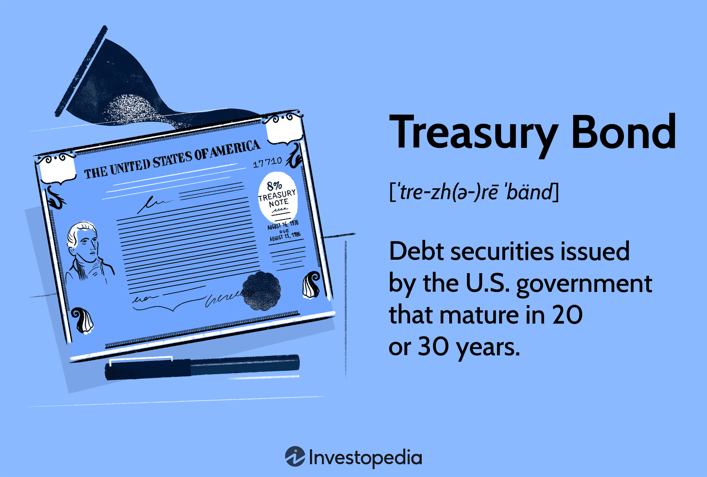

## Table of Contents

## What are U.S. Treasury securities?

U.S. Treasury securities are loans that people and organizations give to the U.S. government. When you buy a Treasury security, you are lending money to the government, and in return, the government promises to pay you back with interest over time. These securities are considered very safe because they are backed by the full faith and credit of the U.S. government.

There are different types of Treasury securities, like Treasury bills, notes, and bonds. Treasury bills are short-term and mature in a few days to a year. Treasury notes have longer terms, usually from two to ten years. Treasury bonds are long-term and mature in 20 to 30 years. Each type pays interest in different ways, but they all help the government raise money to pay for things like roads, schools, and defense.

## Why should someone consider investing in U.S. Treasury securities?

One reason to consider investing in U.S. Treasury securities is that they are very safe. They are backed by the U.S. government, which means there's a very low chance you won't get your money back. This makes them a good choice if you want to keep your money safe and not take big risks. They can be a good place to put your money if you're saving for something important and don't want to lose any of it.

Another reason is that they can give you a steady income. Treasury securities pay interest regularly, which can help you plan your finances. If you buy a Treasury note or bond, you'll get interest payments every six months. This can be helpful if you need a reliable source of income, like if you're retired or saving up for something over time. Even though the interest rates might not be as high as some other investments, the safety and reliability can make them a good choice for many people.

## What types of U.S. Treasury securities are available for purchase?

There are several types of U.S. Treasury securities that people can buy. The first type is Treasury bills, often called T-bills. These are short-term securities that mature in a few days up to one year. When you buy a T-bill, you don't get interest payments like with other securities. Instead, you buy them at a discount and get the full face value when they mature. This means you make money from the difference between what you paid and what you get back.

The second type is Treasury notes, which are medium-term securities that mature in two to ten years. When you buy a Treasury note, you get interest payments every six months until the note matures. This can be a good choice if you want a steady income from your investment. The third type is Treasury bonds, which are long-term securities that mature in 20 to 30 years. Like Treasury notes, they also pay interest every six months. These are good if you want to invest for a long time and get regular interest payments.

Lastly, there are Treasury Inflation-Protected Securities (TIPS). These are special because they help protect your money from inflation. The value of TIPS goes up with inflation and down with deflation. They also pay interest every six months, but the interest is calculated on the adjusted value of the security. This means your investment keeps up with the cost of living, which can be important if you're saving for the future.

## How can someone purchase U.S. Treasury securities?

You can buy U.S. Treasury securities in two main ways. The first way is through the TreasuryDirect website. This is a website run by the U.S. Department of the Treasury where you can set up an account and buy securities directly from the government. It's easy to use and you don't need to pay any fees to buy the securities. Once you have an account, you can choose which type of security you want to buy, like T-bills, notes, bonds, or TIPS, and how much you want to spend. The money will be taken from your bank account, and you'll get your interest payments and the money back when the security matures, all through TreasuryDirect.

The second way to buy Treasury securities is through a bank or a broker. Many banks and brokerage firms offer Treasury securities to their customers. You might need to have an account with them, and they might charge you a fee for buying the securities. But they can help you if you're not sure how to do it yourself. They can also help you buy securities in an auction, which is when the government sells new securities to investors. Once you buy the securities through a bank or broker, they'll take care of getting your interest payments and returning your money when the security matures.

## What are the minimum investment amounts for different types of Treasury securities?

The minimum investment amounts for different types of Treasury securities are pretty easy to understand. For Treasury bills, notes, bonds, and TIPS, if you buy them directly from the TreasuryDirect website, the minimum amount you can buy is $100. This means you need at least $100 to start investing in any of these securities.

If you buy through a bank or a broker, the minimum amount might be different. Some banks and brokers might let you buy Treasury securities for less than $100, but others might have a higher minimum, like $1,000 or more. It's a good idea to check with your bank or broker to find out their rules before you decide to buy.

## What are the maturity periods for various Treasury securities?

Treasury securities come in different types with different maturity periods. Treasury bills, or T-bills, are short-term securities that mature in a few days to one year. This means if you buy a T-bill, you'll get your money back in a short amount of time, from just a few days up to 52 weeks. T-bills are a good choice if you want to invest your money for a short time and get it back quickly.

Treasury notes and bonds have longer maturity periods. Treasury notes mature in two to ten years. If you buy a note, you'll get your money back after two, three, five, seven, or ten years. Treasury bonds are long-term and mature in 20 to 30 years. These are good if you want to invest your money for a long time. There are also Treasury Inflation-Protected Securities (TIPS), which can mature in five, ten, or thirty years. TIPS help protect your money from inflation, and the maturity period you choose depends on how long you want to invest.

## How is the interest on Treasury securities calculated and paid?

Interest on Treasury securities is calculated and paid differently depending on the type of security. For Treasury bills, you don't get regular interest payments. Instead, you buy them at a discount, which means you pay less than the face value. When the T-bill matures, you get the full face value back. The difference between what you paid and what you get back is your interest. For example, if you buy a $1,000 T-bill for $980 and it matures in a year, you'll get $1,000 back, and the $20 difference is your interest.

For Treasury notes, bonds, and TIPS, you get interest payments every six months. The interest is calculated based on the face value of the security and the [interest rate](/wiki/interest-rate-trading-strategies) you get when you buy it. For example, if you buy a $1,000 Treasury note with a 2% annual interest rate, you'll get $10 every six months ($1,000 x 0.02 / 2 = $10). This payment comes straight to your bank account or is added back to your TreasuryDirect account. For TIPS, the interest payment changes with inflation, so if prices go up, your interest payment goes up too.

## What are the tax implications of investing in U.S. Treasury securities?

When you invest in U.S. Treasury securities, you need to know about the taxes. The interest you earn from Treasury securities is taxable at the federal level. This means you have to pay federal income tax on the interest you get every year. But there's good news: the interest is not taxed by state and local governments. So if you live in a place with high state or local taxes, Treasury securities can be a good choice because you won't have to pay those extra taxes on your interest.

For example, if you earn $100 in interest from a Treasury note, you'll need to report that $100 on your federal tax return and pay federal taxes on it. But you won't have to pay any state or local taxes on that $100. This can save you money if you live in a state with high taxes. Also, if you buy and sell Treasury securities, you might have to pay capital gains tax if you sell them for more than you paid. But if you hold them until they mature, you won't have to worry about capital gains tax.

## Can U.S. Treasury securities be sold before maturity? If so, how?

Yes, you can sell U.S. Treasury securities before they mature. If you bought your securities through TreasuryDirect, you can sell them in the TreasuryDirect system. You just need to go to your account, choose the security you want to sell, and follow the steps to sell it. The money from the sale will go back into your bank account. It's easy to do and you can sell your securities whenever you want.

If you bought your securities through a bank or a broker, you can sell them through that same bank or broker. You'll need to contact them and tell them you want to sell your securities. They'll help you with the process and might charge a fee for selling. Once the sale is done, the money will go into your account with the bank or broker. Selling through a bank or broker can be a bit more complicated, but they can help you every step of the way.

## What are the risks associated with investing in U.S. Treasury securities?

U.S. Treasury securities are considered very safe because they are backed by the U.S. government. This means there's a very low chance that you won't get your money back. But there are still some risks you should know about. One risk is interest rate risk. If interest rates go up after you buy a Treasury security, the value of your security might go down. This can be a problem if you need to sell your security before it matures because you might get less money than you expected.

Another risk is inflation risk. Inflation is when prices go up over time, making your money worth less. If inflation is high, the interest you earn from your Treasury securities might not keep up with the rising costs. This means the real value of your investment could go down. While Treasury Inflation-Protected Securities (TIPS) can help protect against inflation, regular Treasury securities don't have this protection. So, it's important to think about inflation when you're deciding to invest in Treasury securities.

## How do Treasury securities fit into a diversified investment portfolio?

Treasury securities can be a great part of a diversified investment portfolio because they are very safe and reliable. When you include them in your investments, they can help balance out riskier investments like stocks or real estate. If the stock market goes down, your Treasury securities will still be there, giving you steady interest payments and keeping your money safe. This can make you feel more secure and help you avoid big losses if other parts of your portfolio don't do well.

Another way Treasury securities fit into a diversified portfolio is by providing a steady income. If you're retired or saving for something important, the regular interest payments from Treasury notes, bonds, or TIPS can help you plan your finances. While the interest rates might not be as high as some other investments, the safety and reliability of Treasury securities make them a good choice for many people. By mixing them with other types of investments, you can create a portfolio that meets your needs for both safety and income.

## What advanced strategies can be used to optimize returns from Treasury securities?

One advanced strategy to optimize returns from Treasury securities is called laddering. This means you buy different Treasury securities that mature at different times. For example, you might buy some that mature in one year, some in two years, and some in five years. When each security matures, you can take the money and buy a new one with a longer maturity. This way, you always have some money coming in, and you can take advantage of higher interest rates if they go up. Laddering helps you spread out your risk and can give you a better overall return over time.

Another strategy is to use Treasury securities as part of a bond swap. This means you sell one Treasury security and use the money to buy another one that might have a better interest rate or a different maturity date. For example, if interest rates go up, you might sell a Treasury note with a lower rate and buy one with a higher rate. This can help you earn more interest. But you need to be careful because selling before maturity can lead to capital gains tax if you make a profit. So, it's important to think about the tax implications and make sure the swap will really help you in the long run.

## What are the risks involved in treasury securities and algo trading?

Treasury securities are essential components of investment portfolios, widely recognized for their safety and predictability. However, like all financial instruments, they come with inherent risks. When considering investments in treasury bonds, investors should be aware of credit, interest rate, and inflation risks, each capable of impacting the return on investment.

Credit risk in treasury securities is minimal since these securities are backed by the full faith and credit of the United States government. However, this does not mean they are completely without risk; the perceived creditworthiness of the government can evolve, potentially affecting security prices and yields. Currently, the U.S. Treasury is viewed as a safe haven, but geopolitical and economic shifts could alter this perception.

Interest rate risk is more pronounced, as the value of treasury securities is inversely related to interest rate fluctuations. When interest rates rise, the market value of existing bonds typically decreases, and vice versa. The duration of a bond, a measure of its sensitivity to interest rates, becomes a crucial consideration. Longer-duration bonds are more affected by interest rate changes.

$$
\text{Duration} = \frac{\sum \left( \frac{t \cdot C_t}{(1 + y)^t} \right)}{\sum \left( \frac{C_t}{(1 + y)^t} \right)}
$$

Where:
- $t$ is the time period.
- $C_t$ is the cash flow at time $t$.
- $y$ is the yield to maturity.

Inflation risk is another critical [factor](/wiki/factor-investing). If inflation surpasses the yield on a treasury security, the real return can be negative. Treasury Inflation-Protected Securities (TIPS) are designed to mitigate this risk by adjusting their principal according to inflation rates. 

In the context of [algorithmic trading](/wiki/algorithmic-trading), specific risks arise in addition to those inherent in the bond market. Data dependency is a significant concern, as algorithms rely on historical and real-time data to execute trades. Errors or inaccuracies in data can lead to suboptimal trading decisions. Moreover, market [volatility](/wiki/volatility-trading-strategies) can exacerbate the impact of ill-timed trades, often executed in milliseconds by these algorithms, leading to potential losses if not meticulously programmed.

Mitigating these risks involves adopting smart investment practices. Diversification across various securities with differing durations can reduce exposure to interest rate risk. Regularly monitoring inflation rates and economic indicators will help address inflation risk, especially when investing in long-term fixed-rate securities. For managed portfolios, integrating TIPS can protect against unexpected inflation surges.

To manage algo trading risks, rigorous testing of algorithm parameters is critical. Backtesting strategies over extensive data sets can illustrate potential performance across varied market conditions. Ensuring data integrity through reliable data sources and adopting robust error-handling mechanisms within the trading algorithms can prevent costly mistakes. Additionally, maintaining a balance between automated and manual oversight can provide a safety net against unexpected market events.

In conclusion, while treasury securities are foundational to conservative investment strategies, understanding and mitigating associated risks is crucial for maintaining portfolio performance. Adopting algorithmic trading requires careful calibration and monitoring to harness technology's benefits without falling prey to its potential pitfalls.

## References & Further Reading

[1]: ["Investing in Treasury Securities"](https://www.investopedia.com/articles/investing/073113/introduction-treasury-securities.asp) - U.S. Department of the Treasury's official resource for understanding treasury securities.

[2]: Hurd, M., & Rohan, R. (2020). ["The Handbook of Fixed Income Securities, Eighth Edition"](https://onlinelibrary.wiley.com/doi/book/10.1002/9781118709207) - A comprehensive guide on fixed income securities, including treasury bonds.

[3]: Lopez de Prado, M. (2018). ["Advances in Financial Machine Learning"](https://www.amazon.com/Advances-Financial-Machine-Learning-Marcos/dp/1119482089) - Insights on machine learning applications in financial markets, including algorithmic trading.

[4]: Aronson, D. (2011). ["Evidence-Based Technical Analysis: Applying the Scientific Method and Statistical Inference to Trading Signals"](https://www.amazon.com/Evidence-Based-Technical-Analysis-Scientific-Statistical/dp/0470008741) - A resource on technical analysis and trading strategies.

[5]: Chan, E. (2009). ["Quantitative Trading: How to Build Your Own Algorithmic Trading Business"](https://github.com/ftvision/quant_trading_echan_book) - A practical guide to setting up algorithmic trading strategies.

[6]: ["Auction Basics – Understanding Treasury Auctions"](https://www.schwab.com/learn/story/how-do-treasury-auctions-work) - Learn about the auction process for purchasing U.S. Treasury securities directly from the government.