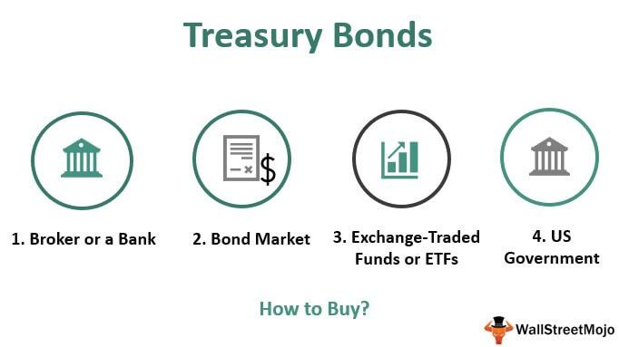

Treasury securities play a pivotal role in the global investment landscape due to their reputation for safety and reliability. These debt instruments, backed by the full faith and credit of the U.S. government, are utilized by various investors, ranging from individuals to large financial institutions, as a cornerstone of their portfolios. The primary appeal of treasury securities lies in their risk-free nature, making them a preferred choice during periods of market volatility.

In recent years, a dual approach involving the traditional method of bond buying and the contemporary practice of algorithmic trading has emerged in the realm of treasury investments. This combination offers investors the opportunity to optimize returns by leveraging technology alongside conventional investment strategies. Algorithmic trading, which involves the use of complex algorithms to execute trades at optimal times and prices, has brought a new level of precision and efficiency to bond markets. It allows for the rapid execution of trades, often with greater accuracy than human traders, thereby enhancing the potential for profit in both primary and secondary markets.



The aim of this article is to explore these facets of treasury investment comprehensively, offering insights into the mechanics and advantages of both traditional and algorithmic approaches. By examining the intricacies of these strategies, the article seeks to guide investors in optimizing their investment portfolios, balancing the historical security of treasuries with the innovative power of algorithmic trading. Through this exploration, investors can not only secure their investments in a changing market landscape but also leverage modern technology to enhance decision-making processes.

## Table of Contents

## Understanding Treasury Securities

Treasury securities are debt instruments issued by the U.S. Department of the Treasury to finance government spending. They play a crucial role in the financial markets by providing a secure and stable investment option for individuals, institutions, and foreign governments. These securities are backed by the full faith and credit of the U.S. government, making them one of the safest investment options available.

**Types of Treasury Securities**

1. **Treasury Bills (T-Bills):** These are short-term securities that mature in one year or less. T-Bills are issued at a discount and mature at face value. The difference between the purchase price and the face value is the interest earned by the investor. T-Bills are commonly used by investors seeking a low-risk place to park cash temporarily.

2. **Treasury Notes (T-Notes):** These securities have maturities ranging from 2 to 10 years. They pay interest every six months and are issued at or near face value. T-Notes are popular among investors looking for a balance between short-term risk and long-term yield.

3. **Treasury Bonds (T-Bonds):** These are long-term securities with maturities greater than 10 years, often extending up to 30 years. Like T-Notes, T-Bonds pay semi-annual interest and are used by investors seeking long-term, predictable returns.

4. **Floating Rate Notes (FRNs):** These are a relatively newer addition to the treasury securities market. FRNs have a 2-year maturity and pay interest quarterly. The interest rate is variable and linked to the discount rate in the most recent 13-week T-Bill auction.

5. **Treasury Inflation-Protected Securities (TIPS):** TIPS are designed to protect investors from inflation. The principal value of TIPS increases with inflation and decreases with deflation, as measured by the Consumer Price Index. TIPS pay interest twice a year, which is applied to the adjusted principal.

**Benefits of Investing in Treasury Securities**

Investing in treasury securities offers several significant benefits. First and foremost is safety; these instruments are considered virtually risk-free, as they are supported by the U.S. government's financial strength. This provides a high level of assurance that investors will receive both their interest payments and principal upon maturity.

Moreover, treasury securities offer predictability in terms of returns. Investors know the yield they can expect, which aids in planning and investment strategy. They also provide [liquidity](/wiki/liquidity-risk-premium) due to the active secondary market where these securities can be sold before maturity if needed.

Finally, treasury securities are exempt from state and local taxes, providing a slight tax advantage. This feature can enhance their appeal relative to comparable taxable investments.

Overall, treasury securities are a cornerstone of conservative investment strategies, valued for their safety, predictability, and beneficial tax treatment. They serve as a fundamental tool for portfolio diversification, offering stability in volatile markets.

## How to Buy Treasury Bonds

Treasury bonds are a fundamental component of the investment landscape, offering investors a low-risk avenue to earn steady returns. Purchasing these securities can be achieved through various channels, with TreasuryDirect, banks, and brokerages playing pivotal roles in facilitating these transactions. Understanding the processes involved in auctions and secondary market activities is crucial for optimal investment decision-making.

**Step-by-Step Guide on Purchasing Treasury Bonds via TreasuryDirect**

1. **Create an Account**: To start buying Treasury bonds through TreasuryDirect, you first need to create an account on their official website. This involves providing personal information such as your Social Security Number and banking details for transactions.

2. **Navigate to the Purchase Page**: Once your account is set up, log in and navigate to the "Buy Direct" page. Here, you can choose from various types of treasury securities, including Treasury bonds.

3. **Select the Security Type and Amount**: You’ll need to specify the exact type of bond you wish to purchase and the desired investment amount. TreasuryDirect allows purchases in multiples of $100.

4. **Review Auction Auctions Dates**: Treasury securities are often sold through auctions, with announced dates when specific securities are available for purchase. It’s essential to check these dates to ensure participation in the desired auction.

5. **Submit Your Purchase Request**: After selecting the securities and reviewing your information, submit your purchase request. TreasuryDirect will handle your bid in the upcoming auction.

6. **Confirm the Purchase**: Following the auction, TreasuryDirect will confirm your purchase details, including the interest rate you’ve secured.

**Role of Banks and Brokerages in the Bond Purchasing Process**

While TreasuryDirect offers a direct means to purchase treasuries, banks and brokerages also play a crucial role. These institutions can provide additional services such as advice and market analysis, which can be beneficial for investors seeking greater insight into bond investments.

- **Banks**: Often act as intermediaries, purchasing large quantities of treasury securities and reselling them to clients. They add value by offering convenience and sometimes better deals through volume purchases.

- **Brokerages**: Offer platforms that facilitate bond trading. They provide a more comprehensive range of treasury securities, including the ability to engage in secondary market transactions.

**The Importance of Auctions and Secondary Market Transactions**

Understanding auctions and secondary markets is vital for investors in treasury securities. 

- **Auctions**: The U.S. Treasury conducts auctions to sell new securities. There are competitive and non-competitive bids. In a non-competitive bid, you agree to accept the yield determined at auction, ensuring you get the bond but with potentially unknown interest rates at the time of the bid. Businesses and institutions typically place competitive bids, stating the yield they are willing to accept.

- **Secondary Market**: Once treasury bonds are issued, they can be traded in the secondary market. This market provides liquidity, allowing investors to buy and sell previously issued securities. Prices in the secondary market fluctuate based on interest rates and economic conditions, offering opportunities for capital gains or losses.

Understanding these processes enables investors to make informed decisions, optimizing their bond investment strategies for better returns and risk management.

## Algorithmic Trading in Treasury Securities

Algorithmic trading, commonly referred to as algo trading, is the utilization of computer algorithms to automate trading decisions, primarily based on pre-defined criteria such as timing, price, and [volume](/wiki/volume-trading-strategy). This approach has gained prominence in various financial markets, including the treasury bond market, due to its capacity to process vast amounts of data swiftly and accurately.

In the context of treasury securities, [algorithmic trading](/wiki/algorithmic-trading) offers notable advantages. One of the primary benefits is speed; algorithms can execute transactions in fractions of a second, much faster than human traders can manage. This velocity is crucial in the bond market, where prices can shift rapidly due to changing economic indicators or shifts in investor sentiment. Moreover, algorithms provide efficiency by executing trades according to a specified strategy without the influence of human emotions, thereby reducing the likelihood of errors arising from fatigue or impulsive decision-making.

Advancements in technology have further bolstered the application of algorithmic trading in the bond markets. High-frequency trading ([HFT](/wiki/high-frequency-trading-strategies)) platforms run these algorithms on powerful computers that leverage low-latency networks to minimize the time delay between sending and receiving trading information. This reduction in latency is critical for capturing short-term trading opportunities that can be realized in treasury bond markets.

Additionally, [machine learning](/wiki/machine-learning) and [artificial intelligence](/wiki/ai-artificial-intelligence) have started transforming trading strategies. Algorithms equipped with these technologies can learn from historical data to identify patterns and adjust trading strategies dynamically to adapt to market conditions. For example, a machine learning model might identify correlations between various economic indicators and bond yields to predict future price movements.

The evolving technological landscape enables more sophisticated trading strategies through [backtesting](/wiki/backtesting), which involves simulating how a strategy would have performed in the past using historical data. This process helps in assessing the risk and potential profitability of a strategy before actual deployment in the market. Python, with libraries such as NumPy and pandas, is often used for such tasks due to its flexibility and powerful data manipulation capabilities. An illustrative Python snippet for a simple moving average crossover strategy might look like this:

```python
import pandas as pd

# Assume 'data' is a DataFrame containing historical prices with a 'Close' column
data['Short_MA'] = data['Close'].rolling(window=20).mean()
data['Long_MA'] = data['Close'].rolling(window=50).mean()

# Identify crossover points
data['Signal'] = 0
data['Signal'][20:] = np.where(data['Short_MA'][20:] > data['Long_MA'][20:], 1, 0)
data['Position'] = data['Signal'].diff()

# Examine strategy performance
data['Returns'] = data['Position'].shift(1) * data['Close'].pct_change()
strategy_returns = data['Returns'].cumsum()
```

While algorithmic trading presents numerous advantages, it is not devoid of challenges. The complexities involved in developing effective algorithms, as well as the continuous need for data accuracy and security, necessitate robust infrastructure and expertise. Nonetheless, with proper implementation, algorithmic trading remains a potent tool for optimizing investment strategies in treasury securities.

## Strategies for Investing in Treasury Bonds

Investing in treasury bonds can be approached through a variety of strategies, each catering to different investment objectives. These strategies consider various factors such as the investor's risk profile, investment horizon, and market conditions.

### Bond Trading Strategies

1. **Buy and Hold Strategy**: This is a straightforward approach where investors purchase treasury bonds and hold them until maturity. The main objective is to secure a guaranteed return through interest payments and principal repayment at maturity. This strategy is well-suited for risk-averse investors seeking stable and predictable income.

2. **Ladder Strategy**: Investors construct a portfolio of bonds with staggered maturities. For instance, purchasing bonds that mature in one, two, and three years creates a ladder effect. As bonds mature, the principal is reinvested into new bonds. This strategy helps in managing interest rate risk and provides liquidity at regular intervals.

3. **Barbell Strategy**: This strategy involves investing in very short-term and long-term bonds, avoiding intermediate maturities. The short-term bonds provide liquidity, while long-term bonds aim for higher yield. Investors benefit from the flexibility of short-term bonds while potentially capturing the yield advantage of long-term bonds.

4. **Bullet Strategy**: Investors focus on bonds maturing around the same time period, often aligning with a financial goal or anticipated large expense (e.g., paying for college tuition). This concentrated strategy can be riskier due to exposure to interest rate fluctuations at a single point in time.

### Short-term vs. Long-term Investment Strategies

**Short-term Strategies**: These involve holding treasury bonds with maturities of one to three years. The primary advantage is reduced exposure to interest rate risk. However, short-term bonds typically offer lower yields compared to long-term bonds. Short-term investing is suitable for those seeking to preserve capital and maintain liquidity.

**Long-term Strategies**: These involve holding bonds with maturities extending beyond ten years. While they expose investors to higher interest rate risk, long-term bonds usually offer higher yields. This strategy benefits investors confident in stable interest rates and looking for higher income over extended periods.

### Backtested Strategies and Historical Performance

Backtesting strategies involve analyzing historical data to evaluate how an investment strategy might have performed in the past. For example, a backtest of a bond ladder strategy during periods of rising interest rates could show its effectiveness in mitigating reinvestment risk and preserving capital stability.

Here is a simple example using Python to backtest a ladder strategy:

```python
import numpy as np

def ladder_strategy(interest_rates, principal, years):
    cash_flows = []
    for year in range(years):
        # Simulate reinvestment at current interest rates
        principal *= (1 + interest_rates[year])
        cash_flows.append(principal)
    return cash_flows

# Example interest rates for 5 years
interest_rates = [0.02, 0.025, 0.03, 0.035, 0.04]
principal = 1000
years = 5

cash_flows = ladder_strategy(interest_rates, principal, years)
print("Cash Flows over 5 years:", cash_flows)
```

This script models a simple ladder strategy, reinvesting principal at increasing interest rates over five years, demonstrating how such a strategy can potentially grow initial investment.

Understanding and selecting the appropriate treasury bond investment strategy is essential in aligning with financial goals and risk tolerance. By tailoring strategies such as buy-and-hold, laddering, barbelling, or bulleting, investors can optimize their bond portfolios to meet specific investment objectives while navigating the risks and rewards inherent in varying [interest rate](/wiki/interest-rate-trading-strategies) environments.

## Risks Involved in Treasury Securities and Algo Trading

Treasury securities are essential components of investment portfolios, widely recognized for their safety and predictability. However, like all financial instruments, they come with inherent risks. When considering investments in treasury bonds, investors should be aware of credit, interest rate, and inflation risks, each capable of impacting the return on investment.

Credit risk in treasury securities is minimal since these securities are backed by the full faith and credit of the United States government. However, this does not mean they are completely without risk; the perceived creditworthiness of the government can evolve, potentially affecting security prices and yields. Currently, the U.S. Treasury is viewed as a safe haven, but geopolitical and economic shifts could alter this perception.

Interest rate risk is more pronounced, as the value of treasury securities is inversely related to interest rate fluctuations. When interest rates rise, the market value of existing bonds typically decreases, and vice versa. The duration of a bond, a measure of its sensitivity to interest rates, becomes a crucial consideration. Longer-duration bonds are more affected by interest rate changes.

$$
\text{Duration} = \frac{\sum \left( \frac{t \cdot C_t}{(1 + y)^t} \right)}{\sum \left( \frac{C_t}{(1 + y)^t} \right)}
$$

Where:
- $t$ is the time period.
- $C_t$ is the cash flow at time $t$.
- $y$ is the yield to maturity.

Inflation risk is another critical [factor](/wiki/factor-investing). If inflation surpasses the yield on a treasury security, the real return can be negative. Treasury Inflation-Protected Securities (TIPS) are designed to mitigate this risk by adjusting their principal according to inflation rates. 

In the context of algorithmic trading, specific risks arise in addition to those inherent in the bond market. Data dependency is a significant concern, as algorithms rely on historical and real-time data to execute trades. Errors or inaccuracies in data can lead to suboptimal trading decisions. Moreover, market [volatility](/wiki/volatility-trading-strategies) can exacerbate the impact of ill-timed trades, often executed in milliseconds by these algorithms, leading to potential losses if not meticulously programmed.

Mitigating these risks involves adopting smart investment practices. Diversification across various securities with differing durations can reduce exposure to interest rate risk. Regularly monitoring inflation rates and economic indicators will help address inflation risk, especially when investing in long-term fixed-rate securities. For managed portfolios, integrating TIPS can protect against unexpected inflation surges.

To manage algo trading risks, rigorous testing of algorithm parameters is critical. Backtesting strategies over extensive data sets can illustrate potential performance across varied market conditions. Ensuring data integrity through reliable data sources and adopting robust error-handling mechanisms within the trading algorithms can prevent costly mistakes. Additionally, maintaining a balance between automated and manual oversight can provide a safety net against unexpected market events.

In conclusion, while treasury securities are foundational to conservative investment strategies, understanding and mitigating associated risks is crucial for maintaining portfolio performance. Adopting algorithmic trading requires careful calibration and monitoring to harness technology's benefits without falling prey to its potential pitfalls.

## Conclusion

Investing in treasury securities offers a robust means to enhance the stability and predictability of an investment portfolio, capitalizing on their inherent safety as government-backed financial instruments. These securities, with their diverse types—including Treasury bills, notes, bonds, Floating Rate Notes (FRNs), and Treasury Inflation-Protected Securities (TIPS)—provide a wide array of investment opportunities tailored to different risk appetites and time horizons. Their predictable returns and low default risk make them fundamental assets for portfolio diversification, hedging against more volatile market segments.

In tandem, the rise of algorithmic trading has revolutionized the way treasury securities are traded, introducing unprecedented levels of speed and efficiency in transactions. Algorithms can process large datasets to identify trading opportunities, execute trades at optimal prices, and manage risk more effectively than manual trading methods. By leveraging algorithmic trading, investors can adapt swiftly to market changes, capitalize on transient market inefficiencies, and potentially enhance their returns beyond traditional strategies.

The integration of technology in treasury investment strategies amplifies both the precision and efficiency of decision-making processes. Utilizing data analytics and machine learning models can improve portfolio performance by generating insights that may not be immediately apparent through conventional analysis. This technological innovation empowers investors to build strategies that are not only data-driven but also adaptable to changing market conditions. 

In summary, the strategic use of treasury securities within an investment portfolio mitigates risk through diversification, offering a stable backbone that is enhanced by the agility and sophistication of algorithmic trading. Investors are encouraged to harness the potential of technology to optimize their investment decisions, ensuring that their strategies remain relevant in an increasingly complex financial landscape.

## References & Further Reading

[1]: ["Investing in Treasury Securities"](https://www.investopedia.com/articles/investing/073113/introduction-treasury-securities.asp) - U.S. Department of the Treasury's official resource for understanding treasury securities.

[2]: Hurd, M., & Rohan, R. (2020). ["The Handbook of Fixed Income Securities, Eighth Edition"](https://onlinelibrary.wiley.com/doi/book/10.1002/9781118709207) - A comprehensive guide on fixed income securities, including treasury bonds.

[3]: Lopez de Prado, M. (2018). ["Advances in Financial Machine Learning"](https://www.amazon.com/Advances-Financial-Machine-Learning-Marcos/dp/1119482089) - Insights on machine learning applications in financial markets, including algorithmic trading.

[4]: Aronson, D. (2011). ["Evidence-Based Technical Analysis: Applying the Scientific Method and Statistical Inference to Trading Signals"](https://www.amazon.com/Evidence-Based-Technical-Analysis-Scientific-Statistical/dp/0470008741) - A resource on technical analysis and trading strategies.

[5]: Chan, E. (2009). ["Quantitative Trading: How to Build Your Own Algorithmic Trading Business"](https://github.com/ftvision/quant_trading_echan_book) - A practical guide to setting up algorithmic trading strategies.

[6]: ["Auction Basics – Understanding Treasury Auctions"](https://www.schwab.com/learn/story/how-do-treasury-auctions-work) - Learn about the auction process for purchasing U.S. Treasury securities directly from the government.