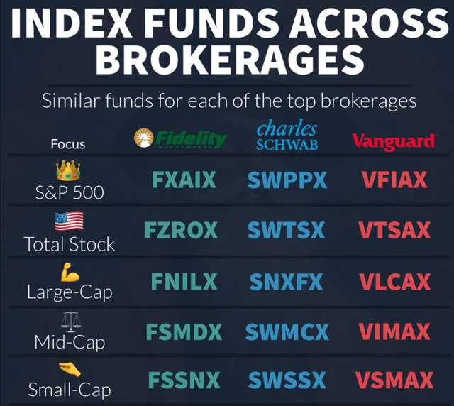

## Table of Contents

## What are Vanguard funds and why might someone want to invest in them?

Vanguard funds are a type of investment product offered by the Vanguard Group, a well-known investment company. These funds pool money from many investors to buy a variety of stocks, bonds, or other assets. This makes it easier for people to invest in a diversified way without having to pick individual stocks or bonds themselves. Vanguard is known for its low-cost index funds, which aim to match the performance of a specific market index, like the S&P 500.

Someone might want to invest in Vanguard funds because they offer a simple and cost-effective way to grow their money over time. Since Vanguard funds often have lower fees compared to other investment options, more of the money you invest can stay in your pocket and work for you. Plus, by investing in a fund that tracks a broad market index, you spread out your risk, which can be safer than putting all your money into just one or two stocks. This makes Vanguard funds a popular choice for people looking to build their savings for the future, like for retirement or other long-term goals.

## What is a third-party brokerage and how does it differ from investing directly with Vanguard?

A third-party brokerage is a company that helps people buy and sell investments like stocks, bonds, and funds. They act like a middleman between you and the investment markets. You open an account with them, put money in, and then use their platform to choose and buy the investments you want. They often offer a wide range of investment options from different companies, not just one.

Investing directly with Vanguard means you're working straight with the Vanguard Group, the company that creates and manages Vanguard funds. When you open an account with Vanguard, you can only buy Vanguard's own products, like their index funds and ETFs. The main difference is that a third-party brokerage gives you more choices, but it might also come with higher fees. On the other hand, investing directly with Vanguard can be cheaper because they're known for low fees, but your options are limited to what Vanguard offers.

## How can I open an account with a third-party brokerage to buy Vanguard funds?

To open an account with a third-party brokerage to buy Vanguard funds, first, you need to choose a brokerage. Popular options include Fidelity, Charles Schwab, and TD Ameritrade. Once you've picked one, go to their website and look for an option to open a new account. You'll need to fill out some personal information like your name, address, and Social Security number. The brokerage will also ask about your investment goals and experience to make sure they're a good fit for you.

After your account is set up and approved, you can add money to it. You can usually do this by linking your bank account and transferring funds. Once the money is in your brokerage account, you can search for Vanguard funds on their platform. Just type in "Vanguard" in the search bar, and you'll see a list of their funds. Choose the ones you want to invest in, decide how much money to put into each, and then place your order. The brokerage will buy the funds for you, and they'll show up in your account.

## What are the steps to purchase Vanguard funds through a third-party brokerage?

To buy Vanguard funds through a third-party brokerage, first, you need to pick a brokerage like Fidelity, Charles Schwab, or TD Ameritrade. Go to their website and find the option to open a new account. You'll have to fill out some personal details like your name, address, and Social Security number. They'll also ask about your investment goals and experience to see if they're a good fit for you. Once you've filled everything out and your account gets approved, you can add money to it. Usually, you do this by linking your bank account and transferring funds.

After your money is in your brokerage account, you can start buying Vanguard funds. Just use the search bar on the brokerage's platform and type in "Vanguard." You'll see a list of their funds. Choose the ones you want to invest in and decide how much money you want to put into each one. Then, place your order. The brokerage will buy the funds for you, and they'll show up in your account. It's pretty simple once you get the hang of it!

## Are there any fees associated with buying Vanguard funds through a third-party brokerage?

Yes, there can be fees when you buy Vanguard funds through a third-party brokerage. These fees might include trading fees, which some brokerages charge every time you buy or sell a fund. There can also be expense ratios, which are yearly fees that come out of the fund itself. Even though Vanguard funds are known for their low expense ratios, if you're buying them through another company, you might end up paying a bit more than if you went straight to Vanguard.

However, many popular third-party brokerages like Fidelity, Charles Schwab, and TD Ameritrade offer commission-free trading for many Vanguard funds. This means you won't have to pay a trading fee each time you buy or sell. But always check the specific fees of the brokerage you choose because they can change, and you want to make sure you know exactly what you'll be paying.

## How do the costs of buying Vanguard funds through a third-party brokerage compare to buying directly from Vanguard?

When you buy Vanguard funds through a third-party brokerage, you might have to pay more than if you bought them directly from Vanguard. Some brokerages charge trading fees every time you buy or sell a fund, and even though Vanguard funds have low expense ratios, you might end up paying a bit more because you're going through another company. However, many popular brokerages like Fidelity, Charles Schwab, and TD Ameritrade offer commission-free trading for many Vanguard funds, which means you won't have to pay a fee each time you trade.

If you buy Vanguard funds directly from Vanguard, you usually don't have to worry about trading fees. Vanguard is known for keeping costs low, so the expense ratios of their funds are often lower than if you bought them through a third-party. This means more of your money stays invested and working for you. So, if keeping costs as low as possible is important to you, buying directly from Vanguard might be the better choice.

## Can I buy all types of Vanguard funds through a third-party brokerage, or are there limitations?

You can buy many types of Vanguard funds through a third-party brokerage, but there might be some limitations. Most brokerages offer a wide range of Vanguard funds, including popular index funds and ETFs. However, they might not have every single Vanguard fund available, especially some of the more specialized or less common ones.

It's a good idea to check the specific brokerage's platform to see which Vanguard funds they offer. If you're set on buying a particular fund that isn't available through your chosen brokerage, you might need to open an account directly with Vanguard to get access to it.

## What are the tax implications of buying Vanguard funds through a third-party brokerage?

The tax implications of buying Vanguard funds through a third-party brokerage are similar to buying them directly from Vanguard. When you invest in Vanguard funds, you might have to pay taxes on any dividends or capital gains the fund distributes. These taxes depend on your personal tax situation and the type of account you're using. If you're investing in a taxable brokerage account, you'll need to report any income from the fund on your tax return. But if you're using a tax-advantaged account like an IRA or 401(k), the tax rules are different, and you might not have to pay taxes on the fund's earnings until you withdraw the money.

The main thing to keep in mind is that the third-party brokerage itself doesn't change the tax rules for the Vanguard funds. What matters most is the type of account you're using and how you handle your investments. For example, if you sell your Vanguard funds at a profit, you'll owe capital gains tax on that profit, no matter where you bought the funds. It's always a good idea to talk to a tax professional to understand how your investments will affect your taxes, especially if you're unsure about the specifics of your situation.

## How can I monitor and manage my Vanguard fund investments through a third-party brokerage?

You can keep an eye on your Vanguard fund investments through a third-party brokerage by logging into your account on their website or using their mobile app. Once you're logged in, you'll see a dashboard that shows all your investments, including your Vanguard funds. You can check how much your funds are worth, how they're performing, and any changes in their value over time. Most brokerages also offer tools like charts and graphs to help you understand your investments better. If you want to see more details about a specific fund, you can click on it to get information like its holdings, expense ratio, and past performance.

Managing your Vanguard funds through a third-party brokerage is easy too. If you decide you want to buy more shares of a fund, you can do that right from your account. Just find the fund, enter how much you want to invest, and place your order. If you need to sell some shares, you can do that the same way. Many brokerages also let you set up automatic investments, so you can keep adding to your Vanguard funds without having to remember to do it each time. And if you have any questions or need help, you can usually reach out to the brokerage's customer support for guidance.

## What are the potential risks and benefits of using a third-party brokerage to invest in Vanguard funds?

Using a third-party brokerage to invest in Vanguard funds can offer some great benefits. One big advantage is that you get more choices. These brokerages often let you buy funds from lots of different companies, not just Vanguard. This can be helpful if you want to mix and match your investments. Another benefit is that many third-party brokerages offer tools and resources to help you learn about investing and manage your money better. Plus, some of them don't charge you any fees when you buy or sell Vanguard funds, which can save you money.

However, there are also some risks to consider. One risk is that you might end up paying more in fees than if you went straight to Vanguard. Even if the brokerage doesn't charge trading fees, the expense ratios of the funds might be a bit higher when you buy them through a third-party. Another risk is that not all Vanguard funds might be available through the brokerage you choose. If you want to invest in a specific fund that isn't offered, you'll need to open an account directly with Vanguard. So, while third-party brokerages can be convenient and offer more options, it's important to weigh these risks against the benefits and make sure it fits with your investment goals.

## How does the performance of Vanguard funds bought through third-party brokerages compare to those bought directly?

The performance of Vanguard funds bought through a third-party brokerage is the same as those bought directly from Vanguard. The performance of the fund itself doesn't change based on where you buy it. What matters is the fund's holdings and how those investments do over time. So, whether you buy a Vanguard fund through Fidelity, Charles Schwab, or directly from Vanguard, the fund's returns will be the same.

However, the overall cost to you might be different. Buying directly from Vanguard often means lower fees, which can lead to better net returns over time. If you buy through a third-party brokerage, you might have to pay trading fees or slightly higher expense ratios, which can eat into your returns. So, while the fund's performance itself is the same, the costs you pay can affect how much money you end up with in the end.

## What advanced strategies can be used when investing in Vanguard funds through third-party brokerages?

One advanced strategy when investing in Vanguard funds through a third-party brokerage is dollar-cost averaging. This means you invest a fixed amount of money into your Vanguard funds at regular intervals, like every month. This strategy can help smooth out the ups and downs of the market because you're buying more shares when prices are low and fewer when prices are high. Over time, this can lead to a lower average cost per share and potentially better returns. Many third-party brokerages let you set up automatic investments, making it easy to stick to this strategy without having to remember to do it each time.

Another strategy is tax-loss harvesting. This involves selling investments that have gone down in value to offset any capital gains you might have from other investments. Since you can buy and sell Vanguard funds easily through a third-party brokerage, you can use this strategy to help manage your taxes. For example, if you have some Vanguard funds that have lost value, you can sell them to offset gains from other funds or stocks. Then, you can immediately buy back similar but not identical Vanguard funds to keep your investment strategy on track. This can be a smart way to lower your tax bill while staying invested in the market.

## References & Further Reading

[1]: Bergstra, J., Bardenet, R., Bengio, Y., & Kégl, B. (2011). ["Algorithms for Hyper-Parameter Optimization."](https://papers.nips.cc/paper/4443-algorithms-for-hyper-parameter-optimization) Advances in Neural Information Processing Systems 24.

[2]: ["Advances in Financial Machine Learning"](https://www.amazon.com/Advances-Financial-Machine-Learning-Marcos/dp/1119482089) by Marcos Lopez de Prado

[3]: ["Evidence-Based Technical Analysis: Applying the Scientific Method and Statistical Inference to Trading Signals"](https://www.amazon.com/Evidence-Based-Technical-Analysis-Scientific-Statistical/dp/0470008741) by David Aronson

[4]: ["Machine Learning for Algorithmic Trading"](https://github.com/PacktPublishing/Machine-Learning-for-Algorithmic-Trading-Second-Edition) by Stefan Jansen

[5]: ["Quantitative Trading: How to Build Your Own Algorithmic Trading Business"](https://www.amazon.com/Quantitative-Trading-Build-Algorithmic-Business/dp/1119800064) by Ernest P. Chan