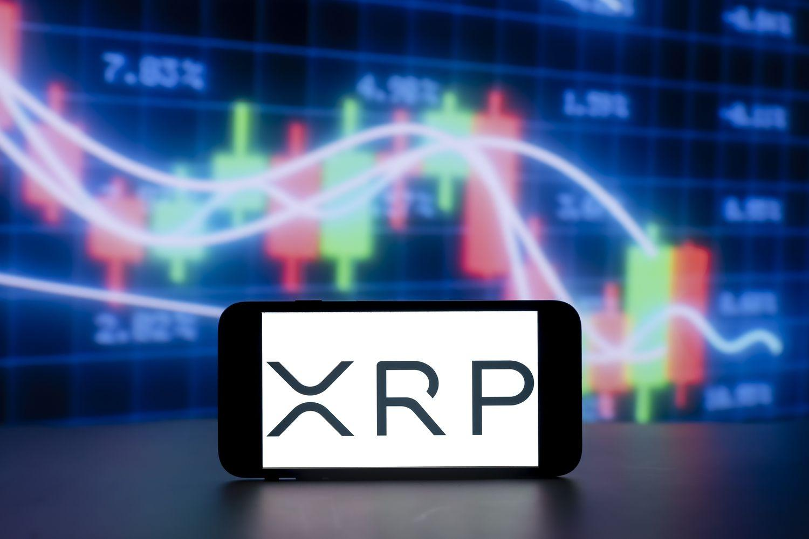

In cryptocurrencies, XRP stands out as a prominent option for both investors and traders. As a key player in the digital finance space, XRP offers a unique opportunity for algorithmic trading, attracting numerous enthusiasts aiming to maximize their returns. XRP's role as a bridge currency in the Ripple Network enhances its appeal for those interested in efficient trading solutions, given its ability to facilitate fast and cost-effective transactions globally.

This article aims to provide a comprehensive guide to buying XRP and leveraging algorithmic trading strategies to enhance investment outcomes. Understanding the mechanics of XRP and its ecosystem is crucial for navigating the often volatile cryptocurrency markets. Whether you're a seasoned trader or just entering the crypto world, understanding the nuances of XRP trading can help you make informed decisions.



Furthermore, the article explores platforms that support XRP trading and examines how algorithmic trading can enhance efficiency and profitability. Algorithmic trading—using computer programs to execute trades based on predefined strategies—enables traders to capitalize on market efficiencies and optimize their trading efforts.

Stay with us as we explore the exciting potential of XRP and the innovative strategies that can boost your cryptocurrency trading experience. By mastering the intricacies of XRP and intelligent trading methodologies, you can take advantage of the opportunities presented by this transformative financial technology.

## Table of Contents

## What is XRP?

XRP is the native digital currency associated with the XRP Ledger, a distributed digital ledger devised to conduct swift and cost-effective currency exchanges and global remittances. Distinguished from typical cryptocurrencies, which often rely on mining processes and blockchain technology, XRP utilizes a consensus algorithm and a verification network, enhancing the speed and efficiency of its transaction processing.

The cornerstone of XRP’s practical utility can be found in the Ripple Network. Within this framework, XRP functions as a bridge currency. This capability is paramount for facilitating cross-border transactions, where banks and financial institutions seek to complete transactions that are both secure and expeditious. The design of XRP enables these entities to achieve this with minimal transaction fees and in a fraction of the time typically associated with traditional financial exchanges.

One of the main advantages of XRP and the XRP Ledger is their ability to enable real-time global financial exchanges. The efficiency in transaction speed stems from its unique consensus protocol, which requires agreement from an independent set of validators rather than through the energy-intensive mining processes associated with others like Bitcoin or Ethereum that use Proof-of-Work (PoW). Typically, an XRP transaction can be settled within four seconds, a considerable improvement over the transaction times of its digital currency counterparts.

An understanding of XRP's intrinsic role and mechanisms is vital for anyone considering engaging in trading or investing with the currency. Such knowledge aids in grasping the potential benefits it offers, notably its ability to facilitate near-instantaneous financial transactions at considerably lower costs. This positions XRP as an attractive option for those looking to invest in or trade within the digital financial markets. The unique features of XRP also underscore the importance of staying informed about technological advancements and market dynamics that could influence its valuation and applicability.

## Where to Buy XRP

XRP can be acquired through a multitude of platforms, both centralized and decentralized, each offering unique advantages and specific criteria for users. Centralized exchanges are the most common venues for purchasing XRP, featuring user-friendly interfaces and solid security measures. Among the top centralized exchanges supporting XRP are:

1. **Coinbase**: Known for its ease of use and comprehensive security protocols, Coinbase offers a straightforward platform for new traders. It supports various fiat currencies, enabling users to purchase XRP directly with their native currency.

2. **Binance**: Binance is renowned for its extensive selection of cryptocurrencies and competitive transaction fees. It provides advanced trading features suitable for experienced users and supports various deposit methods, enhancing its accessibility.

3. **Kraken**: Kraken offers a robust set of trading tools and high security standards. Its focus on regulatory compliance and detailed market analysis tools make it appealing to both beginners and seasoned traders.

4. **Bitstamp**: As one of the oldest crypto exchanges, Bitstamp offers reliability and a well-established reputation. It provides various payment options and ensures high liquidity for trading XRP, facilitating efficient transactions.

For users inclined towards privacy and control over their trades, decentralized platforms present an alternative. Noteworthy decentralized options for acquiring XRP include:

- **PancakeSwap**: Built on the Binance Smart Chain, PancakeSwap allows users to trade XRP for other cryptocurrencies through direct peer-to-peer token swaps. Its decentralized nature ensures users maintain control over their funds.

- **Changelly**: Changelly offers a simple platform for instant crypto exchanges, prioritizing speed and user anonymity. It enables users to swap between XRP and other digital assets without creating an account, appealing to those valuing privacy.

Additionally, [cryptocurrency](/wiki/cryptocurrency) ATMs and mobile wallets such as Trust Wallet and Atomic Wallet present viable methods for purchasing and storing XRP. These solutions offer convenience and often feature integrated platforms for direct purchases.

When selecting a platform to buy XRP, it is crucial to consider factors such as ease of use, transaction fees, and security features. Regional availability and legal considerations are also significant, as regulations may vary across different jurisdictions. Evaluating these criteria will help ensure a secure and efficient XRP acquisition process.

## Algorithmic Trading and XRP

Algorithmic trading involves the use of sophisticated computer programs to execute trades according to predetermined strategies, aiming to exploit market inefficiencies and optimize trading profits. With advancements in technology and increased [liquidity](/wiki/liquidity-risk-premium), cryptocurrencies like XRP have become prime candidates for these automated trading strategies. XRP, the native currency of the XRP Ledger, exhibits distinct attributes that render it particularly amenable to [algorithmic trading](/wiki/algorithmic-trading).

One of the significant strategies employed in algorithmic trading with XRP is [arbitrage](/wiki/arbitrage). This involves exploiting price discrepancies of XRP across different exchanges to generate profit through immediate buy-and-sell actions. Given the global and fragmented nature of cryptocurrency exchanges, such price differences can occur, and algorithmic trading systems are designed to monitor these fluctuations in real time. By executing trades rapidly and efficiently, algorithms can capitalize on even minor price variances, potentially yielding significant returns due to the [high frequency](/wiki/high-frequency-trading) and [volume](/wiki/volume-trading-strategy) of trades executed.

Another popular approach in algorithmic trading with XRP is the use of quantitative models. These models leverage historical price data and external market indicators to predict price movements and schedule trades accordingly. The inherent [volatility](/wiki/volatility-trading-strategies) of crypto markets, where prices can exhibit large swings in short periods, allows quantitative strategies to exploit these fluctuations. This could involve statistical techniques like time-series analysis or [machine learning](/wiki/machine-learning) algorithms that continuously refine their predictive capabilities based on data inputs.

Implementing algorithmic trading systems for XRP requires a high degree of technical proficiency and a nuanced understanding of both market dynamics and risk management. Developers must ensure the robustness of their trading algorithms, as errors in data handling or programming could lead to significant financial loses. Rigorous testing and [backtesting](/wiki/backtesting) procedures are crucial, where algorithms are evaluated against historical data to validate their effectiveness before deployment in live trading environments. These processes help identify potential flaws and optimize the strategy to enhance its resilience to market changes.

Moreover, traders need to consider transaction costs, speed, and the specific characteristics of XRP's consensus mechanism, which differs from traditional blockchain systems. XRP's consensus protocol enables rapid settlement (typically within seconds) and low transaction fees, providing an advantageous environment for high-frequency trading strategies. However, careful attention must be paid to network and exchange fees, which could erode profits from frequent trades.

Staying informed about regulatory developments and market trends is integral to maintaining a competitive edge in algorithmic trading. As global financial landscapes evolve, adapting trading algorithms to align with legal compliance and market conditions can position traders to capitalize on the unique benefits offered by XRP and other cryptocurrencies in the algorithmic trading space.

## Technical Considerations for XRP Algo Trading

When engaging in algorithmic trading with XRP, several technical factors require careful consideration to maximize efficiency and profitability. A comprehensive understanding of transaction costs, execution speed, and the XRP Ledger's consensus mechanism is fundamental.

**Transaction Costs and Speed**  
Transaction costs are a critical [factor](/wiki/factor-investing) in algorithmic trading. The XRP Ledger is known for its low transaction fees, making it an attractive option for frequent trades. However, these costs can accumulate quickly in high-frequency trading environments. Understanding the fee structure of the XRP network, as well as those of various exchanges, ensures that trades remain cost-effective. Speed is another crucial aspect; the XRP Ledger's consensus mechanism allows for fast transaction finalization, which can be advantageous in capturing fleeting market opportunities.

**Technological and Data Analysis Advancements**  
Aligning trading strategies with cutting-edge technologies and data analysis techniques is vital. Leveraging machine learning algorithms and big data analytics can enhance predictive accuracy. Python libraries such as `pandas`, `numpy`, and `scikit-learn` are often used for developing and refining algorithmic strategies through rigorous data analysis.

```python
import pandas as pd
import numpy as np
from sklearn.linear_model import LinearRegression

# Example of a basic linear regression model for price prediction
data = pd.DataFrame({
    'time': np.arange(0, 100, 1),
    'price': np.random.rand(100) * 100
})
model = LinearRegression()
model.fit(data[['time']], data['price'])

# Predict future prices
future_prices = model.predict(np.array([[101], [102], [103]]))
print(future_prices)
```

**Testing and Backtesting**  
Errors in strategy or execution can lead to significant financial losses. It's imperative to conduct rigorous testing and backtesting of algorithms against historical data to ensure their reliability. Backtesting involves simulating a strategy on past data to gauge performance without risking actual funds. Using platforms like QuantConnect or Backtrader can aid in this process.

**Network and Exchange Fees**  
In algorithmic trading, network and exchange fees can impact profitability, especially when implementing high-frequency strategies. It's important to account for these fees in any cost-benefit analysis of potential trades.

**Regulatory Changes and Market Conditions**  
Remaining informed about regulatory developments and market conditions is essential for maintaining a competitive edge. Regulatory shifts can introduce new risks or opportunities, while prevailing market conditions influence asset liquidity and volatility. Keeping abreast of such information can enhance decision-making and strategy adaptation.

In summary, successfully implementing algorithmic trading with XRP involves a multi-faceted approach that combines technical knowledge, strategic testing, and continuous awareness of external factors. By addressing these considerations, traders can enhance the effectiveness of their algorithmic strategies.

## Conclusion: The Future of XRP and Algorithmic Trading

XRP's growing acceptance and utility in global financial systems underscore its robust potential for integration into algorithmic trading strategies, offering substantial opportunities for traders to enhance their investment outcomes. The inherent characteristics of XRP, such as its liquidity and fast transaction speeds, make it a viable candidate for traders seeking efficiency and profitability.

Algorithmic trading, which employs computer programs to execute trades based on predefined strategies, can greatly benefit from the dynamic environment created by XRP. Traders can employ sophisticated strategies that optimize trading actions to diversify portfolios. By using tools such as arbitrage and machine learning algorithms, market participants can capitalize on the inherent volatility of the cryptocurrency markets. For example, an arbitrage algorithm might exploit price differences between exchanges, executing instantaneous buy and sell orders to lock in profits. Meanwhile, predictive algorithms might analyze historical price data using machine learning techniques to anticipate future price movements, thus timing trades for optimal profitability.

Despite the inherent volatility of crypto markets, disciplined algorithmic approaches can yield significant rewards. One method of mitigating risk is rigorous backtesting of trading strategies under various market conditions before actual deployment. Ensuring strategies are well-tested helps protect against unforeseen market movements and reduces the likelihood of substantial losses. Additionally, algorithmic trading allows the execution of trades without the emotional biases that can negatively affect human traders, promoting systematic and objective decision-making.

As the cryptocurrency market continues to evolve, advancements in technology and ongoing education will be pivotal in shaping the future of XRP trading. Staying abreast of developments, such as improvements in machine learning and [artificial intelligence](/wiki/ai-artificial-intelligence), will allow traders to refine their strategies and maintain a competitive edge. Moreover, an emphasis on regulatory compliance and security will play a critical role as the market matures.

Incorporating XRP as part of a trading strategy positions traders at the forefront of innovative financial technology solutions. By leveraging the unique advantages that XRP offers within algorithmic trading frameworks, investors are poised to benefit from enhanced efficiency, diversification, and the potential for significant financial gains. As such, XRP not only represents a promising digital asset in the world of cryptocurrencies but also a gateway to cutting-edge trading methodologies that continue to redefine financial industry standards.

## References & Further Reading

[1]: Bergstra, J., Bardenet, R., Bengio, Y., & Kégl, B. (2011). ["Algorithms for Hyper-Parameter Optimization."](https://papers.nips.cc/paper/4443-algorithms-for-hyper-parameter-optimization) Advances in Neural Information Processing Systems 24.

[2]: ["Advances in Financial Machine Learning"](https://www.amazon.com/Advances-Financial-Machine-Learning-Marcos/dp/1119482089) by Marcos Lopez de Prado

[3]: ["Evidence-Based Technical Analysis: Applying the Scientific Method and Statistical Inference to Trading Signals"](https://www.amazon.com/Evidence-Based-Technical-Analysis-Scientific-Statistical/dp/0470008741) by David Aronson

[4]: ["Machine Learning for Algorithmic Trading"](https://github.com/PacktPublishing/Machine-Learning-for-Algorithmic-Trading-Second-Edition) by Stefan Jansen

[5]: ["Quantitative Trading: How to Build Your Own Algorithmic Trading Business"](https://books.google.com/books/about/Quantitative_Trading.html?id=j70yEAAAQBAJ) by Ernest P. Chan