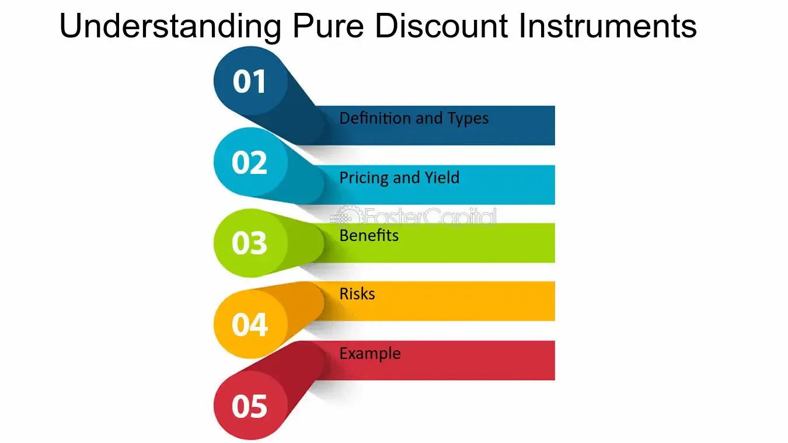

## Table of Contents

## What is a pure discount instrument?

A pure discount instrument is a type of financial product that doesn't pay any interest during its life. Instead, it is sold at a price lower than its face value, and when it matures, the buyer gets the full face value. This difference between the purchase price and the face value is the investor's profit. A common example of a pure discount instrument is a zero-coupon bond.

These instruments are popular because they are simple and their returns are easy to understand. Since they don't pay interest periodically, they are often used by investors who want to save for a specific future date, like when a child goes to college or when they retire. The main risk with pure discount instruments is that if the issuer faces financial trouble, the investor might not get the full face value at maturity.

## How does a pure discount instrument differ from other financial instruments?

A pure discount instrument is different from other financial instruments because it doesn't pay any interest during its term. Instead, you buy it for less than its face value, and when it matures, you get the full face value. The profit you make is the difference between what you paid and what you get back. This is different from bonds or savings accounts, which pay you interest regularly. With those, you get payments over time, not just at the end.

Another difference is that pure discount instruments are simpler. They are easy to understand because you only need to know the purchase price and the face value to figure out your return. Other financial instruments can be more complex, with things like variable interest rates or dividends. Pure discount instruments are often used by people saving for a specific future goal, like paying for college or retirement, because you know exactly how much money you'll have at the end.

## Can you provide examples of pure discount instruments?

A common example of a pure discount instrument is a zero-coupon bond. When you buy a zero-coupon bond, you pay less than what it's worth. For example, you might pay $900 for a bond that will be worth $1,000 when it matures. You don't get any interest payments while you wait. Instead, when the bond matures, you get the full $1,000. The $100 difference is your profit.

Another example is a Treasury bill, often called a T-bill. T-bills are short-term loans to the government. You buy them for less than their face value, and when they mature, usually in a few months to a year, you get the full face value. Like zero-coupon bonds, T-bills don't pay interest along the way. Your profit comes from the difference between what you paid and what you get back at maturity.

## What are the key features of a pure discount instrument?

A pure discount instrument is a type of investment where you buy it for less than what it will be worth later. You don't get any interest payments while you wait. Instead, when the time is up, you get the full amount it's worth. The money you make is the difference between what you paid and what you get back. This makes it easy to know how much you will earn.

These instruments are simple and good for saving up for something in the future, like college or retirement. They are often used by the government, like with Treasury bills, or by companies, like with zero-coupon bonds. The main risk is that if the company or government has money problems, you might not get the full amount back when it's time.

## How is the yield calculated for a pure discount instrument?

The yield on a pure discount instrument is calculated by figuring out the annual return you get from buying it at a discount and getting the full face value at maturity. To do this, you need to know the price you paid, the face value you will get, and how long you have to wait until it matures. The formula to find the yield is: Yield = (Face Value / Purchase Price)^(1 / Years to Maturity) - 1. This formula helps you understand the annual rate of return you are earning on your investment.

For example, if you buy a zero-coupon bond for $900 that will be worth $1,000 in one year, you can use the formula to find the yield. Plugging in the numbers, you get: Yield = (1000 / 900)^(1 / 1) - 1 = 1.1111 - 1 = 0.1111, or about 11.11%. This means your annual return on this investment is about 11.11%. It's important to know this yield because it helps you compare this investment to others and see if it's a good deal for you.

## What are the risks associated with investing in pure discount instruments?

When you invest in pure discount instruments, like zero-coupon bonds or Treasury bills, one of the main risks is that the issuer might not be able to pay you back the full amount when it's time. This can happen if the company or government that issued the bond runs into financial trouble. If they can't pay, you might lose some or all of your money. This risk is called default risk, and it's something to think about, especially with bonds from companies that might not be very stable.

Another risk is that if you need your money before the pure discount instrument matures, you might have to sell it for less than what you paid. This is because the value of these instruments can go up and down before they mature. If interest rates go up after you buy, the price of your bond might go down, and you could lose money if you sell it early. This is known as interest rate risk. So, it's important to plan to keep your money in the investment until it matures if you want to avoid this risk.

## How do pure discount instruments fit into a diversified investment portfolio?

Pure discount instruments, like zero-coupon bonds and Treasury bills, can be a good addition to a diversified investment portfolio. They are simple and easy to understand, which makes them a good choice for people who want to save for something specific in the future, like paying for college or planning for retirement. Because you buy them for less than what they're worth and get the full amount back later, you know exactly how much money you'll have at the end. This can be helpful if you want to make sure you have a certain amount of money at a specific time.

However, it's important to remember that pure discount instruments come with some risks. If the company or government that issued the bond runs into money problems, they might not be able to pay you back the full amount when it's time. Also, if you need to get your money out before the bond matures, you might have to sell it for less than what you paid, especially if interest rates have gone up. So, when you're building a diversified portfolio, you should think about including pure discount instruments along with other types of investments, like stocks or regular bonds, to help balance out these risks and make sure your money is spread out in different ways.

## What is the role of pure discount instruments in financial markets?

Pure discount instruments, like zero-coupon bonds and Treasury bills, play an important role in financial markets. They are simple investments where you buy them for less than what they're worth and get the full amount back when they mature. This makes them easy for people to understand and use when they want to save up for something specific in the future, like paying for college or planning for retirement. Because they don't pay interest along the way, they are especially useful for people who want to know exactly how much money they'll have at a certain time.

In the bigger picture, pure discount instruments help keep financial markets running smoothly. Governments and companies can use them to borrow money from investors, which helps them fund their projects or operations. Investors, on the other hand, can use these instruments to safely park their money for a while, knowing they'll get a certain return at the end. This helps create a stable part of the financial market, balancing out riskier investments like stocks. Overall, pure discount instruments help connect people who need to borrow money with those who want to invest it in a straightforward way.

## How do changes in interest rates affect the value of pure discount instruments?

When interest rates go up, the value of pure discount instruments like zero-coupon bonds or Treasury bills usually goes down. This happens because new bonds that are issued will have higher interest rates, making them more attractive to investors. If you want to sell your bond before it matures, you might have to sell it for less than what you paid because people would rather buy the new bonds with better rates. This is called interest rate risk, and it's something to think about if you might need your money back before the bond matures.

On the other hand, when interest rates go down, the value of pure discount instruments goes up. This is because the bonds you already own will be worth more than new bonds that are issued with lower interest rates. If you decide to sell your bond before it matures, you could sell it for more than what you paid. But, if you keep the bond until it matures, you'll still get the same amount of money as you would have before the interest rates changed. So, it's important to understand how interest rates can affect the value of your investments if you plan to sell them early.

## What are the tax implications of investing in pure discount instruments?

When you invest in pure discount instruments like zero-coupon bonds, you need to think about taxes. Even though you don't get any interest payments along the way, the IRS says you have to pay taxes on the interest that's building up each year. This is called "imputed interest." So, you have to pay taxes on the increase in the bond's value every year, even though you don't actually get any money until the bond matures.

This can be tricky because you have to pay taxes without getting any cash to help you pay them. It's a good idea to set aside some money each year to cover these taxes. When the bond finally matures and you get the full amount, you won't owe any more taxes on it because you've already paid them over the years. It's important to understand these tax rules so you can plan your investments and taxes properly.

## How can pure discount instruments be used for hedging purposes?

Pure discount instruments, like zero-coupon bonds, can be used for hedging against interest rate changes. If you think interest rates are going to go up, you might want to protect your investments that would lose value because of higher rates. By buying a pure discount instrument, you lock in the current interest rate for the future. This means you know exactly how much money you'll get when the bond matures, no matter what happens to interest rates in the meantime. This can help balance out losses from other investments that might go down in value if rates go up.

For example, if you own a lot of bonds that pay interest regularly and you're worried about rising interest rates, you could buy some zero-coupon bonds. These bonds won't be affected by interest rate changes in the same way because they don't pay interest until they mature. So, if interest rates do go up and the value of your regular bonds goes down, the zero-coupon bonds can help make up for some of those losses. This way, you're using pure discount instruments to hedge against the risk of rising interest rates and protect your overall investment portfolio.

## What advanced strategies can be employed with pure discount instruments in financial modeling?

In financial modeling, pure discount instruments can be used in advanced strategies to help predict future cash flows and assess the impact of different interest rate scenarios. One common strategy is to use them in a model to see how changes in interest rates would affect the value of a portfolio. By including zero-coupon bonds in the model, you can see how their fixed return at maturity can help balance out the risks from other investments that might lose value if rates go up. This helps you understand how to manage your investments better and plan for different possible futures.

Another strategy is to use pure discount instruments in models that look at the time value of money. Since these instruments don't pay interest until they mature, they are perfect for showing how money today is worth more than the same amount of money in the future. You can use them to calculate the present value of future cash flows, which is important for making smart investment decisions. By including pure discount instruments in these models, you can get a clearer picture of what your investments might be worth over time and make better plans for saving and investing.

## What is the understanding of Pure Discount Bonds?

Pure discount bonds, a fundamental category of fixed-income securities, are unique in their structure and operation compared to other bonds. Unlike conventional bonds that pay periodic interest, pure discount bonds do not provide any interim interest payments. Instead, they are issued at a substantial discount to their face value and are redeemed at par upon maturity. This distinct feature makes them an attractive financial instrument for investors seeking simplicity and capital appreciation over a specific time horizon.

### Key Characteristics

1. **Sold at a Discount**: Pure discount bonds are sold for less than their face value. The difference between the purchase price and the maturity value represents the investor's return.

2. **Redeemed at Face Value**: At maturity, the bondholder receives the full face value of the bond. This inherent simplicity eliminates concerns about intermittent interest payments and reinvestment risk associated with typically coupon-bearing bonds.

3. **Absence of Periodic Interest Payments**: Because these bonds do not offer periodic interest, they are classified as zero-coupon instruments, meaning the entire return is realized at maturity.

### Popular Types of Pure Discount Instruments

**Zero-Coupon Bonds**: The most well-known pure discount bonds fall under this category. Issued by corporations or government entities, zero-coupon bonds present an opportunity for investors to lock in a fixed return over a specified period without the need to reinvest intermediate cash flows.

**Treasury Bills (T-Bills)**: Short-term government securities with a maturity of one year or less, T-bills are also a type of pure discount bond. They offer a secure investment, backed by the U.S. government, making them a reliable option for risk-averse investors.

### Yield and Return Calculations

The yield and return on pure discount bonds can be calculated using straightforward mathematical formulas, considering their non-interest-bearing nature. 

The yield, expressed as an annual percentage, can be calculated using the formula:

$$

\text{Yield} = \left( \frac{\text{Face Value} - \text{Purchase Price}}{\text{Purchase Price}} \right) \times \frac{360}{\text{Days to Maturity}}
$$

For example, consider a zero-coupon bond with a face value of $1,000, sold at $950, maturing in 180 days:

$$

\text{Yield} = \left( \frac{1,000 - 950}{950} \right) \times \frac{360}{180} = 10.53\%
$$

This calculation illustrates how the investor's return is derived purely from the price appreciation of the bond from the discounted purchase price to the full face value at maturity.

In understanding pure discount bonds, it is crucial to recognize their utility in straightforward financial planning and risk management. By removing the complications associated with interest payments, investors can focus on capital appreciation and aligning bond maturities with future financial needs.

## How do pure discount bonds work?

Pure discount bonds, often referred to as zero-coupon bonds, are unique financial instruments that operate differently from traditional bonds by being issued at a discount and redeemable at their face value upon maturity. This inherent structure eliminates periodic interest payments, making the bond's return contingent solely on the difference between its purchase price and face value.

**Pricing and Yield**

The price of a pure discount bond is determined by discounting its face value using the yield to maturity (YTM), reflecting the bondholder's anticipated return if held to maturity. The fundamental pricing model is given by:

$$
P = \frac{F}{(1 + r)^n}
$$

where:
- $P$ is the present price of the bond,
- $F$ represents the face value,
- $r$ denotes the yield per period, and
- $n$ is the number of periods until maturity.

A crucial metric in understanding these bonds is the bank discount yield, which estimates annualized yield based on the bond's discount from its face value. It is calculated as follows:

$$
\text{Bank Discount Yield} = \frac{F - P}{F} \times \frac{360}{n}
$$

The spot [interest rate](/wiki/interest-rate-trading-strategies), reflecting the current interest rate for a given maturity, is also essential in pricing pure discount bonds. It forms the basis for determining the YTM from the bond's observed market price, establishing a yield curve that represents a function of time until maturity.

**Role in Fixed-Income Portfolios**

Pure discount bonds serve as foundational elements within fixed-income portfolios, providing predictable cash flows at maturity which are useful for long-term planning and investment strategies. Their inclusion offers several strategic benefits:

1. **Diversification**: Pure discount bonds add variety to a portfolio, contrasting with coupon-bearing bonds, thus mitigating reinvestment risk. 

2. **Interest Rate Sensitivity**: Given their extended duration, zero-coupon bonds are particularly sensitive to interest rate changes, allowing portfolio managers to strategically manage duration based on market forecasts.

3. **Arbitrage and Hedging**: Zero-coupon bonds offer arbitrage opportunities, specifically through constructs like the yield curve, facilitating hedging strategies against interest rate fluctuations.

Overall, pure discount bonds provide critical mechanisms for investors seeking to balance risk and return profiles in fixed-income portfolios, making them invaluable in strategic asset allocation.

## What are the applications of pure discount bonds in algorithmic trading?

Pure discount bonds, including zero-coupon bonds and Treasury bills, offer a compelling suite of benefits for algorithmic trading strategies. Their appeal lies in their relative simplicity, with a single cash flow occurring at maturity. This characteristic can be exploited for precision in modeling and predicting future cash flows, an essential feature for algorithmic trading systems.

### Strategic Advantages in Algorithmic Trading

Algorithmic trading leverages computational power to execute trades at high speed and frequency. Pure discount bonds, without periodic coupon payments, simplify the pricing and yield calculations, making them attractive instruments for such execution. Algorithms can swiftly compute the present value of these bonds since they involve a straightforward discounting formula:

$$
P = \frac{F}{(1 + r)^t}
$$

Where:
- $P$ is the price of the bond,
- $F$ is the face value,
- $r$ is the discount rate, and
- $t$ is the time to maturity.

This simplicity facilitates high-frequency trading strategies and aids in efficient portfolio rebalancing.

### Arbitrage Opportunities and Yield Curve Strategies

Pure discount bonds are pivotal in identifying arbitrage opportunities and constructing yield curve strategies. Algorithms can detect discrepancies between the yields of similar instruments more accurately with these bonds. Suppose a zero-coupon bond's yield deviates significantly from an expected point on the theoretical spot yield curve. In that case, algorithms can identify this anomaly as a potential arbitrage opportunity and execute trades to capture these spreads until the market corrects itself.

Yield curve strategies, such as riding the yield curve, become more manageable and precise with pure discount bonds. By utilizing predictive algorithms, traders can calculate and exploit shifts in the yield curve more effectively:

```python
import numpy as np

def calculate_yield_curve_shift(bond_prices, maturities):
    '''
    Calculate potential yield curve shifts using bond pricing data.

    bond_prices: list of bond prices
    maturities: list of bond maturities
    returns: list of predicted yield changes
    '''
    bond_yields = [100 / price for price in bond_prices]  # Simplified
    potential_shifts = np.diff(bond_yields) / np.diff(maturities)
    return potential_shifts

# Example call with mock data
calculate_yield_curve_shift([95, 97, 99], [1, 2, 3])
```

### Risk Management through Algorithmic Trading

Pure discount bonds can significantly contribute to managing interest rate risk, a key concern for fixed-income traders. Algorithms facilitate dynamic hedging strategies that adjust in real-time to market conditions. By using predictive analytics, trading systems can anticipate interest rate movements and adjust bond portfolios accordingly. This approach minimizes risk exposure without the lag time experienced in traditional trading methods.

Algorithm-driven analysis of historical interest rate movements allows for more informed risk assessments and strategy adaptations. The integration of machine learning models furthers the capability to predict adverse scenarios, allowing traders to implement safeguards proactively.

In summary, pure discount bonds form an integral part of algorithmic trading strategies due to their structural characteristics and ease of modeling. The ability to leverage arbitrage opportunities and optimize yield curve strategies highlights their utility, while sophisticated algorithms enable efficient risk management in the inherently volatile interest rate landscape.

## What are the risks and considerations?

Pure discount bonds, such as zero-coupon bonds and Treasury bills, are significant components of many investment portfolios. However, they come with inherent risks that investors must manage carefully—primarily interest rate risk and liquidity risk.

### Interest Rate Risk

Interest rate risk is the potential for investment losses due to fluctuations in interest rates. Pure discount bonds are particularly sensitive to changes in interest rates due to their pricing mechanism: they are sold at a discount to their face value and yield a fixed amount at maturity. The value of a pure discount bond is inversely related to interest rates. As interest rates rise, the present value of the bond decreases, leading to a potential loss if the bond is sold before maturity. This relationship can be modeled using the bond's duration, a measure of interest rate sensitivity.

Mathematically, the price of a zero-coupon bond can be expressed as:

$$
P = \frac{F}{(1 + r)^n}
$$

where $P$ is the price, $F$ is the face value, $r$ is the interest rate, and $n$ is the time to maturity. A change in interest rates significantly affects $P$.

### Liquidity Risk

Liquidity risk involves the difficulty of selling an asset without causing a significant change in its price. Pure discount bonds can be less liquid than their coupon-bearing counterparts, especially those issued by entities with lower credit ratings or in less active markets. Limited market participants can exacerbate liquidity risk, potentially leading to higher transaction costs or the inability to liquidate investments swiftly in response to market conditions.

### Challenges for Algorithmic Traders

Algorithmic traders, who use computers to automate trading processes, face unique challenges when dealing with pure discount bonds. Market [volatility](/wiki/volatility-trading-strategies), data quality issues, and the need for real-time data analysis demand robust technological infrastructure. These systems must handle large volumes of data and transactions efficiently, maintaining accuracy and speed.

### Mitigation Strategies

1. **Diversification**: By investing in a diverse range of assets, including both pure discount and interest-bearing instruments, investors can spread risk across different market conditions and mitigate potential adverse effects from interest rate fluctuations.

2. **Technological Advancements**: Utilization of advanced algorithms and machine learning can enhance the predictive capabilities of trading systems, enabling better anticipation of market movements and improved decision-making processes. 

3. **Dynamic Hedging**: Implementing dynamic hedging strategies can help manage interest rate risks. For instance, traders may use futures contracts or options to offset potential losses from unfavorable interest rate movements.

4. **Enhanced Liquidity Management**: Developing algorithms that factor in liquidity metrics can assist traders in determining optimal times to buy or sell bonds, minimizing the impact of liquidity constraints.

5. **Stress Testing and Scenario Analysis**: Regular stress testing and scenario analysis ensure that trading systems remain resilient under adverse market conditions. By simulating various market scenarios, traders can evaluate the potential impact on their portfolios and adjust strategies accordingly.

In conclusion, while pure discount bonds offer specific investment benefits, they also present risks, particularly concerning interest rates and liquidity. Algorithmic trading, with its inherent capabilities for data processing and analysis, provides tools to manage these risks effectively. Through diversification, technological innovations, and strategic risk management, traders can enhance their ability to navigate the complexities of pure discount bond markets.

## References & Further Reading

[1]: Hull, J. C. (2018). ["Options, Futures, and Other Derivatives."](https://www.semanticscholar.org/paper/Options%2C-Futures%2C-and-Other-Derivatives-Hull/89bdee500c8623864fc9eb7a471546aa713acc44) Pearson Education Limited.

[2]: Grinold, R. C., & Kahn, R. N. (2000). ["Active Portfolio Management: A Quantitative Approach for Producing Superior Returns and Controlling Risk."](https://www.amazon.com/Active-Portfolio-Management-Quantitative-Controlling/dp/0070248826) McGraw-Hill.

[3]: Choudhry, M. (2010). ["The Bond and Money Markets: Strategy, Trading, Analysis."](https://www.sciencedirect.com/book/9780750646772/the-bond-and-money-markets) John Wiley & Sons.

[4]: Sundaresan, S. (2009). ["Fixed Income Markets and Their Derivatives."](https://shop.elsevier.com/books/fixed-income-markets-and-their-derivatives/sundaresan/978-0-12-370471-9) Academic Press.

[5]: Aldridge, I. (2013). ["High-Frequency Trading: A Practical Guide to Algorithmic Strategies and Trading Systems."](https://books.google.com/books/about/High_Frequency_Trading.html?id=6l0DDQAAQBAJ) Wiley Finance.