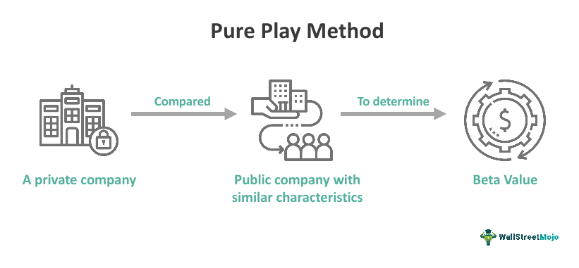

Investing strategies are undergoing a transformation as niche investing gains traction among investors who seek focused opportunities in specific sectors or market segments. This approach, known as 'niche investing', offers a targeted investment strategy aimed at maximizing returns through concentrated exposure to select markets.

As part of its exploration, this article examines key investment strategies such as 'pure play' and the utilization of algorithmic trading ('algo trading'). These methodologies can be integrated to optimize investment portfolios, providing a dynamic and adaptable approach to portfolio management.



The advent of digital platforms and rapid technological advancements have empowered investors to engage with niche markets with enhanced precision and efficiency. This represents a significant shift in investment practices, allowing for more calculated and data-driven decision-making processes.

The discussion will highlight the advantages of adopting a focused strategy through niche investing and the substantial role that algorithmic trading occupies in modern financial markets. By leveraging technology and specialization, investors can potentially unlock significant profit opportunities while navigating the complexities of specific market sectors.

## Table of Contents

## Understanding Niche Investing

Niche investing involves targeting investments in a unique subsector or specialized industry. This strategy prioritizes the identification of sectors that are frequently overlooked by mainstream market participants but hold potential for substantial growth. Investors focus on these areas with the aim of leveraging insider-like knowledge to maximize their potential returns. 

Niche investing provides an opportunity for investors to develop deep insights and expertise in specific sectors. Such in-depth understanding is crucial for capitalizing on market opportunities that other investors may miss. For example, an investor specializing in biotechnology might be more attuned to the nuances and upcoming trends within that industry, thus better positioned to make informed investment decisions.

Historically, niche investing has shown that concentrating efforts on specific sectors can yield higher returns compared to broader investment approaches. Industry-specific strategies might focus on sectors like technology, pharmaceuticals, or renewable energy, where innovation and growth potential are significant. For instance, technology companies involved in [artificial intelligence](/wiki/ai-artificial-intelligence) or cybersecurity might offer lucrative opportunities due to the increasing reliance on digital infrastructure globally.

Alternatively, thematic investing under the umbrella of niche strategies allows investors to target broad themes such as sustainability, demographic changes, or technological innovation. Sustainable investing, for instance, has gained traction as environmental, social, and governance ([ESG](/wiki/esg-investing)) factors become more crucial in shaping company policies and investor sentiments. This thematic approach opens up diversified pathways within niche investing, allowing for targeted exposure to trends that define future economic and social landscapes.

It is crucial for investors engaging in niche investing to conduct thorough research and maintain a pulse on industry developments. The scarcity of readily available information compared to mainstream sectors necessitates a proactive approach to data gathering and analysis. The application of financial modeling, such as discounted cash flow (DCF) analysis, can aid in estimating the intrinsic value of niche companies. Additionally, leveraging [alternative data](/wiki/best-alternative-data) sources and market analytics tools can enhance decision-making processes.

Overall, niche investing offers a focused approach that can harness unique market opportunities. Investors who excel in this strategy often possess a keen eye for future trends and a willingness to embrace innovation within specialized sectors. With a tailored investment strategy, niche investors can potentially achieve superior portfolio performance by anticipating and capitalizing on sector-specific growth prospects.

## Exploring Pure Play Investment Strategies

A 'pure play' investment strategy focuses on investing in companies that specialize in a single line of business, providing investors with concentrated exposure to a specific sector. This approach allows for a more straightforward analysis of business performance and sector dynamics, as the investor is not required to assess the diverse activities typical of conglomerates. As a result, the financial statements and performance metrics of pure play companies are often easier to interpret, providing clearer insights into how particular market factors affect the business.

For example, consider a company solely operating within the renewable energy sector. By focusing exclusively on renewable energy, the company and its investors are able to hone in on this industry without having to [factor](/wiki/factor-investing) in the unrelated risks and variables that come with other sectors. Consequently, investors can better understand the impact of market trends, regulatory changes, or technological advancements on the company's performance.

Despite these advantages, pure play investments [carry](/wiki/carry-trading) a higher specific risk due to their reliance on a single sector. Economic downturns, technological disruptions, or strict regulatory changes within the sector can disproportionately affect the company's profitability. Thus, while the potential for high returns exists, so too does the risk of substantial losses.

Investors using pure play strategies need to be highly knowledgeable about the sector they are investing in, as this knowledge can help mitigate risk. It is essential to conduct thorough market analysis, scrutinize industry trends, and understand competitive dynamics to effectively capitalize on sector-specific growth opportunities. The lack of diversification in pure play investments emphasizes the need for strategic planning and vigilant risk management to navigate potential complexities and turbulent market conditions.

## The Role of Algorithmic Trading

Algorithmic trading, often referred to as 'algo trading', leverages sophisticated computer programs to automate the execution of trading orders. These systems are designed to operate at speeds and frequencies beyond the capabilities of human traders, offering a distinct advantage in today’s fast-paced financial markets.

Algo trading empowers investors to design and execute intricate trading strategies with precision. By analyzing large datasets in real-time, these systems can identify and act upon minute market inefficiencies, thus optimizing the investment process. For instance, when a stock's price deviates from its historical pattern, an algorithm can detect this anomaly and rapidly execute trades to capitalize on the opportunity.

In the context of niche investing, [algorithmic trading](/wiki/algorithmic-trading) significantly enhances the ability to focus on specific sectors or market segments. By employing data-driven decision-making, algorithms can swiftly process and analyze vast amounts of sector-specific information. This capability enables the identification of trends and patterns that might go unnoticed in a manual trading setup. Investors can predefine criteria for trading decisions, allowing algorithms to automatically adjust strategies according to real-time market conditions. For example, a strategy might be programmed to buy a stock once its price drops below a certain threshold or to sell if a particular sector shows signs of decline.

Python is a popular language for implementing algorithmic trading strategies due to its simplicity and the extensive ecosystem of financial libraries available. A simple example of an algorithmic trading strategy might involve the use of a moving average crossover method, coded as follows:

```python
import pandas as pd

# Fetching historical stock data
data = pd.read_csv('stock_data.csv')

# Calculating two moving averages
data['Short_MA'] = data['Close'].rolling(window=20).mean()
data['Long_MA'] = data['Close'].rolling(window=50).mean()

# Generating signals
data['Signal'] = 0
data.loc[data['Short_MA'] > data['Long_MA'], 'Signal'] = 1
data.loc[data['Short_MA'] < data['Long_MA'], 'Signal'] = -1

# Display the first few rows with the calculated strategy signals
print(data.head())
```

In this snippet, the strategy involves buying when a short-term moving average surpasses a long-term moving average, and selling when the opposite occurs. This straightforward system can be expanded with additional criteria and conditions to adapt to various market scenarios.

Moreover, algorithmic trading offers enhanced adaptability to shifting market conditions. Unlike static strategies, algorithms are dynamic, adjusting their operations based on continuously emerging data. This flexibility allows traders to remain responsive amidst market [volatility](/wiki/volatility-trading-strategies), consistently aligning their strategies with ongoing financial developments.

However, despite these advantages, algorithmic trading is not without risks. System failures, data discrepancies, and the necessity for constant oversight can introduce potential drawbacks. Investors must ensure that algorithms are not only rigorously tested and monitored but also continuously updated to align with evolving market dynamics.

## Integrating Pure Play and Algorithmic Trading

Integrating pure play investment strategies with algorithmic trading has the potential to revolutionize portfolio management by enhancing precision and adaptability. Pure play investing targets companies specializing in a single line of business, providing intensely focused exposure to specific sectors. When combined with algorithmic trading, investors can harness the power of technology to systematically manage these investments.

Algorithmic models are designed to process vast amounts of data rapidly and execute trades based on pre-established criteria. In the context of pure play stocks, such models can continuously analyze market trends, identify opportunities, and execute trades with high efficiency. For instance, an algorithm could utilize indicators like moving averages or sentiment analysis to determine optimal entry and [exit](/wiki/exit-strategy) points for pure play stocks. This model not only ensures that trades are executed at the most advantageous times but also provides the agility to adapt to market shifts within milliseconds.

The integration of algorithmic trading allows investors to capitalize on sector-specific growth opportunities while systematically managing risk. By using algorithms to monitor market dynamics, investors can maintain concentrated exposure to desired sectors, as observed in pure play investments, without succumbing to human limitations like emotional biases or slower reaction times. This technological leverage results in improved efficiency and the reduction of execution risks, such as slippage or delayed orders.

Furthermore, algorithmic trading, when employed in managing pure play investments, can enhance returns by implementing strategies like statistical [arbitrage](/wiki/arbitrage) or trend-following systems, which maximize profit potential from market inefficiencies inherent in specific sectors. This hybrid approach helps in maintaining a balanced strategy, combining the detailed market insight from niche investments with the superior execution capabilities of automated systems.

This fusion of strategies is particularly valuable in dynamic markets where rapid changes can significantly impact stock prices. By harnessing technology, investors gain a competitive edge, optimizing their portfolios beyond traditional investment methods. Thus, the synergy between pure play investing and algorithmic trading offers a sophisticated mechanism for achieving better performance and more refined control over investment portfolios.

## Potential Risks and Considerations

Niche investing and pure play strategies have been gaining traction for their potential to deliver high returns by concentrating on specific sectors or themes. However, the inherent focus on limited market segments introduces significant risks, primarily due to the lack of diversification. Investors in these areas must be particularly attuned to the heightened exposure to market volatility. This can arise from various factors impacting specific industries, such as regulatory changes, technological advancements, or shifts in consumer preferences. For instance, a downturn in industry demand or unforeseen market disruptions can disproportionately impact companies solely reliant on that sector, thus magnifying the risk for those following pure play strategies.

Algorithmic trading, while offering the potential to execute trades with unprecedented speed and accuracy, brings about its own set of challenges. The reliance on complex software systems introduces risks linked to technological failures. These can range from software bugs to hardware malfunctions, which might lead to significant financial losses if not promptly addressed. Furthermore, the dynamic nature of financial markets requires algorithms to be rigorously monitored and continuously updated to ensure they are functioning as intended and adapting to current market conditions. This necessity for constant oversight presents an additional layer of complexity and resource allocation for investors using these strategies.

To effectively leverage the advantages of niche investments and algorithmic trading while mitigating associated risks, comprehensive analysis and thorough risk management practices are essential. Investors ought to employ strategies such as stress testing their portfolios against various market scenarios to evaluate potential impacts of adverse conditions. Additionally, diversifying within the niche or adopting risk management tools like stop-loss orders and hedging may help mitigate exposure.

Moreover, the integration of robust technological safeguards and procedural checks is crucial for those engaging in algorithmic trading. Regular audits of trading algorithms, along with the incorporation of [machine learning](/wiki/machine-learning) techniques to enhance predictive accuracy, can serve as an effective means to curtail risks. Continuous vigilance and adaptation to new developments in both market trends and technology will be decisive factors in successfully navigating the complexities of niche investing and algorithmic trading.

## Conclusion

Niche investing strategies, with a particular emphasis on pure play investments, offer distinct opportunities within today's dynamic financial landscape. By targeting specific sectors or themes, investors can tap into specialized growth areas that may be overlooked by broader market participants. These niche opportunities are often uncorrelated with traditional market movements, enabling skilled investors to discover unique profit potential. 

Integrating such strategies with algorithmic trading can further enhance the effectiveness of an investment portfolio. Algorithmic trading allows for precise, data-driven decision-making, which complements the targeted focus of pure play investments. This synergy enables investors to efficiently manage portfolio allocations and dynamically adapt to changing market conditions, ultimately striving for optimized returns. The speed and accuracy provided by algorithmic systems can significantly bolster the ability to capture sector-specific growth opportunities, providing a competitive edge in niche markets.

However, the implementation of these strategies necessitates meticulous planning and rigorous risk management. The concentrated nature of niche and pure play investments inherently involves higher levels of sector-specific risk, which must be mitigated through strategic diversification and diligent market analysis. Additionally, algorithmic trading carries its own set of challenges, particularly the need for robust technological infrastructures and continuous oversight to ensure algorithm integrity and performance.

Investors must remain well-informed and constantly vigilant to navigate the complexities of niche markets effectively. This demands staying abreast of industry trends, technological advancements, and emerging opportunities. By embracing innovation and maintaining a proactive approach to risk management, investors can leverage niche investing and algorithmic trading to potentially achieve superior outcomes in the modern financial ecosystem.

## References & Further Reading

[1]: Jansen, S. (2020). ["Machine Learning for Algorithmic Trading - Second Edition: Predictive models to extract signals from market and alternative data for systematic trading strategies with Python."](https://thuvienso.hoasen.edu.vn/bitstream/handle/123456789/12260/Contents.pdf?sequence=1) Packt Publishing.

[2]: Lopez de Prado, M. (2018). ["Advances in Financial Machine Learning."](https://www.amazon.com/Advances-Financial-Machine-Learning-Marcos/dp/1119482089) Wiley.

[3]: Aronson, D. R. (2007). ["Evidence-Based Technical Analysis: Applying the Scientific Method and Statistical Inference to Trading Signals."](https://onlinelibrary.wiley.com/doi/book/10.1002/9781118268315) Wiley.

[4]: Chan, E. P. (2008). ["Quantitative Trading: How to Build Your Own Algorithmic Trading Business."](https://github.com/egorpe/EPChan-QuantitativeTrading/blob/master/example7_6.m) Wiley.

[5]: Chincarini, L. B., & Kim, D. (2006). ["Quantitative Equity Portfolio Management: An Active Approach to Portfolio Construction and Management."](https://archive.org/details/quantitativeequi0000chin_c9d6) McGraw-Hill Education.