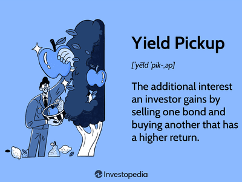

The world of fixed income investing offers a myriad of strategies designed to optimize returns and manage risks. Among these, interest rate swaps, yield pickup strategies, and algorithmic trading stand out as potent tools for enhancing fixed income portfolios. Understanding the synergy between these elements plays a crucial role in crafting advanced investment strategies. 

Interest rate swaps enable investors to manage interest rate exposure effectively. By exchanging fixed and floating rate payments, these derivative contracts allow investors to profit from interest rate fluctuations or to alter their interest rate exposure as needed. This flexibility is vital for sophisticated investors looking to align their portfolios with market conditions.



Complementing this, yield pickup strategies involve the exchange of lower-yielding bonds for those with higher yields, thus potentially increasing the overall yield of a bond portfolio. This strategy is particularly useful in varying interest rate environments where maintaining or managing risk levels while enhancing returns is necessary.

Algorithmic trading adds an extra layer of efficiency by automating complex trading strategies. By executing trades at optimal times and securing the best prices, algorithms maximize efficiency and returns, particularly in volatile markets. This automation allows for precise implementation of yield pickups and interest rate swaps, leading to enhanced execution quality over manual methods.

The interconnected use of interest rate swaps, yield pickup strategies, and algorithmic trading can significantly enhance a fixed income strategy. By integrating these tools, investors can optimize their portfolios through strategic implementation, ultimately improving returns while effectively managing associated risks. Understanding how these elements complement each other is essential for investors aiming to succeed in the complexities of financial markets.

## Table of Contents

## Understanding Interest Rate Swaps

Interest rate swaps constitute a fundamental derivative contract wherein two parties agree to exchange interest payment obligations on specified notional amounts over a defined period. Typically, this involves one party paying a fixed interest rate while the other pays a floating rate, often indexed to benchmarks such as the London Interbank Offered Rate (LIBOR) or the Secured Overnight Financing Rate (SOFR).

By engaging in these swaps, investors can effectively manage [interest rate](/wiki/interest-rate-trading-strategies) exposure. If an investor anticipates that future interest rates will rise, entering into a swap to pay a fixed rate and receive a floating rate can prove advantageous, potentially leading to profit as the floating rate increases. Conversely, locking in a lower fixed rate while paying a higher anticipated floating rate allows an investor to stabilize cash flows in a declining rate environment.

Interest rate swaps serve as an essential mechanism for transforming interest rate exposure. They enable the conversion from fixed to floating rates and vice versa, providing flexibility tailored to the investor’s outlook and strategy. This flexibility is particularly beneficial in managing the interest rate risk present in fixed income portfolios.

Beyond hedging and managing risks, interest rate swaps are instrumental in enhancing yield. By strategically selecting the terms of the swap agreement, sophisticated investors aim to achieve higher returns. This is often done by capitalizing on the spreads between fixed and floating rates, alongside accurately predicting interest rate movements.

The use of these derivatives requires careful risk assessment and understanding of market conditions. Nevertheless, they remain a cornerstone strategy for sophisticated investors seeking both to mitigate risk and to enhance the yield on their portfolios. The strategic deployment of interest rate swaps aligns interest payments more closely with the investor’s financial goals and market expectations.

## Yield Pickup Strategy Explained

A yield pickup strategy involves the deliberate reallocation of a bond portfolio by replacing lower-yielding bonds with those offering higher yields. This approach aims to enhance the portfolio's overall yield while maintaining or effectively managing risk levels. Investors employ this strategy to potentially bolster returns in various interest rate environments, leveraging differences in bond yields to maximize returns.

The fundamental principle behind this strategy is the yield curve, which represents the relationship between interest rates and the time to maturity of debt securities. Typically, longer-term bonds offer higher yields than shorter-term ones, compensating for risks like inflation and interest rate changes. Yield pickup takes advantage of these variations by shifting investments from bonds with lower yields to those with higher returns, thereby increasing the portfolio's yield.

For a practical example, consider a scenario where the yield on a 5-year bond is 3% while a similar risk 10-year bond yields 4%. An investor applying a yield pickup strategy might sell the 5-year bond to purchase the 10-year bond, thereby securing a higher yield and potentially enhancing overall returns.

This strategy, however, requires careful assessment of risk factors, such as credit risk, interest rate risk, and duration risk. Duration, a measure of a bond's sensitivity to interest rate changes, is particularly important. Longer-duration bonds may offer higher yields but are more sensitive to interest rate shifts. Therefore, investors need to conduct thorough risk assessments and consider factors such as:

- Credit spread differentials: Differences in credit spreads between bonds can indicate potential yield pickups within the same credit rating class.

- Duration management: Balancing the duration of the portfolio to avoid excessive exposure to interest rate changes while pursuing higher yields.

- Market conditions: Monitoring economic indicators and rate forecasts to align yield pickup strategies with broader market trends.

The yield pickup strategy is an essential tool for yield enhancement, allowing investors to better navigate varying interest rate landscapes by optimizing the yield potential of their bond portfolio.

## The Role of Algorithmic Trading in Fixed Income Strategies

Algorithmic trading refers to the use of computer algorithms to automate the buying and selling of financial instruments, streamlining trades by executing them efficiently and with precision. In the context of fixed income strategies, [algorithmic trading](/wiki/algorithmic-trading) provides significant advantages by removing the latency and human error inherent in manual trading.

The use of algorithms allows traders to execute transactions at optimal times, which is crucial in markets where timing can drastically affect the profitability of trades. For fixed income strategies, particularly those involving yield pickups and interest rate swaps, algorithms can be programmed to take into account a variety of market factors and execute trades accordingly. For instance, yield pickup strategies may require the timely exchange of lower-yield bonds for higher-yield alternatives. Algorithms can automate this process, continuously scanning the market for suitable bonds and executing trades when predefined criteria are met.

A key feature of algorithmic trading is its ability to provide [liquidity](/wiki/liquidity-risk-premium) and price improvement. By rapidly analyzing large data sets and executing trades in milliseconds, algorithms can interact with different market places to secure the best possible prices. This capability is particularly useful in volatile markets, where quick execution can mean the difference between a profitable trade and a loss.

The precision and consistency provided by algorithmic trading are invaluable for managing and optimizing interest rate swaps. Swaps often involve complex calculations and multiple market factors, which algorithms can handle efficiently. By automating these processes, traders can swiftly adjust their portfolios in response to changing interest rates or anticipated market movements, ensuring that predefined financial goals are met.

Python, a popular language in financial programming due to its extensive libraries and ease of use, is often employed to develop trading algorithms. A typical Python script for a simple trading algorithm might look like this:

```python
import numpy as np
import pandas as pd
import datetime as dt

from pandas_datareader import data as pdr
import yfinance as yf  # For more datasets, visit: https://paperswithbacktest.com/datasetsin
yfin.pdr_override()

# Parameters
start = dt.datetime(2020, 1, 1)
end = dt.datetime.now()
symbol = 'TLT'  # Example fixed income ETF

# Fetch data
data = pdr.get_data_yahoo(symbol, start, end)

# Simple moving average algorithm
data['SMA_50'] = data['Close'].rolling(window=50).mean()
data['SMA_200'] = data['Close'].rolling(window=200).mean()

# Signal generation
data['Signal'] = np.where(data['SMA_50'] > data['SMA_200'], 1, 0)

# Trading positions
data['Position'] = data['Signal'].diff()

# Display potential trades
print(data[data['Position'] != 0][['Close', 'SMA_50', 'SMA_200', 'Position']])
```

In this example, the algorithm identifies crossover points between short-term and long-term moving averages as signals for potential trade entries or exits. This type of logic can be expanded and adapted to encompass more complex strategies, including those within the fixed income area. The objective remains to exploit inefficiencies effectively and enhance trading outcomes systematically. 

By leveraging the speed and data processing capabilities of algorithms, traders in fixed income markets can achieve precision in executing yield pickups and swaps, maximizing returns while managing associated risks.

## Combining Interest Rate Swaps and Yield Pickup Strategies

Combining interest rate swaps with yield pickup strategies can effectively optimize fixed income portfolios by leveraging each component's strengths. Interest rate swaps allow investors to exchange fixed rate payments for floating rate payments or vice versa, thus managing exposure to interest rate fluctuations. When paired with yield pickup strategies, which involve transitioning from lower-yielding bonds to those with higher yields, investors can potentially enhance portfolio returns while controlling risk.

To implement this combination successfully, investors must align the interest rate swap positions with higher-yielding bond investments. For instance, if an investor holds a portfolio of bonds with predominantly fixed interest payments, they might enter into an interest rate swap to receive floating rate payments. This shift could be advantageous if market interest rates are expected to rise, as the floating rate payments would increase, offering higher returns than the original fixed rates.

Strategically planning these moves is crucial. The effectiveness of this strategy hinges on several factors, such as anticipating interest rate movements, selecting the right duration and counterparties for the swaps, and choosing suitable higher-yielding bonds without compromising the portfolio's risk profile. An optimal approach might involve using quantitative models or algorithmic trading to automate these decisions, ensuring precise execution.

For instance, Python can be used to model potential interest rate movements and evaluate the impact of different swap scenarios:

```python
import numpy as np

def calculate_swap_value(fixed_rate, floating_rate, notional, periods):
    npv_fixed = np.sum([notional * fixed_rate * (1 / (1 + floating_rate) ** t) for t in range(1, periods + 1)])
    npv_floating = np.sum([notional * floating_rate * (1 / (1 + floating_rate) ** t) for t in range(1, periods + 1)])
    return npv_floating - npv_fixed

# Example usage: fixed rate = 3%, floating rate = 4%, notional = $1,000,000, periods = 5
swap_value = calculate_swap_value(0.03, 0.04, 1000000, 5)
print(f"Net present value of swap: ${swap_value:,.2f}")
```

This combination of strategies requires careful analysis to ensure that benefits outweigh the risks. Changes in market conditions, such as an unexpected drop in interest rates or a decrease in higher-yielding bond quality, can adversely affect the strategy's performance. Therefore, investors should conduct thorough due diligence, continuously monitoring macroeconomic indicators and credit ratings to make informed decisions.

Ultimately, the synergy between interest rate swaps and yield pickup strategies enables investors to optimize their fixed income portfolios. With strategic planning and analysis, the combination can significantly improve returns while effectively managing interest rate risks, thus enhancing overall portfolio performance.

## Case Study: A Successful Implementation

To illustrate the strategic use of interest rate swaps and yield pickup strategies, let's examine a successful case study involving a mid-sized investment fund managing a fixed income portfolio. The objective was to enhance portfolio yields while effectively managing interest rate risk in a fluctuating economic environment.

### Step 1: Portfolio Analysis

The fund manager began with an in-depth analysis of the existing bond portfolio, identifying securities that were underperforming relative to market opportunities. The analysis revealed a significant portion of the portfolio was invested in low-yield, high-credit-quality government bonds which were susceptible to interest rate increases.

### Step 2: Implementing Interest Rate Swaps

To mitigate interest rate risk and potentially enhance returns, the manager opted to enter into interest rate swaps. The swaps were structured to exchange fixed-rate cash flows for floating-rate cash flows, capitalizing on expected interest rate hikes. This tactical move aimed to transition a portion of the portfolio from fixed to variable exposure, aligning it with the anticipated economic scenario of rising rates.

Mathematically, the swap’s payoff was structured as follows:

$$
\text{Net Payoff} = (\text{Floating Rate} - \text{Fixed Rate}) \times \text{Notional Principal}
$$

### Step 3: Executing Yield Pickup Strategy

Simultaneously, the fund manager engaged in a yield pickup strategy by swapping out lower-yielding bonds for higher-yielding corporate bonds. This involved a targeted bond selection process, focusing on securities with moderately higher risk profiles but offering substantial yield premiums. A careful balance was maintained to ensure the additional yield did not disproportionately increase the overall portfolio risk.

### Step 4: Leveraging Algorithmic Trading

Algorithmic trading systems were employed to execute both interest rate swaps and bond replacements efficiently. The algorithms were programmed to identify optimal trading opportunities, executing transactions at times calculated to maximize pricing advantages and minimize costs.

Python pseudocode for algorithmic trade execution:

```python
def execute_trades(bond_list, swap_list, market_conditions):
    for bond in bond_list:
        if bond.yield < market_conditions.target_yield:
            replace_bond(bond, market_conditions.optimal_bond)

    for swap in swap_list:
        if swap.is_profitable(market_conditions.current_rate):
            initiate_swap(swap)

execute_trades(current_portfolio.bonds, current_portfolio.swaps, current_market_conditions)
```

### Results and Lessons Learned

The results of this dual strategy approach were significant. The portfolio’s overall yield increased by an average of 150 basis points, while interest rate risk exposure was effectively managed, maintaining a stable duration. This success demonstrated the efficacy of combining interest rate swaps and yield pickup strategies within an algorithmic framework to adapt to changing market conditions.

The fund's experience underscores several key lessons for future implementations: the importance of timely market analysis, the need for precise execution facilitated by algorithmic systems, and the cautious integration of higher-yield instruments to balance risk and return. These lessons can guide investment managers in crafting responsive, dynamic fixed income strategies that navigate complex financial landscapes effectively.

## Conclusion

Interest rate swaps and yield pickup strategies are integral to enhancing fixed income investing, offering avenues to optimize returns and manage risks by reshaping interest rate exposure and improving portfolio yield. Interest rate swaps, as derivative contracts, allow investors to manage interest rate exposure effectively by exchanging fixed and floating interest rate payments. This mechanism provides flexibility to adapt to changing market conditions and takes advantage of interest rate fluctuations. Yield pickup strategies complement this by facilitating the transition from lower-yielding bonds to higher-yield options, thereby maximizing portfolio returns.

Combining these strategies with algorithmic trading greatly enhances their efficacy. Algorithmic trading automates trade execution, improving precision and timing while reducing the impact of market [volatility](/wiki/volatility-trading-strategies). This automation is particularly advantageous in fast-moving markets, where timing is critical to capturing yield and mitigating risk. Algorithms can quickly analyze market conditions and execute trades that would be difficult for humans to replicate with the same speed and accuracy.

To successfully leverage interest rate swaps and yield pickup strategies, investors must remain informed and actively adjust their approaches as financial landscapes evolve. Staying updated on market trends and technological advancements is crucial for strategic implementation. By carefully integrating these tools and utilizing the power of automated trading systems, investors can navigate the complexities of financial markets more effectively, balancing risk and reward to achieve enhanced portfolio performance.

## References & Further Reading

[1]: ["Interest Rate Swaps and Their Derivatives: A Practitioner's Guide"](http://students.aiu.edu/submissions/profiles/resources/onlineBook/N2D3C5_Interest_Rate_Swaps_and_Their_Derivatives.pdf) by Amir Sadr

[2]: ["Fixed Income Analysis"](https://en.wikipedia.org/wiki/Fixed_income_analysis) by Frank J. Fabozzi

[3]: ["Advances in Financial Machine Learning"](https://www.amazon.com/Advances-Financial-Machine-Learning-Marcos/dp/1119482089) by Marcos Lopez de Prado

[4]: ["Algorithmic and High-Frequency Trading"](https://www.cambridge.org/us/universitypress/subjects/mathematics/mathematical-finance/algorithmic-and-high-frequency-trading) by Álvaro Cartea, Sebastian Jaimungal, and José Penalva

[5]: ["Quantitative Trading: How to Build Your Own Algorithmic Trading Business"](https://www.amazon.com/Quantitative-Trading-Build-Algorithmic-Business/dp/1119800064) by Ernest P. Chan

[6]: ["An Introduction to the Mathematics of Financial Derivatives"](https://archive.org/details/introductiontoma0000neft) by Salih N. Neftci

[7]: ["Python for Finance: Mastering Data-Driven Finance"](https://www.amazon.com/Python-Finance-Mastering-Data-Driven/dp/1492024333) by Yves Hilpisch