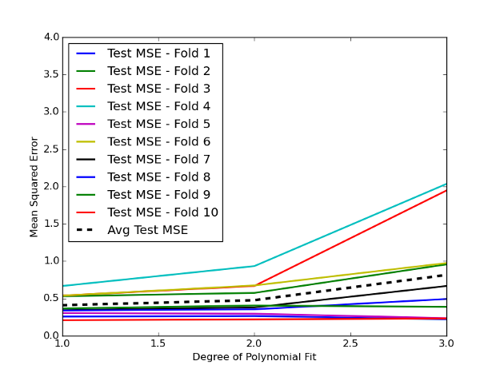

In the world of algorithmic trading, accurate backtesting is crucial. This process involves simulating a trading strategy using historical data to predict its future performance. However, traditional methods like K-Fold Cross-Validation often fall short due to the distinctive features of financial time-series data, such as temporal dependencies and volatility clustering. This article explores the advanced technique of Purged K-Fold Cross-Validation and its application in algorithmic trading.

Traditional cross-validation techniques face several challenges when applied to financial datasets. These data often exhibit non-independence due to autocorrelation and structural breaks, leading to unrealistic backtesting results caused by look-ahead bias and data leakage. Purged K-Fold Cross-Validation addresses these issues by purging overlapping data between training and validation sets along the temporal axis, effectively eliminating look-ahead bias. Furthermore, using an embargo technique ensures any temporally adjacent data is omitted, reducing data leakage and enhancing the accuracy of the model's predictive power.



Understanding these concepts enables traders and analysts to make more informed decisions, thereby reducing the risk of overfitting during backtesting and improving the predictive performance of trading strategies. This method also offers advantages over traditional cross-validation methods by providing a more robust framework for model evaluation in environments with temporal dependencies. Consequently, utilizing Purged K-Fold Cross-Validation leads to better trading strategy performance and resilience in real-world market conditions.

## Table of Contents

## Understanding K-Fold Cross-Validation

K-Fold Cross-Validation is a prevalent technique in [machine learning](/wiki/machine-learning) utilized to evaluate the generalization capability of a statistical analysis to an independent data set. It operates by dividing a dataset into k distinct subsets or folds. The method proceeds by training the model on k-1 of these subsets while validating it on the remaining fold. This cycle is repeated k times, ensuring each subset serves once as a validation set. The results are then averaged to produce an overall assessment.

This method's popularity stems from its ability to provide a thorough utilization of the data, maximizing the dataset's efficiency without requiring an additional dedicated test set. However, K-Fold Cross-Validation assumes that all data points are independently and identically distributed (IID). This assumption often falls short when applied to financial datasets, which typically exhibit temporal dependencies and patterns of [volatility](/wiki/volatility-trading-strategies) clustering. Financial data are time-series in nature, meaning that each data point is, to some extent, influenced by the preceding data points. This results in challenges such as look-ahead bias, where future information inappropriately influences the model's training, and data leakage, where the model is trained on information it would not have in a live scenario.

In financial applications, these assumptions often lead to unrealistic [backtesting](/wiki/backtesting) results. Look-ahead bias occurs when the dataset inadvertently allows the model to learn from data points that include future information, thus providing an overly optimistic performance estimate. Data leakage, where the training set inadvertently contains elements of the validation or test set that should be isolated, further distorts the validity and reliability of the model. Both issues result in a model that might perform well on historical data but poorly on new, unseen data, highlighting the limitations of conventional K-Fold Cross-Validation in financial contexts.

## Challenges with K-Fold in Financial Data

Financial time-series data present unique challenges for traditional K-Fold Cross-Validation due to their inherent non-independence and non-identical distribution (non-IID) nature. These datasets often exhibit autocorrelation, where current values are influenced by their previous values, and structural breaks, sudden changes in the underlying data generation process. These characteristics make it difficult to assume that samples are independently and identically distributed (IID), a core assumption behind traditional K-Fold Cross-Validation.

One significant issue prevalent in financial modeling is the phenomenon of look-ahead bias. Look-ahead bias occurs when future information is inadvertently included in the training phase of a model. This happens because traditional cross-validation methods do not account for the temporal ordering of financial data, leading to overly optimistic performance estimations. For instance, if a model is trained using data that contains future information about an asset's price, the resulting predictions can be misleading, suggesting a level of accuracy that would not be achievable in a real-world setting.

Another critical challenge is multiple testing or selection bias. This issue arises when a model is repeatedly exposed to the same test set, potentially resulting in a model that is finely tuned to historical data. Such a model may appear effective when evaluated on past data but performs poorly when applied to new, unseen data. This bias is particularly problematic in finance, where market conditions are continually evolving and past performance is not always indicative of future results.

Additionally, financial datasets often suffer from data leakage. Data leakage occurs when the training dataset inadvertently contains information that would not be available at the time a prediction is made in a live setting. This can happen if, for instance, data from the future leaks into the training set, providing the model with an unfair advantage and skewing its assessment. As a result, the model's performance might appear to be accurate during backtesting but fails when deployed in real-time trading environments.

These challenges highlight the necessity for more advanced validation techniques in [algorithmic trading](/wiki/algorithmic-trading), ones that can appropriately account for the temporal dependencies and dynamic nature of financial data. Such methods should ensure that models are evaluated in a manner that genuinely reflects their potential performance in live market conditions.

 to Purged K-Fold Cross-Validation

Purged K-Fold Cross-Validation is a sophisticated technique tailored to address the unique challenges posed by traditional K-Fold Cross-Validation in financial time-series data. Standard cross-validation methods often fall short in financial settings due to temporal dependencies, leading to biased evaluation results. Purged K-Fold Cross-Validation seeks to mitigate these biases by incorporating a structured temporal element in the validation process.

The purging process is pivotal in this method. It involves the careful removal of data that overlaps temporally between the training and validation sets. In traditional methods, inadvertent inclusion of future information in the training set can occur, leading to look-ahead bias. By purging overlapping data along the temporal axis, this method ensures that the model does not gain unfair predictive advantages from future information that would not be available in real-world trading.

Enhancing the purging strategy is the introduction of the 'embargo' approach. This technique further refines the separation of data by excluding any training data points that are temporally proximate to the validation data. The embargo period creates a buffer zone around the validation set. This effectively prevents data leakage, where information from the training set could inadvertently influence the validation set, compromising the integrity of the model's evaluation.

Together, these methods enhance the generalization capability of financial models. Traditional cross-validation often overestimates a model's performance due to biased evaluation strategies. By integrating purging and embargo techniques, Purged K-Fold Cross-Validation fosters a more rigorous evaluation framework. This not only reduces overfitting but also allows backtests to align more closely with real-world trading conditions, yielding results that more accurately reflect potential performance.

Implementing Purged K-Fold Cross-Validation requires a robust understanding of the temporal structure of the data. Practitioners must meticulously define training and validation sets, ensuring proper temporal separation. This methodological rigor ultimately leads to better robustness and reliability in algorithmic trading strategies, aligning backtested insights more closely with live market behavior.

## Implementing Purged K-Fold in Algorithmic Trading

To implement Purged K-Fold Cross-Validation in algorithmic trading, the process begins with the meticulous partitioning of the dataset into training and test subsets that are temporally non-overlapping to avoid skewed results. This involves leveraging the purging process, where any data that shares time windows with the validation set is omitted from the training set, minimizing look-ahead bias.

A crucial element in this implementation is the embargo technique. This involves adding a temporal buffer zone around the validation data, ensuring data points proximal to the validation set are not included in the training dataset. This further reduces the potential for data leakage. For instance, suppose the validation period ends at time $t$; an embargo of width $b$ would exclude any data points in the interval $[t+1, t+b]$ from the training set.

Practitioners should also carefully consider the financial data's granularity, whether it involves high-frequency (minute or second-level), daily, or long-term (monthly or annually) data. Each type requires a tailored approach to purging and embargoing to adequately capture the temporal dependencies and ensure robust model performance. For daily data, an embargo period might only span a few days, whereas high-frequency data may necessitate minute-level embargo periods to mitigate the risk of leakage.

The Purged K-Fold method is particularly beneficial in validating Deep Reinforcement Learning (DRL) models, which are increasingly used in trading for their ability to optimize strategies through continuous learning and adaptation. It assists in evaluating these models against realistic scenarios by accounting for sequential dependencies in financial data, thus improving the validity and reliability of the strategies derived from them.

The following Python code snippet demonstrates a basic implementation of Purged K-Fold Cross-Validation with an embargo:

```python
import numpy as np

def purged_k_fold(X, y, n_splits=5, embargo=0):
    n_samples = len(X)
    indices = np.arange(n_samples)
    fold_sizes = np.full(n_splits, n_samples // n_splits, dtype=int)
    fold_sizes[:n_samples % n_splits] += 1
    current = 0
    for fold_size in fold_sizes:
        start, stop = current, current + fold_size
        mid_point = int((start + stop) / 2)
        embargo_start, embargo_stop = max(0, start - embargo), min(n_samples, stop + embargo)

        test_mask = np.zeros(n_samples, dtype=bool)
        test_mask[start:stop] = True
        train_mask = np.ones(n_samples, dtype=bool)
        train_mask[start:stop] = False
        train_mask[embargo_start:embargo_stop] = False

        yield indices[train_mask], indices[test_mask]
        current = stop
```

In this code, `X` and `y` are the features and target variables, respectively. `n_splits` determines the number of folds, and `embargo` specifies the embargo period. This implementation cycles through folds, calculating indices for training and testing, while observing the embargo constraint to minimize leakage and bias.

## Advantages and Limitations

Purged K-Fold Cross-Validation brings forth notable advantages for algorithmic trading, most significantly by reducing look-ahead bias and data leakage. By carefully purging datasets, this method ensures that the temporal dependencies inherent to financial time-series data are respected, thereby enhancing the robustness of trading models when applied to unseen data. This robustness is critical in ensuring that trading strategies do not merely capitalize on spurious patterns, but instead hold genuine predictive power over new, unobserved data samples.

Nevertheless, Purged K-Fold Cross-Validation is not without its limitations. One primary challenge involves the added computational complexity this method demands. The purging process, alongside the implementation of embargo strategies, requires substantial computational resources, which can become a bottleneck for large datasets or high-frequency trading scenarios. This increased complexity necessitates a balance between thorough validation and computational efficiency.

Moreover, the method assumes market conditions remain static throughout the purging and embargo phases. However, financial markets are dynamic, often characterized by rapid changes and unforeseen events. This assumption might lead to an inadequate reflection of real-world trading conditions, potentially reducing the method's effectiveness in highly volatile or shifting markets.

Additionally, researchers and practitioners must exercise caution to prevent overly sparse training sets. Excessive purging or aggressive application of embargo periods can lead to insufficient data for model training, which can hinder the model's ability to generalize effectively. This sparsity could weaken the model's performance when applied to new data, as it may not have encountered a comprehensive range of scenarios during training.

Therefore, while Purged K-Fold Cross-Validation offers a more refined approach to model evaluation, it demands careful consideration of the available data and computational resources. Researchers must weigh these factors against the potential for obtaining more reliable, actionable insights into trading strategies that can better withstand the complexities of real-world market conditions.

## Conclusion

Purged K-Fold Cross-Validation marks a crucial advancement in validating trading algorithms, effectively addressing the limitations of traditional cross-validation methods in financial data environments. This approach is particularly beneficial in managing the complexities associated with financial time-series data, which are often non-IID, exhibiting temporal dependencies and structural breaks. By employing purging and embargo techniques, this method mitigates the risks of look-ahead bias and data leakage—issues that frequently undermine the reliability of backtested trading models.

The purging technique involves systematically removing potential overlaps between training and validation datasets along the temporal dimension, thereby ensuring that past information does not inadvertently influence future predictions. The addition of an embargo period further enhances this process by excluding data points that are temporally proximate to the validation set, preventing any leakage that could distort the model's validity during simulation.

Incorporating these strategies allows for more precise simulation of trading conditions during model validation, leading to improved reliability of backtest results. The resulting models demonstrate enhanced robustness, capable of withstanding real-world market conditions more effectively. This reduction in overfitting risk paves the way for more efficient and resilient algorithmic trading frameworks, enhancing their predictive power and reliability in uncertain market environments.

As financial markets continue to evolve, the methods used to test and validate trading models must similarly advance. The Purged K-Fold Cross-Validation method exemplifies this evolutionary process, offering a robust framework that aligns algorithmic trading models with the complex and dynamic nature of financial markets. By updating our validation techniques, we ensure our models remain as adaptable and resilient as the markets they are designed to navigate, making them more reliable tools for decision-making in trading practices.

## References & Further Reading

[1]: ["Advances in Financial Machine Learning"](https://www.amazon.com/Advances-Financial-Machine-Learning-Marcos/dp/1119482089) by Marcos Lopez de Prado

[2]: Bergstra, J., Bardenet, R., Bengio, Y., & Kégl, B. (2011). ["Algorithms for Hyper-Parameter Optimization."](https://dl.acm.org/doi/10.5555/2986459.2986743) Advances in Neural Information Processing Systems 24.

[3]: ["Machine Learning for Algorithmic Trading"](https://github.com/stefan-jansen/machine-learning-for-trading) by Stefan Jansen

[4]: {"A Survey of Cross-validation Procedures for Model Selection" by Arlot and Celisse, 2010. URL: https://arxiv.org/pdf/0907.4728.pdf}

[5]: ["Quantitative Trading: How to Build Your Own Algorithmic Trading Business"](https://books.google.com/books/about/Quantitative_Trading.html?id=j70yEAAAQBAJ) by Ernest P. Chan

[6]: ["Evidence-Based Technical Analysis: Applying the Scientific Method and Statistical Inference to Trading Signals"](https://www.amazon.com/Evidence-Based-Technical-Analysis-Scientific-Statistical/dp/0470008741) by David Aronson