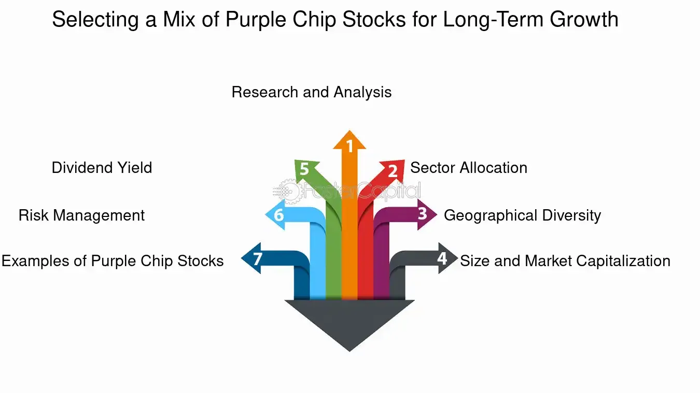

## Table of Contents

## What are Purple Chip Stocks?

Purple Chip Stocks are a special kind of investment that combines the reliability of blue-chip stocks with the growth potential of tech companies. Blue-chip stocks are from big, stable companies that have been around for a long time, like Coca-Cola or IBM. Tech companies, on the other hand, are often newer and can grow very quickly, like Google or Amazon. When people talk about Purple Chip Stocks, they mean companies that have the best of both worlds: they are stable and have a good chance to grow a lot.

These stocks are not an official category, but more of a nickname that investors use. They are usually from companies that are well-known and trusted, but also have a strong focus on technology or innovation. This makes them attractive to investors who want to invest in something safe but also want the chance for big returns. Examples of Purple Chip Stocks might include companies like Apple or Microsoft, which are big, stable, and also leaders in technology.

## How do Purple Chip Stocks differ from Blue Chip Stocks?

Purple Chip Stocks and Blue Chip Stocks are both considered safe investments, but they have some key differences. Blue Chip Stocks come from big, well-known companies that have been around for a long time. These companies are usually very stable and reliable, like Coca-Cola or Procter & Gamble. They are a safe choice for investors who want to avoid big risks and are happy with steady, but not huge, returns.

On the other hand, Purple Chip Stocks are a mix of the safety of Blue Chip Stocks and the growth potential of tech companies. They are from companies that are not only stable but also have a strong focus on technology or innovation. This means they can offer the chance for bigger returns than traditional Blue Chip Stocks. Companies like Apple or Microsoft are often seen as Purple Chip Stocks because they are big and stable, but also leaders in technology, making them attractive to investors looking for both safety and growth.

## What are the characteristics of a Purple Chip Stock?

Purple Chip Stocks are a special kind of investment that mixes the best parts of Blue Chip Stocks and tech companies. They come from big, stable companies that have been around for a while, just like Blue Chip Stocks. But what makes them different is that these companies also focus a lot on technology or new ideas. This means they can grow a lot, just like many tech companies do.

Because of this mix, Purple Chip Stocks are seen as a safe choice for investors who want to make money without taking big risks. At the same time, they also offer the chance for bigger returns than regular Blue Chip Stocks. Companies like Apple or Microsoft are often called Purple Chip Stocks because they are big and stable, but they also lead in technology and innovation. This makes them a good pick for people who want both safety and the chance to make more money.

## Can you provide examples of Purple Chip Stocks?

Purple Chip Stocks are a special kind of investment that mixes the best parts of Blue Chip Stocks and tech companies. They come from big, stable companies that have been around for a while, just like Blue Chip Stocks. But what makes them different is that these companies also focus a lot on technology or new ideas. This means they can grow a lot, just like many tech companies do.

Some examples of Purple Chip Stocks are Apple and Microsoft. Apple is a big company that makes iPhones, iPads, and other tech products. They have been around for a long time and are very stable, but they also keep coming up with new technology. Microsoft is another example. They make software like Windows and Office, and they are also working on new things like cloud computing and [artificial intelligence](/wiki/ai-artificial-intelligence). Both companies are seen as safe investments that can also grow a lot.

Other examples include companies like Amazon and Alphabet (Google's parent company). Amazon started as an online bookstore but has grown into a huge company that sells all kinds of things and offers services like cloud computing. Alphabet, through Google, is known for its search engine but also works on new technologies like self-driving cars and health research. These companies are big and stable, but they also focus on innovation, making them good examples of Purple Chip Stocks.

## What are the benefits of investing in Purple Chip Stocks?

Investing in Purple Chip Stocks can be a smart choice because they offer a good mix of safety and growth. These stocks come from big, stable companies that have been around for a long time, so they are less risky than many other investments. This means you don't have to worry as much about losing your money. At the same time, Purple Chip Stocks are from companies that focus on technology or new ideas, which can help them grow a lot. This means you might make more money than if you just invested in regular Blue Chip Stocks.

Another benefit is that Purple Chip Stocks are often from well-known companies like Apple, Microsoft, Amazon, and Google's parent company Alphabet. These companies are leaders in their fields and keep coming up with new products and services. This makes them attractive to investors who want to be part of exciting new developments while still having a safe place to put their money. So, if you want to invest in something that is both safe and has the chance to grow a lot, Purple Chip Stocks could be a good choice.

## What are the risks associated with Purple Chip Stocks?

Even though Purple Chip Stocks are seen as safe investments, they still have some risks. One risk is that the stock market can go up and down. This means the value of your Purple Chip Stocks can change a lot, and you could lose money if you need to sell them when the market is down. Another risk is that even big, stable companies can have problems. For example, they might not do as well as expected, or they might have to deal with new competition or changes in the market that affect their business.

Another thing to think about is that Purple Chip Stocks often come from companies that focus a lot on technology or new ideas. This can be good for growth, but it also means these companies might spend a lot of money on research and development. If their new projects don't work out, it could hurt their stock price. Also, technology changes quickly, and a company that is a leader today might not be a leader tomorrow. So, while Purple Chip Stocks can offer both safety and growth, they are not completely risk-free.

## How can one identify a potential Purple Chip Stock?

To identify a potential Purple Chip Stock, look for companies that are big and stable, like Blue Chip Stocks, but also focus a lot on technology or new ideas. These companies should have a strong history of doing well in their business and making money. They should also be leaders in their industry, known for coming up with new products or services that can help them grow. Companies like Apple, Microsoft, Amazon, and Alphabet are good examples because they are big, stable, and always working on new technology.

Another way to spot a Purple Chip Stock is to see if the company has a good balance between being safe and having the potential for growth. This means the company should not be too risky, but it should also have the chance to make more money in the future. You can check this by looking at the company's financial reports and seeing how much money they are making and how much they are spending on new projects. If a company is stable and also investing in new technology, it might be a good Purple Chip Stock.

## What sectors typically have Purple Chip Stocks?

Purple Chip Stocks are often found in the technology sector. This is because companies like Apple, Microsoft, and Alphabet (Google's parent company) are big, stable, and always coming up with new tech ideas. These companies have been around for a long time and make a lot of money, but they also spend a lot on research to create new products and services. This makes them good examples of Purple Chip Stocks because they are safe to invest in but also have the chance to grow a lot.

Another sector where you can find Purple Chip Stocks is in e-commerce and cloud computing. Amazon is a great example. It started as an online bookstore but has grown into a huge company that sells all kinds of things and offers services like cloud computing. Amazon is very stable and keeps coming up with new ways to make money, making it a good Purple Chip Stock. So, if you are looking for Purple Chip Stocks, the technology and e-commerce sectors are good places to start.

## How do Purple Chip Stocks perform during economic downturns?

Purple Chip Stocks can be a good choice during economic downturns because they come from big, stable companies that have been around for a long time. These companies often have strong financials and can handle tough times better than smaller or newer companies. For example, companies like Apple and Microsoft have a lot of money saved up, which helps them keep going even when the economy is not doing well. This means their stocks might not go down as much as others during a downturn.

However, even Purple Chip Stocks can lose value during a big economic downturn. The stock market can be unpredictable, and even big, stable companies can be affected by bad economic news. For instance, if people stop buying as many products or services, even companies like Amazon or Alphabet might see their stock prices go down. But because these companies are leaders in their fields and focus on new technology, they often recover faster than others once the economy starts to get better. So, while Purple Chip Stocks can be a safer choice during downturns, they are not completely immune to economic problems.

## What strategies should be used when investing in Purple Chip Stocks?

When investing in Purple Chip Stocks, it's a good idea to start by doing a lot of research. Look at the company's financial reports to see how much money they are making and how much they are spending on new projects. This will help you understand if the company is stable and has a good chance to grow. It's also important to keep an eye on the news and see if there are any big changes happening in the company or the industry that could affect the stock price. By staying informed, you can make better decisions about when to buy or sell.

Another strategy is to think about how long you want to keep your money invested. If you are planning to hold onto your Purple Chip Stocks for a long time, you might not worry too much about short-term ups and downs in the stock market. But if you might need your money sooner, you should be ready for the stock price to change a lot. It's also a good idea to spread your money around and not put it all in one stock. This way, if one stock goes down, you won't lose all your money. By being patient and diversifying your investments, you can make the most of the safety and growth potential that Purple Chip Stocks offer.

## How do Purple Chip Stocks fit into a diversified investment portfolio?

Purple Chip Stocks can be a great addition to a diversified investment portfolio because they offer a mix of safety and growth. These stocks come from big, stable companies that have been around for a long time, like Blue Chip Stocks. But they also focus a lot on technology or new ideas, which means they can grow a lot, just like many tech companies do. This makes them a good choice for investors who want to have some safe investments but also want the chance to make more money. By including Purple Chip Stocks in your portfolio, you can balance out riskier investments and still have the potential for good returns.

Adding Purple Chip Stocks to your portfolio can also help you spread out your money across different kinds of companies and industries. For example, if you invest in companies like Apple, Microsoft, Amazon, and Alphabet, you are investing in technology, e-commerce, and cloud computing. This can help protect your money because if one industry or company doesn't do well, the others might still do okay. So, by including Purple Chip Stocks in your mix of investments, you can have a more balanced portfolio that is both safe and has room to grow.

## What are the long-term growth prospects for Purple Chip Stocks?

Purple Chip Stocks have good long-term growth prospects because they come from big, stable companies that also focus on new technology. Companies like Apple, Microsoft, Amazon, and Alphabet are always working on new projects and coming up with new products. This means they have a good chance to keep growing and making more money over time. Even though the stock market can go up and down, these companies are leaders in their fields and have a history of doing well, which makes them a good choice for long-term investment.

Another reason Purple Chip Stocks have good growth prospects is that they are not just about safety but also about innovation. These companies spend a lot of money on research and development to stay ahead of the competition. For example, Apple keeps coming out with new iPhones and other tech products, while Amazon is always expanding its services. This focus on new ideas helps them grow even when the economy is not doing well. So, if you are looking for a safe investment that can also grow a lot over time, Purple Chip Stocks could be a good choice.

## References & Further Reading

[1]: Bergstra, J., Bardenet, R., Bengio, Y., & Kégl, B. (2011). ["Algorithms for Hyper-Parameter Optimization."](https://dl.acm.org/doi/10.5555/2986459.2986743) Advances in Neural Information Processing Systems 24.

[2]: ["Advances in Financial Machine Learning"](https://www.amazon.com/Advances-Financial-Machine-Learning-Marcos/dp/1119482089) by Marcos Lopez de Prado

[3]: ["Evidence-Based Technical Analysis: Applying the Scientific Method and Statistical Inference to Trading Signals"](https://www.amazon.com/Evidence-Based-Technical-Analysis-Scientific-Statistical/dp/0470008741) by David Aronson

[4]: ["Machine Learning for Algorithmic Trading"](https://github.com/stefan-jansen/machine-learning-for-trading) by Stefan Jansen

[5]: ["Quantitative Trading: How to Build Your Own Algorithmic Trading Business"](https://www.amazon.com/Quantitative-Trading-Build-Algorithmic-Business/dp/1119800064) by Ernest P. Chan