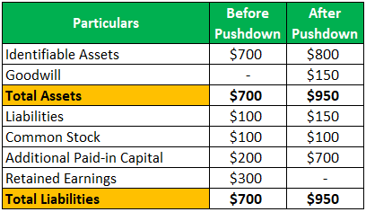

Financial reporting and modern accounting practices are increasingly intertwined in today's complex economic landscape. The integration of advanced technologies and innovative methods, such as pushdown accounting, algorithmic trading, and enhanced financial reporting standards, are shaping the future of business finance. These concepts, while distinct, converge to offer comprehensive insights into financial health, driving accurate decision-making and strategic forecasting.

Pushdown accounting represents a nuanced approach to financial reporting, particularly in scenarios involving mergers and acquisitions. This method allows companies to reflect the acquisition-related adjustments directly on the acquired firm's financial statements, effectively simplifying consolidated reports. Pushdown accounting can offer a clearer picture of the new ownership's financial impact. Understanding its implementation is crucial for accurately assessing financial status post-acquisition.

Algorithmic trading, or algo trading, is revolutionizing securities trading by using complex algorithms to execute orders at lightning speed. This method enhances market efficiency, reduces transaction costs, and minimizes human error. Its integration into financial systems emphasizes the need for transparent reporting to maintain market integrity and regulatory compliance.

The convergence of these elements highlights the evolving nature of financial reporting, driven by technological advancements and sophisticated accounting strategies. Understanding these components is essential in navigating the modern financial landscape, offering businesses the tools to thrive in a dynamic environment.

This article explores the relationship between pushdown accounting, algorithmic trading, and financial reporting processes. Readers will gain insights into how these modern accounting practices impact financial transparency, the role of regulatory frameworks in shaping these domains, and future trends poised to transform financial management.

## Table of Contents

## Understanding Financial Reporting in Modern Accounting

Financial reporting serves as a fundamental pillar in the business landscape, offering a transparent account of an organization's financial performance and position. It encompasses the structured presentation of financial statements, which include the balance sheet, income statement, cash flow statement, and statement of changes in equity. These documents provide stakeholders—such as investors, creditors, regulators, and management—with insights into a company's financial health, enabling informed decision-making and strategic planning.

Accounting standards, chiefly the Generally Accepted Accounting Principles (GAAP) and the International Financial Reporting Standards (IFRS), play a crucial role in shaping the content and presentation of financial reports. These standards ensure consistency, reliability, and comparability of financial statements across different jurisdictions and time periods. GAAP, predominantly used in the United States, encompasses a framework comprising conventions, rules, and procedures essential for precise financial reporting. Meanwhile, IFRS, adopted by over 120 countries, prioritizes a principle-based approach, fostering a high level of transparency and facilitating international financial integration.

Contemporary accounting practices have significantly influenced financial reporting, driven largely by technological advancements and complex economic activities. The transition to digital platforms has expedited data collection, processing, and reporting, leading to enhanced accuracy and efficiency. Automated accounting systems and software streamline the reporting process, reducing human error and allowing real-time financial data analysis. Moreover, contemporary practices, such as fair value accounting, have introduced more dynamic financial assessments, reflecting current market conditions rather than historical costs. This shift provides a more realistic view of a company’s financial position and risks, although it also introduces challenges related to valuation and [volatility](/wiki/volatility-trading-strategies).

In sum, financial reporting, underscored by rigorous standards and contemporary practices, is indispensable for accurate corporate evaluation and strategic oversight. These elements coalesce to form a comprehensive framework that not only fulfills legal obligations but also drives transparency and confidence in financial markets globally.

## The Mechanism of Pushdown Accounting

Pushdown accounting is an accounting method applied when a company undergoes a substantial change in ownership, typically following an acquisition. This approach allows the adjustment of the acquired company's financial statements to reflect the new owner's fair value assessments directly onto the subsidiary's [books](/wiki/algo-trading-books), hence "pushing down" the effects of the purchase. One primary purpose is to align the company's financial reporting with the new economic realities introduced by the acquisition.

### Differences Between Traditional and Pushdown Accounting Approaches

Traditional accounting methods continue to maintain the historical cost basis for a subsidiary's financial records, even after a change in ownership. These historical costs do not reflect the fair value adjustments that arise from the acquisition, maintaining a separation between the parent company's adjustments and the subsidiary's accounting books.

In contrast, pushdown accounting integrates these fair value adjustments directly into the subsidiary's financial statements. Thus, the assets and liabilities of the subsidiary are revalued at fair value, providing a more accurate representation of their current worth post-acquisition. This can mean adjustments to assets, liabilities, and equity based on the purchase price allocation executed during the acquisition.

### Key Benefits of Pushdown Accounting

One of the main advantages of pushdown accounting is its ability to simplify the financial reporting process by eliminating the need for the acquiring company to perform additional reconciliations between its consolidated financial statements and those of its subsidiaries. By aligning the subsidiary's financials with the parent company's valuation, consistency across financial reporting is maintained.

Pushdown accounting also aids in financial transparency. By reflecting the new fair values on the subsidiary's books, stakeholders can have a clearer understanding of the subsidiary's financial health and performance, which might not be as evident under traditional accounting.

Moreover, for the acquiring company, pushdown accounting can result in tax benefits resulting from depreciation or amortization expenses derived from the new fair value bases of the assets.

### Challenges Associated with Pushdown Accounting

Despite its benefits, pushdown accounting is not without challenges. One significant concern is the potential volatility it introduces to a subsidiary's financial statements. The revaluation of assets and liabilities can lead to large fluctuations in reported earnings and financial position, affecting the subsidiary's perceived stability.

Another challenge is maintaining compliance with accounting standards such as U.S. Generally Accepted Accounting Principles (GAAP) or International Financial Reporting Standards (IFRS) which may have specific requirements or limitations regarding pushdown accounting. For example, the U.S. Financial Accounting Standards Board (FASB) has guidelines under ASC 805 for applying pushdown accounting, which companies need to adhere to strictly.

Finally, there might be resistance from within the subsidiary, as aligning with pushdown accounting could obscure the subsidiary's historical financial performance, altering comparisons with prior periods. Furthermore, stakeholders such as non-controlling interest holders may have differing views on the application of fair value adjustments.

Overall, while pushdown accounting provides a more holistic view of a company's financial position post-acquisition, its implementation requires careful consideration of both regulatory guidelines and potential impacts on financial statement users.

## Algorithmic Trading: Transforming Financial Markets

Algorithmic trading, often referred to as algo trading, involves the use of computer algorithms to automate trading strategies and execute orders at speeds and frequencies beyond human capability. This approach to trading has gained significant traction since the late 20th century, transforming financial markets with its precision and efficiency. The fundamental idea is to leverage statistical models and advanced computational techniques to identify profitable opportunities, minimize costs, and reduce human error.

One of the primary reasons for the growing popularity of [algorithmic trading](/wiki/algorithmic-trading) is its ability to manage large volumes of trades with minimal human intervention. Algorithms can be programmed to analyze multiple market conditions simultaneously and execute transactions based on pre-defined criteria, such as timing, price, or quantity. This real-time analysis and execution enable traders to capitalize on even the smallest market inefficiencies.

Algorithmic trading is also integrated within the broader framework of financial reporting and analysis. It provides a mechanism for investors and traders to incorporate complex data analytics into their decision-making processes. For instance, algo trading can utilize historical data and real-time information to forecast stock price movements, assess risks, and evaluate portfolio performance continuously. This integration helps enhance the accuracy of financial reports and forecasts, providing stakeholders with more reliable data for strategic planning.

The introduction of algo trading has had a profound impact on market efficiency and transparency. From a market efficiency perspective, algorithmic trading has contributed to increased [liquidity](/wiki/liquidity-risk-premium) and tighter bid-ask spreads. Liquidity allows for the smoother execution of large orders without significantly impacting the market price, while tighter spreads lower the cost of executing trades. This enhances overall market efficiency, as prices are more reflective of all available information.

Transparency in financial markets has also improved with the rise of algorithmic trading. As algorithms execute trades based on quantifiable and programmed criteria, there is increased visibility into the trading process. Market participants can track the execution of these trades, which promotes fairness and reduces the potential for market manipulation.

Despite its benefits, algorithmic trading also presents challenges, such as the risk of exacerbating market volatility. High-frequency trading, a subset of algo trading, can lead to flash crashes where rapid, automated trading activities cause sharp market drops, as seen in the infamous 2010 Flash Crash. Regulatory bodies continue to refine regulations to address these risks and ensure market stability. 

Overall, algorithmic trading is a significant technological advancement that continues to reshape financial markets. Its ability to enhance efficiency and transparency has made it a critical component of modern trading strategies and financial reporting, offering traders and investors a powerful tool for navigating the complexities of today's markets.

## Integrating Pushdown Accounting with Algo Trading Insights

Integrating pushdown accounting with algorithmic trading insights offers a novel approach to enhancing financial reporting and decision-making processes. Pushdown accounting involves recording assets and liabilities of a subsidiary at their fair values following an acquisition directly in the subsidiary's books. This accounting method reflects the economic reality more accurately post-acquisition, providing clearer insights into the subsidiary's financial standing. On the other hand, algorithmic trading employs complex algorithms to execute trades at high speeds and volumes, often relying on mathematical models and historical data.

The integration of these two paradigms presents multiple synergies. One significant application is in the optimization of financial reporting. By using algorithmic trading insights such as predictive analytics and real-time data processing, businesses can model potential market impacts on their recent acquisitions more accurately. This approach ensures that financial reports consistently reflect current economic realities and projections, thus enhancing transparency.

In decision-making, combining pushdown accounting with algorithmic trading strategies can lead to more informed investment and risk management decisions. For instance, algorithmic models can simulate various economic scenarios and their potential impact on the valuation of acquired subsidiaries. These simulations can feed into the pushdown accounting process to adjust values dynamically, allowing management to make real-time, data-driven decisions regarding asset management and resource allocation.

Consider a hypothetical scenario: A company acquires a tech startup and applies pushdown accounting to integrate its financials. By employing algorithmic trading techniques, the company develops models predicting the startup's performance under various market conditions. These models could help in fine-tuning the startup's recorded fair values and expected cash flows, ensuring that stakeholders receive the most accurate financial projections. 

Such integration not only enhances the financial reporting quality but also provides competitive advantages by allowing companies to react swiftly to market changes and optimize investment strategies accordingly. These benefits underscore the potential of merging advanced accounting methods with cutting-edge trading technologies, heralding a more dynamic and responsive financial landscape.

## Regulatory Considerations and Industry Impacts

The regulatory landscape surrounding pushdown accounting and algorithmic trading is shaped by a combination of accounting standards, financial market regulations, and emerging compliance requirements. Pushdown accounting, a method where the financial statements of a subsidiary reflect the acquirer's valuation adjustments post-acquisition, involves specific regulatory considerations. In the United States, the Financial Accounting Standards Board (FASB) provides guidance on when and how pushdown accounting should be applied. [1] The Securities and Exchange Commission (SEC) may also offer insights or guidelines, particularly for publicly traded companies.

Algorithmic trading (algo trading) is subject to stringent regulations to ensure market stability, transparency, and fairness. Regulatory bodies like the SEC in the United States and the Financial Conduct Authority (FCA) in the United Kingdom oversee the activities of high-frequency traders and algo trading firms, focusing on aspects such as market manipulation, trade transparency, and systemic risk mitigation. Regulations such as the European Union's Markets in Financial Instruments Directive II (MiFID II) include certain provisions that specifically address algorithmic trading by requiring firms to implement adequate risk controls, provide detailed reporting, and ensure robust pre- and post-trade transparency. [2]

Regulatory authorities influence the adoption and evolution of both pushdown accounting and algo trading by establishing compliance requirements and issuing directives that govern their application. For instance, the deployment of algorithmic trading strategies must comply with market abuse regulations, anti-money laundering (AML) initiatives, and cybersecurity laws. In contrast, pushdown accounting must adhere to the stipulated accounting standards and financial reporting norms. Failure to comply can result in both financial penalties and reputational damage.

The impacts on different sectors vary significantly. Financial institutions, which are predominant users of algo trading, must continuously update their trading algorithms and compliance frameworks to align with changing regulations and market conditions. These updates often involve investments in technology and personnel training to mitigate risks and ensure compliance. In other sectors, businesses that undergo mergers and acquisitions (M&A) must carefully consider the implications of pushdown accounting on their financial statements and regulatory filings.

To adapt effectively, organizations should prioritize regulatory compliance as part of their strategic planning. This involves staying informed about ongoing regulatory updates, investing in robust financial and trading systems, and fostering a culture of continuous learning and adaptation. By doing so, businesses can not only mitigate risks but also leverage regulatory requirements as a pathway to innovate and improve operational efficiencies.

In conclusion, the regulatory frameworks governing pushdown accounting and algorithmic trading significantly impact their adoption and business practices across various sectors. As regulations continue to evolve, staying informed and adaptable becomes crucial for sustaining competitive advantages and achieving compliance.

### References:
1. "Pushdown Accounting." Financial Accounting Standards Board (FASB).
2. "Markets in Financial Instruments Directive II (MiFID II)." European Securities Markets Authority (ESMA).

## Future Outlook: Trends and Innovations

The landscape of financial reporting, accounting, and trading is undergoing significant transformations propelled by technological advancements and regulatory changes. Understanding these emerging trends and innovations is crucial for staying competitive and compliant.

**Emerging Trends in Financial Reporting and Accounting**

One of the most significant trends in financial reporting is the increasing integration of advanced technologies such as [artificial intelligence](/wiki/ai-artificial-intelligence) (AI) and [machine learning](/wiki/machine-learning) (ML) into accounting processes. These technologies are enabling more efficient data processing, enhanced accuracy, and deeper insights into financial data. AI-driven analytics can identify patterns and anomalies in large datasets, improving decision-making and risk management.

Blockchain technology is also gaining traction as a tool for financial reporting. Its inherent transparency and immutability make blockchain an ideal solution for ensuring the accuracy and integrity of financial records. This can potentially reduce auditing costs and enhance trust in financial statements.

Moreover, there is a push towards real-time financial reporting, facilitated by cloud computing and digital platforms. Real-time data access allows businesses to quickly adapt to market changes and make informed strategic decisions. This trend is likely to continue as companies seek greater agility and responsiveness.

**Role and Future of Pushdown Accounting**

Pushdown accounting, wherein the financial statements of a subsidiary reflect the acquirer’s basis of accounting, is likely to see increased usage as companies engage in more mergers and acquisitions. With globalization and market consolidation trends, pushdown accounting provides an efficient method for harmonizing financial reporting across entities. However, as this practice gains prominence, there may be calls for more standardized guidelines to address variations in its application.

**Algorithmic Trading Innovations**

Algorithmic trading, which utilizes computer algorithms to automatically execute trades, is an area that is rapidly evolving due to advancements in computing power and data analytics. The growth of big data and enhanced analytical tools allows for the development of more sophisticated algorithms capable of processing vast amounts of information quickly.

In the future, we may see the application of quantum computing in algorithmic trading. Quantum algorithms possess the potential to solve complex optimization problems far more efficiently than classical algorithms, potentially revolutionizing trading strategies and market dynamics.

Furthermore, the rise of environmental, social, and governance ([ESG](/wiki/esg-investing)) considerations in trading strategies is expected to influence algorithmic trading models. As investors increasingly [factor](/wiki/factor-investing) ESG criteria into their investment decisions, algorithmic trading systems will need to incorporate this data to remain competitive.

**Innovations in Financial Data Management and Reporting**

The use of robotic process automation (RPA) in financial data management is set to increase. RPA can automate repetitive and time-consuming tasks, such as data entry and reconciliation, allowing accounting professionals to focus on more strategic activities. This not only boosts productivity but also reduces the likelihood of human error.

Additionally, the use of predictive analytics is expected to become more prevalent in financial data management. By employing statistical models and algorithms to analyze historical data, businesses can forecast future financial trends and outcomes, enhancing strategic planning.

As these innovations continue to reshape the financial landscape, companies must remain adaptable and forward-thinking. Deploying advanced technologies and staying abreast of regulatory developments will be key to successfully navigating the evolving financial reporting and trading environment.

## Conclusion

The intersection of financial reporting with emerging accounting practices such as pushdown accounting and algorithmic trading reflects the dynamic nature of today's financial landscape. Through this article, we explored how these components are reshaping traditional approaches to accounting and market analysis, understanding their distinct and combined impacts on financial transparency, market efficiency, and decision-making processes.

Remaining informed and adaptable is essential as financial practices continuously evolve. The rapid integration of technology into accounting and trading requires professionals to not only comprehend these innovations but also to anticipate shifts in regulatory and industry standards. This ongoing evolution provides opportunities to enhance the accuracy and reliability of financial data reporting.

Furthermore, leveraging these advanced accounting and trading innovations holds tremendous potential for achieving business success. By integrating and applying contemporary accounting techniques and trading strategies, businesses can gain actionable insights, optimize their decision-making processes, and maintain competitive advantages. This strategic approach ensures that businesses are well-positioned to navigate the complexities of financial markets and capitalize on emerging opportunities in a rapidly changing environment. Ultimately, proficiency in both accounting and trading practices will be a cornerstone for future growth and sustainability in the financial industry.

## References & Further Reading

[1]: [Financial Accounting Standards Board (FASB). "Pushdown Accounting."](https://fasb.org/jsp/FASB/Page/SectionPage&cid=1176156316498)

[2]: European Securities and Markets Authority (ESMA). ["Markets in Financial Instruments Directive II (MiFID II)."](https://www.esma.europa.eu/publications-and-data/interactive-single-rulebook/mifid-ii)

[3]: J.P. Morgan (2020). ["The Impact of Algorithmic Trading on Financial Markets"](https://www.jpmorgan.com/markets/execute/fxalgos)

[4]: Lopez de Prado, M. (2018). ["Advances in Financial Machine Learning."](https://www.amazon.com/Advances-Financial-Machine-Learning-Marcos/dp/1119482089) Wiley.

[5]: Aronson, D. (2006). ["Evidence-Based Technical Analysis: Applying the Scientific Method and Statistical Inference to Trading Signals."](https://www.amazon.com/Evidence-Based-Technical-Analysis-Scientific-Statistical/dp/0470008741) Wiley.

[6]: Jansen, S. (2020). ["Machine Learning for Algorithmic Trading."](https://github.com/stefan-jansen/machine-learning-for-trading) 

[7]: Chan, E. P. (2008). ["Quantitative Trading: How to Build Your Own Algorithmic Trading Business."](https://github.com/justinchou/books-quantitative-trading) Wiley.