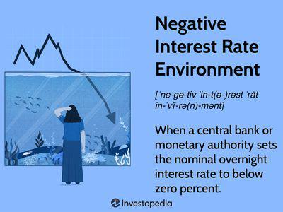

The world of economics is filled with metaphors that help us understand complex concepts, and one such metaphor is 'pushing on a string.' This phrase is a vivid representation of the challenges central banks face when trying to stimulate an economy using monetary policy. Originating during the economic hardships of the 1930s, the metaphor encapsulates the difficulties encountered when expansionary monetary measures fail to produce the desired economic activity, much like trying to push a piece of string that moves effortlessly only when pulled.

This article will investigate the origins of this metaphor, its significance in economic discourse, and its relevance to modern financial practices such as algorithmic trading. By dissecting the limits of monetary policy—highlighted during scenarios where increasing the money supply does not equate to increased economic activity—we uncover the necessity for alternative strategies, such as fiscal policy. These limitations are particularly pronounced in periods when banks and consumers are unwilling or unable to lend and spend, respectively, despite low interest rates or increased monetary supply.



Additionally, this exploration will touch on the connection between this metaphor and algorithmic trading, where comprehension of economic signals is fundamental. In algorithmic trading, models need to account for the inefficacy of certain monetary policies, such as during times of liquidity traps. Here, algorithms are designed to interpret economic indicators and central bank actions, making the understanding of metaphors like 'pushing on a string' critical for anticipating market movements. 

By unraveling the nuances of monetary policy, we will see how the metaphor of 'pushing on a string' has influenced economic thinking and financial strategies. This understanding is crucial not only for policymakers but also for traders and economists who navigate the intricate and often unpredictable financial landscape.

## Table of Contents

## The Origin and Meaning of 'Pushing on a String'

The metaphor "pushing on a string" emerged prominently in economic discourse during the mid-1930s, specifically within the context of U.S. Congressional hearings in 1935. This phrase was notably used by Marriner Eccles, who was the Chairman of the Federal Reserve at the time, to describe the inherent limitations of monetary policy when attempting to stimulate economic activity. During the Great Depression, Eccles was questioned about the Federal Reserve's capacity to catalyze economic recovery. He articulated that while central banks have the capacity to constrain or restrain economic activity through policies akin to "pulling on a string," their ability to spur economic growth by merely increasing the money supply is not symmetrical, hence the analogy to "pushing on a string."

This metaphor highlights the asymmetric influence of central banks over the economy under certain conditions. Central banks are effective in curbing inflation or slowing an overheated economy by increasing interest rates or pulling back on the money supply, comparable to pulling a string. However, during periods of economic downturns or recessions, such as the Great Depression, these entities face significant challenges in promoting economic growth through monetary policy alone. This issue arises because traditional stimulative measures, such as lowering interest rates and increasing the money supply, depend fundamentally on the willingness of banks to lend and consumers to spend. 

Historically, several economic episodes have underscored the metaphor's significance. For instance, during the Great Depression, despite the Federal Reserve's efforts to boost the economy by injecting [liquidity](/wiki/liquidity-risk-premium), the prevailing conditions led to a liquidity trap. In such a trap, interest rates are low, and injecting more money into the banking system does not necessarily result in increased lending or borrowing. Similar challenges were evident during the 2007-2008 financial crisis, where the central bank's efforts to recover the economy through quantitative easing faced limitations.

This notion highlights that the effectiveness of monetary policy is contingent upon external factors, such as consumer confidence and financial institutions' lending behavior, over which central banks have limited control. Thus, relying solely on monetary mechanisms can occasionally prove insufficient, necessitating complementary fiscal policy measures to effectively stimulate economic growth. The concept of "pushing on a string" serves as a poignant reminder of these constraints and the need for a multifaceted approach to economic policy.

## Monetary Policy: A One-Directional Tool?

Monetary policy, a critical instrument utilized by central banks, primarily involves manipulating interest rates and conducting open market operations to influence economic activity. Despite its utility, this policy often demonstrates a disproportionate efficiency in cooling down an overheated economy compared to stimulating a sluggish one. This asymmetric behavior is encapsulated in the concept of a "liquidity trap," where, under certain conditions, expansionary monetary policy fails to spur demand effectively.

A liquidity trap occurs when interest rates are already at or near zero, rendering traditional monetary policy tools ineffective. The 2007-2008 financial crisis exemplified this phenomenon. During the crisis, central banks, such as the Federal Reserve, aggressively lowered interest rates and implemented quantitative easing (QE) to inject liquidity into the economy. However, these measures struggled to rejuvenate economic activity substantially, highlighting the limitations of monetary policy under certain circumstances.

Quantitative easing, an unconventional monetary policy tool, involves large-scale purchases of government securities or other securities from the market to increase the money supply and encourage lending and investment. Despite its aim to spur economic growth by lowering long-term interest rates, QE's efficacy is sometimes akin to "pushing on a string." While it substantially increases the monetary base, it does not guarantee that banks will lend more or that consumers and businesses will exhibit heightened demand for credit.

This situation underscores the necessity for supplementary economic measures, such as fiscal policy, which can directly influence demand through government spending and taxation policies. Unlike monetary policy, fiscal interventions can inject purchasing power into the economy more directly, thereby bypassing liquidity constraints that might stymie monetary efforts.

In periods of sluggish economic activity, central banks may find themselves reliant on government fiscal actions to stimulate demand and promote recovery. Such reliance becomes crucial when the traditional monetary levers are insufficient to generate the required economic [momentum](/wiki/momentum), necessitating a coordinated policy approach to effectively address economic downturns. 

Understanding the limitations of monetary policy and the contexts in which it might resemble "pushing on a string" is essential for designing comprehensive economic strategies. Combining accommodative fiscal policies with monetary interventions can create a more balanced and effective strategy to counteract economic slowdowns and promote sustainable growth.

## Algorithmic Trading and Economic Metaphors

Algorithmic trading, often called 'algo trading,' extensively utilizes computational systems to automate and enhance trade execution by analyzing market data and economic signals. The efficacy of these systems hinges on their ability to interpret complex economic metaphors, such as 'pushing on a string,' which relate to the challenges and nuances of monetary policy.

Understanding such metaphors is critical for algorithmic systems aiming to anticipate market movements and respond to economic shifts. The 'pushing on a string' metaphor is particularly pertinent when examining the effectiveness of monetary policy actions. When monetary policy is perceived as ineffective, for instance, during times when central banks' measures fail to stimulate economic growth, market [volatility](/wiki/volatility-trading-strategies) can ensue. Algorithmic systems must be designed to incorporate these potential fluctuations into their trading strategies to maintain precision and optimize success rates.

To incorporate economic principles seamlessly, financial technology employs advanced data analysis methodologies and [machine learning](/wiki/machine-learning) algorithms. This integration allows traders to refine their strategies in response to the actions of central banks and resultant market reactions. For example, an algorithm might be programmed to interpret specific economic indicators, such as [interest rate](/wiki/interest-rate-trading-strategies) changes or employment data, and adjust trading positions accordingly.

Here is a simplified Python example illustrating how an [algorithmic trading](/wiki/algorithmic-trading) strategy might react to an economic signal such as a federal interest rate change:

```python
def trading_signal(rate_change):
    if rate_change > 0:
        return "Buy Bonds" # Signal to buy bonds when interest rates increase
    elif rate_change < 0:
        return "Sell Stocks" # Signal to sell stocks when interest rates decrease
    else:
        return "Hold" # Remain inactive if no change in interest rates

# Example usage
latest_rate_change = -0.25
signal = trading_signal(latest_rate_change)
print("Trading Signal:", signal)
```

In this example, the trading algorithm makes decisions based on the direction of the interest rate change, reflecting the economic environment's sensitivity to monetary policies. Such strategies underscore the importance of economic metaphors like 'pushing on a string,' facilitating a deeper comprehension of how central bank interventions may or may not effectively influence economic activity.

Ultimately, the ability of algorithmic trading systems to integrate metaphorical understandings contributes to their capability to navigate complex economic landscapes. By acknowledging the potential ineffectiveness of monetary policies through metaphors like 'pushing on a string,' algo traders can develop more resilient algorithms that align closely with real-world economic dynamics and central bank actions, leading to improved financial outcomes.

## Conclusion

The metaphor of "pushing on a string" remains a crucial concept in the analysis of economic policy efficacy, particularly when juxtaposed with the roles of monetary and fiscal policies. This metaphor encapsulates the inherent limitations faced by central banks; while they wield significant tools to regulate economic activity, these tools are not universally effective across all economic conditions. Particularly in scenarios like liquidity traps or deflationary periods, monetary policy alone may struggle to stimulate consumer demand or investment, necessitating a more nuanced, multipronged approach that includes fiscal interventions.

As technology continues to redefine financial landscapes, understanding such economic metaphors becomes indispensable. Algorithmic trading systems, for instance, rely on economic data to devise strategies and respond to market fluctuations. They must account for the potential ineffectiveness of monetary policy in certain situations, much like "pushing on a string," thereby underscoring the need for comprehensive economic literacy in designing robust algorithms.

By critically integrating economic metaphors with contemporary financial technologies, stakeholders can craft strategies that are better prepared for the complexities and volatility of global markets. This approach aids policymakers in making informed decisions that balance monetary and fiscal tools, helps traders optimize algorithmic strategies, and ensures economists maintain a holistic perspective on market dynamics. Consequently, embracing the lessons embedded in "pushing on a string" aligns modern economic practices with the unpredictable nature of global financial systems, enhancing adaptability and resilience.

## References & Further Reading

[1]: ["Monetary Policy Under the Zero Lower Bound"](https://www.kansascityfed.org/research/research-working-papers/how-optimal-was-us-monetary-policy-at-the-zero-lower-bound/) by Gauti B. Eggertsson and Michael Woodford

[2]: Bernanke, B. S. (2002). ["Deflation: Making Sure 'It' Doesn’t Happen Here"](https://www.federalreserve.gov/boarddocs/speeches/2002/20021121/default.htm)

[3]: ["Monetary Policy in the Great Recession: Lessons and the Way Forward"](https://www.econtalk.org/extra/monetary-policy-and-the-great-recession/) by Ben S. Bernanke

[4]: Blanchard, O., Dell'Ariccia, G., & Mauro P. (2010). ["Rethinking Macroeconomic Policy"](https://www.imf.org/external/pubs/ft/spn/2010/spn1003.pdf) IMF Staff Position Note.

[5]: ["Algorithmic and High-Frequency Trading"](https://www.amazon.com/Algorithmic-High-Frequency-Trading-Mathematics-Finance/dp/1107091144) by Álvaro Cartea, Sebastian Jaimungal, and José Penalva

[6]: ["Pushing on a String: Policy Reactions to the Global Credit Crisis"](https://www.investopedia.com/terms/p/push_on_a_string.asp) by Jonas D. M. Fisher and Todd E. Clark

[7]: Keynes, J.M. (1936). ["The General Theory of Employment, Interest, and Money"](http://files.ethz.ch/isn/125515/1366_KeynesTheoryofEmployment.pdf)

[8]: ["Quantitative Easing: A Skeptical Survey"](https://www.jstor.org/stable/43741323?ab_segments=0%2Fbasic_search_gsv2%2Fcontrol) by Martin Feldstein