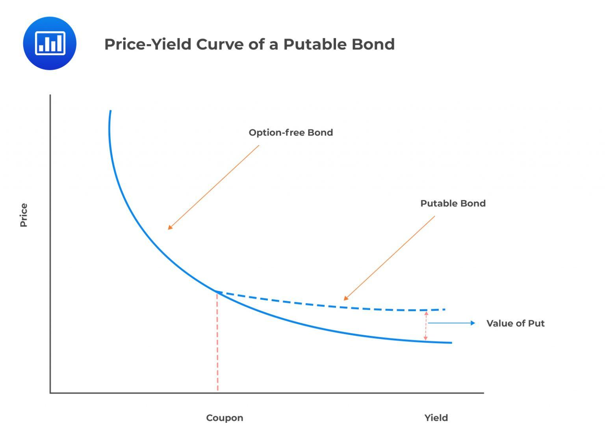

## Table of Contents

## What is a Put Bond?

A put bond is a type of bond that gives the bondholder the right to sell the bond back to the issuer before it matures. This feature is useful for the bondholder because it provides an option to get their money back early if they need it or if they think they can invest it in a better opportunity.

For the issuer, offering a put bond can make the bond more attractive to investors. This is because investors like having the flexibility to get their money back early. However, the issuer has to be ready to pay back the bond if the bondholder decides to use the put option.

## How does a Put Bond work?

A put bond is a special type of bond that lets the person who owns it sell it back to the company that made it before the bond is supposed to finish. Imagine you lend money to a friend, but you can ask for it back early if you need to. That's what a put bond is like. The owner of the bond can choose to get their money back before the bond's end date, which can be really helpful if they need the money or if they find a better place to put their money.

For the company that issues the put bond, it's a way to make their bonds more appealing to people who might want to buy them. By offering this option, the company is saying, "You can have your money back early if you want." But, the company needs to be ready to pay back the money if the bond owner decides to use this option. It's like a promise that adds a bit of flexibility for the bond owner but also means the company has to plan for the possibility of paying back the money sooner than expected.

## What are the benefits of investing in Put Bonds?

Investing in put bonds can be really good for people who want some flexibility with their money. If you buy a put bond, you have the option to get your money back from the company that issued the bond before it's supposed to finish. This can be super helpful if you suddenly need your money back or if you find a better investment opportunity. It's like having a safety net that lets you change your plans without losing out.

For people who don't like taking big risks, put bonds can make them feel safer. Knowing you can sell the bond back to the issuer if things go wrong can make investing less scary. It's like having a backup plan. This can be especially comforting during uncertain times in the economy or if the company issuing the bond starts to look less stable. So, put bonds can help you feel more secure while still [earning](/wiki/earning-announcement) some money from your investment.

## What are the risks associated with Put Bonds?

Investing in put bonds isn't without risks. One big risk is that if lots of people decide to use their put option and sell their bonds back to the issuer at the same time, the issuer might not have enough money to pay everyone back. This can happen if the company is going through tough times or if the economy is not doing well. If the issuer can't pay back the money, it could mean big trouble for the bondholders.

Another risk is that put bonds might offer lower interest rates compared to other bonds because they come with the put option. This means you might earn less money over time. Also, if interest rates go up after you buy the bond, you might miss out on better opportunities because you've already used your money to buy the put bond. So, while put bonds give you flexibility, they might not always be the best choice if you're looking to maximize your earnings.

## Who typically invests in Put Bonds?

People who like to have some control over their investments often choose put bonds. These investors might be looking for a way to get their money back early if they need it or if they find a better place to invest. They might be cautious and want the safety of being able to sell the bond back to the issuer if things don't go as planned.

Retirees or those nearing retirement might also be drawn to put bonds. They need their money to be safe and want the option to access it when they need it. Put bonds give them a bit of peace of mind because they can get their money back without waiting for the bond to mature. This can be really important for people who are planning their finances carefully and want to avoid taking big risks.

## How do Put Bonds differ from other types of bonds?

Put bonds are different from other types of bonds because they let you sell the bond back to the company that made it before it's supposed to finish. This is like having a special button you can press to get your money back early. Most other bonds don't have this feature. For example, with a regular bond, you have to wait until the end to get your money back, unless you can sell it to someone else. With a put bond, you don't have to worry about finding another buyer because the company has to buy it back from you.

Another way put bonds differ is that they might offer lower interest rates compared to other bonds. This is because the put option makes the bond more attractive, so the company doesn't need to offer as high an [interest rate](/wiki/interest-rate-trading-strategies) to get people to buy it. This means you might earn less money over time with a put bond than you would with other types of bonds. But, the trade-off is that you get more flexibility and a bit more safety because you can get your money back early if you need to.

## What are the key features to look for in a Put Bond?

When looking at a put bond, the first thing to check is the put option itself. This is the feature that lets you sell the bond back to the company that issued it before it matures. You want to know when you can use this option and under what conditions. For example, some put bonds let you sell them back after a certain date, while others might let you do it at specific times during the bond's life. Knowing these details helps you understand how flexible the bond really is.

Another important feature to look for is the interest rate the put bond offers. Because put bonds come with the option to sell them back early, they often have lower interest rates compared to other bonds. You should compare the rate to what you could get from other investments to see if it's a good deal. Also, consider the creditworthiness of the issuer. If the company is financially stable, it's more likely they'll be able to pay you back if you decide to use the put option. This can give you more confidence in your investment.

## How is the pricing of a Put Bond determined?

The pricing of a put bond is influenced by several factors. The main one is the interest rate it offers. Because put bonds let you sell them back to the issuer before they mature, they usually have lower interest rates than regular bonds. This makes them less attractive in terms of earnings, so the price has to be set in a way that still makes them appealing to investors. Another [factor](/wiki/factor-investing) is the creditworthiness of the issuer. If the company is financially stable, investors feel more confident about getting their money back, which can affect how much they're willing to pay for the bond.

The put option itself also plays a big role in pricing. This option gives you flexibility, so the bond's price needs to reflect that value. If the put option can be used at any time, the bond might be priced higher because it's more flexible. On the other hand, if the option can only be used at certain times or after a specific date, the bond might be priced lower. The bond's price also depends on what's happening in the broader market. If interest rates are going up, the bond's price might go down because investors could find better opportunities elsewhere.

## What is the process for exercising a Put Bond?

Exercising a put bond means you want to sell the bond back to the company that made it before it's supposed to finish. To do this, you need to tell the company you want to use your put option. This usually has to be done by a certain date or during a specific time, depending on what the bond says. You can let the company know by sending them a letter or filling out a form, following the instructions they give you.

Once you've told the company you want to use your put option, they have to buy the bond back from you. They'll give you the money the bond is worth, which is usually the face value of the bond. This process can take a little time, so you need to be patient. After you get your money back, you can use it for something else or invest it in a different way.

## How do interest rate changes affect Put Bonds?

When interest rates go up, it can make put bonds less attractive. If you own a put bond and interest rates rise, you might wish you had waited because you could get a better deal on a new bond with a higher interest rate. This can make the price of your put bond go down because other people might not want to buy it when they can get a better rate elsewhere. But, the put option can help you because you can sell the bond back to the company that made it and then use that money to buy a new bond with a higher interest rate.

On the other hand, if interest rates go down, put bonds can become more valuable. If you have a put bond with a good interest rate and rates drop, your bond becomes more attractive because it's paying more than new bonds being issued. This can make the price of your put bond go up because other people might want to buy it. Even if you decide to use the put option and sell it back to the company, you might still be happy because you can reinvest the money at the new, lower rates or keep it if you need it.

## What are some historical examples of Put Bond usage?

In the 1980s, put bonds became more popular because people wanted more control over their money. One big example was when companies like IBM issued put bonds. These bonds let investors sell them back to IBM before they matured if they needed their money back or if they found a better investment. This made the bonds more appealing because people felt safer knowing they could get their money back early if they needed to.

Another example happened during the financial crisis in 2008. Many investors used put bonds to get their money back from companies that were struggling. For instance, some banks issued put bonds, and when the economy got shaky, people used the put option to sell their bonds back to the banks. This helped investors avoid losing money if the banks had big problems, but it also put a lot of pressure on the banks to pay back the money quickly during a tough time.

## What advanced strategies can be employed with Put Bonds?

One advanced strategy with put bonds is to use them as a way to manage risk in your investment portfolio. If you think the market might go down or if you're worried about a specific company, you can buy put bonds from that company. This gives you the option to sell the bond back if things go bad, helping you protect your money. You can also use put bonds to balance out riskier investments. For example, if you have stocks that could lose value, owning put bonds can give you some security because you know you can get some of your money back if you need to.

Another strategy is to use put bonds to take advantage of changing interest rates. If you think interest rates are going to go up, you can buy put bonds now and then use the put option to sell them back later. This lets you get your money back and then invest it in new bonds with higher interest rates. On the other hand, if you think interest rates are going to go down, you can hold onto your put bonds because they'll be worth more. This way, you can make money from the bonds themselves and also from selling them at a higher price later.

## References & Further Reading

1. Fabozzi, F. J., Mann, S. V., & Choudhry, M. (2007). *The Handbook of Fixed Income Securities*. This book provides comprehensive coverage on various bond mechanisms and types, essential for understanding the fundamentals of the bond market.

2. Hull, J. C. (2018). *Options, Futures, and Other Derivatives*. This text offers an analysis of financial derivatives, which can be useful for understanding the complex features of certain bonds, including puttable bonds.

3. Hasbrouck, J. (2007). *Empirical Market Microstructure: The Institutions, Economics, and Econometrics of Securities Trading*. This book explores the empirical aspects of algorithmic trading, which is pertinent for those interested in bond markets and technical trading strategies.

4. Aldridge, I. (2009). *High-Frequency Trading: A Practical Guide to Algorithmic Strategies and Trading Systems*. This guide provides insights into algorithmic trading strategies, touching on statistical arbitrage which can be applied in bond markets.

5. Phelps, B. D. (2011). *Analyzing and Interpreting the Yield Curve*. For a deeper understanding of bond pricing mechanisms, this book offers concepts and analysis essential in the context of algo trading.

6. Choudhry, M. (2010). *The Bond and Money Markets: Strategy, Trading, Analysis*. This resource covers comprehensive strategies, including algorithmic, necessary for engaging effectively in the bond markets.

7. Hendershott, T., & Moulton, P. C. (2011). "Automation, speed, and stock market quality: The NYSE's Hybrid." *Journal of Financial Markets*, 14(4), 568–604. Useful for understanding the role of automation in trading, including in bond markets.

**Suggestions for Further Reading:**

- *Quantitative Finance for Dummies* by S. Joe provides an introduction to strategies used in financial markets, including those involving bonds.

- "Machine Learning in the Bond Market: Examples and Techniques" by Z. Lee and W. Zhang, in the *Journal of Finance & Data Science* (2018), covers the impact of machine learning on trading strategies.

- The International Capital Market Association’s *Guide to Best Practice in the European Fixed Income Markets* offers insights into the regulatory framework and best practices in bond trading.

- *Blockchain and the Future of Financial Markets* by C. Parknotts investigates into the impact of emerging technologies on financial trading systems, including bond markets.

