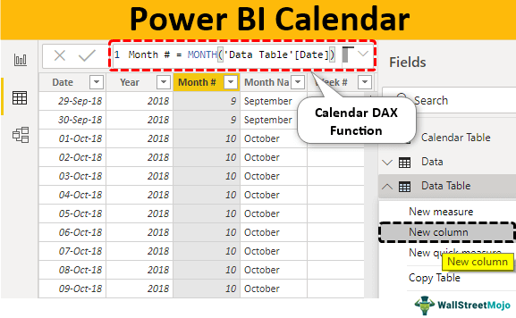

Financial strategies are pivotal to effective wealth management and investment. Among numerous strategies available, options trading, particularly the put calendar strategy, and algorithmic trading have gained significant attention. These strategies offer investors a sophisticated approach to managing risk and optimizing returns, leveraging both temporal opportunities and technological advancements.

Options trading serves as a cornerstone in the financial markets, allowing traders to speculate on the future prices of assets while managing risk. Options give the holder the right, but not the obligation, to buy or sell an asset at a predetermined price before a certain date. Within options trading, put options are used to insure against declines in asset prices, while call options cater to potential upward movements. Specifically, the put calendar strategy involves a unique approach: it combines the sale of a near-term put option with the purchase of a long-term put option, effectively capitalizing on the time decay and potential market movements.



Algorithmic trading, often referred to as algo trading, uses computer algorithms to execute trades based on predetermined criteria. This type of trading has revolutionized financial markets by facilitating fast, accurate, and efficient trade execution. By integrating algorithmic processes with options strategies like the put calendar, traders can enhance their ability to adapt to ever-changing market conditions, optimize entry and exit points, and potentially improve overall performance.

Understanding these financial strategies is crucial for effective financial management. As markets grow increasingly complex and interconnected, traders and investors must be equipped with diverse strategies that allow them to navigate volatility and take advantage of fleeting opportunities. The article aims to provide a comprehensive guide to the put calendar strategy and the role of algorithmic trading in modern financial strategies. It is tailored for financial professionals, traders, and investors who seek to deepen their knowledge and leverage these techniques for better portfolio management.

## Table of Contents

## Understanding Options Trading

Options trading represents a crucial component of modern financial strategies, offering traders the flexibility to hedge, speculate, and enhance portfolio diversification. At its core, options are derivative contracts that confer the right, but not the obligation, to buy (call option) or sell (put option) an underlying asset at a predetermined price (strike price) on or before a specific expiration date.

### Overview of Call and Put Options

**Call Options:** A call option provides the holder the right to purchase the underlying asset. Traders generally buy call options when they anticipate an upward movement in the asset's price. The primary motivation is to leverage potential gains without the upfront cost of purchasing the asset outright.

**Put Options:** Conversely, a put option grants the holder the right to sell the underlying asset. This mechanism is beneficial when traders predict a decline in the value of the asset. Owning put options allows traders to hedge against potential losses in their holdings or to profit from adverse price movements.

### Detailed Look at the Put Calendar Strategy

The put calendar strategy, also known as a calendar spread, is a sophisticated options trading strategy involving the simultaneous sale and purchase of put options with the same strike price but different expiration dates. Typically, a trader sells a near-term put option and buys a longer-term put option. This strategy is predominantly employed to capitalize on time decay, known as theta decay, where the decline in the option's extrinsic value accelerates as expiration approaches.

**Components of the Put Calendar Strategy:**

1. **Near-Term Put:** The trader sells this option to collect premium income. Its value diminishes quickly as it nears expiration, benefiting the trader who has sold the option.

2. **Longer-Term Put:** The trader buys this option to retain the right to sell the underlying asset at a specific price over a more extended period. This acts as a hedge against unfavorable market movements after the expiration of the near-term put.

The put calendar strategy benefits traders expecting limited short-term [volatility](/wiki/volatility-trading-strategies) but more significant moves over the long term. While this strategy may not yield profits from drastic market shifts in the short term, it capitalizes on the decay of the sold option's premium while maintaining the protection afforded by the longer-term put option.

By employing options, traders can develop complex strategies tailored to their risk tolerance, market expectations, and financial objectives. Understanding these mechanisms is essential for effectively navigating the intricacies of financial markets and enhancing the potential for returns while managing associated risks.

## Mechanics of the Put Calendar Strategy

The Put Calendar Strategy is a refined options trading approach that involves the simultaneous sale and purchase of put options with the same strike price but differing expiration dates. Specifically, an investor sells a near-term put option and buys a longer-term put option, both of which have identical strike prices. The main objective of this strategy is to capitalize on time decay and market volatility differentials.

### Working Mechanism

The strategy's mechanistic core hinges on the concept of time decay, which reflects how the value of options diminishes as the expiration date approaches. By selling a near-term put, the investor benefits from accelerated time decay, a phenomenon where the option's extrinsic value erodes more rapidly as the expiration date nears. Conversely, the longer-term put retains more of its extrinsic value longer because its expiration is further out.

When executed optimally, the strategy can harness the volatility differentials between the two options. The expectation is that the short-term put will expire worthless or can be bought back at a lower price, while the long-term put may retain its value or appreciate if market conditions shift, offering protection or profit potential.

### Benefits

The Put Calendar Strategy offers several benefits. First, it provides a potential for profit through strategic exploitation of timing and volatility differentials. When executed correctly, the strategy allows traders to finance the purchase of a longer-term put almost fully or partially through the sale of the near-term put. 

Risk management is another significant advantage. The strategy cushions against the risk of significant losses due to adverse market movements, as the longer-term put acts as a hedge. Furthermore, the potential to rebalance the strategy by readjusting or "rolling" the short-term put can enhance flexibility and responsiveness to market shifts.

### Risks Involved

Despite its benefits, the Put Calendar Strategy is not without risks. One key risk is the impact of market movements. If the underlying asset price moves significantly away from the strike price of the options, the strategy can incur losses. Another critical consideration is volatility. Declining volatility levels can reduce the potential profit margins, since the strategy partly depends on realizing profits from volatility discrepancies.

Additionally, [liquidity](/wiki/liquidity-risk-premium) issues can pose execution risks, especially when it comes to closing or rolling options positions. Traders may find it challenging to adjust their positions quickly without impacting the market price or incurring significant transaction costs.

In summary, the Put Calendar Strategy offers a sophisticated approach to options trading, combining elements of time decay and volatility management to generate potential profits and mitigate risks. However, successful execution requires a nuanced understanding of market dynamics, options pricing, and strategic positioning.

## Algorithmic Trading in Options Strategies

Algorithmic trading, commonly referred to as algo trading, involves the use of computer programs and systems to execute financial transactions at speeds and frequencies that are impossible for human traders. This trading strategy utilizes predetermined criteria such as timing, price, and [volume](/wiki/volume-trading-strategy) to make trading decisions. The evolution of [algorithmic trading](/wiki/algorithmic-trading) traces back to the early 1970s with the development of electronic trading platforms. Its growth accelerated with advancements in technology and data analysis in the late 20th and early 21st centuries.

The impact of algorithmic trading on financial markets is profound. In options markets, algorithms have significantly increased the efficiency and liquidity of trading. They reduce transaction costs and allow for rapid execution, which is crucial in volatile markets. Algorithms are not only used for high-frequency trading but also for executing complex, multi-leg strategies like the put calendar spread. They help traders in predicting market trends through data patterns and reducing human error by automating decision-making processes.

Algorithms enhance the implementation of the put calendar strategy in several ways. A put calendar spread involves selling a short-term put option and buying a longer-term put option with the same strike price. The strategy benefits from the time decay of options, and algorithms can optimize the timing of these trades. For example, an algorithm can adjust the short and long positions dynamically based on market volatility, interest rates, and options greeks such as theta and vega.

In a practical context, a Python script could be written to monitor these variables and execute trades when predefined conditions are met. Here is a simple example of how an algorithm might look:

```python
import numpy as np
import pandas as pd
from datetime import datetime

# Hypothetical data for options
option_data = pd.DataFrame({
    'expiry': ['2023-11-15', '2023-12-15'],
    'strike_price': [100, 100],
    'option_price': [5, 7],
    'implied_volatility': [0.2, 0.25]
})

# Define the threshold for execution
volatility_threshold = 0.22

def execute_put_calendar(option_data):
    short_expiry = datetime.strptime(option_data.iloc[0]['expiry'], '%Y-%m-%d')
    long_expiry = datetime.strptime(option_data.iloc[1]['expiry'], '%Y-%m-%d')
    short_imp_vol = option_data.iloc[0]['implied_volatility']
    long_imp_vol = option_data.iloc[1]['implied_volatility']

    if short_imp_vol < volatility_threshold and long_imp_vol > volatility_threshold:
        print("Execute Put Calendar Spread: Sell short-term, Buy long-term")
    else:
        print("Do not execute strategy")

# Running the algorithm
execute_put_calendar(option_data)
```

This script evaluates the implied volatility of short-term and long-term options and decides whether to execute the put calendar strategy based on a predefined volatility threshold. Such algorithms can be further refined with additional indicators and constraints to enhance accuracy and performance.

In summary, algorithmic trading brings precision, efficiency, and scalability to options trading strategies like the put calendar spread, enabling traders to capitalize on market inefficiencies and adapt to changing conditions.

## Combining Put Calendars with Algo Trading

Combining put calendar strategies with algorithmic trading offers a sophisticated approach to optimizing options trading. The integration of algorithms into options trading requires precise execution and can significantly enhance the performance of put calendar strategies. Algorithms enable traders to adjust for market changes in real time and optimize entry and [exit](/wiki/exit-strategy) positions, thereby improving the overall strategy's effectiveness.

Execution of put calendar strategies using algorithms typically involves selling a short-term put option while simultaneously purchasing a longer-term put option with the same strike price. Algorithms can be coded to monitor dynamic market conditions and execute trades almost instantaneously as opportunities arise. Through constant data analysis and [machine learning](/wiki/machine-learning) techniques, algorithms can identify optimal moments to enter or exit a position based on volatility, time decay, and market trends.

For example, consider an algorithm designed to manage a put calendar spread: 
```python
import numpy as np

# Simulate market volatility and stock prices
market_volatility = np.random.normal(loc=0.2, scale=0.05, size=100)
stock_prices = np.linspace(100, 105, 100)

def option_premium(spot_price, strike_price, time_to_maturity, volatility):
    # Simplified Black-Scholes formula for put option pricing
    d1 = (np.log(spot_price / strike_price) + (volatility ** 2 / 2) * time_to_maturity) / (volatility * np.sqrt(time_to_maturity)) 
    d2 = d1 - volatility * np.sqrt(time_to_maturity)
    put_price = strike_price * norm.cdf(-d2) - spot_price * norm.cdf(-d1)
    return put_price

def execute_put_calendar(spot_prices, volatility, short_term_days, long_term_days, strike):
    """ Execute a put calendar strategy """
    short_term_premium = option_premium(spot_prices, strike, short_term_days/365, volatility)
    long_term_premium = option_premium(spot_prices, strike, long_term_days/365, volatility)
    return long_term_premium - short_term_premium

# Example usage
profits = [execute_put_calendar(price, vol, 30, 60, 102)
           for price, vol in zip(stock_prices, market_volatility)]
```

Such an algorithm can track volatility and price movements, adjust parameters, and automate the decision-making process for trading put calendar spreads. The potential for improved strategy performance is significant, thanks to algorithmic interventions that remove human bias and error, allowing precise management of time decay and volatility.

The primary advantage of using algorithmic trading in this context is the ability to respond immediately to market conditions, which can maximize profits while managing risks effectively. The algorithms' capacity for [backtesting](/wiki/backtesting) with historical data enables the refinement of trading strategies before their deployment in live markets. However, it's important to note that the success of such implementations requires robust risk management protocols and considerations for potential technical failures or unexpected market disruptions.

Overall, integrating algorithmic trading into put calendar strategies represents a powerful synergy that leverages technology to enhance traditional options trading techniques.

## Advantages and Challenges

Options trading strategies, such as the put calendar spread, offer distinct advantages and challenges that traders must consider. A primary advantage of the put calendar strategy is strategic flexibility. This approach allows traders to capitalize on different market scenarios, particularly when they aim to exploit the dynamics between short-term and long-term options. The strategy involves selling a near-term put option and buying a longer-term put option with the same strike price. This setup creates an opportunities for [earning](/wiki/earning-announcement) profits when the underlying asset experiences moderate price changes.

The potential for profit through volatility and time decay is a significant advantage. When employing a put calendar spread, time decay (theta) primarily benefits the trader as the short-term option loses value faster than the long-term option. This time decay disparity can generate profits as the short-term option approaches expiration. Additionally, the strategy tends to be most effective when implied volatility is expected to rise, potentially increasing the value of the long-term option relative to the short-term option.

Despite these advantages, challenges exist. Technical requirements are crucial since executing a put calendar spread necessitates precise timing and an understanding of options pricing models. Traders must keep abreast of factors such as changes in interest rates and dividend yields that can impact option pricing.

Execution risks also play a role. Disparate liquidity levels between short-term and long-term options can affect the ease of entering and exiting positions. Moreover, unexpected market movements can lead to losses, especially when the price of the underlying asset deviates significantly from the strike price. Market changes, including shifts in volatility or surprise economic events, require traders to continually adapt their strategies.

To mitigate these challenges, risk management techniques are essential. Traders can employ stop-loss orders to limit potential losses if adverse market moves occur. Diversification of strategies can also offset the impact of unfavorable market conditions. Additionally, using algorithms to monitor market trends and execute trades can enhance precision and adjust strategies efficiently under changing market conditions.

Incorporating these considerations ensures that traders can maximize the advantages of the put calendar spread while minimizing associated risks. This balanced approach is vital for achieving consistent success in options trading.

## Real-World Applications and Case Studies

Put calendar spreads, a type of options trading strategy, provide investors with a method to profit from anticipated changes in market volatility and the passage of time. This section explores how these strategies can be applied in various market conditions, offers case studies demonstrating their successful implementation, and provides insights for traders seeking to optimize their use.

### Application of Put Calendar Spreads in Different Market Conditions

Put calendar spreads function by leveraging the difference in expiration dates between two options: selling a put option with a near-term expiration and purchasing a put option with a longer-term expiration. This strategy is particularly effective in stagnant or slightly bullish markets where limited price movement allows traders to capitalize on time decay, or theta, of the short-term option. In volatile markets, the strategy can be adjusted to benefit from swings in implied volatility.

For instance, if a trader anticipates low volatility, they might opt to execute a standard put calendar spread. Conversely, in a high-volatility environment, adjustments like widening the spread between expiration dates or choosing options with higher deltas might be more appropriate.

### Case Studies Showcasing Successful Implementation

1. **Case Study: Use in a Low-Volatility Market**

   In 2021, a portfolio manager at an investment firm anticipated a period of low market volatility following a major economic policy announcement. Utilizing a put calendar spread on a major index, they sold a near-term put option with a strike price of $3,500 and purchased a longer-term put option with the same strike price. The stagnation of the market in the following weeks led to substantial time decay on the sold option, enabling the manager to close the position profitably as the price of the near-term put option declined significantly.

2. **Case Study: Adjustments in a High-Volatility Environment**

   A different scenario involved a trader dealing in technology stocks during a period of significant market unrest. By implementing a modified put calendar spread, where the strike price of the long put was lower than that of the short put, the trader could hedge against unexpected downturns. This adjustment allowed the trader to maintain a protective position while still generating income from the time decay of the short put. This strategy demonstrated success when volatility subsided quicker than anticipated, leading to gains from both time decay and volatility normalization.

### Lessons Learned and Practical Insights for Traders

- **Market Condition Awareness**: Understanding current market conditions and anticipated volatility can significantly influence the effectiveness of calendar spreads. Traders are advised to closely monitor economic indicators, geopolitical events, and earnings announcements that could impact market volatility.

- **Strike Price and Expiry Management**: The choice of strike prices and the spread between expiration dates are crucial factors. Traders should select these based on a careful assessment of market conditions, personal risk tolerance, and pricing models.

- **Technology and Tools Utilization**: Employing algorithmic tools to simulate various scenarios and optimize entry/exit points can markedly improve the success rate of these strategies. Traders can deploy Python-based algorithms to test different configurations and predict outcomes with improved accuracy.

- **Risk Management**: Implementing stop-loss orders and maintaining a diversified portfolio to mitigate potential losses associated with incorrect market forecasts is vital in preserving capital.

By applying these strategies in the context of observed and expected market conditions, traders can potentially enhance their financial outcomes while managing associated risks effectively.

## The Future of Options and Algo Trading

Emerging trends in algorithmic trading and options strategies indicate a transformative phase in financial markets, primarily driven by advances in technology and data analytics. Algorithmic trading, leveraging sophisticated algorithms and high-speed computational power, continues to redefine the efficiency and capacity of trading systems. This transformation is characterized by the increased adoption of machine learning and [artificial intelligence](/wiki/ai-artificial-intelligence) to enhance decision-making processes, optimize trade execution, and manage risk more effectively.

Machine learning algorithms, particularly [deep learning](/wiki/deep-learning) models, allow traders to analyze vast datasets, identify patterns, and implement predictive models that respond to changing market conditions. These innovations facilitate the development of more refined options strategies, such as the put calendar strategy, where timing and precision are crucial. This sophistication offers traders enhanced strategic flexibility and the ability to capitalize on short-term market inefficiencies.

The landscape of financial markets is rapidly evolving, influenced by technological integration and regulatory developments. Blockchain technology and its applications in smart contracts foretell a future where transaction processes are expedited and made more transparent. Such advancements could potentially decrease transaction costs and increase market access, influencing the dynamics of options trading. Additionally, with the growing focus on environmental, social, and governance ([ESG](/wiki/esg-investing)) criteria, algorithmic options strategies may integrate these factors into their risk-reward assessments, aligning financial outcomes with sustainable goals.

Predictions for the future state of financial strategies involving options and algorithms include a further blurring of the lines between traditional and algorithmic trading methods. As these methods become more intertwined, traders are expected to develop hybrid models that incorporate both quantitative and qualitative data, enhancing decision-making efficacy. These strategies will likely feature real-time data processing capabilities, adaptive learning mechanisms, and a more personalized approach to risk management.

Moreover, with the continual enhancement of computing technologies, the execution speed and efficiency of algorithmic trading are expected to improve, further solidifying its role in the financial market landscape. The integration of quantum computing presents potential breakthroughs in solving complex optimization problems, further enriching trading strategies.

In conclusion, as algorithmic trading and options strategies evolve, they signify a shift towards more data-driven, efficient, and adaptive financial markets. These advancements will demand traders to be agile, continuously learning, and adapting to leverage these technologies in pursuit of consistent performance and enhanced financial outcomes.

## Conclusion

In conclusion, financial strategies that encompass options trading, particularly the put calendar strategy, and algorithmic trading play a crucial role in modern financial management. Understanding these strategies can significantly enhance a trader's ability to manage risk and capitalize on market movements. Options trading, with its emphasis on call and put options, offers a versatile toolset for traders. The put calendar strategy, which involves selling a near-term put and purchasing a longer-term put, provides opportunities to benefit from time decay and market volatility when employed effectively.

Algorithmic trading represents another essential facet of contemporary trading strategies, facilitating automated, precise, and swift decision-making processes. When integrated with options strategies like the put calendar, algorithmic trading can optimize entry and exit points, adjusting for market changes and enhancing overall performance.

The combined knowledge of these strategies equips traders with the flexibility and tools needed to navigate diverse market conditions, balancing potential profits against inherent risks. To ensure success, traders must continually educate themselves on these financial strategies, staying informed about emerging trends and technological advancements. This proactive approach can yield substantial gains and sustainable trading methodologies in the evolving landscape of financial markets.

## References & Further Reading

[1]: ["Options, Futures, and Other Derivatives" (10th Edition)](https://www.amazon.com/Options-Futures-Other-Derivatives-10th/dp/013447208X) by John C. Hull

[2]: Chin, W. W., & Cheong, X. Y. (2018). ["Option Calendar Spreads: An Empirical Analysis."](https://scholar.google.com/citations?user=vFlpR7QAAAAJ) The Journal of Derivatives, 26(2), 102-118.

[3]: Carr, P., & Wu, L. (2009). ["Variance Risk Premiums"](https://academic.oup.com/rfs/article-abstract/22/3/1311/1581057) The Review of Financial Studies, 22(3), 1313-1341.

[4]: Chan, E. P. (2013). ["Algorithmic Trading: Winning Strategies and Their Rationale"](https://github.com/ftvision/quant_trading_echan_book) Wiley.

[5]: Jabbour, R., & Karmouni, H. (2020). ["Advanced Techniques for Algorithmic Trading"](https://www.scribd.com/document/665071123/jabbour2020) CRC Press.