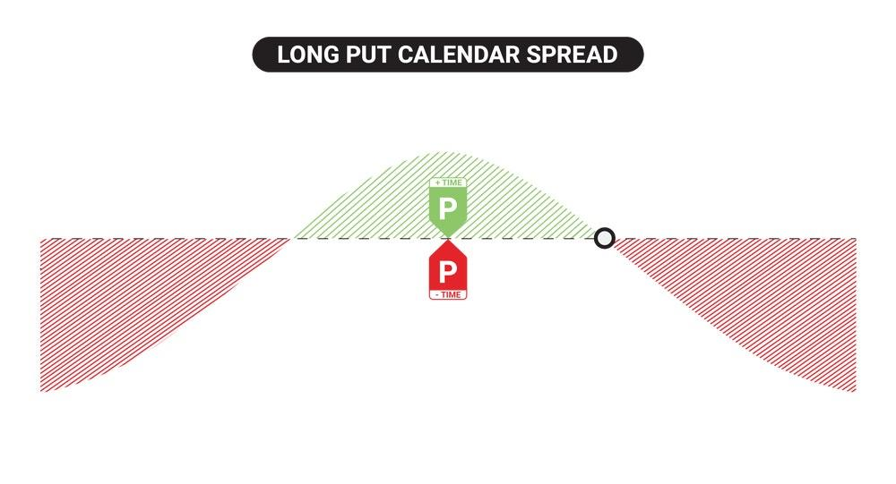

## Table of Contents

## What is a Put Calendar?

A Put Calendar, also known as a Put Calendar Spread, is an options trading strategy that involves buying and selling put options with the same strike price but different expiration dates. The goal is to profit from the difference in time decay between the two options. You sell a put option that expires sooner and buy a put option that expires later. This strategy is used when you expect the stock price to stay the same or move slightly up until the near-term option expires.

The main advantage of a Put Calendar is that it can generate income from the premium of the short-term put option while potentially benefiting from the longer-term put option if the stock price moves as expected. However, it's important to be aware of the risks. If the stock price drops significantly before the near-term option expires, you could face losses. Therefore, it's a strategy that requires careful monitoring and understanding of the stock's potential movements.

## How does a Put Calendar work?

A Put Calendar works by using two put options on the same stock with the same strike price but different expiration dates. You sell a put option that will expire soon and buy a put option that will expire later. The idea is to make money from the difference in how quickly these options lose value over time. The short-term put option you sell will lose value faster than the long-term put option you buy. If the stock price stays about the same or goes up a little bit until the near-term option expires, you can keep the money you got from selling that option.

However, if the stock price drops a lot before the near-term option expires, you might lose money. This is because the value of the put option you sold will go up, and you might have to buy it back at a higher price. The long-term put option you bought can help limit your losses if the stock price keeps falling after the near-term option expires. But, you need to watch the stock closely and understand how it might move to use this strategy well.

## What are the basic components of a Put Calendar?

A Put Calendar has two main parts: a short-term put option that you sell and a long-term put option that you buy. Both options have the same price at which they can be used, called the strike price. The difference is when they expire. The short-term option expires sooner, and the long-term option expires later. You get money right away from selling the short-term option, which is called the premium.

The goal is to make money from the difference in how fast the two options lose value over time. The short-term option loses value faster than the long-term one. If the stock price stays the same or goes up a little until the short-term option expires, you keep the money from selling it. But if the stock price drops a lot before the short-term option expires, you might lose money because you'll have to buy back the option at a higher price. The long-term option can help if the stock price keeps falling after the short-term option expires, but you need to watch the stock closely.

## What is the difference between a Put Calendar and other options strategies?

A Put Calendar is different from other options strategies because it involves selling a short-term put option and buying a long-term put option at the same strike price. This is different from a simple put option where you only buy or sell one put. With a Put Calendar, you make money from the difference in how fast the two options lose value over time. If the stock price stays about the same until the short-term option expires, you keep the money from selling it. Other strategies, like a long put or a short put, focus more on whether the stock price will go up or down, not on the time difference.

Another difference is how a Put Calendar handles risk compared to other strategies. For example, a covered put involves selling a put option while owning the stock, which can limit your risk but ties up your money in the stock. A Put Calendar, on the other hand, doesn't need you to own the stock, but it does need you to watch the stock price closely. If the stock price drops a lot before the short-term option expires, you might lose money. Other strategies like a straddle or strangle involve buying both a call and a put option, which can be more expensive but can make money if the stock price moves a lot in either direction. A Put Calendar is more about expecting the stock to stay steady or move slightly up.

## What are the potential benefits of using a Put Calendar?

One of the main benefits of using a Put Calendar is that you can make money from the difference in how fast the two put options lose their value over time. When you sell a short-term put option, you get money right away. If the stock price stays about the same or goes up a little until this option expires, you get to keep this money. The long-term put option you buy will lose value slower, so it can still be worth something even after the short-term option expires. This strategy can be a good way to earn some income while betting on the stock staying steady or going up slightly.

Another benefit is that a Put Calendar can help you manage risk if the stock price does drop. The long-term put option you buy can act as a safety net. If the stock price falls a lot after the short-term option expires, the long-term option can still be worth something, helping to limit your losses. This makes a Put Calendar a bit safer than just selling a short-term put option on its own. However, you still need to watch the stock closely because if it drops too much before the short-term option expires, you could lose money.

## What are the risks associated with a Put Calendar?

One risk of using a Put Calendar is that the stock price might drop a lot before the short-term put option you sold expires. If this happens, the value of the short-term option will go up, and you might have to buy it back at a higher price than you sold it for. This can lead to losses. The long-term put option you bought can help if the stock keeps falling after the short-term option expires, but it won't help much if the big drop happens right away.

Another risk is that the stock price might go up a lot. If this happens, the value of both the short-term and long-term put options you have will go down. You might lose the money you paid for the long-term option, and the gain from selling the short-term option might not be enough to cover this loss. A Put Calendar works best when the stock price stays about the same or goes up a little, so big moves in either direction can be risky.

## How do you set up a Put Calendar?

To set up a Put Calendar, you need to pick a stock you want to trade options on. Then, you find a put option with a strike price that you think the stock will be near when the option expires. You sell a put option that will expire soon, and you buy a put option with the same strike price that will expire later. The money you get from selling the short-term option is called the premium, and you keep it if the stock price stays about the same or goes up a little until the option expires.

The key is to make sure the short-term option you sell loses value faster than the long-term option you buy. If the stock price stays steady, the short-term option will become worthless when it expires, and you keep the premium. But, you need to be careful because if the stock price drops a lot before the short-term option expires, you might lose money. You have to watch the stock closely and be ready to make changes if the price moves a lot.

## What factors should be considered when choosing the expiration dates for a Put Calendar?

When choosing the expiration dates for a Put Calendar, you need to think about how long you want the trade to last and how much the stock price might change. The short-term option you sell should expire soon, usually in a few weeks to a month. This is because you want it to lose value fast so you can keep the money you got from selling it. The long-term option you buy should expire much later, maybe in a few months. This gives you more time for the stock price to move in your favor and helps protect you if the stock price drops a lot after the short-term option expires.

You also need to consider how much the stock price might move before the short-term option expires. If you think the stock price will stay about the same or go up a little, a shorter time for the near-term option might work well. But if you're worried the stock might drop a lot, you might want to choose a longer time for the short-term option to give the stock more time to recover. Always watch the stock closely and be ready to make changes if the price moves more than you expected.

## How can market volatility affect a Put Calendar?

Market [volatility](/wiki/volatility-trading-strategies) can have a big effect on a Put Calendar. If the market is very calm and the stock price stays steady, the short-term put option you sold will lose value fast. This means you can keep the money you got from selling it, which is good for you. But if the market gets really wild and the stock price jumps around a lot, it can be risky. If the stock price drops a lot before the short-term option expires, the value of that option will go up. You might have to buy it back at a higher price, which could lead to losses.

On the other hand, if the stock price goes up a lot because of high volatility, both the short-term and long-term put options you have will lose value. The gain from selling the short-term option might not be enough to cover the money you paid for the long-term option. So, big moves in the stock price can hurt your Put Calendar, no matter if they go up or down. You need to watch the market closely and be ready to make changes if things get too unpredictable.

## What are some advanced strategies for managing a Put Calendar?

One advanced way to manage a Put Calendar is to adjust the position if the stock price moves a lot. If the stock price drops before the short-term option expires, you might want to buy back the short-term option to stop your losses from getting bigger. Then, you could sell a new short-term option with a lower strike price. This can help you make some of the money back if the stock keeps going down. Another thing you can do is to roll the long-term option to a later date if you think the stock price will recover. This means you sell the long-term option you have and buy a new one that expires even later.

Another strategy is to use stop-loss orders to protect your money. A stop-loss order can automatically close your position if the stock price moves against you by a certain amount. This can help limit how much you might lose if the market gets too wild. You can also use delta hedging to balance out the risk. Delta hedging means you buy or sell shares of the stock to offset the changes in the value of your options. This can help keep your Put Calendar more stable when the stock price moves around a lot.

## How can one analyze the performance of a Put Calendar?

To analyze the performance of a Put Calendar, you need to look at how the stock price has moved compared to what you expected. If the stock price stayed about the same or went up a little until the short-term option expired, you probably made money from the premium you got when you sold that option. You can check this by seeing if you were able to keep the money from selling the short-term option without having to buy it back at a higher price. If the stock price dropped a lot before the short-term option expired, you might have lost money because you had to buy back the option at a higher price. You can see how much you lost by comparing the price you bought it back at to the price you sold it for.

Another way to analyze the performance is by looking at the value of the long-term option you bought. If the stock price dropped after the short-term option expired, the long-term option might have helped limit your losses. You can see this by checking how much the long-term option was worth at different times. If the stock price went up a lot, both options might have lost value, and you might have lost the money you paid for the long-term option. By comparing the total money you made from the short-term option to the total money you spent on the long-term option, you can figure out if the Put Calendar was a good trade for you.

## What are some real-world examples of successful Put Calendar trades?

One example of a successful Put Calendar trade happened with a tech company's stock. Let's say the stock was trading at $100, and the trader thought it would stay around that price for a while. They sold a put option with a $100 strike price that would expire in a month and bought a put option with the same $100 strike price but that would expire in three months. The stock price did stay steady, and when the short-term option expired, it was worthless, so the trader kept the premium they got from selling it. The long-term option they bought didn't lose much value because the stock price didn't move much, so they could sell it later for a good price or hold onto it as a safety net.

Another example involved a retail company's stock. The stock was at $50, and the trader expected it to go up a little or stay the same. They set up a Put Calendar by selling a put option with a $50 strike price expiring in two weeks and buying a put option with the same strike price expiring in two months. The stock price actually went up to $52 by the time the short-term option expired, so the trader kept the premium from selling it. The long-term option they bought lost some value but was still worth something, and they could sell it later at a profit or keep it as protection if the stock price started to drop.

## References & Further Reading

[1]: ["Options, Futures, and Other Derivatives" (10th Edition)](https://www.amazon.com/Options-Futures-Other-Derivatives-10th/dp/013447208X) by John C. Hull

[2]: Chin, W. W., & Cheong, X. Y. (2018). ["Option Calendar Spreads: An Empirical Analysis."](https://scholar.google.com/citations?user=vFlpR7QAAAAJ) The Journal of Derivatives, 26(2), 102-118.

[3]: Carr, P., & Wu, L. (2009). ["Variance Risk Premiums"](https://academic.oup.com/rfs/article-abstract/22/3/1311/1581057) The Review of Financial Studies, 22(3), 1313-1341.

[4]: Chan, E. P. (2013). ["Algorithmic Trading: Winning Strategies and Their Rationale"](https://github.com/ftvision/quant_trading_echan_book) Wiley.

[5]: Jabbour, R., & Karmouni, H. (2020). ["Advanced Techniques for Algorithmic Trading"](https://www.scribd.com/document/665071123/jabbour2020) CRC Press.