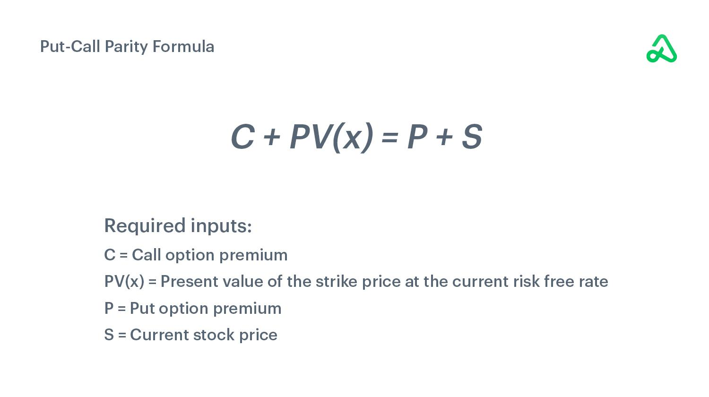

Financial derivatives are vital instruments in today's complex financial markets. These contracts derive their value from underlying assets such as stocks, bonds, commodities, currencies, interest rates, or market indexes. Among the most prominent derivatives are options, specifically call and put options, which provide traders with the right, but not the obligation, to buy or sell an asset at a predetermined price before or at a set expiration date.

A fundamental concept in options pricing is put-call parity, a principle originating from the Black-Scholes option pricing model, which establishes a relationship between the price of call options, put options, and the underlying asset. Put-call parity is represented mathematically by the equation $C + PV(X) = P + S$, where $C$ is the call option price, $P$ is the put option price, $PV(X)$ is the present value of the strike price, and $S$ is the current price of the underlying asset. Understanding put-call parity is crucial for traders as it assists in identifying arbitrage opportunities and ensuring market equilibrium.

Algorithmic trading has rapidly gained traction in financial markets, significantly integrating with concepts like put-call parity to enhance trading strategies. These algorithms are designed to process large volumes of financial data at speeds far beyond human capabilities, identifying minor discrepancies in options pricing which can be leveraged for profit through arbitrage. High-frequency trading, a subset of algorithmic trading, often utilizes these strategies to maintain market efficiency and capitalize on transient imbalances.

For both individual and institutional traders, combining the understanding of financial derivatives, the implications of put-call parity, and the power of algorithmic trading can lead to optimized trading strategies. These tools offer a competitive edge by streamlining decision-making processes, minimizing risks, and maximizing potential returns. For traders, a robust grasp of these concepts is not just advantageous but essential in navigating the intricacies of modern financial markets effectively.

## Table of Contents

## Overview of Financial Derivatives

Financial derivatives are financial instruments whose value is derived from the value of an underlying asset or group of assets. These underlying assets can include stocks, bonds, commodities, currencies, interest rates, and market indices. Derivatives play a critical role in the financial markets by providing mechanisms for managing risk, enhancing liquidity, and improving the efficiency of capital allocation.

There are several types of financial derivatives, each with unique characteristics and applications:

1. **Futures**: These are standardized contracts obligating the buyer to purchase, or the seller to sell, an asset at a predetermined future date and price. Futures are commonly used for commodities like oil or wheat but can also be applied to financial instruments like indices and currencies. They are mainly used for hedging risks and speculative purposes.

2. **Options**: An option provides the buyer the right, but not the obligation, to buy or sell an asset at a specified price on or before a particular date. There are two primary types of options: call options, which allow buying the asset, and put options, which permit selling the asset. Options are versatile tools employed for various strategies, including hedging, speculation, and complex trading strategies aimed at capturing time value and volatility.

3. **Swaps**: These are contracts in which two parties agree to exchange cash flows or other financial instruments over a specified period. The most common type is the interest rate swap, where cash flows based on a notional principal amount are exchanged, often involving fixed-rate for floating-rate interest payments. Swaps are typically utilized for managing interest rate risk and currency exposure.

Derivatives serve multiple purposes in the financial markets:

- **Hedging**: By using derivatives, investors can protect themselves against price fluctuations in the underlying asset, thereby reducing risk. For instance, a wheat farmer might use futures contracts to lock in a price for their crop, shielding their revenue against market volatility.

- **Speculation**: Traders aiming to profit from expected changes in the prices of underlying assets often use derivatives. Because derivatives can be highly leveraged, they can amplify gains, but also the potential for losses.

- **Arbitrage**: Derivatives can assist in exploiting price differences between markets to achieve risk-free profits. This involves buying and selling derivatives in different markets or forms to capitalize on price discrepancies.

Derivatives are integral to the global economy, contributing to pricing efficiency and risk distribution. They enhance market [liquidity](/wiki/liquidity-risk-premium) by enabling investors to transfer risk to those better equipped to manage it. This capability was highlighted during the financial crisis of 2007-2008, which underscored the importance of understanding derivatives and their implications on economic stability. Despite the risks, when used judiciously, derivatives provide essential benefits to the financial system, facilitating the management of risk and the pursuit of complex financial strategies.

## Options Trading: Key Concepts

Options are a fundamental type of financial derivative that grants the holder the right, but not the obligation, to buy or sell an underlying asset at a predetermined price before a specified expiration date. Options are versatile tools in the financial markets, offering investors various ways to hedge, speculate, or enhance their investment returns.

Options are broadly categorized into two types: call options and put options. A call option gives the holder the right to purchase the underlying asset at a predetermined strike price before the expiration date. Conversely, a put option provides the right to sell the underlying asset at the strike price before the option expires. Both types serve different strategic purposes, with call options typically utilized in anticipating price increases and put options for price declines.

Understanding the pricing of options is crucial, which involves several core components. The concept of 'moneyness' helps determine the intrinsic value of an option. An option is considered "in-the-money" if exercising it would result in a profitable transaction. For call options, this means the market price of the underlying asset is above the strike price. For put options, 'in-the-money' occurs when the market price is below the strike. Conversely, options are "out-of-the-money" when they hold no intrinsic value based on current prices, with "at-the-money" indicating the market price is equivalent to the strike price.

Several strategies involve the use of options depending on the trader's outlook and risk tolerance. Covered calls, for instance, involve holding a long position in an asset while selling call options on the same asset. This strategy aims to generate additional income from option premiums while maintaining stock ownership. Protective puts are employed to limit potential losses. Here, an investor holding a long position in a stock buys put options to hedge against price declines, effectively setting a floor on the losses.

These strategies, among others, allow traders and investors to tailor their portfolios to align more closely with their risk management objectives and market outlook. Options trading provides significant flexibility but requires a comprehensive understanding of the underlying concepts and potential risks to optimize utilization effectively.

## Put-Call Parity: Understanding the Principle

Put-call parity is a fundamental concept in options pricing, originating from the work of economists who sought to understand the intrinsic relationship between call and put options. This principle is pivotal for options trading, particularly involving European-style options, which can only be exercised at expiration.

In essence, put-call parity defines a specific equality relation between the prices of European call (C) and put (P) options that have identical strike prices (X) and expiration dates. This relationship can be mathematically expressed as:

$$
C + PV(X) = P + S
$$

where:
- $C$ is the price of the call option.
- $PV(X)$ is the present value of the strike price, calculated using the risk-free interest rate.
- $P$ is the price of the put option.
- $S$ is the current price of the underlying asset.

This equation implies that the combination of a long call option and the present value of the strike price is equivalent to the combination of a long put option and the current value of the underlying asset. This relationship must hold to prevent [arbitrage](/wiki/arbitrage) opportunities—profit opportunities that arise from price imbalances across markets without any intrinsic risk.

Put-call parity is contingent upon several conditions. Predominantly, it assumes the absence of transaction costs, taxes, and other market frictions, which could otherwise skew this equilibrium. Additionally, it is applicable under the premise of European options, which do not permit early exercise, unlike American options. These constraints help maintain a balanced and efficient market, as any discrepancy in put-call parity would prompt traders to exploit the mispricing, thereby restoring equilibrium quickly.

Understanding the principle of put-call parity equips traders with a powerful tool to gauge the theoretical fairness of option pricing and to detect any potential arbitrage opportunities, ensuring that the market operates effectively and in harmony with theoretical expectations.

## Put-Call Parity in Action: Examples and Applications

Put-call parity represents a fundamental principle in options pricing that establishes a relationship between the price of call options, put options, and the underlying asset. This principle can be illustrated effectively with a practical example.

### Practical Example of Put-Call Parity

Consider a European call option and a European put option on the same underlying stock, both with a strike price of $50 and an expiration date in three months. Suppose the current stock price is $52, the risk-free [interest rate](/wiki/interest-rate-trading-strategies) is 5% per annum, and no dividends are expected during this period.

The put-call parity equation is expressed as follows:

$$
C + PV(X) = P + S
$$

Where:
- $C$ is the price of the call option.
- $PV(X)$ is the present value of the strike price $X$.
- $P$ is the price of the put option.
- $S$ is the current stock price.

First, calculate $PV(X)$, the present value of the strike price:

$$
PV(X) = X \times e^{-rT}
$$

Where:
- $X = 50$
- $r = 0.05$
- $T = \frac{3}{12}$ (three months expressed in years)

$$
PV(X) = 50 \times e^{-0.05 \times 0.25} \approx 50 \times e^{-0.0125} \approx 50 \times 0.9876 \approx 49.38
$$

Suppose the call option is priced at $3.60. Using the put-call parity formula:

$$
3.60 + 49.38 = P + 52
$$

$$
P = 3.60 + 49.38 - 52
$$

$$
P = 0.98
$$

### Common Scenarios for Put-Call Parity

Put-call parity can be particularly useful in identifying pricing errors in the options market. If the relationship depicted by the parity condition does not hold, it suggests the presence of mispriced options, which can be exploited for arbitrage.

Arbitrageurs can construct a riskless position to take advantage of the price discrepancies. For example, if the left side of the equation (call price plus present value of the strike) is greater than the right side (put price plus stock price), an arbitrageur might sell the call, buy the put and the stock, and lend out the present value of the strike price to profit from the mispricing.

### Market Equilibrium and Arbitrage Opportunities

Put-call parity plays a significant role in maintaining equilibrium in options pricing. Market makers and arbitrageurs contribute to market efficiency by correcting price discrepancies. Through strategies enabled by put-call parity, traders can engage in arbitrage if the equilibrium is disrupted, thus restoring the balance.

These opportunities, while often razor-thin, especially in liquid and efficient markets, motivate the use of [algorithmic trading](/wiki/algorithmic-trading) systems to detect and exploit these discrepancies quickly. The effective use of put-call parity in trading strategies underscores its significance in financial derivatives and options trading, promoting a deeper understanding of market dynamics and enhancing trading efficiency.

## Algorithmic Trading and Put-Call Parity

Algorithmic trading, which utilizes computer algorithms to execute trades at high speed and [volume](/wiki/volume-trading-strategy), plays a vital role in modern finance. These algorithms are particularly adept at exploiting arbitrage opportunities that arise from discrepancies in put-call parity, a fundamental concept in options pricing. Put-call parity establishes a specific relationship between the prices of European call and put options with the same strike price and expiration date. When discrepancies occur in this parity, they present potential arbitrage opportunities for traders.

Consider the put-call parity formula: $C + PV(X) = P + S$, where $C$ is the price of the call option, $PV(X)$ is the present value of the strike price $X$, $P$ is the price of the put option, and $S$ is the stock price. If this equation does not hold, an arbitrage opportunity exists. Algorithms are designed to rapidly identify such mismatches by continuously analyzing vast amounts of market data.

Once detected, algorithms can execute trades to capitalize on these inefficiencies. For instance, if the cost of buying the call and selling the corresponding synthetic put (buying the stock and selling the put) is less than the present value of the strike price, a trader using an algorithm can profit by simultaneously executing these trades, thus bringing the market back into parity.

The impact of high-frequency trading ([HFT](/wiki/high-frequency-trading-strategies)), a subset of algorithmic trading, on market efficiency cannot be overstated. HFT firms use sophisticated algorithms and ultra-fast data feeds to execute trades within microseconds. This rapid trading helps to ensure that any discrepancies in put-call parity are quickly resolved, thereby maintaining market efficiency. By executing a high volume of trades each second, HFT algorithms contribute to greater liquidity and tighter bid-ask spreads, which are beneficial to all market participants.

While the benefits of algorithmic trading are clear, it also presents certain challenges. For instance, there are concerns regarding market stability, as the very speed that allows algorithms to correct inefficiencies can also amplify errors. Additionally, regulatory scrutiny is increasing to ensure these technologies are used to enhance, rather than disrupt, market integrity.

In conclusion, algorithmic trading, particularly through HFT, is instrumental in identifying and exploiting arbitrage opportunities presented by put-call parity discrepancies. This mechanism plays a critical role in maintaining market efficiency, improving liquidity, and facilitating consistent pricing, despite the challenges that come with its widespread adoption.

## Challenges and Limitations

In real-world trading environments, several challenges and limitations affect the application of put-call parity in options trading. A primary concern is the impact of transaction costs. These are the expenses incurred when buying or selling securities, which include broker fees, bid-ask spreads, and sometimes additional hidden charges. When trading strategies are designed around slight pricing discrepancies, significant transaction costs can erode potential profits, making arbitrage opportunities less attractive or even unprofitable.

Taxes also play a critical role. The taxation of option trades varies by jurisdiction and can influence the net returns from trading strategies. Taxes on capital gains or options-specific taxes can alter the dynamics of put-call parity arbitrage, affecting the overall cost-benefit analysis for traders.

Furthermore, dividends present another layer of complexity. When pricing options, the expected dividends of the underlying asset must be accurately accounted for; otherwise, mispricing can occur. Put-call parity assumes that these dividends are correctly integrated into the options pricing models. Failure to do so can lead to errors in assessing the true parity condition, thus jeopardizing potential trades.

Market conditions such as liquidity constraints and [volatility](/wiki/volatility-trading-strategies) spikes further complicate put-call parity applications. Liquidity refers to the ability to quickly buy or sell an asset without causing significant price movement. In less liquid markets, the difference between buying and selling prices (spread) can widen, affecting the execution price of trades designed to exploit put-call parity conditions. Additionally, during periods of high volatility—often characterized by rapid and unpredictable price movements—the assumptions underlying options pricing models, including put-call parity, may not hold, resulting in potential inaccuracies and increased risk.

Regulation is another aspect that cannot be neglected. Regulatory requirements can dictate how certain trades are executed and what disclosures are necessary, impacting the feasibility and legality of specific trading strategies based on put-call parity. Understanding these regulations is crucial for maintaining compliance and mitigating risk, especially for institutional traders who must adhere to stringent guidelines.

Overall, while put-call parity provides a fundamental theoretical framework for understanding option prices, real-world challenges necessitate a nuanced approach. Successful application in trading strategies requires careful consideration of transaction costs, taxes, dividends, market liquidity, volatility, and regulatory frameworks. Traders must remain informed and adapt their strategies to manage these variables effectively, ensuring compliance and optimized trading outcomes.

## Conclusion

Financial derivatives, particularly options, play a vital role in the global financial ecosystem by providing tools for hedging, speculation, and arbitrage. These instruments enable traders and institutions to manage risk and exploit various market conditions. Options trading, which involves call and put options, is foundational for these strategies; understanding their pricing, particularly through concepts like 'moneyness' and put-call parity, is crucial.

Put-call parity serves as a fundamental principle in options pricing, establishing a clear mathematical relationship between call and put options with the same strike price and expiration. This relationship ensures market equilibrium and highlights potential arbitrage opportunities. The formula, C + PV(X) = P + S, underscores the interplay between option prices, strike prices, present value of cash flows, and underlying asset prices. Such theoretical constructs guide traders in identifying pricing discrepancies, thus maintaining market efficiency.

Algorithmic trading, a pervasive force in today's financial markets, leverages the principles of put-call parity to enhance trading strategies. By utilizing algorithms, traders can rapidly identify and exploit minor arbitrage opportunities arising from put-call parity discrepancies. This high-frequency trading mechanism contributes to overall market liquidity and efficiency.

However, real-world trading involves challenges such as transaction costs, liquidity constraints, and market volatility, which can impact the application of these theoretical models. Therefore, it is essential for traders, both individual and institutional, to remain informed about market dynamics, regulatory changes, and potential risks to effectively implement their trading strategies.

In conclusion, a comprehensive understanding of derivatives, options trading, and put-call parity is indispensable for optimizing trading outcomes. By integrating these concepts with advanced algorithmic trading techniques, traders can enhance their strategic approaches, adapt to dynamic market conditions, and achieve greater success in the financial markets. Continued education and awareness of these evolving financial tools will enable market participants to navigate complexities and capitalize on emerging opportunities.

## References & Further Reading

[1]: ["Options, Futures, and Other Derivatives"](https://www.amazon.com/Options-Futures-Other-Derivatives-11th/dp/B0B9JS99C2) by John C. Hull

[2]: Black, F. and Scholes, M. (1973). ["The Pricing of Options and Corporate Liabilities."](https://www.cs.princeton.edu/courses/archive/fall09/cos323/papers/black_scholes73.pdf) Journal of Political Economy, 81(3), 637-654.

[3]: Cox, J. C., & Rubinstein, M. (1985). ["Option Markets."](https://archive.org/details/optionsmarkets00coxj) Prentice Hall.

[4]: Taleb, N. N. (1997). ["Dynamic Hedging: Managing Vanilla and Exotic Options."](https://www.amazon.com/Dynamic-Hedging-Managing-Vanilla-Options/dp/0471152803) Wiley Finance.

[5]: Hasbrouck, J. (2005). ["Trading Costs and Returns for U.S. Equities: Estimating Effective Costs from Daily Data"](https://www.jstor.org/stable/20488006). Journal of Finance, 60(3), 1445-1477.

[6]: Aldridge, I. (2010). ["High-Frequency Trading: A Practical Guide to Algorithmic Strategies and Trading Systems."](https://www.amazon.com/High-Frequency-Trading-Practical-Algorithmic-Strategies/dp/1118343506) Wiley Trading.