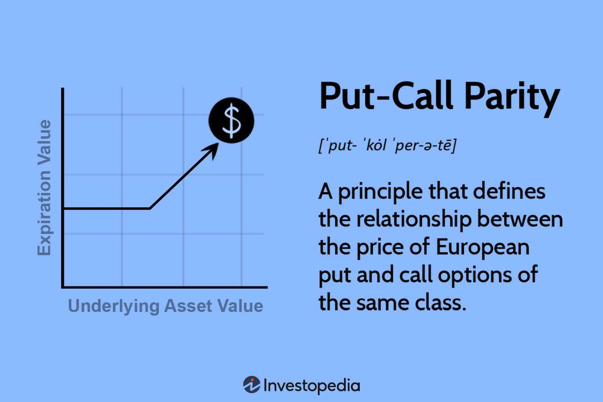

Put-Call Parity is a fundamental principle in financial mathematics that establishes a relationship between the prices of European call and put options with the same strike price and expiry date. The parity formula is expressed as:

$$
C - P = S - Ke^{-rT}
$$



where $C$ is the price of the call option, $P$ is the price of the put option, $S$ is the current stock price, $K$ is the strike price, $r$ is the risk-free interest rate, and $T$ is the time to expiration. This equation represents the theoretical fairness between call and put options and forms the foundational basis for pricing and hedging strategies in financial markets.

The relationship illustrates that holding a long call option and a short put option with the same strike price and expiry is equivalent to holding a forward contract expiring at the same time, adjusted for the present value of the strike price. In essence, this means that the differing payouts from the options balance each other out when adjusted for the movement of the underlying asset and interest rate, thus ensuring no arbitrage opportunities should ideally exist.

In algorithmic trading, Put-Call Parity plays a crucial role as it provides a reliable framework for identifying arbitrage opportunities. Automated trading systems can exploit deviations from this parity to execute trades that profit from market inefficiencies, thereby enhancing the robustness of trading strategies. Fast and efficient computing allows algorithms to swiftly detect pricing anomalies, analyze large datasets, and implement trades to capitalize on these discrepancies, underscoring the importance of mathematical relationships like Put-Call Parity in developing sophisticated algorithmic trading models.

## Table of Contents

## Understanding Put-Call Parity

Put-Call Parity is a fundamental concept in options pricing that establishes a relationship between the prices of European call and put options with the same strike price and expiration. This relationship is pivotal as it illustrates how these options can replicate a forward contract on the underlying security.

### Foundational Concept

At its core, Put-Call Parity demonstrates that holding a long call option and selling a put option (short put) with identical strike prices and expiry dates is equivalent to holding a forward contract. This can be expressed through the formula:

$$
C - P = S - \frac{K}{(1 + r)^T}
$$

Where:
- $C$ = Price of the call option
- $P$ = Price of the put option
- $S$ = Current price of the underlying asset
- $K$ = Strike price of the options
- $r$ = Risk-free rate
- $T$ = Time to expiration (in years)

The equivalency indicates that the combination of a long call and a short put at the same strike price and expiry mimics the payoff of a forward contract. If Put-Call Parity holds, [arbitrage](/wiki/arbitrage) opportunities—where a riskless profit can be made—should not exist in efficient markets.

### Assumptions

For Put-Call Parity to be applicable, certain market conditions and assumptions are necessary:

1. **Efficient Markets**: The markets are efficient, and prices reflect all available information, leaving no room for arbitrage.

2. **European Options**: The options are European, meaning they can only be exercised at expiration, aligning both call and put options to the same time horizon.

3. **No Transaction Costs**: There are no transaction costs involved in buying or selling the options or the underlying asset, ensuring that the parity holds without additional expenses.

4. **Constant Interest Rates**: The risk-free interest rate remains constant, allowing for the calculation of present values over the option's life.

5. **Dividends**: The underlying stock does not pay dividends during the life of the options. If it does, the model would need adjustments to reflect these cash flows.

These assumptions are crucial for the Put-Call Parity relationship to function correctly. Any deviations—such as transaction costs, taxes, or market inefficiencies—can lead to discrepancies, offering potential arbitrage opportunities. However, in real-world scenarios, these opportunities are swiftly corrected by market participants.

## Principles of Algorithmic Trading

Algorithmic trading, often referred to as algo trading, is the use of computer algorithms to execute trading orders at speeds and frequencies that a human trader cannot match. With advancements in technology, high-frequency trading represents the pinnacle of this approach, allowing trades to occur within microseconds. As financial markets continue to evolve, the prevalence and sophistication of [algorithmic trading](/wiki/algorithmic-trading) have exponentially increased, now representing a substantial [volume](/wiki/volume-trading-strategy) of trades on major exchanges.

There are several types of algorithms used in trading, each designed to achieve specific goals:

1. **Market Making Algorithms**: These algorithms provide liquidity by continuously quoting buy and sell prices. They earn the spread between these prices, hence playing a crucial role in maintaining market efficiency.

2. **Statistical Arbitrage Models**: These algorithms rely on statistical and mathematical models to identify and exploit price inefficiencies between related financial instruments. They often use historical data to predict potential price movements.

3. **Trend-Following Systems**: These algorithms are designed to capitalize on momentum and typically involve buying when prices are trending upward and selling when they trend downward. They rely heavily on technical indicators.

4. **Machine Learning Algorithms**: Leveraging the power of machine learning, these algorithms can detect complex patterns in vast datasets, adapting over time to enhance predictive accuracy and trading performance.

5. **Execution Algorithms**: Used primarily by institutional traders, these algorithms aim to execute large orders without significantly impacting the market price. Algorithms like VWAP (Volume Weighted Average Price) and TWAP (Time Weighted Average Price) are common examples, aiming to execute trades as close to the average price as possible over a specific period.

Mathematical relationships form the backbone of algorithmic trading strategies. These relationships, often derived from financial models, help in predicting price movements and assessing risk. For instance, the Black-Scholes model, a cornerstone of options pricing, aids traders in valuing options and informing decision-making processes. Statistical measures such as mean reversion, where prices tend to return to an average over time, and correlations between asset prices, are essential in constructing robust trading strategies.

Moreover, the application of complex mathematical principles like stochastic calculus, machine learning techniques, and optimization models allows traders to gain competitive advantages. An understanding of these relationships is crucial, as they enable traders to craft strategies that can withstand different market conditions and optimize returns while managing risks efficiently. Algorithmic trading thrives on these principles, continually adapting and evolving to capture fleeting opportunities in an increasingly complex market landscape.

## Application of Put-Call Parity in Algorithmic Trading

Put-Call Parity serves as a crucial tool for algorithmic traders aiming to exploit arbitrage opportunities in financial markets. At its core, Put-Call Parity creates a relationship between European call and put options with the same strike price and expiration date. This relationship can be expressed by the formula: 

$$
C - P = S - K \times e^{-r(T-t)}
$$

where $C$ is the call option price, $P$ is the put option price, $S$ is the spot price of the underlying asset, $K$ is the strike price, $r$ is the risk-free interest rate, and $T-t$ is the time to maturity. If any discrepancy occurs in the above equation, traders see it as an arbitrage opportunity.

### Arbitrage Opportunities

Traders leverage discrepancies in Put-Call Parity to execute arbitrage strategies. If the theoretical price derived from the Put-Call Parity formula does not match the market price, traders can construct a delta-neutral portfolio and profit from this mispricing. For instance, if the left side of the Put-Call Parity is greater than the right side, a trader can buy the put, sell the call, and short the stock, locking in risk-free profits.

### Delta-Neutral Strategies

Delta-neutral strategies involve creating a portfolio with zero delta, meaning its value doesn't change with small movements in the market price of the underlying asset. Put-Call Parity provides the groundwork for constructing such strategies by ensuring the portfolio's sensitivity to changes in the asset price is minimized. Traders often use a combination of calls, puts, and the underlying asset to achieve delta neutrality, making their strategies more robust to market fluctuations.

### Algorithmic Trading Systems

Algorithmic trading systems capitalize on Put-Call Parity relationships by continuously monitoring prices and executing trades faster than human traders. Algorithms can be programmed to identify deviations from Put-Call Parity instantly and execute trades to take advantage of the arbitrage opportunities. For example, a Python script might monitor option prices and execute the following logic:

```python
if C - P > S - K * math.exp(-r * (T - t)):
    # Execute trades for arbitrage opportunity
    buy_put()
    sell_call()
    short_stock()
```

By leveraging the fast execution speed of algorithms, traders can enhance returns significantly while minimizing risks. In advanced systems, [machine learning](/wiki/machine-learning) techniques can further refine these algorithms, adjusting strategies in real-time based on market conditions and historical data patterns.

Overall, Put-Call Parity is a powerful principle in algorithmic trading, facilitating the design of profitable and delta-neutral trading strategies, especially when discrepancies arise in market prices.

## Implementation and Challenges

Put-Call Parity is a cornerstone concept in options pricing, providing an equilibrium relationship between the prices of European put and call options with identical strike prices and expiry dates. However, implementing this theoretical construct in real-world trading is fraught with challenges due to transaction costs and market frictions. These [factor](/wiki/factor-investing)s can distort the ideal relationship expressed by Put-Call Parity, leading to mispricings that traders could potentially exploit.

### Transaction Costs and Market Frictions

Transaction costs, which include brokerage fees, taxes, and bid-ask spreads, are a significant barrier to the pure application of Put-Call Parity. The presence of these costs means that the theoretical arbitrage opportunities provided by deviations in Put-Call Parity are often not profitable in practice. For example, if the cost of executing multiple trades to exploit a discrepancy exceeds the potential profit from the arbitrage, the opportunity is nullified.

Market frictions refer to elements such as [liquidity](/wiki/liquidity-risk-premium) constraints, regulatory restrictions, and delays in trade execution. In highly liquid markets, slight deviations in Put-Call Parity can prompt swift correction as high-frequency trading algorithms capitalize on these opportunities. Conversely, in less liquid markets, options might be priced inefficiently for extended periods, making it difficult to execute trades at the needed volumes or prices to exploit these discrepancies.

### Challenges in Less Liquid Markets

Implementing Put-Call Parity in markets with low liquidity presents unique challenges. In such environments, wide bid-ask spreads and limited availability of options contracts can significantly hinder the execution of arbitrage strategies. For instance, an algorithm designed to take advantage of Put-Call Parity might struggle to find enough counterparties to complete its trades without impacting the market price adversely.

Less liquid markets also often lack the depth necessary to maintain stable prices, making it riskier to rely on the traditional relationship between puts and calls. Algorithms in these markets need to incorporate additional checks and balances to ensure that they can still achieve profitability while managing increased slippage and the potential for delayed trade executions.

### Algorithmic Solutions 

Algorithmic trading systems are designed to manage these challenges by incorporating sophisticated risk management protocols and dynamic adjustment models. Such algorithms typically factor in transaction costs and adjust decision-making thresholds to ensure trades are still profitable after expenses. They also utilize statistical models to predict liquidity trends and adaptively modify their strategies based on real-time market data.

For example, an algorithm might employ a delta-neutral strategy that adjusts its positions dynamically to maintain a hedged portfolio. Python code can be employed here to simulate and back-test such strategies:

```python
def calculate_portfolio_delta(calls, puts, stock_price, call_delta, put_delta):
    portfolio_delta = 0
    for call, delta in zip(calls, call_delta):
        portfolio_delta += call * delta
    for put, delta in zip(puts, put_delta):
        portfolio_delta -= put * delta
    portfolio_delta -= stock_price * len(calls)
    return portfolio_delta

# Example usage
calls = [2, 3, 1]
puts = [1, 2, 1]
stock_price = 100
call_delta = [0.6, 0.5, 0.7]
put_delta = [0.4, 0.3, 0.2]

portfolio_delta = calculate_portfolio_delta(calls, puts, stock_price, call_delta, put_delta)
print(f"Portfolio Delta: {portfolio_delta}")
```
This code snippet calculates the portfolio delta, allowing traders to assess the need for adjustments based on updated market conditions, thus maintaining an arbitrage opportunity even in less liquid markets.

By understanding and managing the limitations of transaction costs, market frictions, and liquidity constraints, algorithmic trading platforms can effectively harness Put-Call Parity as part of a sophisticated trading strategy. However, successful implementation requires constant adaptation to market conditions and evolving technological capabilities.

## Case Studies

Historically, Put-Call Parity has offered lucrative arbitrage opportunities, especially during periods of market inefficiency. One striking example of this occurred during the 1987 stock market crash, where extreme [volatility](/wiki/volatility-trading-strategies) and panic led to discrepancies between put and call prices. Savvy traders were able to exploit these discrepancies by constructing synthetic positions that should, under normal conditions, have yielded equivalent payoffs. For instance, they could take a long position in a call and short position in a put with the same strike price and expiration to effectively create a position equivalent to holding the underlying asset, adjusted for the present value of the strike price.

In more recent times, examples within major stock indices and foreign exchange ([FX](/wiki/fx-anomaly)) markets have reaffirmed the relevance of Put-Call Parity. For instance, during periods of financial crises or unexpected market announcements, discrepancies have re-emerged, albeit briefly. Traders use algorithmic systems to identify these fleeting opportunities almost instantaneously, executing trades that leverage slight mispricings between options.

A concrete example could involve a situation in the S&P 500 options market. Suppose a European call option with a strike price of $3,500 is trading at $150, and a put option with the same strike is trading at $140, while the underlying asset is at $3,480 and the risk-free rate is close to zero. According to Put-Call Parity:

$$
C - P = S - K
$$

Where $C$ is the call option price, $P$ the put option price, $S$ the current price of the underlying asset, and $K$ the strike price. Plugging in the given numbers does not satisfy this relationship, indicating a potential arbitrage opportunity.

In FX markets, traders often observe discrepancies due to [interest rate](/wiki/interest-rate-trading-strategies) differentials between currencies. By maintaining portfolios that exploit these differences, informed by Put-Call Parity, traders can craft strategies that hedge against adverse currency movements, capturing returns from mispriced options.

Lessons from these case studies highlight the importance of speed and accuracy in detecting arbitrage opportunities. Algorithmic trading systems that incorporate real-time data analytics and sophisticated mathematical models are crucial in capturing these opportunities before they dissipate. Moreover, these case studies underscore the continual need for technological advancement and risk management. As markets become more efficient, the window for arbitrage reduces, making it imperative for algorithmic traders to develop more refined and rapid responses to market inefficiencies.

The historical and ongoing exploitation of Put-Call Parity informal algorithmic trading not only reinforces its significance but also highlights the evolving landscape in which traders operate. New tools and strategies continually emerge, driven by the lessons learned from past successes and challenges in aligning theoretical models with real-world market behaviors.

## Conclusion

Put-Call Parity holds a pivotal role in algorithmic trading, serving as the bedrock for numerous trading strategies aimed at exploiting price inefficiencies. Its mathematical foundation provides a robust framework for understanding the intrinsic relationship between the pricing of European call and put options. This relationship is key to uncovering arbitrage opportunities, which traders can systematically exploit through algorithms.

As we look toward the future, Put-Call Parity continues to influence the evolution of trading strategies. With the advancement of technology and the increasing complexity of financial markets, the reliance on precise mathematical relationships will only grow. Algorithmic trading strategies that harness these relationships are likely to evolve, becoming more sophisticated and potentially incorporating machine learning to predict market dynamics.

Moreover, the dynamic nature of markets underscores the necessity for ongoing research and observation. As trading conditions and market structures change, continually refining our understanding of Put-Call Parity and its applications will be crucial. This ongoing study will help traders adapt to new market conditions, ensuring that the significance of Put-Call Parity remains a cornerstone in the toolbox of future trading strategies. Encouraging further exploration of this and similar concepts will be vital for traders who wish to remain at the forefront of the evolving financial landscape.

## References & Further Reading

[1]: Hull, J. C. (2017). ["Options, Futures, and Other Derivatives"](https://www.semanticscholar.org/paper/Options%2C-Futures%2C-and-Other-Derivatives-Hull/89bdee500c8623864fc9eb7a471546aa713acc44) (9th Edition). Pearson.

[2]: Black, F., & Scholes, M. (1973). ["The Pricing of Options and Corporate Liabilities."](https://www.cs.princeton.edu/courses/archive/fall09/cos323/papers/black_scholes73.pdf) Journal of Political Economy, 81(3), 637-654.

[3]: Merton, R. C. (1973). ["Theory of Rational Option Pricing."](https://www.jstor.org/stable/3003143) The Bell Journal of Economics and Management Science, 4(1), 141-183.

[4]: Natenberg, S. (1994). ["Option Volatility and Pricing: Advanced Trading Strategies and Techniques."](https://www.amazon.com/Option-Volatility-Pricing-Strategies-Techniques/dp/0071818774) McGraw-Hill.

[5]: Kissell, R. (2014). ["The Science of Algorithmic Trading and Portfolio Management."](https://www.sciencedirect.com/book/9780124016897/the-science-of-algorithmic-trading-and-portfolio-management) Academic Press.