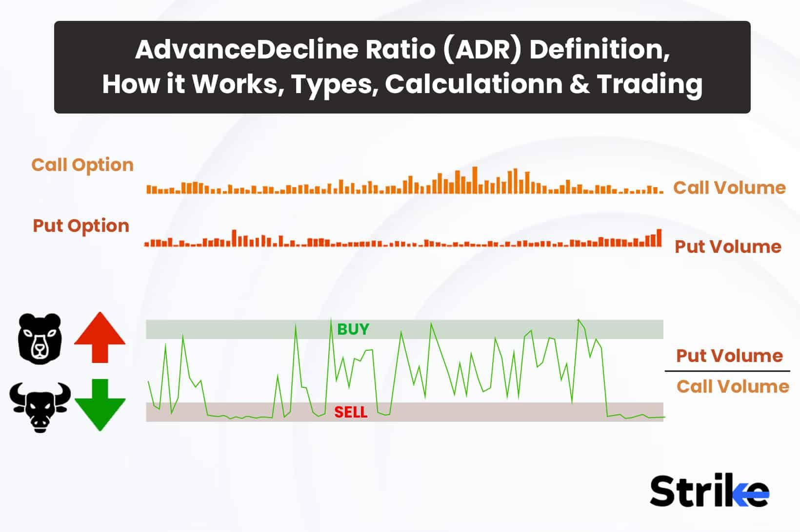

## Table of Contents

## What is the Put-Call Ratio and how is it calculated?

The Put-Call Ratio is a tool that investors use to gauge the overall mood of the stock market. It compares the number of put options, which are bets that a stock's price will go down, to the number of call options, which are bets that a stock's price will go up. A high Put-Call Ratio means more people are betting on a stock's price to fall, which might suggest a bearish or negative market sentiment. On the other hand, a low Put-Call Ratio indicates more people are betting on a stock's price to rise, suggesting a bullish or positive market sentiment.

To calculate the Put-Call Ratio, you simply divide the total number of traded put options by the total number of traded call options over a specific period, like a day or a week. For example, if on a given day, 1,000 put options and 2,000 call options were traded, the Put-Call Ratio would be 1,000 divided by 2,000, which equals 0.5. This ratio can be used for individual stocks or for the entire market, providing insights into what investors are thinking and feeling about future market movements.

## How can the Put-Call Ratio be used as an indicator in trading?

Traders use the Put-Call Ratio to understand what other investors are thinking about the market. If the ratio is high, it means more people are buying put options, betting that stock prices will go down. This can signal that the market might be getting too negative, and some traders might see this as a chance to buy stocks at a lower price, expecting them to go up later. On the other hand, a low Put-Call Ratio means more people are buying call options, betting that stock prices will go up. This can signal that the market might be getting too positive, and some traders might see this as a warning sign to sell their stocks before prices drop.

The Put-Call Ratio can also help traders spot when the market might be about to change direction. For example, if the ratio has been high for a while and then starts to drop, it could mean that the market is becoming less negative and might start to go up. Traders might use this as a signal to start buying stocks. Similarly, if the ratio has been low for a while and then starts to rise, it could mean that the market is becoming less positive and might start to go down. Traders might use this as a signal to start selling their stocks. By watching the Put-Call Ratio, traders can try to make smarter decisions about when to buy and sell.

## What is a backtest strategy and why is it important in trading?

A backtest strategy is when traders use old market data to test if their trading plan would have worked in the past. They pretend to buy and sell stocks or other things using this old data to see how well their plan would have done. It's like practicing trading without using real money. By doing this, traders can see if their ideas are good or if they need to change them before they start trading for real.

Backtesting is important because it helps traders understand how their strategy might work in real life. It can show them what might go wrong and how they can make their plan better. This practice can help traders feel more confident and ready when they start trading with real money. It's a way to learn from the past to do better in the future.

## How does the Put-Call Ratio Backtest Strategy work?

The Put-Call Ratio Backtest Strategy involves using old market data to see how well a trading plan that uses the Put-Call Ratio would have worked in the past. Traders look at the Put-Call Ratio over time and see if they could have made good decisions about buying and selling stocks based on changes in the ratio. For example, they might set rules like buying stocks when the ratio goes below a certain level, thinking it means the market is getting too positive, or selling stocks when the ratio goes above a certain level, thinking it means the market is getting too negative.

By backtesting, traders can see if their rules for using the Put-Call Ratio would have made them money or lost them money in the past. They can then tweak their strategy to try and make it better. If the backtest shows that the strategy would have worked well, traders might feel more confident using it in real trading. If it didn't work well, they can change their rules or try different levels for the Put-Call Ratio to see if that makes a difference. This helps traders learn and improve their trading plan before using real money.

## What are the historical performance results of the Put-Call Ratio Backtest Strategy?

The historical performance of the Put-Call Ratio Backtest Strategy has shown mixed results over time. Some studies have found that using the Put-Call Ratio to guide trading decisions can be effective, especially when combined with other indicators. For example, a backtest might show that buying stocks when the Put-Call Ratio is low and selling when it's high could have led to profits in certain periods, like during market recoveries after downturns. However, the success of this strategy can vary depending on the specific time frame and market conditions being tested.

In other cases, the Put-Call Ratio Backtest Strategy has not always proven to be a reliable predictor of market movements. Some backtests have shown that following the Put-Call Ratio alone might lead to losses, especially during times of high market volatility or when the market behaves in unexpected ways. This suggests that while the Put-Call Ratio can be a useful tool, it's important to use it alongside other indicators and to understand that past performance does not guarantee future results. Traders often find that adjusting the strategy based on different market conditions and combining it with other analysis methods can improve its effectiveness.

## What are the key parameters to consider when setting up a Put-Call Ratio Backtest?

When setting up a Put-Call Ratio Backtest, one of the key parameters to consider is the threshold levels for the Put-Call Ratio. Traders need to decide at what levels of the ratio they will buy or sell stocks. For example, they might choose to buy when the ratio drops below 0.5, thinking the market is getting too positive, and sell when it rises above 1.0, thinking the market is getting too negative. These levels can be adjusted based on past data to see what works best.

Another important parameter is the time frame for the backtest. Traders need to choose how long they want to test their strategy, whether it's a few months, a year, or several years. Different time frames can show different results, so it's helpful to test the strategy over various periods to get a good idea of how it might work in different market conditions. Also, the frequency of trading decisions, like daily or weekly, can affect the results, so this should be set carefully.

Lastly, it's crucial to consider what other indicators or rules will be used alongside the Put-Call Ratio. The strategy might work better if combined with other tools like moving averages or volume indicators. Traders should also think about how much money they're pretending to use in the backtest and set rules for managing risks, like how much they're willing to lose on each trade. By carefully setting these parameters, traders can get a clearer picture of how well their strategy might perform in real trading.

## How can one optimize the Put-Call Ratio Backtest Strategy for better results?

To optimize the Put-Call Ratio Backtest Strategy for better results, start by adjusting the threshold levels for buying and selling based on the Put-Call Ratio. You might find that setting the buy threshold at a lower level, like 0.4, and the sell threshold at a higher level, like 1.2, could lead to better outcomes in certain market conditions. It's important to run the backtest with different threshold levels to see which ones work best. Also, try different time frames for the backtest. Testing the strategy over various periods, like a year or five years, can help you understand how it performs in different market environments. You might find that the strategy works better in some years than others.

Another way to optimize the strategy is by combining the Put-Call Ratio with other indicators. For example, you could use moving averages or volume indicators alongside the Put-Call Ratio to make more informed trading decisions. This can help you catch trends or confirm signals that the Put-Call Ratio alone might miss. Additionally, consider adjusting the frequency of your trading decisions, like switching from daily to weekly trades, to see if that improves the results. Finally, set clear rules for managing risks, such as deciding how much you're willing to lose on each trade. By carefully tweaking these aspects, you can make your Put-Call Ratio Backtest Strategy more effective and increase your chances of success in real trading.

## What are the common pitfalls and limitations of using the Put-Call Ratio Backtest Strategy?

One common pitfall of using the Put-Call Ratio Backtest Strategy is that it might not work well in all market conditions. The strategy can be very good in some years but not so good in others. This happens because the stock market can change a lot, and what worked in the past might not work the same way in the future. Traders need to be careful and not just trust the strategy without thinking about how the market is doing right now. They should also use other tools and indicators to help them make better decisions.

Another limitation is that the Put-Call Ratio can be affected by things that are hard to predict, like big news events or sudden changes in the market. These things can make the ratio go up or down in ways that don't really show what most investors are thinking. This can make the backtest results less reliable. Also, backtesting can sometimes make a strategy look better than it really is because it's easy to change the rules to fit past data. Traders need to remember that just because a strategy worked in the past, it doesn't mean it will work the same way in the future.

## How does the Put-Call Ratio Backtest Strategy perform in different market conditions?

The Put-Call Ratio Backtest Strategy can work differently depending on what's happening in the market. In times when the market is going up slowly and steadily, the strategy might do well. If the Put-Call Ratio is low, it might be a good time to buy stocks because it means more people are betting that prices will go up. But, if the market is going down or is very unpredictable, the strategy might not work as well. Big news or sudden changes can make the Put-Call Ratio go up and down a lot, which can make it hard to know if it's a good time to buy or sell.

In markets that are very up and down, the Put-Call Ratio can be tricky to use. When everyone is scared and selling, the ratio might be high, making you think it's a bad time to buy. But sometimes, this can be a good time to buy because prices might go back up later. On the other hand, when everyone is happy and buying, the ratio might be low, making you think it's a good time to buy. But this can be risky because prices might drop soon. So, it's important to look at other things in the market too, not just the Put-Call Ratio, to make the best decisions.

## Can the Put-Call Ratio Backtest Strategy be combined with other indicators or strategies?

Yes, the Put-Call Ratio Backtest Strategy can be combined with other indicators or strategies to make it work better. For example, you might use moving averages to help you see the overall trend of the market. If the Put-Call Ratio is low and the moving average is going up, it might be a good time to buy. Or, you could use volume indicators to see if a lot of people are trading. If the Put-Call Ratio is high but the volume is also high, it might mean that a lot of people think the market is going to go down, so it could be a good time to sell.

Another way to combine the Put-Call Ratio with other strategies is to use it along with fundamental analysis. This means looking at things like a company's earnings and how much it's worth. If the Put-Call Ratio suggests it's a good time to buy and the company's fundamentals are strong, you might feel more confident about buying its stock. By using the Put-Call Ratio with other tools, you can get a better picture of what's happening in the market and make smarter trading decisions.

## What are the advanced techniques for analyzing the effectiveness of the Put-Call Ratio Backtest Strategy?

One advanced technique for analyzing the effectiveness of the Put-Call Ratio Backtest Strategy is to use a method called walk-forward optimization. This means you split your old market data into smaller parts and test your strategy on each part one by one. You start with the first part of the data to set your rules, like what levels of the Put-Call Ratio you'll use to buy or sell. Then, you test those rules on the next part of the data to see if they still work. If they don't, you can change the rules a little and try again. This helps you make sure your strategy can keep working as the market changes over time.

Another advanced technique is to use Monte Carlo simulations. This is a way to test your strategy many times with different pretend situations. You can change things like how much the market goes up or down and see how your strategy would do in all those different cases. By doing this, you can see how likely it is that your strategy will work well in the future. It helps you understand the risks better and can make you feel more sure about using the strategy in real trading.

## How can one implement the Put-Call Ratio Backtest Strategy using programming languages like Python?

To implement the Put-Call Ratio Backtest Strategy using Python, you first need to gather historical data on the Put-Call Ratio and stock prices. You can use libraries like `pandas` to load and manipulate this data. Once you have the data, you can set up your strategy rules, like buying when the Put-Call Ratio drops below a certain level, say 0.5, and selling when it goes above another level, say 1.0. You'll write a loop that goes through the data day by day, checking the Put-Call Ratio and making buy or sell decisions based on your rules. Keep track of your pretend money and the value of your pretend stock portfolio as you go along.

After setting up the backtest, you can use Python's `matplotlib` library to make graphs that show how your strategy did over time. You might want to see a graph of your portfolio's value or a graph of when you bought and sold stocks. To make your strategy better, you can try different levels for the Put-Call Ratio or combine it with other indicators like moving averages. Python's `numpy` library can help you do math to figure out the best levels to use. By testing your strategy with different rules and looking at the results, you can learn a lot about how well it might work in real trading.

## What is the Put-Call Ratio and how can it be understood?

The put-call ratio is a vital metric in the financial markets that serves as a barometer of investor sentiment, predominantly utilized in options trading. It quantifies the relationship between the trading volumes of put options to call options and is expressed as:

$$
\text{Put-Call Ratio} = \frac{\text{Volume of Put Options}}{\text{Volume of Call Options}}
$$

This ratio provides insight into market participants' expectations and can help traders gauge whether the sentiment is leaning towards bearishness or bullishness. A put option gives investors the right to sell a security at a predetermined price, which investors purchase if they expect the security's price to decline. Conversely, a call option gives investors the right to buy, signaling an anticipation of price increases. 

Generally, a higher put-call ratio, typically above 1, suggests that the market sentiment is bearish, as there are more puts being traded relative to calls. This indicates that traders are hedging against potential declines in asset prices or are speculating that such declines will occur. On the other hand, a lower put-call ratio, often below 0.7, indicates bullish market sentiment, as it reflects increasing demand for calls, suggesting optimism about future price increases.

Understanding the nuances of this ratio is crucial for predicting market movements, as it allows traders to assess the underlying mood and expectations within the market. It's important to note that while the put-call ratio provides valuable insights, it should be used in conjunction with other technical and fundamental analyses to make informed trading decisions.

## Can the Put-Call Ratio be used as a Contrarian Indicator?

The put-call ratio serves as a contrarian indicator by highlighting extreme market sentiments that may present trading opportunities. When the ratio is exceedingly high, it signals that there might be an overwhelming sentiment of bearishness within the market. This occurs because a large number of investors are purchasing put options relative to call options, suggesting they anticipate a market downturn. For contrarian traders—who thrive on exploiting deviations from prevailing market sentiments—a high put-call ratio can be interpreted as a potential buying opportunity. This contrarian stance is based on the idea that the market may have overreacted, leading to a future rebound.

Conversely, a very low put-call ratio indicates a heavily bullish sentiment in the market. Here, the number of call options significantly outweighs put options, reflecting widespread investor optimism about future market rises. For contrarians, this could signal that the market is overheated, and a sell-off may be impending. The rationale is that excessive bullishness might lead to unsustainable market conditions, eventually correcting through declines.

Mathematically, the put-call ratio ($PCR$) is expressed as:

$$
PCR = \frac{\text{Volume of Put Options}}{\text{Volume of Call Options}}
$$

To effectively use the put-call ratio as a contrarian indicator in algorithmic trading, traders often set predefined thresholds. For instance, a historical analysis may reveal that a put-call ratio above 1.2 typically precedes market upturns, while a ratio below 0.5 often foreshadows downturns. Algorithmic traders can program these thresholds into their trading systems, allowing automatic detection and reaction to these conditions.

Python can be used to monitor these signals as shown in the following code snippet:

```python
def check_contrarian_signal(put_volume, call_volume, high_thresh=1.2, low_thresh=0.5):
    pcr = put_volume / call_volume
    if pcr > high_thresh:
        return "Consider buying opportunity due to high bearish sentiment."
    elif pcr < low_thresh:
        return "Consider selling opportunity due to high bullish sentiment."
    else:
        return "No significant contrarian signal detected."

# Example usage
print(check_contrarian_signal(1200, 800))
```

In practice, successful deployment of the put-call ratio as a contrarian indicator requires more than just acknowledging high and low thresholds; it necessitates integrating these signals into a broader strategy that considers other technical indicators and market conditions.

## References & Further Reading

[1]: Black, F., & Scholes, M. (1973). ["The Pricing of Options and Corporate Liabilities."](https://www.cs.princeton.edu/courses/archive/fall09/cos323/papers/black_scholes73.pdf) Journal of Political Economy, 81(3), 637-654.

[2]: Natenberg, S. (1994). ["Option Volatility and Pricing: Advanced Trading Strategies and Techniques."](https://www.amazon.com/Option-Volatility-Pricing-Strategies-Techniques/dp/0071818774) McGraw-Hill.

[3]: Cboe Options Exchange. ["Understanding the Cboe Volatility Index (VIX)."](https://www.cboe.com/us/indices/dashboard/VIX/) 

[4]: Murphy, J.J. (1999). ["Technical Analysis of the Financial Markets: A Comprehensive Guide to Trading Methods and Applications."](https://www.amazon.com/Technical-Analysis-Financial-Markets-Comprehensive/dp/0735200661) New York Institute of Finance.

[5]: Hull, J.C. (2018). ["Options, Futures, and Other Derivatives."](https://books.google.com/books/about/Options_Futures_and_Other_Derivatives_eB.html?id=2iopDwAAQBAJ) Pearson.