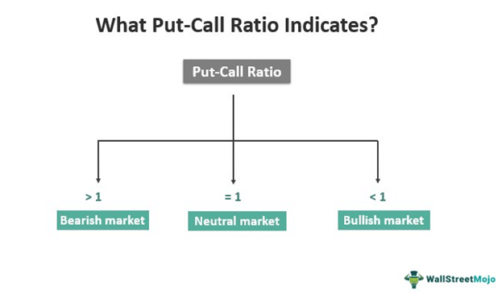

The Put-Call Ratio is an essential metric in options trading and investment analysis, providing insights into market sentiment. This article examines the importance of the Put-Call Ratio in understanding market dynamics, interpreting this key indicator, and its application in algorithmic trading. Through a detailed exploration of this ratio, investors and traders can refine their decision-making processes, gaining a deeper understanding of how the Put-Call Ratio acts as a barometer of market sentiment and its subsequent effects on investment strategies. Moreover, the discussion extends to the integration of this ratio into algorithmic trading platforms and various investment indicators, showcasing its relevance in contemporary trading practices. This analysis aims to equip investors with the knowledge to utilize the Put-Call Ratio effectively, thereby optimizing their strategic approaches in the investment landscape.

## Table of Contents



## Understanding the Put-Call Ratio

The Put-Call Ratio serves as a critical metric for gauging market sentiment by comparing the volume of put options to call options. This ratio is essential for traders and investors who seek to understand the prevailing mood in the market. 

A 'put' option is a financial contract that grants the owner the right to sell a specified quantity of an underlying asset at a set price, known as the strike price, before or at the expiration date. Conversely, a 'call' option provides the owner the right to buy an asset at a predetermined price within a specified timeframe. These options are integral to hedging strategies and speculative efforts within the trading community.

The Put-Call Ratio is calculated by dividing the trading volume of puts by that of calls, represented mathematically as:

$$
\text{Put-Call Ratio} = \frac{\text{Volume of Put Options}}{\text{Volume of Call Options}}
$$

The interpretation of this ratio offers useful insights into market trends. A higher Put-Call Ratio, suggesting that investors are buying more puts than calls, often indicates a bearish sentiment. This sentiment arises from the expectation of declining prices, leading investors to protect their portfolios or speculate on downturns. Conversely, a lower ratio, where calls outpace puts, signals bullish sentiment, reflecting expectations of rising asset prices.

For practical purposes, specific benchmark values are often considered. A ratio greater than 1 is typically aligned with bearish sentiment, as it reflects a greater demand for put options over calls. Ratios below 0.7 frequently indicate bullish expectations, with a higher proportion of call options reflecting the sentiment that markets will go up.

Understanding these values within the context of the broader market environment is essential. Traders and investors use these indicators to adjust their strategies accordingly, balancing the insights from the Put-Call Ratio with other market factors to optimize their decision-making processes.

## Interpreting the Put-Call Ratio

Investors use the Put-Call Ratio as a contrarian indicator to forecast potential market reversals. This ratio, which compares the [volume](/wiki/volume-trading-strategy) of traded put options to call options, reflects the prevailing sentiment in the market. A ratio that reaches extreme levels typically suggests heightened bearish or bullish sentiment, frequently preceding a market turnaround. When the Put-Call Ratio is unusually high, it indicates a dominant bearish sentiment, implying that market participants expect prices to fall. Conversely, a very low value may indicate excessive bullishness, suggesting an impending upward price movement.

Historical data analysis is pivotal for determining what may be considered 'extreme levels' for the Put-Call Ratio. These thresholds can vary depending on market conditions and the prevailing economic environment, making it crucial to consider the context. This historical perspective helps investors understand how past peaks and troughs in the Put-Call Ratio coincide with market reversals, thereby aiding in the anticipation of future events.

Understanding the context within which the ratio operates involves a comprehensive analysis of market conditions and historical norms. Market phases, economic indicators, and macroeconomic events can all impact the level regarded as extreme for the ratio. For instance, during a bear market, the threshold for what constitutes a high Put-Call Ratio might be different from what it would be in a bull market.

Moreover, it is common practice to use the Put-Call Ratio in conjunction with other market indicators to confirm market trends or potential shifts. Indicators like the VIX (Volatility Index), moving averages, and economic indicators (e.g., GDP growth rates, unemployment figures) provide additional layers of insight that reinforce or question the signal given by the Put-Call Ratio. By employing a diversified set of analytical tools, investors gain a more nuanced understanding of market dynamics, reducing the risk of relying solely on the Put-Call Ratio, which can sometimes render misleading signals due to its inherent lagging nature.

In conclusion, while the Put-Call Ratio is a valuable tool for discerning market sentiment and anticipating reversals, its effectiveness is significantly enhanced when interpreted within the context of other relevant indicators and historical norms. This comprehensive approach enables investors to make more informed predictions about potential market shifts.

## Algorithmic Trading and Put-Call Ratio

Algorithmic trading leverages the Put-Call Ratio as a critical component in the automation of trading strategies, reflecting market sentiment. The Put-Call Ratio, a metric that compares the volume of put options to call options, acts as an indicator of investor sentiment, providing insightful data for developing algorithmic strategies.

Algorithmic traders use the Put-Call Ratio to trigger trades by setting predefined levels based on market sentiment. When the ratio reaches these levels, it signals a potential market movement, prompting algorithms to execute buy or sell orders. For example, a high Put-Call Ratio, which suggests bearish sentiment, might trigger a sell order, while a low ratio might trigger a buy order.

Integrating the Put-Call Ratio with other quantitative data enhances the predictive accuracy of algorithmic systems. By using a conjunction of different data sources, algorithms can triangulate market conditions more effectively. This combinative approach increases the reliability of the signals generated by the Put-Call Ratio, reducing the likelihood of false positives in trading decisions.

Machine learning models are increasingly being deployed to refine trading algorithms, with the Put-Call Ratio serving as a key input in identifying sentiment-driven patterns. These models process historical and real-time data, learning from past trends to predict future market movements. By analyzing changes in the Put-Call Ratio alongside other market indicators, [machine learning](/wiki/machine-learning) algorithms can adapt to evolving market conditions, optimizing trading strategies in real-time.

The strategic integration of the Put-Call Ratio into trading algorithms can significantly enhance return on investment. By timing market entries and exits more effectively, algorithms can capitalize on sentiment shifts before they fully manifest in the market. This anticipatory action allows traders to position their portfolios advantageously, capturing value from short-term sentiment-driven market movements.

Incorporating code, one could use libraries like `pandas` for data analysis and `scikit-learn` for machine learning in Python to model and predict trading signals based on the Put-Call Ratio:

```python
import pandas as pd
from sklearn.ensemble import RandomForestClassifier

# Load historical option data
data = pd.read_csv('option_data.csv')

# Calculate the Put-Call Ratio
data['Put_Call_Ratio'] = data['Put_Volume'] / data['Call_Volume']

# Features (including the Put-Call Ratio) and target variable
X = data[['Put_Call_Ratio', 'Other_Feature1', 'Other_Feature2']]
y = data['Market_Move']

# Machine learning model
model = RandomForestClassifier()
model.fit(X, y)

# Predicting future market moves
predictions = model.predict(X)
```

By nurturing such [algorithmic trading](/wiki/algorithmic-trading) frameworks, traders and investment firms can improve prediction accuracy and optimize their strategies, leveraging the Put-Call Ratio's insights into market sentiment efficiently.

## Applications in Investment Strategies

Traders and investors incorporate the Put-Call Ratio into various strategies, leveraging its ability to signal market sentiment shifts. One common approach is contrarian trading, where the ratio is used to identify potential market reversals. When the Put-Call Ratio reaches extreme levels—indicating either excessive bearishness or bullishness—traders might anticipate that the market is poised to move in the opposite direction. This contrarian perspective allows traders to capitalize on overreactions within the market.

Long-term investors use the Put-Call Ratio to adjust their portfolio allocations according to extreme ratio levels, aiming to mitigate risk. When the ratio suggests an overbought condition, indicating that a high volume of call options relative to puts could signal excessive optimism, investors may decide to reduce their equity exposure. Conversely, an oversold indication might prompt an increase in stock holdings, aligning with a more favorable long-term risk-reward ratio.

Options traders specifically leverage the Put-Call Ratio as a tool for hedging. By understanding market sentiment, these traders can hedge their positions more effectively in anticipation of market sentiment shifts. For instance, a spike in put option volume could signify impending market [volatility](/wiki/volatility-trading-strategies), suggesting it may be prudent for traders to implement protective strategies against potential downturns.

Institutional investors integrate the Put-Call Ratio within a broader sentiment analysis framework, utilizing it alongside other indicators to drive investment decisions. By analyzing the ratio in conjunction with various metrics, such as market volume and volatility indices, these investors enhance their understanding of market dynamics, allowing them to better navigate complex financial environments and adjust investment strategies accordingly. This comprehensive approach supports informed decision-making, especially in managing large and diverse portfolios.

In summary, the Put-Call Ratio serves as a versatile component in various investment strategies, providing insights that guide both short-term trading actions and long-term asset allocation decisions. By interpreting the ratio within the context of market sentiment analysis, traders and investors enhance their capability to predict market movements and adjust their strategies to capitalize on the resulting opportunities.

## Limitations and Considerations

The Put-Call Ratio, while insightful, comes with limitations that warrant careful consideration. Primarily, its nature as a lagging indicator means it reflects past market activity rather than predicting future movements. This temporal disconnect can present challenges, particularly in fast-moving markets where conditions may change rapidly. Thus, its historical basis may not accurately capture upcoming trends or shifts in sentiment.

Additionally, the ratio is susceptible to distortions from contextual factors such as the market phase or significant external events. For instance, in bullish markets, a naturally lower ratio may occur, while bearish markets might see higher ratios, regardless of impending changes in direction. Externalities, such as geopolitical events or macroeconomic shifts, can also skew the ratio, leading to potentially misleading interpretations.

Short-term fluctuations in the ratio further complicate its reliability. Rapid increases or decreases in the volume of put or call options can cause significant deviations that do not necessarily indicate a long-term sentiment shift. As a result, relying solely on this metric without broader context may lead to suboptimal trading decisions.

For these reasons, a comprehensive analytical approach is essential. Investors are advised to combine the Put-Call Ratio with other indicators, such as moving averages, [momentum](/wiki/momentum) indicators, or [fundamental analysis](/wiki/fundamental-analysis) metrics, to construct a more holistic view of market conditions. This multifaceted strategy can provide a more robust foundation for decision-making, reducing the risk of misinterpretation based on the Put-Call Ratio alone.

## Conclusion

The Put-Call Ratio remains an essential tool for gauging market sentiment, playing a critical role in shaping trading strategies. Its significance is particularly evident in algorithmic trading, where its versatility allows adaptation to contemporary investment practices. By incorporating this ratio, algorithmic platforms can refine predictive models and automate trading strategies based on identified sentiment patterns, improving the timing of market entries and exits.

Despite its power, the Put-Call Ratio should not be used in isolation. To form a comprehensive market analysis, it should complement other market indicators, providing a more robust framework for decision-making. This integration is crucial as the ratio, primarily a reflection of past market activity, may not fully anticipate future market shifts. Therefore, combining it with additional data sources and indicators enables traders and investors to navigate market complexities more effectively and strategically position themselves.

The continuous study and adaptation of the Put-Call Ratio's application promise to yield further insights into market behavior prediction. Traders and investors who leverage ongoing advancements and refine their understanding of this ratio can enhance their strategic insights, potentially leading to improved decision-making and better-managed investment risks. This adaptability underscores the importance of keeping abreast of new developments and incorporating them into existing frameworks to maintain a competitive edge in financial markets.

## References & Further Reading

[1]: Cremers, M., & Weinbaum, D. (2010). ["Deviations from Put-Call Parity and Stock Return Predictability."](https://www.cambridge.org/core/journals/journal-of-financial-and-quantitative-analysis/article/abs/deviations-from-putcall-parity-and-stock-return-predictability/D9BA8F97580328AAFD7988B092FE5D50) Journal of Financial and Quantitative Analysis, 45(2), 335-367.

[2]: Natenberg, S. (1994). ["Option Volatility & Pricing: Advanced Trading Strategies and Techniques"](https://www.amazon.com/Option-Volatility-Pricing-Strategies-Techniques/dp/0071818774). McGraw-Hill.

[3]: Black, F., & Scholes, M. (1973). ["The Pricing of Options and Corporate Liabilities."](https://www.cs.princeton.edu/courses/archive/fall09/cos323/papers/black_scholes73.pdf) Journal of Political Economy, 81(3), 637-654.

[4]: Hull, J. C. (2017). ["Options, Futures, and Other Derivatives"](https://www.semanticscholar.org/paper/Options%2C-Futures%2C-and-Other-Derivatives-Hull/89bdee500c8623864fc9eb7a471546aa713acc44). Pearson Education.

[5]: Jensen, R. E., & Bennette, J. J. (1974). ["Put-Call Parity and Market Efficiency"](https://books.google.com/books/about/Remote_Sensing_of_the_Environment.html?id=A6YsAQAAMAAJ). The Journal of Finance, 29(5), 1221-1230.