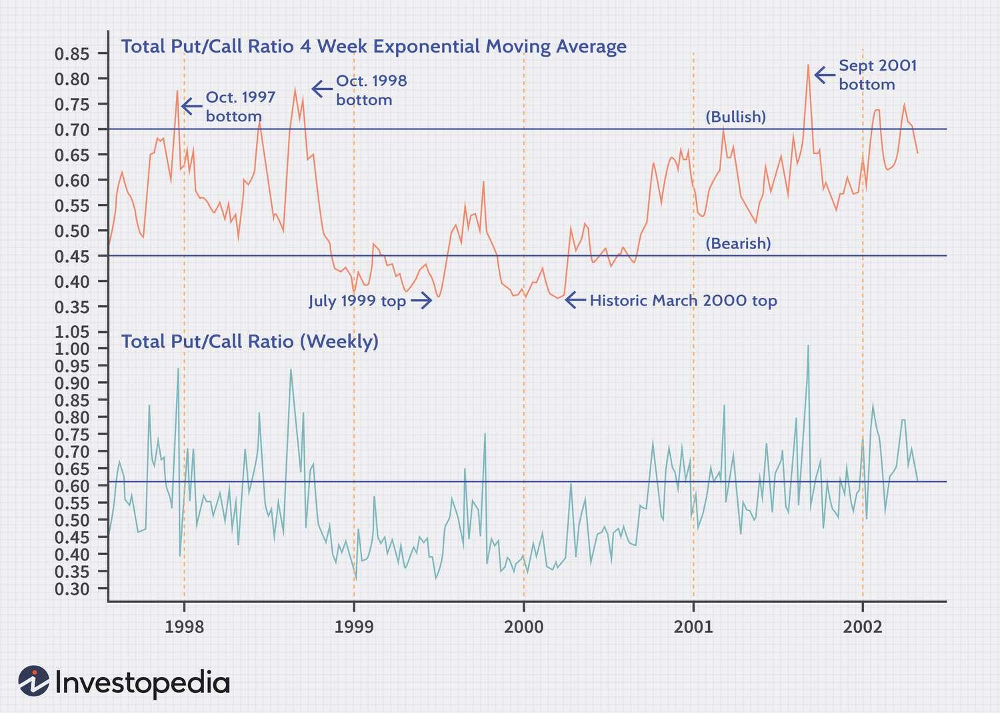

## Table of Contents

## What is the Put-Call Ratio and how is it calculated?

The Put-Call Ratio is a tool that investors use to gauge the overall mood of the stock market. It tells us how many people are betting that the market will go down (puts) compared to how many are betting it will go up (calls). If more people are buying puts, it might mean they think the market will fall. If more are buying calls, it might mean they think the market will rise.

To calculate the Put-Call Ratio, you take the number of put options traded and divide it by the number of call options traded. For example, if on a certain day, 10,000 put options and 20,000 call options were traded, the Put-Call Ratio would be 10,000 divided by 20,000, which equals 0.5. A ratio above 1 suggests more people are betting on a market drop, while a ratio below 1 suggests more people are betting on a market rise.

## Why is the Put-Call Ratio important for market analysis?

The Put-Call Ratio is important for market analysis because it helps investors understand what other people in the market are thinking. If a lot of people are buying put options, it might mean they think the market will go down soon. On the other hand, if a lot of people are buying call options, it might mean they think the market will go up. By looking at the Put-Call Ratio, investors can get a sense of whether the market sentiment is more fearful or hopeful.

This ratio can also be used as a contrarian indicator. Sometimes, when everyone is very scared and buying a lot of puts, it might be a sign that the market is actually near a bottom and could soon start to rise. Similarly, when everyone is very hopeful and buying a lot of calls, it might mean the market is near a peak and could soon start to fall. By watching the Put-Call Ratio, investors can make better decisions about when to buy or sell their investments.

## How can beginners use the Put-Call Ratio to gauge market sentiment?

Beginners can use the Put-Call Ratio to understand how other people feel about the stock market. If the ratio is high, it means more people are buying put options, which they do when they think the market will go down. A low ratio means more people are buying call options, showing they think the market will go up. By checking this ratio, beginners can get a quick idea of whether the market's mood is more worried or more hopeful.

It's also helpful for beginners to know that the Put-Call Ratio can sometimes act like a warning signal. When everyone is very scared and the ratio is very high, it might be a sign that the market could soon start to go up. On the other hand, if everyone is very hopeful and the ratio is very low, it might mean the market could soon start to go down. By watching these changes, beginners can learn to make smarter choices about when to buy or sell their investments.

## What are the typical values of the Put-Call Ratio and what do they indicate?

The Put-Call Ratio usually ranges between 0.5 and 1.0. A ratio around 0.5 means more people are buying call options, which shows they think the market will go up. When the ratio is closer to 1.0, it means more people are buying put options, showing they think the market will go down. These numbers help investors understand if the market is feeling hopeful or worried.

Sometimes, the Put-Call Ratio can go outside of this usual range. If it goes above 1.0, it means a lot more people are betting the market will drop, which can be a sign that the market might be near a bottom and could soon start to rise. On the other hand, if the ratio drops below 0.5, it means a lot more people are betting the market will go up, which can be a sign that the market might be near a peak and could soon start to fall. Watching these changes can help investors make better decisions about their investments.

## Can the Put-Call Ratio predict market trends, and if so, how?

The Put-Call Ratio can help predict market trends by showing what other people think about the market. If a lot of people are buying put options and the ratio is high, it means they are worried the market will go down. This can be a sign that the market might be near a bottom, and it could start to go up soon. On the other hand, if a lot of people are buying call options and the ratio is low, it means they think the market will go up. This can be a sign that the market might be near a peak, and it could start to go down soon.

However, the Put-Call Ratio is not perfect and should not be used alone to make big decisions. It's just one tool that can give you clues about what might happen next in the market. It's always a good idea to look at other things, like how the economy is doing or what big news is happening, before deciding to buy or sell investments. By combining the Put-Call Ratio with other information, you can make smarter choices about your money.

## What are the limitations of using the Put-Call Ratio as a sole indicator?

The Put-Call Ratio can be helpful, but it has some limits if you use it by itself. One big problem is that it doesn't tell you everything about the market. It only shows what people think might happen, not what will definitely happen. For example, if a lot of people are buying puts and the ratio is high, it might mean they think the market will go down. But sometimes, the market can still go up even when the ratio is high. So, you can't just look at the Put-Call Ratio and know for sure what will happen.

Another thing to think about is that the Put-Call Ratio can change a lot from day to day. Just because the ratio is high or low one day doesn't mean it will stay that way. This means you need to look at it over time to see if there's a pattern. Also, other things can affect the market, like big news or how the economy is doing. If you only use the Put-Call Ratio, you might miss these other important signs. It's always better to use it along with other tools and information to get a fuller picture of what might happen in the market.

## How does the Put-Call Ratio vary across different markets, such as stocks, options, and futures?

The Put-Call Ratio can be different in different markets like stocks, options, and futures. In the stock market, the ratio looks at the trading of put and call options on individual stocks or stock indexes. For example, if people think a certain stock will go down, they might buy more put options for that stock, making the Put-Call Ratio for that stock go up. On the other hand, if people think the whole stock market will go up, they might buy more call options on an index like the S&P 500, making the Put-Call Ratio for the index go down.

In the options market, the Put-Call Ratio is similar, but it focuses more on the trading of options contracts. Options are agreements that give the buyer the right to buy or sell an asset at a set price before a certain date. The ratio here shows how many put options are being bought compared to call options. This can tell you if people are more worried or hopeful about the price of the underlying asset. For example, if more people are buying put options on a stock index, it might mean they are worried about the market going down.

In the futures market, the Put-Call Ratio works a bit differently because futures are contracts to buy or sell an asset at a future date. The ratio in this market looks at the trading of put and call options on futures contracts. For example, if people think the price of oil will go down, they might buy more put options on oil futures, pushing the Put-Call Ratio up. If they think the price of gold will go up, they might buy more call options on gold futures, making the Put-Call Ratio go down. Each market's Put-Call Ratio can give you different clues about what people think will happen next.

## What advanced techniques can be used to refine the analysis of the Put-Call Ratio?

To make the Put-Call Ratio even more useful, you can use some advanced techniques. One way is to look at the ratio over different time periods, not just one day. If you see the ratio staying high or low for a long time, it might be a stronger sign of what people think will happen next. Another technique is to compare the Put-Call Ratio with other market indicators, like the VIX, which shows how much people expect the stock market to move around. If the Put-Call Ratio and the VIX are both high, it might mean people are really worried about the market going down.

Another advanced way to use the Put-Call Ratio is to break it down by different types of options, like short-term and long-term options. Sometimes, people buying short-term puts might just be protecting their investments, not betting on a big drop. But if a lot of people are buying long-term puts, it might mean they think the market will go down for a while. You can also look at the Put-Call Ratio for different sectors of the market, like tech or finance. If the ratio is high for one sector but not others, it might tell you that people are worried about that sector more than the whole market.

## How does historical data on the Put-Call Ratio help in making informed investment decisions?

Looking at past numbers of the Put-Call Ratio can help you make smarter choices about your investments. When you see how the ratio has changed over time, you can spot patterns. For example, if the ratio was really high a few times in the past and the market went up after that, you might think the same could happen again. This can give you a clue about when it might be a good time to buy or sell.

Using historical data also lets you compare today's Put-Call Ratio with what it was like before. If the ratio is much higher or lower than usual, it might mean people are feeling more worried or hopeful than normal. By understanding these patterns, you can better guess what might happen next in the market and make your investment decisions based on more than just what's happening right now.

## What are some common misconceptions about the Put-Call Ratio and how can they be addressed?

One common misconception about the Put-Call Ratio is that it can predict the future of the market perfectly. People might think that if the ratio is high, the market will definitely go down, or if it's low, the market will definitely go up. But it's not that simple. The Put-Call Ratio is just one tool that shows what people think might happen, not what will definitely happen. It's important to use it along with other information to get a better idea of what might happen next.

Another misconception is that the Put-Call Ratio works the same way in all markets and for all time periods. In reality, the ratio can be different for stocks, options, and futures, and it can change a lot from day to day. To understand it better, you need to look at the ratio over time and in different markets. By doing this, you can see if there are patterns that can help you make smarter choices about your investments.

## How can the Put-Call Ratio be integrated with other technical indicators for a more robust market analysis?

To get a better picture of what might happen in the market, you can use the Put-Call Ratio along with other tools like technical indicators. One way to do this is to look at the Put-Call Ratio with the Relative Strength Index (RSI). The RSI shows if a stock or the market is overbought or oversold. If the Put-Call Ratio is high and the RSI is low, it might mean the market is near a bottom and could go up soon. If the Put-Call Ratio is low and the RSI is high, it might mean the market is near a peak and could go down soon.

Another way to use the Put-Call Ratio is with moving averages. Moving averages help smooth out price changes over time. If the Put-Call Ratio is high but the moving average of the market is going up, it might mean that even though people are worried, the market could still go up. On the other hand, if the Put-Call Ratio is low but the moving average is going down, it might mean the market could go down even though people are hopeful. By looking at the Put-Call Ratio with these other tools, you can make better guesses about what might happen next in the market.

## What are the latest research findings on the effectiveness of the Put-Call Ratio in different economic conditions?

Recent research has shown that the Put-Call Ratio can be a helpful tool in understanding market sentiment, but its effectiveness can change depending on the economic conditions. In times of high market volatility, like during a financial crisis, the Put-Call Ratio can be a strong indicator of fear or panic in the market. For example, a study found that during the 2008 financial crisis, a high Put-Call Ratio was often followed by market rebounds, suggesting that extreme fear could signal a buying opportunity. However, in more stable economic times, the ratio might not be as useful because people's feelings about the market are less extreme.

Another finding from recent research is that the Put-Call Ratio's predictive power can vary across different sectors and markets. For instance, the ratio might be more effective in predicting trends in the stock market than in the futures market. This is because stocks are often more influenced by public sentiment and news, which the Put-Call Ratio can capture. In contrast, futures markets might be driven more by institutional investors and economic fundamentals, making the ratio less reliable. Overall, while the Put-Call Ratio can provide valuable insights, it's important to consider the broader economic context and use it alongside other indicators for the best results.

## What is the Put-Call Ratio and how can it be understood?

The Put-Call Ratio serves as a critical metric for gauging market sentiment by comparing the volume of put options to call options. This ratio is essential for traders and investors who seek to understand the prevailing mood in the market. 

A 'put' option is a financial contract that grants the owner the right to sell a specified quantity of an underlying asset at a set price, known as the strike price, before or at the expiration date. Conversely, a 'call' option provides the owner the right to buy an asset at a predetermined price within a specified timeframe. These options are integral to hedging strategies and speculative efforts within the trading community.

The Put-Call Ratio is calculated by dividing the trading volume of puts by that of calls, represented mathematically as:

$$
\text{Put-Call Ratio} = \frac{\text{Volume of Put Options}}{\text{Volume of Call Options}}
$$

The interpretation of this ratio offers useful insights into market trends. A higher Put-Call Ratio, suggesting that investors are buying more puts than calls, often indicates a bearish sentiment. This sentiment arises from the expectation of declining prices, leading investors to protect their portfolios or speculate on downturns. Conversely, a lower ratio, where calls outpace puts, signals bullish sentiment, reflecting expectations of rising asset prices.

For practical purposes, specific benchmark values are often considered. A ratio greater than 1 is typically aligned with bearish sentiment, as it reflects a greater demand for put options over calls. Ratios below 0.7 frequently indicate bullish expectations, with a higher proportion of call options reflecting the sentiment that markets will go up.

Understanding these values within the context of the broader market environment is essential. Traders and investors use these indicators to adjust their strategies accordingly, balancing the insights from the Put-Call Ratio with other market factors to optimize their decision-making processes.

## References & Further Reading

[1]: Cremers, M., & Weinbaum, D. (2010). ["Deviations from Put-Call Parity and Stock Return Predictability."](https://www.cambridge.org/core/journals/journal-of-financial-and-quantitative-analysis/article/abs/deviations-from-putcall-parity-and-stock-return-predictability/D9BA8F97580328AAFD7988B092FE5D50) Journal of Financial and Quantitative Analysis, 45(2), 335-367.

[2]: Natenberg, S. (1994). ["Option Volatility & Pricing: Advanced Trading Strategies and Techniques"](https://www.amazon.com/Option-Volatility-Pricing-Strategies-Techniques/dp/0071818774). McGraw-Hill.

[3]: Black, F., & Scholes, M. (1973). ["The Pricing of Options and Corporate Liabilities."](https://www.cs.princeton.edu/courses/archive/fall09/cos323/papers/black_scholes73.pdf) Journal of Political Economy, 81(3), 637-654.

[4]: Hull, J. C. (2017). ["Options, Futures, and Other Derivatives"](https://www.semanticscholar.org/paper/Options%2C-Futures%2C-and-Other-Derivatives-Hull/89bdee500c8623864fc9eb7a471546aa713acc44). Pearson Education.

[5]: Jensen, R. E., & Bennette, J. J. (1974). ["Put-Call Parity and Market Efficiency"](https://books.google.com/books/about/Remote_Sensing_of_the_Environment.html?id=A6YsAQAAMAAJ). The Journal of Finance, 29(5), 1221-1230.