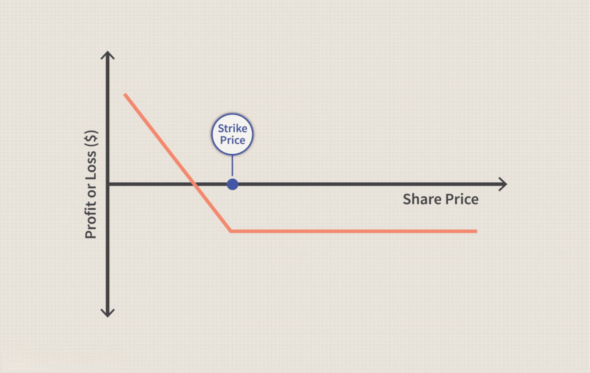

In today's dynamic investment landscape, bond options present a unique opportunity for investors to diversify their strategies. These financial instruments offer flexibility, allowing investors to manage risk more effectively by providing the right, but not the obligation, to buy or sell bonds at a predetermined price. This strategic advantage can be particularly beneficial in navigating volatile market conditions and adapting to fluctuations in interest rates. 

Bond options, including bond put options, play a significant role in both bond investing and algorithmic trading. A fundamental understanding of these options reveals their potential to enhance portfolio performance. By incorporating various bond options, investors can optimize their strategies to hedge against market volatility and interest rate changes, providing a versatile tool for risk management.



Bond options operate through a mechanism that is heavily influenced by factors such as interest rate trends, market volatility, and the issuer's creditworthiness. The types of bond options, including call and put options, cater to diverse investor needs and goals. This flexibility underscores the importance of bond options in strategic investing, allowing for tactical approaches tailored to specific market conditions.

Furthermore, the integration of algorithmic trading with bond options has revolutionized how these instruments are utilized in the market. By leveraging real-time data, algorithms can assess market conditions and execute trades that maximize returns while minimizing risk. This synergy between technology and financial strategy highlights the evolving landscape of bond investing.

As investors explore the intricacies of bond options, it is essential to weigh their potential benefits against the associated risks. Understanding this balance is crucial for making informed decisions and achieving financial objectives. With appropriate knowledge and strategies, bond options can serve as powerful tools in an investor's portfolio, offering opportunities for diversification and enhanced financial performance.

## Table of Contents

## Understanding Bond Options

Bond options are financial derivatives that grant the holder the right, but not the obligation, to buy or sell a bond at a predetermined strike price on or before a specified expiration date. These instruments are integral to the fixed-income market, providing investors with flexibility in response to changing market conditions. The valuation and utility of bond options are influenced by several key factors:

1. **Interest Rates**: Interest rates are a primary influence on bond option pricing. As interest rates rise, the price of existing bonds typically falls, making put options more valuable. Conversely, falling interest rates generally enhance the value of call options, as existing bonds with higher yields become more attractive.

2. **Market Volatility**: Volatility in the financial markets can significantly affect the pricing of bond options. Higher volatility increases the likelihood that an option will expire in-the-money. As a result, options on more volatile bonds or in more volatile markets typically command a higher premium.

3. **Issuer's Creditworthiness**: The credit quality of the bond issuer also plays a crucial role. Bonds issued by entities with lower credit ratings tend to have higher yields, reflecting higher risk. Options on these bonds may be priced differently compared to those on bonds with higher credit quality, factoring in the increased risk of default.

Different types of bond options cater to a variety of investor strategies. The two main categories are:

- **Call Options**: These provide the holder the right to purchase the underlying bond at the strike price before expiration. Investors might use call options to capitalize on anticipated decreases in interest rates or improvements in the issuer's credit profile.

- **Put Options**: These grant the holder the right to sell the underlying bond at a predetermined price. Put options can be useful for hedging against potential declines in bond prices due to rising interest rates or deteriorating credit conditions of the bond issuer.

In summary, bond options are versatile financial tools that respond to [interest rate](/wiki/interest-rate-trading-strategies) movements, market [volatility](/wiki/volatility-trading-strategies), and credit risk. Understanding these factors and the types of bond options available can help investors tailor their strategies to meet specific financial objectives in diverse market conditions.

## Mechanics of Bond Put Options

A bond put option grants the holder the right to sell a specific bond at a predetermined price, known as the strike price, before the option's expiration date. This mechanism provides investors with a means to protect themselves against potential declines in bond prices, a scenario typically prompted by rising interest rates or deteriorating creditworthiness of the bond issuer.

**Protection Against Rising Interest Rates and Credit Risk:**

Put options serve as an effective hedge by allowing investors to lock in a sale price, thus mitigating losses in a rising interest rate environment. As interest rates increase, bond prices generally decrease, which would otherwise result in capital losses for bondholders. Furthermore, if doubts arise regarding the issuer’s ability to meet its obligations, put options can serve as insurance against credit risk, allowing investors to sell their bonds before any default or downgrade materializes.

**Factors Affecting Put Option Pricing:**

Pricing of bond put options is subject to various factors. Key among these are:

1. **Interest Rates:** The level and volatility of interest rates significantly impact the intrinsic and time value of put options. Higher volatility can increase the option’s premium.

2. **Creditworthiness:** A deterioration in the issuer's credit rating can lead to higher premiums due to increased default risk.

3. **Time to Expiry:** Longer time to expiry generally results in a higher premium due to the greater uncertainty over a longer period.

4. **Underlying Bond's Price:** The closer the bond’s current price is to the strike price, the more valuable the put option could become, particularly as expiry approaches.

5. **Market Volatility:** High market volatility tends to increase the value of options, including puts, due to the greater likelihood of significant price movements.

**Potential Scenarios for Use:**

Investors can employ bond put options in various scenarios:

- **Interest Rate Hikes:** Investors anticipating rate hikes may use put options to safeguard their holdings from anticipated price declines.

- **Credit Concerns:** In situations where there is concern about a bond issuer’s financial stability, put options offer a mechanism to exit the position at a predetermined price.

- **Strategic Portfolio Adjustments:** When balancing a bond portfolio or shifting investment strategies, put options allow tactical exits without liquidating substantial holdings immediately.

In summary, bond put options are valuable tools for risk management and strategic positioning, allowing investors to navigate the uncertainties of bond price fluctuations and credit risks effectively.

## Investing in Bonds with Options

Integrating bond options into an investment strategy can effectively provide a hedge against market volatility, enabling investors to make tactical adjustments to their portfolios in response to fluctuating market conditions. One primary reason investors turn to bond options is their ability to offer downside protection while still allowing for potential upside gains.

Options allow investors to hedge against adverse market movements by providing the flexibility to exercise the option only if it proves financially beneficial. For example, in a scenario where interest rates are expected to rise—possibly leading to a decrease in bond prices—investors can leverage put options. A put option grants the holder the right to sell a bond at a predetermined price, effectively placing a floor on potential losses.

To maximize potential returns while managing risk in bond options trading, investors can employ several key tactics:

1. **Covered Call Writing**: This strategy involves holding a long position in a bond while simultaneously writing (selling) call options on the same security. This can generate additional income through the premium received from selling the call options. However, it also caps the potential upside if bond prices rise significantly.

2. **Protective Put**: Investors seeking to limit downside risk while holding a bond might purchase put options. This strategy, akin to an insurance policy, can be particularly beneficial in volatile markets by offering protection against falling bond prices.

3. **Straddles and Strangles**: These strategies involve purchasing both call and put options on the same bond with the same expiration date but possibly different strike prices. They are designed to profit from significant price movement in either direction, making them suitable for periods of expected high volatility.

4. **Spread Strategies**: By implementing spread strategies, investors can simultaneously buy and sell different options of the same class (calls or puts) on the same bond. This approach can help manage risk by limiting potential losses to the net premium paid while still capitalizing on favorable market conditions.

In Python, simulating these strategies can be a valuable way to understand potential outcomes. For instance, using libraries such as NumPy and pandas, investors can model option pricing and portfolio impacts under various market scenarios. 

Here is a simplified example demonstrating how Python can simulate the impact of a protective put strategy:

```python
import numpy as np

# Define bond price, put option strike price, option premium
bond_price = 100
strike_price = 95
option_premium = 2

# Simulate bond price changes
bond_price_changes = np.random.normal(0, 1, 1000)
final_bond_prices = bond_price + bond_price_changes

# Calculate payoff of protective put strategy
put_payoffs = np.maximum(strike_price - final_bond_prices, 0) - option_premium

# Calculate final portfolio value
final_portfolio_values = final_bond_prices + put_payoffs

expected_portfolio_value = np.mean(final_portfolio_values)
print(f"Expected final portfolio value: {expected_portfolio_value:.2f}")
```

In this example, you can adjust parameters such as the initial bond price, strike price, and option premium to explore the efficacy of the protective put strategy under different market conditions.

Integrating bond options into investment strategies thus provides a blend of defensive and aggressive tactics. By allowing adjustments to be made in response to market changes, investors are better equipped to stabilize returns and manage risks.

## Algorithmic Trading and Bond Options

Algorithmic trading utilizes computer algorithms to make automatic trading decisions that integrate market data and trading signals. These systems can leverage bond options to optimize trading strategies, analyzing real-time data and current market conditions to inform decision-making. The use of sophisticated algorithms allows traders to discover inefficiencies and implement strategies more systematically than traditional manual trading.

Algorithms assess the market using quantitative techniques like statistical [arbitrage](/wiki/arbitrage) and data mining to evaluate patterns and forecast price movements. In bond option trading, these algorithms analyze variables such as interest rate changes, volatility indices, and the issuer’s credit risk. For instance, algorithms might utilize the Black-Scholes model, among other derivatives pricing models, to calculate the theoretical price of bond options, incorporating variables like the underlying bond price, strike price, maturity, and volatility.

To illustrate, Python can be employed to perform such analyses. Using libraries like NumPy and SciPy, traders can model option pricing and test various trading strategies. Here's a simplified example of calculating a put option price using the Black-Scholes model in Python:

```python
import numpy as np
from scipy.stats import norm

def black_scholes_put(S, K, T, r, sigma):
    # S: current bond price
    # K: strike price
    # T: time to maturity
    # r: risk-free interest rate
    # sigma: volatility
    d1 = (np.log(S / K) + (r + 0.5 * sigma**2) * T) / (sigma * np.sqrt(T))
    d2 = d1 - sigma * np.sqrt(T)
    put_price = K * np.exp(-r * T) * norm.cdf(-d2) - S * norm.cdf(-d1)
    return put_price

# Example parameters
S = 100    # Current bond price
K = 95     # Strike price
T = 1      # Time to maturity (1 year)
r = 0.05   # Annual risk-free interest rate (5%)
sigma = 0.2 # Annual volatility (20%)

put_price = black_scholes_put(S, K, T, r, sigma)
print(f"Put option price: {put_price:.2f}")
```

The integration of [algorithmic trading](/wiki/algorithmic-trading) in bond markets offers numerous advantages. Algorithms can handle large volumes of trades at speeds impossible for human traders, increasing market efficiency. They help in managing order execution, reducing market impact, and improving [liquidity](/wiki/liquidity-risk-premium). Moreover, algorithmic systems can continuously monitor market conditions, adjusting strategies to optimize gains and minimize risks dynamically.

However, algorithmic trading in bond options comes with challenges and considerations. The complexity of bond derivatives and the multitude of influencing factors necessitate robust models and high-quality data inputs. Additionally, algorithmic strategies require careful monitoring to guard against systemic risks, such as flash crashes or unintended arbitrage opportunities. Moreover, regulatory considerations must be accounted for, as trading strategies need to comply with financial market regulations.

In conclusion, while algorithmic trading enhances the efficacy of bond option strategies, it requires a thorough understanding of both the technical and financial aspects involved. Investors leveraging algorithms must weigh the potential for enhanced returns against the risks of sophisticated trading systems.

## Risks and Benefits of Bond Options

Bond options, encompassing both call and put options, present investors with significant opportunities but also inherent risks. These financial derivatives grant rights without obligation, thus providing a flexible approach to bond market participation. However, the potential for high returns is accompanied by the need to navigate several risks, such as market volatility and counterparty risk.

One of the primary risks associated with bond options is market volatility. The value of bond options is significantly influenced by changes in interest rates, which are inherently volatile. Interest rate fluctuations can directly affect bond prices, thus impacting the value of the corresponding options. For instance, if interest rates rise, bond prices typically fall, which might result in a loss for a holder of a bond call option. Conversely, it could benefit a holder of a put option, providing a hedge against declining bond prices. Investors must keenly monitor interest rate movements and understand their implications on option pricing.

Counterparty risk is another crucial consideration in bond options trading. This risk arises when one party in the derivatives contract defaults, causing potential financial losses. To mitigate such risks, traders often use clearinghouses, which act as intermediaries to guarantee the performance of the parties involved in the derivatives contracts.

Balancing risk and reward is essential in bond options trading. Investors need to assess their risk tolerance and set appropriate strategies accordingly. They can employ various tools such as the Black-Scholes model or the binomial model to evaluate option pricing and anticipate market movements. For example, the Black-Scholes model can help determine the fair price of bond options by considering factors like interest rates, the bond's price, and the option's time to expiration.

A fundamental understanding of these concepts is pivotal for making informed investment decisions. Investors should consider employing stress testing and scenario analysis techniques to anticipate how different market conditions might impact their options positions. These approaches provide insights into the potential outcomes of different strategies and help in crafting a robust risk management plan.

Lastly, diversifying portfolios with bond options can offer a hedge against various financial risks. However, it requires a finely tuned strategy to capitalize on prospective benefits while managing potential downsides. Investors are encouraged to undertake detailed research and, if necessary, seek professional financial advice to navigate the complexities associated with trading bond options effectively.

## Conclusion: Mastering Bond Options

Bond options are intricate instruments within the financial markets that necessitate a comprehensive understanding of various elements influencing the bond market. These elements include interest rates, credit ratings, and general economic indicators. Successfully navigating bond options can empower investors to effectively hedge against volatility and achieve specific financial objectives.

Effective strategies can transform bond options into highly powerful tools for risk management and return optimization. For example, constructing a strategy that combines both bond call and put options can provide investors with flexibility in managing interest rate fluctuations and credit risk. By doing so, investors can better position their portfolios to respond to unexpected market shifts without significant downside exposure.

Given the inherent complexities of bond options, it is imperative for investors to acquire a profound grasp of the bond market's dynamics. This involves keeping abreast of interest rate trends, inflation forecasts, and changes in governmental or fiscal policies that may impact bond prices. Furthermore, recognizing the interplay between these factors can aid in predicting how bond options might behave under various scenarios.

Investors are strongly advised to expand their knowledge base through continuous education and by leveraging resources from financial literature and expert analyses. Additionally, consulting with financial advisors or professionals who specialize in derivatives can offer valuable insights. These professionals can provide tailored advice that aligns with an investor’s specific goals and risk tolerance.

In conclusion, while bond options can offer significant opportunities for financial growth and risk mitigation, they also come with challenges that require diligence, strategic thinking, and professional guidance. By mastering the complexities of bond options, investors can harness these instruments to effectively manage risk and enhance their financial portfolio.

## Frequently Asked Questions

### Frequently Asked Questions

**What are the key differences between bond options and stock options?**

Bond options and stock options are both derivative instruments but differ in their underlying assets. Bond options are linked to bonds, which are debt securities, while stock options are tied to equities. This fundamental difference influences their pricing and risks. Bond options' values are affected by interest rates, credit risk, and bond duration, whereas stock options' values are primarily driven by stock price volatility and market sentiment. Additionally, bond options often incorporate coupons and yield curves into their valuation, concepts generally absent in stock options.

**How do market conditions affect the pricing of bond put options?**

The pricing of bond put options is significantly influenced by interest rates, credit spreads, and general market volatility. An increase in interest rates typically leads to a rise in bond put option premiums since higher rates decrease bond prices, thereby increasing the value of the right to sell the bond at a predetermined price. The formula for option pricing, such as the Black-Scholes model modified for bonds, incorporates these factors:

$$
C = f(P, r, T, \sigma)
$$

where $P$ is the underlying bond price, $r$ is the interest rate, $T$ is the time to maturity, and $\sigma$ represents market volatility.

**Can bond options serve as a reliable hedge against rising interest rates?**

Yes, bond options, particularly put options, can be an effective hedge against rising interest rates. As interest rates climb, bond prices typically decline, so holding a put option on a bond allows investors to sell the bond at a pre-determined higher price, offsetting potential losses from interest rate increases. This makes bond put options a strategic tool for managing interest rate risk.

**How does algorithmic trading enhance the efficacy of bond option strategies?**

Algorithmic trading systems use advanced algorithms to evaluate vast amounts of market data in real time. In bond options trading, algorithms can integrate factors such as interest rate fluctuations, credit ratings, and economic indicators to optimize trading strategies. Here is an example of a simple Python program leveraging real-time data for decision-making in bond option strategies:

```python
import numpy as np

def calculate_option_price(bond_price, strike_price, time_to_maturity, interest_rate, volatility):
    # Simplified Black-Scholes formula for bond options
    d1 = (np.log(bond_price / strike_price) + (interest_rate + 0.5 * volatility**2) * time_to_maturity) / (volatility * np.sqrt(time_to_maturity))
    d2 = d1 - volatility * np.sqrt(time_to_maturity)
    put_price = strike_price * np.exp(-interest_rate * time_to_maturity) * norm.cdf(-d2) - bond_price * norm.cdf(-d1)
    return put_price

# Example usage with hypothetical data
bond_price = 100
strike_price = 95
time_to_maturity = 1
interest_rate = 0.05
volatility = 0.2

price = calculate_option_price(bond_price, strike_price, time_to_maturity, interest_rate, volatility)
print(f"Calculated bond put option price: {price}")
```

By using such strategies, algorithmic trading can enhance decision-making efficiency and precision in bond option markets.

## References & Further Reading

[1]: Fabozzi, F. J. (2005). ["The Handbook of Fixed Income Securities."](https://www.amazon.com/Handbook-Fixed-Income-Securities-Ninth/dp/1260473899) McGraw-Hill Education.

[2]: Hull, J. C. (2018). ["Options, Futures, and Other Derivatives."](https://www.semanticscholar.org/paper/Options%2C-Futures%2C-and-Other-Derivatives-Hull/89bdee500c8623864fc9eb7a471546aa713acc44) Pearson.

[3]: Black, F., & Scholes, M. (1973). ["The Pricing of Options and Corporate Liabilities."](https://www.cs.princeton.edu/courses/archive/fall09/cos323/papers/black_scholes73.pdf) Journal of Political Economy, 81(3), 637-654.

[4]: López de Prado, M. (2018). ["Advances in Financial Machine Learning."](https://www.amazon.com/Advances-Financial-Machine-Learning-Marcos/dp/1119482089) Wiley.

[5]: Chan, E. P. (2009). ["Quantitative Trading: How to Build Your Own Algorithmic Trading Business."](https://github.com/ftvision/quant_trading_echan_book) Wiley.