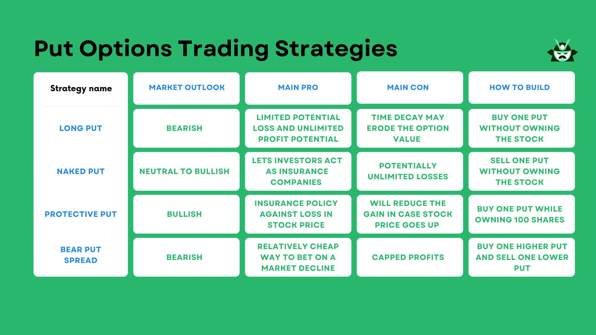

## Table of Contents

## What is a put option and how does it work?

A put option is a financial contract that gives you the right, but not the obligation, to sell a specific asset, like a stock, at a set price within a certain time. This set price is called the strike price. Imagine you own a stock and you think its price might go down. You can buy a put option to protect yourself. If the stock price does drop below the strike price, you can use the put option to sell the stock at the higher strike price, instead of the lower market price.

Here's how it works in practice: Let's say you buy a put option for XYZ stock with a strike price of $50, and it costs you $2 per share. If the stock price stays above $50, you don't have to do anything, and you just lose the $2 per share you paid for the option. But if the stock price drops to $40, you can use your put option to sell the stock at $50. So, you sell the stock at $50, even though it's only worth $40 on the market. After subtracting the $2 you paid for the option, you still come out ahead by $8 per share.

## What are the basic components of a put option?

A put option has a few key parts that you need to know about. The first is the strike price, which is the price at which you can sell the asset if you choose to use the option. If the market price of the asset falls below this strike price, you can sell it at the higher strike price, which can help you make money or reduce your losses. The second part is the expiration date, which is the last day you can use the option. After this date, the option is no longer valid, and you can't use it to sell the asset at the strike price.

The third part is the premium, which is the price you pay to buy the put option. This is like an insurance fee; you pay it upfront, and it's yours to keep, no matter what happens with the stock price. If the stock price stays above the strike price, you might lose the premium because you won't use the option. But if the stock price drops below the strike price, the premium can be a small price to pay for the chance to sell the stock at a higher price. These three parts—the strike price, the expiration date, and the premium—are the basic components of a put option.

## How can a beginner start trading put options?

If you're new to trading and want to start with put options, the first step is to open a brokerage account. You can do this online with many different brokers. Once your account is set up, you'll need to get approved for options trading. This usually involves filling out a form where you tell the broker about your experience and how much risk you're okay with. They'll look at this and decide if you can trade options.

After you're approved, you can start buying put options. Let's say you think a stock's price is going to go down. You can buy a put option for that stock. You'll need to pick the strike price, which is the price you can sell the stock at if you use the option, and the expiration date, which is when the option stops working. You'll also pay a premium, which is the cost of the option. If the stock price drops below the strike price before the expiration date, you can use the put option to sell the stock at the higher strike price and make some money. If the stock price stays above the strike price, you'll lose the premium you paid, but that's the risk you take when trading options.

## What are the risks associated with trading put options?

Trading put options can be risky. One big risk is losing the money you paid for the option, which is called the premium. If the stock price doesn't go below the strike price before the option expires, you won't use the option, and you'll lose the premium. It's like paying for insurance you never use. Another risk is that the stock price can drop a lot, and even if you use the put option, you might still lose money on the stock itself if you own it.

There's also something called "time decay" that can hurt your put options. As the expiration date gets closer, the value of the option goes down if the stock price doesn't move. This means you need the stock price to drop quickly enough to make up for the time decay. Lastly, using put options to bet on a stock price dropping can be risky because the stock might not go down as much or as fast as you think. If you're wrong, you could lose the money you spent on the option.

## What are the potential benefits of using put options in a trading strategy?

Using put options in a trading strategy can help you make money if you think a stock's price is going to go down. When you buy a put option, you get the right to sell the stock at a certain price, called the strike price, even if the market price drops lower. If the stock price does go down below the strike price, you can use the put option to sell the stock at the higher strike price and make a profit. This way, you can take advantage of falling stock prices without having to own the stock itself.

Put options can also act like insurance for stocks you already own. If you're worried that a stock you own might lose value, you can buy a put option as a safety net. If the stock price drops, the put option lets you sell the stock at the strike price, which can help you limit your losses. Even if the stock price stays the same or goes up, the most you can lose is the premium you paid for the put option. This can give you peace of mind and protect your investments from big drops in value.

## How do you calculate the profit and loss of a put option?

To figure out the profit or loss from a put option, you need to know the premium you paid for the option, the strike price, and the current market price of the stock. Let's say you bought a put option with a strike price of $50 for a premium of $2 per share. If the stock price drops to $40 before the option expires, you can use the put option to sell the stock at $50. So, you sell the stock for $50, but you paid $2 for the option, so your net profit is $50 - $40 - $2 = $8 per share.

On the other hand, if the stock price stays above $50, like at $55, you won't use the put option because you can sell the stock for more on the market. In this case, the put option expires worthless, and you lose the $2 per share premium you paid. So, the most you can lose with a put option is the premium you paid for it.

## What are some common strategies for trading put options?

One common strategy for trading put options is called "protective puts." Imagine you own a stock and you're worried it might lose value. You can buy a put option for that stock as a kind of insurance. If the stock price goes down, you can use the put option to sell the stock at the strike price, which helps you limit your losses. If the stock price stays the same or goes up, you just lose the premium you paid for the put option, but your stock is still safe.

Another strategy is "speculative puts," where you buy put options because you think a stock's price will go down. If you're right and the stock price drops below the strike price, you can use the put option to sell the stock at a higher price than it's worth on the market, and you make a profit. But if the stock price stays the same or goes up, you lose the money you paid for the put option. This strategy can be riskier because you're betting on the stock price going down, but it can also be rewarding if you guess right.

A third strategy is "put spreads," which involves buying and selling put options at different strike prices. For example, you might buy a put option with a higher strike price and sell a put option with a lower strike price. This can help you limit your risk because the premium you get from selling the lower strike put option can offset the cost of buying the higher strike put option. If the stock price falls between the two strike prices, you can make a profit, but if it falls below the lower strike price, your profit is capped.

## How does the time value and intrinsic value affect the price of a put option?

The price of a put option is made up of two parts: the intrinsic value and the time value. The intrinsic value is how much money you would make if you used the put option right now. It's the difference between the strike price and the current stock price, but only if the strike price is higher. If the stock price is $40 and the strike price is $50, the intrinsic value is $10 because you could sell the stock for $50 instead of $40. If the stock price is above the strike price, the intrinsic value is zero because you wouldn't use the option.

The time value is the other part of the put option's price. It's what you pay for the chance that the stock price might drop below the strike price before the option expires. The more time left until the option expires, the higher the time value, because there's more time for the stock price to move. As the expiration date gets closer, the time value goes down, a process called time decay. So, the total price of a put option is the sum of its intrinsic value and its time value. If the stock price is far above the strike price, the option's price is mostly time value. If the stock price is below the strike price, the option's price is mostly intrinsic value plus a little bit of time value.

## What is the impact of volatility on put option pricing?

Volatility is how much a stock's price goes up and down. When a stock is more volatile, it means its price can change a lot in a short time. This affects put options because the more a stock's price can move, the more valuable the put option can be. If a stock is very volatile, there's a bigger chance it could drop below the strike price of the put option before it expires. So, people are willing to pay more for the put option because it has a better chance of being useful.

The price of a put option goes up when the stock's [volatility](/wiki/volatility-trading-strategies) goes up. This is because the time value of the option, which is the part of the price that comes from the chance the stock price might move, gets bigger. Even if the stock price stays the same, a put option on a more volatile stock will cost more than one on a less volatile stock. This is why traders watch volatility closely when they're buying or selling put options.

## How can advanced traders use put options for hedging?

Advanced traders often use put options to hedge their investments, which means they use them to protect against losses. Imagine you own a lot of stock in a company, and you're worried that the stock price might go down. You can buy put options for that stock. If the stock price does drop, the put options let you sell the stock at a higher price than it's worth on the market. This can help you limit your losses and keep your investment safe. The put options act like insurance, and the premium you pay for them is like an insurance fee. If the stock price stays the same or goes up, you just lose the premium, but your stock is still safe.

Another way advanced traders use put options for hedging is by creating a "collar" strategy. This involves buying a put option to protect against a drop in the stock price and selling a call option to help pay for the put option. The call option gives someone else the right to buy your stock at a certain price, called the strike price, if the stock price goes up. By selling the call option, you get some money that can offset the cost of the put option. This strategy can help you protect your stock from big drops in value while also limiting how much you can make if the stock price goes up a lot. It's a way to balance risk and reward, and it's popular with traders who want to protect their investments without spending too much on insurance.

## What are the tax implications of trading put options?

When you trade put options, you need to think about taxes. If you make money from put options, you have to pay taxes on your profits. The tax rate depends on how long you held the option before selling it or letting it expire. If you held it for less than a year, the profit is taxed as short-term capital gains, which is the same as your regular income tax rate. If you held it for more than a year, it's taxed as long-term capital gains, which is usually lower than your regular income tax rate.

If you lose money on put options, you can use those losses to reduce your taxes. You can subtract your losses from your gains to lower your taxable income. This is called tax loss harvesting. But there are rules about how much you can deduct and when you can use these losses. It's a good idea to talk to a tax professional to make sure you're doing everything right and taking advantage of all the tax benefits you can.

## How can one use technical analysis to improve put option trading decisions?

Technical analysis can help you make better decisions when trading put options by looking at past stock prices and trading volumes to spot patterns. You can use tools like moving averages, which smooth out price changes over time, to see if a stock is trending up or down. If the stock's price is below its moving average, it might be a good time to buy a put option because the stock could keep going down. You can also use other tools like the Relative Strength Index (RSI) to see if a stock is overbought or oversold. If the RSI shows a stock is overbought, it might be ready to drop, which could be a good time to buy a put option.

Another way technical analysis can help is by looking at chart patterns. For example, if you see a "head and shoulders" pattern, it might mean the stock price is about to go down. This could be a signal to buy a put option. You can also use support and resistance levels to decide when to buy or sell. If a stock price breaks below a support level, it might keep falling, and that could be a good time to buy a put option. By using these technical analysis tools, you can make more informed decisions about when to buy put options and increase your chances of making a profit.

## What are the Mechanics of Put Options?

Put options are a critical component in options trading, representing a financial contract that gives the holder the right, but not the obligation, to sell an underlying asset at a specified price—the strike price—before a predetermined expiration date. This contrasts with call options, which confer the right to buy an underlying asset. Put options are primarily used for hedging against potential downturns in asset prices and for speculative purposes when investors anticipate a decline in market value.

In comparing put options with call options, put options provide a mechanism for benefiting from price declines. While call options are advantageous during bullish market expectations, put options are instrumental in bearish scenarios. For instance, if an investor holds a portfolio of stocks and anticipates a short-term decline in their value, purchasing put options can provide a form of insurance. If the stock price falls below the strike price, the investor can exercise the option, selling the stock at the higher, pre-determined price.

Several scenarios illustrate the strategic use of put options. Investors might employ put options as a hedge to protect against potential losses in an existing portfolio. This protective strategy is known as a "protective put" or a "married put". For example, if an investor owns shares in a company but fears potential short-term declines due to an upcoming earnings report, buying puts can mitigate losses. Additionally, traders may use put options to speculate on market downturns without the need to sell the underlying asset short, providing a limited-risk means to profit from decreases in asset prices.

The pricing of put options is influenced by several key factors: time value, intrinsic value, and volatility. The intrinsic value of a put option is calculated as the difference between the strike price and the current price of the underlying asset, assuming this results in a positive figure; otherwise, it is zero. The formula is:

$$
\text{Intrinsic Value} = \max(0, K - S)
$$

where $K$ is the strike price, and $S$ is the current stock price. Time value reflects the probability of an option gaining intrinsic value before expiration and diminishes as the expiration date approaches. This is often modeled using the Black-Scholes option pricing formula, which also factors in implied volatility—historical market fluctuations that affect the likelihood of price changes and thus option premiums.

Real-world applications of put options demonstrate their versatility. For instance, during the 2008 financial crisis, many investors utilized put options to hedge against significant market downturns, preserving capital during periods of severe volatility. More recently, during fluctuating market conditions induced by the COVID-19 pandemic, put options served as a risk management tool for those seeking to navigate uncertain market terrain.

Understanding the mechanics of put options and their role in modern finance enables investors to strategically apply them in both hedging and speculative endeavors, optimizing portfolio strategies across diverse market conditions.

## References & Further Reading

[1]: Black, F., & Scholes, M. (1973). ["The Pricing of Options and Corporate Liabilities."](https://www.cs.princeton.edu/courses/archive/fall09/cos323/papers/black_scholes73.pdf) Journal of Political Economy, 81(3), 637-654.

[2]: Hull, J.C. (2017). ["Options, Futures, and Other Derivatives"](https://books.google.com/books/about/Options_Futures_and_Other_Derivatives.html?id=yfr0DQAAQBAJ) (10th ed.). Pearson.

[3]: Aldridge, I. (2013). ["High-Frequency Trading: A Practical Guide to Algorithmic Strategies and Trading Systems"](https://www.amazon.com/High-Frequency-Trading-Practical-Algorithmic-Strategies/dp/1118343506) (2nd ed.). Wiley.

[4]: Chan, E. (2009). ["Quantitative Trading: How to Build Your Own Algorithmic Trading Business"](https://github.com/ftvision/quant_trading_echan_book). Wiley.

[5]: Lopez de Prado, M. (2018). ["Advances in Financial Machine Learning"](https://www.amazon.com/Advances-Financial-Machine-Learning-Marcos/dp/1119482089). Wiley.

[6]: McGowan, C., & Zhang, R. (2020). ["The Impact of Algorithmic Trading on the Stock Market and Its Ecosystem."](https://academic.oup.com/rcfs/article/9/3/593/5868419) Review of Finance, 24(6), 1215-1245.