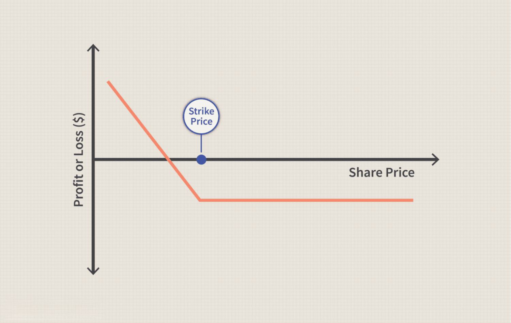

Understanding financial derivatives is essential for today's traders, with options trading being a pivotal part of this financial landscape. Options are complex financial instruments that offer traders the ability to secure rights to buy or sell underlying assets without the obligation to execute those rights. This flexibility can provide significant opportunities to capitalize on market fluctuations and mitigate risks inherent in volatile markets. Among the various types of options, put options stand out due to their unique strategic possibilities. They allow traders to benefit from declining asset prices or to hedge against potential market downturns, making them a valuable tool for risk management and speculation.

With the increased digitization of trading processes, the integration of algorithmic trading has further enhanced the capabilities and scope of options trading. Algorithms enable traders to adopt systematic, data-driven approaches, facilitating more precise trade execution and decision-making processes. By employing advanced computational techniques, algorithms assist in handling the fast-paced and complex demands of trading options, particularly put options, in today's financial markets.



In this article, we will explore the components of options trading, with a primary focus on the role and mechanics of put options. We will also discuss how algorithmic trading augments these processes, providing traders with refined tools to navigate and succeed in the financial derivatives landscape.

## Table of Contents

## Understanding Financial Derivatives: Options Trading

Options are a type of financial derivative that furnish traders with the right, but not the obligation, to buy or sell an underlying asset at a specified strike price before a set expiration date. This gives traders the flexibility to engage in market activities without committing to a transaction, allowing them to leverage price movements while controlling their exposure to risk. 

The contractual nature of options means they have clearly defined terms. The strike price is the agreed price at which the underlying asset can be bought or sold. The expiration date is the deadline by which the option must be exercised, or it will expire worthless. These defined parameters enable options to be used in various strategic capacities, predominantly for speculation and hedging. 

Speculation involves predicting market movements to profit from price fluctuations. Traders who speculate generally use options to gain from potential price changes of the underlying assets. On the other hand, hedging is employed as a risk management strategy, allowing investors to offset potential losses in their portfolios. Through options, traders can establish protective positions against adverse price movements, thereby stabilizing returns.

An essential tool in the valuation of options, especially European-style options, is the Black-Scholes model. Formulated by Fischer Black and Myron Scholes in 1973, this model offers a mathematically grounded method for calculating an option's theoretical price. The Black-Scholes formula is:

$$
C = S_0 N(d_1) - Xe^{-rT} N(d_2)
$$

Where:

- $C$ is the call option price.
- $S_0$ is the current price of the stock.
- $X$ is the strike price of the option.
- $r$ is the risk-free interest rate.
- $T$ is the time to expiration.
- $N$ is the cumulative distribution function of the standard normal distribution.
- $d_1$ and $d_2$ are calculated as:
$$
  d_1 = \frac{\ln(\frac{S_0}{X}) + (r + \frac{\sigma^2}{2})T}{\sigma\sqrt{T}}

$$
$$
  d_2 = d_1 - \sigma\sqrt{T}

$$

Understanding the intricacies of options trading involves grasping the mechanics of the market and employing effective strategies to manage positions. Traders must be adept at evaluating market conditions and implementing strategies congruent with their investment objectives and risk tolerance. Employing analytical tools and constantly educating oneself about market dynamics are critical components in achieving success in options trading.

## Put Options: Definition and Example

A put option represents a type of financial derivative that provides the holder with the right, though not the obligation, to sell a specific quantity of an underlying asset at a predetermined price, known as the strike price, before or at a specified expiration date. This characteristic differentiates put options from call options, which confer the right to buy the underlying asset.

The primary utility of put options lies in their ability to enable traders to capitalize on anticipated declines in the price of the underlying asset, without requiring ownership of the asset itself. By acquiring a put option, traders positions themselves to profit if the market price of the asset drops below the strike price; the potential for profit stems from the difference between the market price and the strike price, adjusted for the option premium paid.

Consider, for example, an investor who holds a bearish view on a stock presently trading at $50. The investor opts to purchase a put option with a strike price of $45, with an option premium of $2. If the stock price decreases to $40 prior to the option's expiration, the investor can exercise the option to sell the stock at the $45 strike price. Here, the profit is calculated as the difference between the strike price and current market price, minus the premium paid, resulting in a net profit of $45 - $40 - $2 = $3 per share. 

Put options, therefore, serve as a strategic tool for both speculative and hedging purposes, providing investors with a mechanism to offset potential portfolio losses in the event of declining asset prices.

## Algo Trading: Enhancing Options Trading

Algorithmic trading represents a cutting-edge method of executing and managing trades using sophisticated computer algorithms based on predefined rules and criteria. This technological advancement provides a distinct advantage in options trading markets due to their inherently fast-paced and complex nature.

Options trading demands rapid execution and precision because the value of options is highly time-sensitive. Algorithms facilitate timely trade execution, ensuring traders can capitalize on fleeting opportunities with minimal human intervention. By doing so, they help mitigate the risk of delays that can occur in manual trading processes. This efficiency is paramount, as even minor delays can significantly impact the profitability of trades in volatile markets.

Algorithmic trading enhances trading strategies by integrating systematic decision-making processes. These algorithms are designed to analyze vast amounts of data in real-time, allowing traders to adapt to changing market conditions quickly. The systematic approach helps traders implement strategies such as statistical [arbitrage](/wiki/arbitrage), market-making, and dynamic hedging with enhanced accuracy and speed.

A typical [algorithmic trading](/wiki/algorithmic-trading) system comprises several components, including market data feeds, trading signals, and execution management. The system continuously receives and processes data from multiple sources, generating trading signals based on the criteria set by the trader. These signals guide the execution of trades, ensuring that buy or sell orders are placed promptly and adjusted as market conditions evolve.

An example of a simple algorithmic trading strategy for options might involve the use of the Black-Scholes model to assess the fair price of options in real-time. The algorithm could be programmed to buy underpriced options and sell overpriced ones, executing trades automatically whenever predetermined conditions are met. 

Furthermore, algorithmic trading often incorporates [machine learning](/wiki/machine-learning) models to predict future market movements or optimize the existing strategies. These models can include regression analysis, decision trees, and neural networks, to name a few. As market data is continuously fed into these models, they learn and adapt, improving their predictive accuracy over time.

In conclusion, algorithmic trading significantly enhances options trading by offering the capability to execute trades with speed, precision, and systematic consistency. This integration of technology not only optimizes the implementation of various trading strategies but also positions traders to better manage the complexities and demands of modern financial markets.

## Benefits and Risks of Put Option Trading

Put options are financial instruments that offer traders significant flexibility in managing risk and capitalizing on bearish market movements. By providing the right to sell an asset at a predetermined price, put options allow investors to hedge against potential declines in asset values. This protective feature makes put options a vital component in the strategic toolkit of many traders and investors.

One of the primary benefits of put options is their ability to function as a protective hedge. For instance, if an investor holds a portfolio of stocks and anticipates a market downturn, they can purchase put options to mitigate potential losses. This strategy is akin to an insurance policy, where the cost of the option (premium) provides coverage against significant losses if the asset’s price falls below the strike price. This hedging ability is crucial for maintaining overall portfolio value and can be particularly beneficial in volatile markets.

Moreover, put options present opportunities for speculation based on anticipated downward price movements of an underlying asset. Traders speculating on market declines can leverage put options to profit without needing to short sell the asset directly. This indirect exposure allows for profit potential while minimizing the risks associated with short selling, such as margin calls and infinite losses.

However, put option trading is not devoid of risks. A key risk lies in the possibility of options expiring worthless. If the underlying asset's price does not decline below the strike price by the option’s expiration date, the investor loses the premium paid for the option. This risk of total premium loss necessitates careful consideration and analysis of market trends and asset performance before engaging in put option trades.

To quantify and manage these risks effectively, traders often employ option Greeks, such as Delta, which measures the sensitivity of the option’s price to changes in the price of the underlying asset. Other Greeks like Gamma, Theta, and Vega assist in evaluating second-order sensitivities, time decay, and [volatility](/wiki/volatility-trading-strategies) impacts, respectively. Together, these metrics enable traders to adjust their positions dynamically, thereby enhancing their risk management strategies.

In conclusion, while put options offer valuable strategic benefits for hedging and speculation, they also require careful management of potential risks. By understanding and leveraging financial metrics, traders can optimize their use of put options within their broader trading and investment objectives.

## Integrating Algorithmic Strategies in Put Option Trading

Algorithmic trading has revolutionized the approach to monitoring markets and capitalizing on trading opportunities, especially in options trading. In the context of put option trading, algorithmic strategies can systematically enhance the efficiency and execution of trades. The implementation of algorithms in trading put options facilitates the use of advanced strategies such as [statistical arbitrage](/wiki/statistical-arbitrage), [market making](/wiki/market-making), and dynamic hedging.

Statistical arbitrage involves exploiting price inefficiencies between a set of securities. When applied to put option trading, this technique identifies mispricing opportunities across different options or within the underlying assets, enabling traders to execute favorable trades based on statistical models. For instance, machine learning algorithms can be employed to predict price movements and identify arbitrage opportunities based on historical and real-time data.

Market making, another crucial algorithmic strategy, involves providing [liquidity](/wiki/liquidity-risk-premium) to the market by placing both buy and sell orders for options. Algorithms can assist market makers in optimizing their bid-ask spreads and managing risks, ensuring they capture the bid-ask spread profit while maintaining a balanced inventory. By automating order placement and dynamically adjusting to market conditions, algorithms help market makers respond more swiftly and effectively to changes in option prices.

Dynamic hedging offers another strategic advantage through algorithmic integration. This strategy involves adjusting a portfolio's options positions in response to changes in market conditions to maintain a desired risk profile. Algorithms facilitate the continuous recalibration of hedging strategies by processing vast amounts of market data to calculate real-time adjustments to options positions, thereby maintaining an optimal hedge ratio.

Back-testing is an integral element for refining algorithmic strategies. It involves running the algorithms on historical market data to evaluate their performance and make necessary adjustments before deploying them in live trading. Back-testing helps ensure that the strategies are robust and capable of performing effectively under different market conditions. In addition, real-time monitoring is essential for tracking the market and algorithm performance. It allows traders to make quick adjustments as required, thereby minimizing risks and maximizing returns.

In summary, integrating algorithmic strategies in put option trading provides traders with an automated, systematic approach to identifying and exploiting market opportunities. The application of statistical arbitrage, market making, and dynamic hedging, bolstered by back-testing and real-time monitoring, enhances the precision and efficacy of trading operations, ultimately leading to improved financial outcomes.

## Risk Management in Algo Options Trading

Effective risk management is paramount in algorithmic options trading, as it aids traders in navigating market volatility and minimizing potential losses. A key aspect of this involves the use of options Greeks—Delta, Gamma, Theta, and Vega—which serve as essential metrics for quantifying risk and enabling dynamic adjustments to trading positions.

Delta measures the sensitivity of an option's price to changes in the price of the underlying asset, essentially indicating how much the price of an option is expected to move for a $1 change in the price of the underlying asset. Gamma, on the other hand, is the rate of change of Delta itself, providing insight into how Delta will shift with fluctuations in the underlying price. This is crucial for re-hedging strategies where maintaining a neutral Delta is desired.

Theta represents the time decay of an option, quantifying how much the price of an option decreases as it approaches its expiration date. Vega assesses the sensitivity of an option's price to changes in the volatility of the underlying asset. High Vega values suggest significant potential for price changes with volatility shifts, necessitating careful consideration in turbulent markets.

Implementing stop-loss orders and automated trading pauses forms another layer of risk management. Stop-loss orders act as a safety measure, automatically executing a trade to mitigate losses when the price of an asset reaches a certain threshold. This prevents significant drawdowns which can be especially common in fast-moving markets. Automated trading pauses provide an opportunity to evaluate market conditions when certain parameters are met, such as excessive volatility or a sequence of losses, allowing traders to recalibrate their strategies based on fresh market insights.

Incorporating these elements into algorithmic strategies helps create a comprehensive risk management framework that is dynamic and adaptable to market conditions. Utilizing programming languages like Python can enhance these strategies through automation and efficient execution. Here is a simple Python example to calculate Delta of an option using the Black-Scholes model:

```python
from scipy.stats import norm
import numpy as np

def black_scholes_delta(S, K, T, r, sigma, option_type='call'):
    d1 = (np.log(S/K) + (r + 0.5 * sigma**2) * T) / (sigma * np.sqrt(T))
    if option_type == 'call':
        return norm.cdf(d1)
    elif option_type == 'put':
        return norm.cdf(d1) - 1

# Example usage
S = 100  # Underlying asset price
K = 100  # Strike price
T = 1    # Time to expiration in years
r = 0.05 # Risk-free interest rate
sigma = 0.2  # Volatility

delta_call = black_scholes_delta(S, K, T, r, sigma, option_type='call')
delta_put = black_scholes_delta(S, K, T, r, sigma, option_type='put')

print(f"Delta Call: {delta_call:.4f}")
print(f"Delta Put: {delta_put:.4f}")
```

This computational approach allows traders to efficiently determine the Delta of an option and supports the dynamic adjustment of trading strategies. By systematically integrating options Greeks and strategic trade management mechanisms such as stop-loss orders, traders can build a robust defense against the intricacies of algorithmic options trading.

## Conclusion

Options trading, with a focus on put options, offers traders robust instruments for both speculation and hedging. These financial derivatives grant the flexibility to capitalize on anticipated declines in asset prices while protecting portfolios from downward market movements. The unique ability to engage in these strategies without necessarily holding the underlying asset is a key advantage of put options. 

The integration of algorithmic trading into options trading processes significantly enhances the precision, speed, and efficiency of trade execution. Algorithms operate based on predefined criteria and leverage historical data alongside real-time market insights to optimize trading decisions. This systemic approach allows traders to react swiftly to market fluctuations, ensuring that trading strategies are consistently aligned with market conditions. 

Moreover, understanding the dynamics of derivatives is essential for effective trading, particularly when incorporating algorithmic strategies. A comprehensive grasp of models, such as the Black-Scholes model, which is crucial for options pricing, enhances the ability to forecast market trends and manage trades efficiently. 

Implementing robust risk management frameworks is indispensable for mitigating potential losses inherent in algorithmic options trading. Traders must utilize tools such as Options Greeks—Delta, Gamma, Theta, and Vega—to quantify risks and dynamically adjust positions accordingly. Additionally, incorporating stop-loss orders and automated trading pauses are integral components of a sturdy risk management strategy. 

In conclusion, a combined approach utilizing options and algorithmic trading enables traders to navigate volatile markets with greater confidence and precision. Mastering these elements—understanding derivatives, coupling strategies with technology, and applying solid risk management practices—ensures a well-rounded and effective approach to successful options trading.

## References & Further Reading

Henrique, B. M., Sobreiro, V. A., & Kimura, H. (2019). 'Literature review: Machine learning techniques applied to financial market prediction.' This article offers a comprehensive overview of the application of machine learning techniques in predicting financial markets, providing insights into how these technologies can enhance algorithmic trading strategies through improved predictive accuracy and decision-making processes.

Black, F., & Scholes, M. (1973). 'The Pricing of Options and Corporate Liabilities.' This seminal paper introduced the Black-Scholes model, a breakthrough in financial economics that for the first time provided a mathematical model for pricing European-style options. The Black-Scholes formula has become a cornerstone in the field of financial derivatives, allowing traders to determine theoretical prices and develop robust hedging strategies.

Wilmott, P., Howison, S., & Dewynne, J. (1995). 'The Mathematics of Financial Derivatives: A Student Introduction.' This text provides an accessible introduction to the mathematics underpinning financial derivatives, making complex concepts such as stochastic calculus and partial differential equations more approachable for students and practitioners aiming to understand financial models and tools like the Black-Scholes equation.

Hull, J. C. (2018). 'Options, Futures, and Other Derivatives.' Known as one of the most authoritative [books](/wiki/algo-trading-books) on derivatives, Hull's work covers a broad range of topics from fundamental concepts to complex derivatives trading strategies, including put options and algorithmic trading, providing practical insights through real-world examples and case studies.

Kissell, R. (2013). 'The Science of Algorithmic Trading and Portfolio Management.' This book investigates into the intricacies of algorithmic trading and portfolio management, offering detailed explanations of market microstructure, order formation strategies, and risk management. It emphasizes the role of algorithms in enhancing the efficiency and effectiveness of trading systems, particularly relevant for options trading in modern financial markets.

