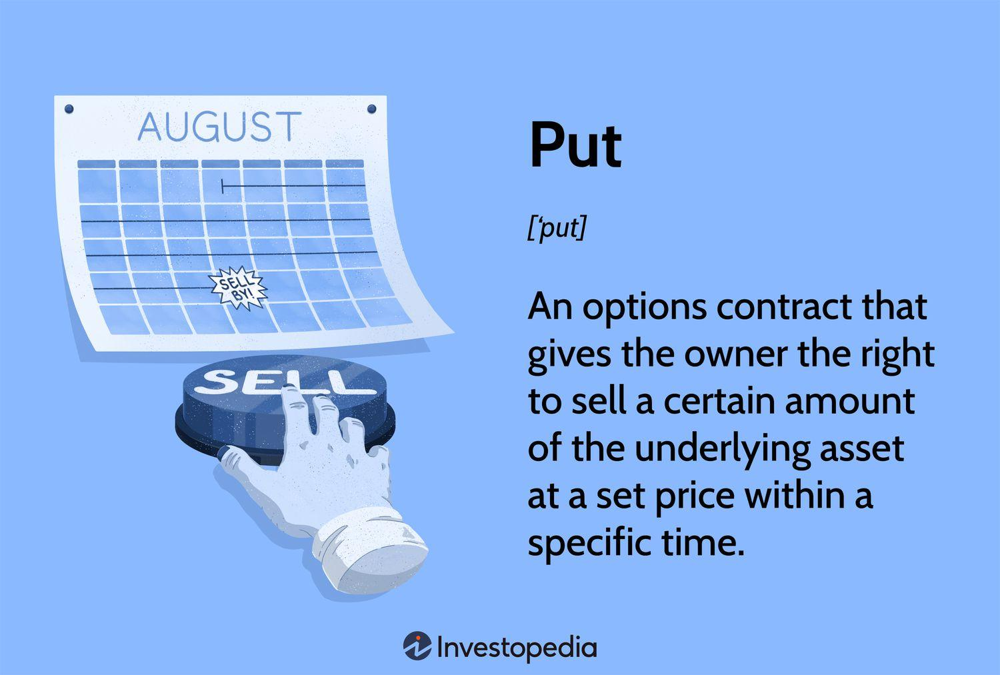

## Table of Contents

## What is a put option in investing?

A put option is a type of financial contract in investing that gives you the right, but not the obligation, to sell a specific asset, like a stock, at a set price before a certain date. Imagine you think a stock's price is going to drop. You can buy a put option to sell that stock at today's higher price, even if the stock's value goes down later. This can help you make money or protect other investments you own.

For example, if you buy a put option for a stock currently priced at $50, and the option lets you sell it at $50 in the next three months, you're set. If the stock falls to $40, you can still sell it at $50 using your put option, making a profit from the difference. But if the stock stays above $50, you don't have to use the option, and you only lose the cost of buying the option itself. It's like an insurance policy for your investments.

## How does a put option work?

A put option is like a special agreement that lets you sell something, like a stock, at a certain price before a specific time. Imagine you own a stock that's worth $100 right now. You think the price might go down soon, so you buy a put option. This option gives you the right to sell that stock at $100, even if the stock's price drops to $80 later. You only have to pay a small fee to get this option, which is much less than the stock's full price.

If the stock's price does drop below $100, you can use your put option to sell it at the higher price you locked in. This means you make money because you're selling it for more than it's currently worth. But if the stock stays above $100 or goes up, you don't have to use the option. You just lose the small fee you paid for it. It's kind of like buying insurance; you hope you don't need it, but it's there to protect you if things go wrong.

## What are the key components of a put option contract?

A put option contract has a few important parts that you need to know about. The first part is the strike price, which is the price at which you can sell the stock if you choose to use the option. For example, if the strike price is $50, you can sell the stock at $50 no matter what the current market price is. The second part is the expiration date, which tells you when the option will stop being valid. If you don't use the option by this date, it becomes worthless.

The third part is the premium, which is the price you pay to buy the put option. This is like an insurance fee; it's usually much smaller than the stock's price. The last part is the underlying asset, which is the stock or other thing that the option is based on. When you buy a put option, you're betting that the price of this asset will go down before the expiration date. If it does, you can make money by selling it at the higher strike price.

## Why would an investor buy a put option?

An investor might buy a put option if they think the price of a stock or other asset is going to go down. By buying a put option, they get the right to sell that asset at a set price, even if the market price drops lower. This can help them make money from the falling price. For example, if they buy a put option with a strike price of $50 and the stock falls to $40, they can sell it at $50 and make a profit from the difference.

Another reason to buy a put option is to protect other investments. Imagine an investor owns a stock they think might go down in value. They can buy a put option as a kind of insurance. If the stock's price does drop, the put option lets them sell it at a higher price than the market, reducing their losses. If the stock's price stays the same or goes up, they only lose the small fee they paid for the option, which is much less than losing money on the stock itself.

## What are the risks associated with buying put options?

Buying put options can be risky because you might lose the money you paid for the option if things don't go as planned. The price you pay for the option, called the premium, is like a bet that the stock's price will go down. If the stock's price stays the same or goes up instead, the put option becomes worthless when it expires, and you lose the premium you paid. It's like buying a lottery ticket; if you don't win, you lose what you spent on the ticket.

Another risk is that the stock might not fall as much as you expect, or it might not fall before the expiration date of the option. If the stock only drops a little bit, the profit you make from selling it at the strike price might not be enough to cover the cost of the premium. Plus, if the stock takes too long to drop, the option might expire before you can use it, leaving you with nothing. It's important to think carefully about these risks before buying a put option.

## How is the price of a put option determined?

The price of a put option, also known as the premium, is figured out by looking at a few important things. One big thing is how much the stock's price is expected to move around, which is called [volatility](/wiki/volatility-trading-strategies). If people think the stock's price might jump around a lot, the put option will cost more because it's riskier. Another thing is how much time is left until the option expires. The more time there is, the more the put option will cost because there's more chance for the stock's price to go down.

Another [factor](/wiki/factor-investing) is the difference between the stock's current price and the strike price of the option. If the strike price is a lot higher than the current stock price, the put option will be more valuable because it lets you sell the stock at a much better price. Also, interest rates and how much people expect the stock to pay out in dividends can affect the price of the put option. All these things together help decide how much you'll have to pay for a put option.

## What is the difference between an American and a European put option?

An American put option and a European put option are similar because they both give you the right to sell a stock at a certain price before a specific date. The big difference between them is when you can use the option. With an American put option, you can choose to sell the stock at any time before the option expires. This means if the stock's price drops a lot, you can quickly use your option to make money or protect your investment.

On the other hand, a European put option only lets you sell the stock on the expiration date, not before. This means you have to wait until the end to see if the stock's price has gone down enough for you to make a profit. Because of this difference, American put options can be more flexible and sometimes more valuable, but they might also cost more than European put options.

## Can you explain the concept of put option moneyness?

Put option moneyness is a way to describe how valuable a put option is right now compared to the stock's current price. It's like checking if your option is worth using at this moment. There are three main types of moneyness: in-the-money, at-the-money, and out-of-the-money. If your put option is in-the-money, it means the stock's price is below the strike price, so you could make money by selling the stock at the higher strike price right now. If it's at-the-money, the stock's price is the same as the strike price, so you wouldn't make or lose money if you used the option right away. And if it's out-of-the-money, the stock's price is above the strike price, so using the option now wouldn't help you.

Understanding moneyness helps you decide if it's a good time to use your put option or if you should wait. If your option is in-the-money, you might want to use it to make a profit, especially if you think the stock's price won't drop any further. But if it's out-of-the-money, you might hold onto it, hoping the stock's price will fall below the strike price before the option expires. Moneyness is a key thing to keep an eye on because it can change as the stock's price moves up and down.

## How can put options be used as a hedging strategy?

Put options can be used as a hedging strategy to protect other investments you own. Imagine you own a stock that you think might go down in value. To protect yourself, you can buy a put option for that stock. This put option gives you the right to sell the stock at a set price, even if the market price drops lower. By doing this, you're kind of buying insurance for your stock. If the stock's price does fall, you can use the put option to sell it at the higher price you locked in, which helps you avoid losing as much money.

For example, let's say you own a stock currently worth $100, and you're worried it might drop to $80. You can buy a put option with a strike price of $100. If the stock's price does go down to $80, you can use your put option to sell it at $100, saving yourself from a $20 loss per share. The cost of the put option is much smaller than the potential loss you're protecting against. If the stock's price stays the same or goes up, you only lose the small fee you paid for the option, but at least you had protection in case things went wrong.

## What are the tax implications of trading put options?

When you trade put options, you need to think about taxes. If you make money from selling a put option, that profit is usually treated as a capital gain. How much tax you pay depends on how long you held the option. If you held it for less than a year, it's a short-term capital gain, and you'll be taxed at your regular income tax rate. If you held it for more than a year, it's a long-term capital gain, and the tax rate is usually lower. But if you use put options to hedge other investments, the tax rules can get more complicated, and you might need to talk to a tax expert.

If you lose money on put options, you can use those losses to reduce your taxes. You can deduct these losses from your capital gains, which can lower the amount of tax you owe. If your losses are more than your gains, you can use up to $3,000 of those losses to reduce your regular income. Any extra losses can be carried over to future years to help with your taxes then. It's always a good idea to keep good records of your put option trades and talk to a tax professional to make sure you're doing everything right.

## How do advanced strategies like put spreads work?

A put spread is a way to use put options to make money or protect your investments, but with less risk than just buying a single put option. Imagine you think a stock's price is going to go down, but you don't want to spend a lot of money on a put option. You can do a put spread by buying one put option and selling another put option at the same time. The put option you buy has a higher strike price, and the one you sell has a lower strike price. This means you pay less for the whole strategy because the money you get from selling the second option helps cover the cost of the first one.

For example, let's say a stock is trading at $50. You buy a put option with a strike price of $50, which costs you $3. Then, you sell a put option with a strike price of $45, and you get $1 for that. So, your total cost for the put spread is $2 ($3 - $1). If the stock's price drops below $45, you can make money from the difference between the two strike prices, minus the $2 you spent. But if the stock's price stays above $50, you only lose the $2 you paid for the spread, which is less than if you had just bought the $50 put option by itself. Put spreads can help you manage risk and costs while still giving you a chance to profit from a falling stock price.

## What are some real-world examples of put option usage in major financial events?

During the 2008 financial crisis, many investors used put options to protect their investments. They were worried about big drops in the stock market, so they bought put options on major stock indexes like the S&P 500. If the market did fall, these put options let them sell their stocks at higher prices than the market was offering, which helped them avoid huge losses. This strategy was like buying insurance for their portfolios, and it turned out to be a smart move as the market did crash, causing many stock prices to plummet.

Another example happened during the GameStop stock frenzy in early 2021. Some investors bought put options on GameStop because they thought the stock's price was too high and would eventually fall. When the stock did start to drop after its big surge, those who held put options could sell the stock at much higher prices than it was trading at, making a profit. On the other hand, some big investors who had bet against GameStop by selling put options lost a lot of money when the stock's price unexpectedly soared due to a group of retail investors pushing it up.

## What is the understanding of financial derivatives in options trading?

Options are a type of financial derivative that furnish traders with the right, but not the obligation, to buy or sell an underlying asset at a specified strike price before a set expiration date. This gives traders the flexibility to engage in market activities without committing to a transaction, allowing them to leverage price movements while controlling their exposure to risk. 

The contractual nature of options means they have clearly defined terms. The strike price is the agreed price at which the underlying asset can be bought or sold. The expiration date is the deadline by which the option must be exercised, or it will expire worthless. These defined parameters enable options to be used in various strategic capacities, predominantly for speculation and hedging. 

Speculation involves predicting market movements to profit from price fluctuations. Traders who speculate generally use options to gain from potential price changes of the underlying assets. On the other hand, hedging is employed as a risk management strategy, allowing investors to offset potential losses in their portfolios. Through options, traders can establish protective positions against adverse price movements, thereby stabilizing returns.

An essential tool in the valuation of options, especially European-style options, is the Black-Scholes model. Formulated by Fischer Black and Myron Scholes in 1973, this model offers a mathematically grounded method for calculating an option's theoretical price. The Black-Scholes formula is:

$$
C = S_0 N(d_1) - Xe^{-rT} N(d_2)
$$

Where:

- $C$ is the call option price.
- $S_0$ is the current price of the stock.
- $X$ is the strike price of the option.
- $r$ is the risk-free interest rate.
- $T$ is the time to expiration.
- $N$ is the cumulative distribution function of the standard normal distribution.
- $d_1$ and $d_2$ are calculated as:
$$
  d_1 = \frac{\ln(\frac{S_0}{X}) + (r + \frac{\sigma^2}{2})T}{\sigma\sqrt{T}}

$$
$$
  d_2 = d_1 - \sigma\sqrt{T}

$$

Understanding the intricacies of options trading involves grasping the mechanics of the market and employing effective strategies to manage positions. Traders must be adept at evaluating market conditions and implementing strategies congruent with their investment objectives and risk tolerance. Employing analytical tools and constantly educating oneself about market dynamics are critical components in achieving success in options trading.

## References & Further Reading

Henrique, B. M., Sobreiro, V. A., & Kimura, H. (2019). 'Literature review: Machine learning techniques applied to financial market prediction.' This article offers a comprehensive overview of the application of [machine learning](/wiki/machine-learning) techniques in predicting financial markets, providing insights into how these technologies can enhance [algorithmic trading](/wiki/algorithmic-trading) strategies through improved predictive accuracy and decision-making processes.

Black, F., & Scholes, M. (1973). 'The Pricing of Options and Corporate Liabilities.' This seminal paper introduced the Black-Scholes model, a breakthrough in financial economics that for the first time provided a mathematical model for pricing European-style options. The Black-Scholes formula has become a cornerstone in the field of financial derivatives, allowing traders to determine theoretical prices and develop robust hedging strategies.

Wilmott, P., Howison, S., & Dewynne, J. (1995). 'The Mathematics of Financial Derivatives: A Student Introduction.' This text provides an accessible introduction to the mathematics underpinning financial derivatives, making complex concepts such as stochastic calculus and partial differential equations more approachable for students and practitioners aiming to understand financial models and tools like the Black-Scholes equation.

Hull, J. C. (2018). 'Options, Futures, and Other Derivatives.' Known as one of the most authoritative [books](/wiki/algo-trading-books) on derivatives, Hull's work covers a broad range of topics from fundamental concepts to complex derivatives trading strategies, including put options and algorithmic trading, providing practical insights through real-world examples and case studies.

Kissell, R. (2013). 'The Science of Algorithmic Trading and Portfolio Management.' This book investigates into the intricacies of algorithmic trading and portfolio management, offering detailed explanations of market microstructure, order formation strategies, and risk management. It emphasizes the role of algorithms in enhancing the efficiency and effectiveness of trading systems, particularly relevant for options trading in modern financial markets.

