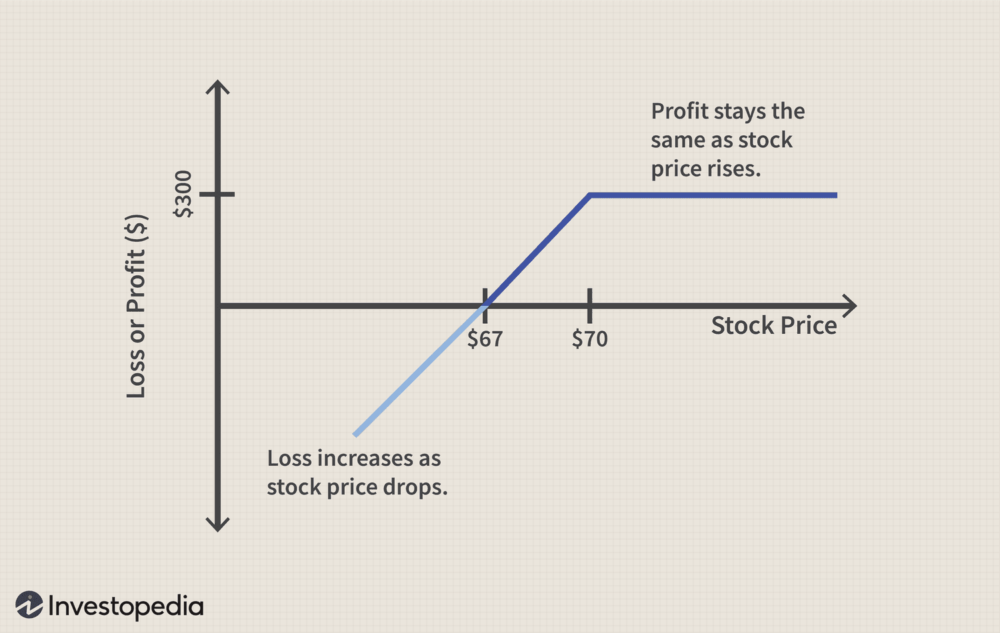

Understanding financial derivatives is crucial for both seasoned and novice traders, as these instruments offer a broad range of strategies for managing risk and generating income. Among financial derivatives, put options play a pivotal role in options trading, providing investors with unique opportunities to profit from expected market downturns. Specifically, a put option grants the holder the right, but not the obligation, to sell an underlying asset at a specified price before a certain expiration date. This property makes put options inherently valuable in bearish market conditions, where traders can benefit from declining asset prices.

The advent of option writing, the process of selling options contracts, has significantly influenced trading strategies. By writing put options, traders can earn premiums, offering a potential income stream. However, it is essential to recognize the inherent risks involved, particularly the obligation to buy the underlying asset if the option is exercised. This dual nature of income generation and risk exposure makes understanding option writing a vital aspect of options trading.



Moreover, the integration of algorithmic trading into the options market has transformed traditional trading approaches. Algorithmic trading involves using automated systems programmed to execute trades based on pre-defined criteria, enhancing the efficiency, precision, and speed of trading operations. The influence of algorithms minimizes emotional decision-making and biases, allowing traders to focus on data-driven strategies. This automated approach is particularly advantageous in managing the complexity of options trading, where market conditions can shift rapidly.

This article aims to explore the confluence of put options, option writing, and algorithmic trading, providing insights into how these elements can be effectively leveraged for income generation and risk management. By understanding and integrating these strategies, traders can navigate the dynamic landscape of financial markets with greater confidence and sophistication. Through this discussion, the article seeks to equip readers with the knowledge needed to harness the full potential of put options and algorithmic trading in building robust trading strategies.

## Table of Contents

## Understanding Put Options

A put option is a financial contract that provides the holder with the right, but not the obligation, to sell a specific quantity of an underlying asset at a predetermined price, known as the strike price, before or at the expiration date. This financial derivative becomes particularly valuable as the price of the underlying asset decreases, enabling the holder to sell the asset at a higher strike price while potentially repurchasing it at a lower market price. Consequently, the value of a put option rises inversely with the asset's price movement.

Investors employ put options for various strategic purposes. One primary usage is hedging, where the investor seeks to protect their portfolio from potential declines in asset prices. For example, an investor holding a portfolio of stocks may purchase put options to limit potential losses if the stock market experiences a downturn. This protective measure ensures that any depreciation in the portfolio's value can be offset by gains in the put options.

Put options are also utilized for speculative purposes, allowing investors to profit from anticipated declines in asset prices. Speculators may purchase put options if they believe a specific asset is poised for a decrease in value. If their prediction is accurate, the put option will gain in value, and they can sell the option at a profit or exercise it to benefit from the difference between the strike and market prices.

In volatile markets, the intrinsic value of put options is magnified. The intrinsic value is derived from the difference between the strike price and the current market price of the underlying asset, considering only scenarios where the option is "in the money"—when the strike price is above the prevailing market price. As [volatility](/wiki/volatility-trading-strategies) increases, the probability of a significant price movement rises, enhancing both the intrinsic and potential extrinsic value (time value) of put options. In summary, put options are integral tools for hedging and speculation, providing a versatile mechanism to manage risks and capitalize on downturns in asset prices.

## The Mechanics of Option Writing

Option writing is a fundamental aspect of options trading, particularly for traders seeking to generate income or acquire assets at more favorable prices. By selling options contracts—such as put options—traders receive a premium, which serves as payment for taking on the obligation associated with the contract. When a trader writes a put option, they agree to purchase the underlying asset at a predetermined strike price if the option holder exercises it. This obligation requires careful risk management as the market conditions can influence the profitability of the strategy. 

When implementing put option writing, the potential outcomes are governed by the relationship between the strike price and the market price of the underlying asset. If the asset's market value remains above the strike price, the option generally expires worthless, allowing the writer to retain the entire premium as profit. Such scenarios make put option writing an attractive strategy for income generation. However, the strategy becomes riskier if the market price falls below the strike price, as the writer might be obligated to purchase the asset at a higher than market value, leading to potentially significant losses.

The risk-reward dynamics of option writing are inherently asymmetric. The writer's maximum profit is limited to the premium received, whereas the potential loss is theoretically unlimited, as it depends on how far the asset's price falls below the strike price. Thus, it is crucial for option writers to employ robust risk management strategies and continually analyze market conditions to optimize their positions. 

Python can be a useful tool for modeling option writing scenarios and evaluating potential risks and returns. Below is a simple code snippet illustrating how the payoff of writing a put option can be calculated:

```python
def put_option_writer_payoff(stock_price, strike_price, premium):
    """Calculate the payoff for writing a put option."""
    if stock_price >= strike_price:
        return premium
    else:
        return premium - (strike_price - stock_price)

# Example usage:
premium_received = 5  # Premium received for writing the put option
strike_price = 100    # Strike price of the put option
market_prices = [110, 100, 90, 80]  # Various market prices of the underlying asset

payoffs = [put_option_writer_payoff(market_price, strike_price, premium_received) for market_price in market_prices]

# Display the payoffs
print(payoffs)
```

In this example, the function `put_option_writer_payoff` computes the financial outcome for a put option writer based on different market price scenarios. By inputting various stock prices, traders can visualize potential profits and losses, assisting them in making informed trading decisions.

Ultimately, successful option writing requires astute market analysis and risk management, ensuring strategies align well with the trader's financial objectives and risk tolerance.

 to Algorithmic Trading

Algorithmic trading, often referred to as algo trading, employs automated systems programmed with specific rules to execute trades efficiently and rapidly. These systems are crucial in the options market due to their ability to operate at speeds and precision beyond human capability. The core principle of [algorithmic trading](/wiki/algorithmic-trading) is to capitalize on computational algorithms that can process vast amounts of data, identify trading opportunities, and minimize the cost and timing of trading operations.

One of the primary advantages of algorithmic trading is efficiency. By automating the trading process, algorithms eliminate manual intervention, thereby reducing the likelihood of errors associated with human operation. This precision ensures that trades can be executed at optimal prices, maximizing potential returns or minimizing costs.

Moreover, algorithms enhance the speed of trading. In the fast-paced environment of financial markets, where prices can shift in milliseconds, the ability to execute orders instantaneously is a significant competitive edge. High-frequency trading ([HFT](/wiki/high-frequency-trading-strategies)), a subset of algorithmic trading, exemplifies this advantage by executing a large number of orders at extremely high speeds, often in fractions of a second.

Another vital aspect of algorithmic trading is its capacity to remove emotional and psychological biases from trading decisions. Human traders are prone to biases such as fear, overconfidence, or herd behavior, which can negatively impact trading outcomes. Algorithms, however, adhere strictly to their programming and make decisions based solely on data-driven insights. This objectivity can lead to more consistent and reliable trading performance.

The programming of an algorithmic trading strategy typically involves setting specific parameters and rules based on historical data and predictive models. For example, a simple moving average (SMA) crossover strategy, widely used in trading, can be implemented to automatically trigger buy and sell signals. In Python, such a strategy might look like this:

```python
import pandas as pd

# Sample data
data = pd.DataFrame({
    'price': [100, 102, 101, 104, 107, 103, 106, 108, 110, 109]
})

# Calculate moving averages
data['SMA_short'] = data['price'].rolling(window=3).mean()
data['SMA_long'] = data['price'].rolling(window=5).mean()

# Define buy and sell signals
data['signal'] = 0
data.loc[data['SMA_short'] > data['SMA_long'], 'signal'] = 1  # Buy signal
data.loc[data['SMA_short'] < data['SMA_long'], 'signal'] = -1 # Sell signal

# Display signals
print(data)
```

This example demonstrates how a trader can use historical price data to program rules that identify market trends, triggering trades automatically when certain conditions are met. Overall, the integration of algorithmic trading in the options market offers numerous benefits, including enhanced precision, speed, and impartiality. As the technology evolves, it will continue to redefine the landscape of modern trading strategies.

## Benefits and Risks of Put Option Trading

Put options provide a critical mechanism for investors to protect portfolios against adverse market movements and derive income through option writing. By holding a put option, an investor obtains the right, but not the obligation, to sell a particular asset at a specified strike price before the option expires. This right enables investors to hedge their portfolios by reducing exposure to potential declines in the market value of the underlying asset.

One significant benefit of put options is their capability to serve as an insurance policy against market downturns. Investors pay a premium for this protection, which can offset losses incurred in the broader market. In environments of heightened market volatility, the intrinsic value of put options can increase, providing a buffer against unfavorable price changes.

Beyond hedging, put options offer opportunities for income generation. Writing put options involves selling the option contract and receiving a premium, thus providing immediate income. This strategy can be particularly advantageous when investors anticipate that the underlying asset will remain stable or appreciate slightly. The received premium serves as the primary source of profit.

Despite their advantages, put options [carry](/wiki/carry-trading) associated risks. The foremost risk is the obligation to purchase the underlying asset at the strike price if the option is exercised. This scenario often occurs when the market value of the asset falls below the strike price, forcing the option writer to buy at a higher cost than the current market value. Consequently, understanding the market dynamics and setting appropriate strike prices is crucial to mitigating this risk.

Market volatility is another critical [factor](/wiki/factor-investing) affecting the success of put option strategies. High volatility can lead to significant fluctuations in option pricing, influencing both premiums received and potential obligations. It is essential for traders to carefully monitor volatility indices, such as the Cboe Volatility Index (VIX), to gauge the risk-reward balance effectively.

In conclusion, while put options provide valuable instruments for hedging and income, their inherent risks necessitate a thorough understanding of market behavior and volatility. Investors must weigh these factors when considering put options within broader portfolio management strategies.

## Integration of Algorithmic Strategies in Options Trading

Algorithmic strategies play a pivotal role in optimizing opportunities within put options trading. By systematically identifying patterns and inefficiencies, algorithms excel in executing trades with precision and speed that manual trading cannot match. These computerized systems are adept at managing massive data inputs, making them invaluable in the fast-paced environment of options trading.

One of the primary strategies employed through algorithmic trading is statistical [arbitrage](/wiki/arbitrage) (stat-arb). Statistical arbitrage involves identifying pricing discrepancies between functionally related financial instruments, such as equity pairs or options with similar characteristics. In the context of put options, algorithms can monitor a wide universe of option contracts to spot mispriced puts relative to their historical volatility or to other options in the chain. These discrepancies can then be exploited to capture profits when the prices eventually converge.

Dynamic hedging is another advanced algorithmic strategy that enhances options trading. It involves the continuous recalibration of positions to maintain a desired risk profile. For put options, dynamic hedging ensures that traders are not overexposed to adverse market movements by adjusting the hedge as the underlying asset's price changes. The algorithms can use complex mathematical models to recalibrate these positions, ensuring optimal hedge ratios and minimizing risk.

An essential component of implementing successful algorithmic strategies in put options trading is back-testing. Back-testing involves running the algorithm on historical data to evaluate its performance before deploying it in live trading. This process helps traders understand how their strategies would have fared under different market conditions, identify potential pitfalls, and refine logic for improved future performance. For example, a Python implementation for back-testing might involve using libraries such as Pandas for data manipulation and NumPy for mathematical operations. Here is a simple Python snippet to demonstrate a basic structure for back-testing a put option strategy:

```python
import pandas as pd
import numpy as np

# Load historical options data
data = pd.read_csv('historical_options_data.csv')

def calculate_profit_loss(option_data, strike_price, premium, market_price):
    """Calculates profit/loss for a put option strategy."""
    intrinsic_value = max(strike_price - market_price, 0)
    return intrinsic_value - premium

def back_test(data):
    results = []
    for index, row in data.iterrows():
        profit_loss = calculate_profit_loss(row, row['Strike'], row['Premium'], row['MarketPrice'])
        results.append(profit_loss)
    return np.mean(results), np.std(results)

# Execute back-testing
mean_return, risk = back_test(data)
print(f"Mean Return: {mean_return}, Risk (Standard Deviation): {risk}")
```

Algorithms not only enhance the precision of trade execution but also significantly bolster consistent strategy implementation, making them indispensable in modern options trading. However, it is crucial for traders to continually refine these algorithms to adapt to ever-changing market dynamics, ensuring sustained success in capturing opportunities within put options trading.

## Risk Management in Algo Options Trading

Risk management is a cornerstone of successful algorithmic options trading, particularly when dealing with put options. A key aspect of this approach involves the use of options Greeks—Delta, Gamma, Theta, and Vega—to assess and mitigate risk.

**Delta** measures the sensitivity of an option's price to a $1 change in the price of the underlying asset. For put options, Delta is negative, indicating that their value decreases as the underlying asset's price increases. In algorithmic trading, Delta can be used to construct a Delta-neutral portfolio, minimizing its sensitivity to underlying price movements and thereby reducing risk.

**Gamma** measures the rate of change of Delta with respect to changes in the underlying asset's price. A high Gamma value indicates substantial fluctuations in Delta as the underlying price changes, necessitating more frequent adjustments to maintain a neutral Delta. Algorithms can autonomously adjust positions in response to Gamma changes, thereby maintaining desired risk exposure.

**Theta** quantifies the sensitivity of an option’s price to the passage of time, commonly known as time decay. Put options lose value as expiration approaches if other factors remain constant. By employing algorithms, traders can manage Theta risk by scheduling strategic rollovers or designing time-decay-neutral strategies.

**Vega** measures an option’s sensitivity to changes in the volatility of the underlying asset. High Vega values mean the option price is more affected by changes in volatility. Algorithms can dynamically adjust positions based on real-time volatility data to manage Vega risk, ensuring that unexpected volatility doesn’t unduly impact the option's value.

Utilizing algorithms in options trading allows for the continuous recalibration of these Greeks. By executing trades based on preset conditions, such as maintaining a specific Delta neutrality or minimizing exposure to Vega fluctuations, algorithms can effectively manage risk in a highly dynamic market. The process generally involves coding complex strategies into the algorithm, which then executes trades based on data-driven insights, optimizing for factors such as risk-to-reward ratios while minimizing potential losses.

Here is a Python snippet illustrating a basic implementation to maintain a Delta-neutral position:

```python
def adjust_delta(current_delta, target_delta, option_price, asset_price):
    quantity_to_trade = (target_delta - current_delta) / option_price
    trade_value = quantity_to_trade * asset_price
    return quantity_to_trade, trade_value

# Example usage
current_delta = -0.25  # Current Delta value of the portfolio
target_delta = 0.0     # Target Delta neutrality
option_price = 2.0     # Price of the option
asset_price = 100.0    # Price of the underlying asset

quantity, value = adjust_delta(current_delta, target_delta, option_price, asset_price)
print(f"Trade {quantity} options for a total value of ${value}")
```

Such algorithmic systems not only enhance precision and speed but also help in maintaining a disciplined approach to risk management, free from emotional biases. This systematic approach ensures that traders are better positioned to respond to market shifts, safeguarding their investments against potential losses.

## Conclusion

Put options play a significant role in options trading, offering key strategic advantages for both hedging against market downturns and generating income. By granting the holder the right, but not the obligation, to sell an asset at a predetermined price, put options become valuable tools in volatile market conditions, allowing investors to protect their portfolio from losses. The intrinsic value of put options increases as the underlying asset price declines, making them particularly advantageous in bearish markets.

The incorporation of algorithmic trading into options strategies further enhances the effectiveness of these instruments. Automated systems executing trades based on preset conditions bring considerable efficiency, speed, and precision, vital in the dynamic environment of financial markets. By utilizing algorithmic trading, traders can limit emotional biases and adhere to data-driven decisions, improving the reliability of their strategies. Algorithms can systematically identify market opportunities and implement advanced strategies like [statistical arbitrage](/wiki/statistical-arbitrage) and dynamic hedging, which might be challenging to execute manually.

To fully benefit from put options and the advantages of algorithmic trading, it is essential for traders to possess a comprehensive understanding of both domains. This knowledge ensures that traders can effectively integrate algorithms into their options trading strategies, optimizing execution and enhancing risk management. By continually refining these strategies through back-testing and adaptation, traders can navigate the complexities of the market with greater confidence and potential for success.

## References & Further Reading

To deepen understanding of algorithmic trading and financial derivatives, numerous literature reviews and studies offer valuable insights. A foundational work is the Black-Scholes model, introduced in 1973 by Fischer Black and Myron Scholes, which provides a seminal framework for pricing options. The model is based on several assumptions, including the constant volatility of the underlying asset and the absence of arbitrage opportunities. The Black-Scholes formula for a European put option is given by:

$$
P = Xe^{-rT}N(-d_2) - S_0N(-d_1)
$$

where:
- $P$ is the put option price.
- $X$ is the strike price of the option.
- $r$ is the risk-free interest rate.
- $T$ is the time to expiration.
- $S_0$ is the current price of the stock.
- $N(\cdot)$ is the cumulative distribution function of the standard normal distribution.
- $d_1$ and $d_2$ are calculated as follows:

$$
d_1 = \frac{\ln(S_0/X) + (r + \sigma^2/2)T}{\sigma \sqrt{T}}
$$

$$
d_2 = d_1 - \sigma \sqrt{T}
$$

where $\sigma$ is the volatility of the underlying asset.

Further research into put options pricing encompasses statistical analyses that address variations in assumptions inherent in the Black-Scholes model, such as stochastic volatility and [interest rate](/wiki/interest-rate-trading-strategies) variations. These adjustments facilitate more accurate pricing in real-market conditions.

Algorithmic trading literature extensively examines the use of computational algorithms to implement trading strategies across various financial instruments, including options. Key texts investigate applications of statistical arbitrage, dynamic hedging strategies, and the utilization of [machine learning](/wiki/machine-learning) to enhance predictive performance. They emphasize the importance of back-testing and optimization to refine algorithms prior to live trading.

Continuous learning and adaptation are crucial in the ever-evolving landscape of options trading. It is important for traders to remain informed of cutting-edge research and technological advancements. This commitment enables the efficient integration of complex strategies tailored to current market environments, ultimately enhancing the potential for profitability and effective risk management.

For more information, consider the following resources:
- "Options, Futures, and Other Derivatives" by John C. Hull for an in-depth exploration of derivatives and the Black-Scholes model.
- "Algorithmic Trading: Winning Strategies and Their Rationale" by Ernie Chan, which offers practical insights into the development and application of trading algorithms.
- Academic journals such as the "Journal of Financial Economics" and "Quantitative Finance" regularly publish studies and reviews relevant to algorithmic trading and derivatives pricing.

