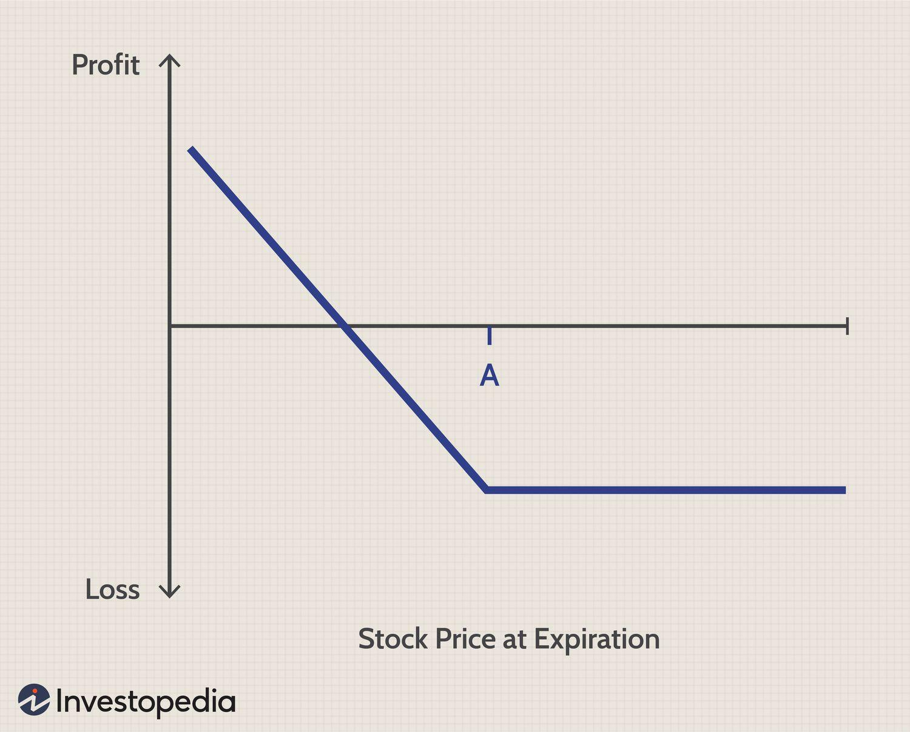

## Table of Contents

## What is a put option?

A put option is a type of contract in finance that gives you the right, but not the obligation, to sell a specific asset at a set price within a certain time period. The asset could be stocks, commodities, or other financial instruments. The set price is called the strike price, and the time period is known as the expiration date. You would buy a put option if you think the price of the asset will go down before the expiration date.

When you buy a put option, you pay a fee called a premium to the seller of the option. If the asset's price drops below the strike price before the expiration date, you can use the put option to sell the asset at the higher strike price, making a profit. If the asset's price stays above the strike price, you don't have to use the option, and you only lose the premium you paid. Put options are often used to protect against losses in investments or to speculate on price movements.

## How does a put option work?

A put option is like a contract that gives you the right to sell something at a certain price, called the strike price, before a specific date, known as the expiration date. Imagine you own a stock and you think its price might go down. You can buy a put option to protect yourself. If the stock's price does drop below the strike price, you can use the put option to sell the stock at the higher strike price, making a profit on the difference. If the stock's price stays above the strike price, you don't have to do anything, and you just lose the small fee, called the premium, that you paid for the option.

For example, let's say you own a stock that's currently worth $50, and you think it might fall. You buy a put option with a strike price of $45 for a premium of $2. If the stock falls to $40 before the expiration date, you can use your put option to sell the stock at $45, even though it's only worth $40 on the market. You make a profit of $3 per share ($45 strike price - $40 market price - $2 premium). If the stock stays above $45, you don't use the option and lose the $2 premium, but you still own the stock.

## What are the basic components of a put option?

A put option has a few key parts that you need to know. The first part is the strike price. This is the price at which you can sell the asset if you choose to use the option. It's like a set price that stays the same no matter what happens in the market. The second part is the expiration date. This is the last day you can use the option. After this date, the option is no longer valid.

The third part is the premium. This is the fee you pay to buy the put option. It's like the cost of having the right to sell the asset at the strike price. The premium is usually a small amount compared to the price of the asset. The last part is the underlying asset. This is what you can sell if you use the put option. It could be a stock, a commodity, or another financial product. Knowing these parts helps you understand how put options work and how they can be used.

## What is the difference between a put option and a call option?

A put option gives you the right to sell an asset at a certain price before a certain date. This is useful if you think the price of the asset will go down. For example, if you own a stock and think its value will drop, you can buy a put option to sell it at a higher price than the market value if it does fall. You pay a fee called a premium for this right, and if the stock stays above the set price, you lose only the premium.

A call option, on the other hand, gives you the right to buy an asset at a certain price before a certain date. This is helpful if you believe the price of the asset will go up. For instance, if you think a stock's price will rise, you can buy a call option to purchase it at a lower price than the market value if it does increase. Like a put option, you pay a premium for this right, and if the stock stays below the set price, you lose only the premium.

In short, a put option is about selling at a set price if the asset's value drops, while a call option is about buying at a set price if the asset's value rises. Both options help you manage risk and potentially make profits based on your predictions about future price movements.

## Who typically buys put options?

People who buy put options are often investors who want to protect their investments. They might own a stock and think its price will go down. By buying a put option, they can sell the stock at a higher price than the market if it does fall. This helps them avoid big losses. These investors use put options like insurance for their stocks, paying a small fee to keep their investments safe.

Others who buy put options are speculators. These are people who don't own the stock but think its price will drop. They buy put options to make money if their prediction is right. If the stock's price falls below the set price in the option, they can buy the stock at the lower market price and then use the option to sell it at the higher set price, making a profit. Speculators take bigger risks but can earn more if they guess the market correctly.

## What are the potential benefits of buying a put option?

Buying a put option can help you protect your investments. If you own a stock and think its price might go down, a put option lets you sell it at a higher price than the market. This way, you don't lose as much money if the stock's value drops. It's like having insurance for your stocks, where you pay a small fee, called a premium, to keep your investments safe. This can give you peace of mind and help you manage risk.

Another benefit is that you can make money if you think a stock's price will fall. Even if you don't own the stock, you can buy a put option and then buy the stock at a lower price if it drops. Then, you can use the option to sell it at the higher price set in the option, making a profit. This kind of trading can be risky, but if you guess the market right, you can earn a good return.

## What are the risks associated with put options?

Buying a put option comes with some risks. The biggest one is that you could lose the money you paid for the option, called the premium, if the stock price doesn't go down like you thought it would. If the stock stays above the strike price until the expiration date, the put option becomes worthless, and you lose what you paid for it. This can happen if you guessed wrong about the stock's future price.

Another risk is that the stock could drop, but not enough to make using the put option worthwhile. If the stock price falls just a little below the strike price, the profit you make from using the option might not be enough to cover the premium you paid. Also, if you're using put options to speculate, you're betting on the stock going down, which can be risky because predicting the market is hard. If you're wrong, you could lose money.

## How can put options be used for hedging?

Put options can be used for hedging to protect your investments from losing value. Imagine you own a stock that you think might go down in price. You can buy a put option for that stock, which gives you the right to sell it at a set price, even if the market price drops lower. This way, if the stock's value falls, you can still sell it at the higher set price and avoid big losses. The put option acts like insurance, where you pay a small fee, called a premium, to keep your investment safe.

For example, if you own 100 shares of a stock worth $50 each, and you think the price might drop, you can buy a put option with a strike price of $45. If the stock falls to $40, you can use the put option to sell your shares at $45, losing only $5 per share instead of $10. This helps you manage risk and gives you peace of mind. Even if the stock price stays above $45, you only lose the premium you paid for the put option, which is usually less than the potential loss if the stock had fallen.

## What is the 'put option premium' and how is it determined?

The put option premium is the fee you pay to buy a put option. It's like the cost of having the right to sell a stock at a set price if you want to. The premium is usually a small amount compared to the price of the stock. You pay it upfront when you buy the option, and it's yours to keep no matter what happens to the stock price.

The premium is determined by several things. One big [factor](/wiki/factor-investing) is how much the stock's price might move around, called volatility. If the stock is expected to move a lot, the premium will be higher because there's a bigger chance the option will be useful. Another factor is how long the option lasts. Longer time until the expiration date means a higher premium because there's more time for the stock price to change. The difference between the stock's current price and the strike price also matters. If the strike price is far below the current stock price, the premium will be lower because it's less likely you'll use the option. All these things together help decide what you'll pay for the put option.

## What strategies involve the use of put options?

One common strategy involving put options is called protective puts. Imagine you own a stock and you're worried its price might fall. You can buy a put option for that stock. This gives you the right to sell the stock at a set price, even if the market price drops lower. It's like insurance for your stock. If the stock's price goes down, you can use the put option to sell it at the higher set price, which helps you avoid big losses. If the stock price stays up, you just lose the small fee you paid for the put option.

Another strategy is called put buying for speculation. Here, you don't own the stock but think its price will drop. You buy a put option hoping to make money if your prediction is right. If the stock's price falls below the set price in the option, you can buy the stock at the lower market price and then use the option to sell it at the higher set price, making a profit. This can be risky because if the stock price stays above the set price, you lose the money you paid for the put option.

A third strategy is selling put options, also known as writing puts. In this case, you're the one selling the put option to someone else. You get paid the premium upfront, which is yours to keep no matter what. If the stock's price stays above the set price, the buyer won't use the option, and you keep the premium as profit. But if the stock's price falls below the set price, the buyer can use the option, and you have to buy the stock at the higher set price, which could lead to a loss if the market price is lower. This strategy can be used to earn extra income, but it comes with the risk of having to buy the stock at a higher price than it's worth.

## How do market conditions affect the pricing of put options?

Market conditions play a big role in deciding how much you pay for a put option. One key factor is how much the stock's price might move around, which we call volatility. If the stock is expected to swing a lot, the put option will cost more because there's a bigger chance it will be useful if the stock drops. Another thing that affects the price is the time left until the option expires. The longer you have until the expiration date, the more the put option will cost because there's more time for the stock's price to change. Also, the difference between the stock's current price and the strike price matters. If the strike price is much lower than where the stock is now, the put option will be cheaper because it's less likely you'll use it.

Interest rates and how the overall market is doing can also change the price of put options. When interest rates are high, put options might cost a bit more because it's more expensive to hold onto them. If the whole market is going down, put options can become more expensive because more people want to protect their investments or bet on the market falling. On the other hand, if the market is going up and everyone is feeling good about it, put options might be cheaper because fewer people are worried about their stocks losing value. All these things together help decide how much you'll pay for a put option.

## What advanced techniques can be used to manage a portfolio of put options?

One advanced technique to manage a portfolio of put options is called delta hedging. This means you try to balance your options so that changes in the stock's price don't affect your overall position too much. If you own put options, you can buy or sell the stock to make sure that if the stock's price goes down, the value of your options goes up just enough to keep your portfolio's value steady. It's like trying to keep your boat level in choppy waters by adjusting your sails. This can be a bit tricky because you need to keep an eye on the stock and make changes often, but it can help you manage risk better.

Another technique is called rolling options. This means you close out an existing put option and open a new one with a different expiration date or strike price. If you think the stock will keep going down, you might roll your put option to a later date to give it more time to be useful. Or, if the stock has already fallen a lot, you might roll to a lower strike price to make a bigger profit if it falls more. This can help you keep your strategy going and maybe make more money, but it also means you have to pay another premium for the new option, so it's important to think about the costs.

A third technique is using a put spread. This involves buying one put option and selling another one at a different strike price. For example, you could buy a put option with a strike price of $50 and sell one with a strike price of $45. This limits both your risk and your potential profit. If the stock falls below $45, your profit is capped at the difference between the two strike prices minus the net premium you paid. But if the stock stays above $50, you only lose the net premium. This can be a good way to manage risk while still having a chance to make some money if the stock goes down.

## What is Understanding Financial Derivatives: Options Trading?

Options are financial derivatives that provide traders the right, but not the obligation, to buy or sell an underlying asset. This contractual right allows traders to participate in the market with defined terms, specifically through the option's strike price and expiration date. The strike price is the predetermined price at which the underlying asset can be bought or sold, while the expiration date signifies the deadline by which the option must be exercised.

For instance, an option can represent a contract to buy or sell assets like stocks, commodities, or indices. This versatility makes options an attractive tool for various trading strategies. They allow traders to leverage positions, enhance returns, limit downside risks, and potentially benefit from movements in the underlying asset's price without necessity owning it outright.

Options trading serves strategic purposes including speculation, where traders attempt to profit from market movements by predicting future prices. Additionally, options are widely used for hedging, where traders aim to reduce potential losses from adverse price changes in their portfolios. This is achieved by offsetting potential risks associated with holding the underlying asset.

Mathematically, options pricing is influenced by several factors known as the "Greeks", which include Delta (Δ), Gamma (Γ), Theta (Θ), Vega (ν), and Rho (ρ). These metrics measure the option's sensitivity to various market parameters such as changes in the underlying asset's price, [volatility](/wiki/volatility-trading-strategies), time decay, and interest rates. 

The Black-Scholes model is a fundamental mathematical model used to calculate European options' pricing. The model's formula is:

$$
C(S, t) = N(d_1) S - N(d_2) Ke^{-r(T-t)}
$$

Where:
- $C$ is the call option price.
- $S$ is the current price of the underlying stock.
- $K$ is the strike price of the option.
- $r$ is the risk-free interest rate.
- $T$ is the time to expiration.
- $N$ is the cumulative distribution function of the standard normal distribution.
- $d_1$ and $d_2$ are intermediary calculations based on current market parameters.

Options trading requires an understanding of market mechanics and strategies to effectively manage positions and optimize potential returns or protection against market volatility.

## What are Put Options: Definition and Example?

A put option is a financial instrument that grants the holder the right, but not the obligation, to sell a specified asset at a predetermined price, known as the strike price, within a specific time frame. This financial derivative allows traders to profit from declines in the underlying asset's price without owning the asset itself. 

The intrinsic value of a put option increases as the price of the underlying asset decreases. This relationship results from the option's capacity to be sold at the strike price, which remains constant while the market value of the asset drops. The put option is, therefore, a strategic tool for investors who anticipate bearish market conditions. 

For example, consider an investor who predicts a decline in the market price of a particular stock, currently trading at $100. The investor may purchase a put option with a strike price of $95, expiring in three months, for a premium of $3 per share. If the stock price falls to $90 before expiration, the investor can exercise the put option, buying the stock at the market price of $90 and selling it at the strike price of $95, realizing a profit. The profit calculation can be represented as:

$$
\text{Profit} = (\text{Strike Price} - \text{Market Price} - \text{Premium}) \times \text{Number of Shares}
$$

In this scenario:

$$
\text{Profit} = (95 - 90 - 3) \times \text{Number of Shares} = 2 \times \text{Number of Shares}
$$

Thus, understanding and utilizing put options effectively can offer investors a method to capitalize on market downturns or protect against potential losses in their portfolios.

## How can algorithmic strategies be integrated into put option trading?

Algorithmic trading empowers traders to automate the monitoring of markets and identify trading opportunities in options seamlessly. By employing sophisticated computer programs, traders can execute trades based on pre-defined rules, enhancing both the efficiency and accuracy of put option strategies. Statistical [arbitrage](/wiki/arbitrage), [market making](/wiki/market-making), and dynamic hedging are prominent strategies that algorithms can implement to optimize trading outcomes.

Statistical arbitrage involves exploiting price differences between related securities or markets by using statistical models. In the context of put options, algorithms can detect deviations from historical price patterns and execute trades to profit from anticipated reversion to the mean. For instance, algorithms can analyze large datasets to identify correlations that indicate an options mispricing, enabling traders to act swiftly and effectively.

Market making, another strategy facilitated by [algorithmic trading](/wiki/algorithmic-trading), involves providing [liquidity](/wiki/liquidity-risk-premium) to the market by simultaneously offering to buy and sell options contracts. Algorithms can manage these dual positions, ensuring that the bid-ask spread is optimized while mitigating risk through rapid adjustment of positions based on market movements. This continuous arbitrage helps maintain liquid and efficient markets, benefiting traders by reducing transaction costs.

Dynamic hedging leverages algorithms to adjust option positions dynamically in response to changes in underlying asset prices, implied volatility, and other market conditions. By continuously recalculating the optimal hedge ratio and adjusting positions accordingly, traders can effectively manage risk and stabilize returns. The formula for the dynamic hedge ratio $\Delta$ uses the option's delta, which represents the sensitivity of an option's price relative to a $1 change in the price of the underlying asset: 

$$
\Delta = \frac{\partial \text{Option Price}}{\partial \text{Underlying Price}}
$$

Algorithms can adapt real-time inputs to maintain the desired delta exposure, automating decisions that would be impractical to make manually.

The utility of algorithmic trading in put option strategies is further enhanced by back-testing and real-time monitoring. Back-testing involves running algorithms on historical data to validate the effectiveness of strategies before deploying them in live markets. This process ensures that the strategies are robust and capable of delivering consistent performance under various market conditions.

Real-time monitoring allows traders to track market trends and algorithm performance instantaneously, providing a feedback loop to refine strategies dynamically. This capability is critical for adapting to evolving market environments and maintaining a competitive edge.

In summary, the integration of algorithmic strategies in put option trading enables traders to execute sophisticated strategies with precision and speed. Through automation, statistical models, and continuous monitoring, traders can harness these advanced tools to optimize their trades and manage risk effectively.

## References & Further Reading

[1]: Henrique, B. M., Sobreiro, V. A., & Kimura, H. (2019). ["Literature review: Machine learning techniques applied to financial market prediction."](https://www.semanticscholar.org/paper/Literature-review%3A-Machine-learning-techniques-to-Henrique-Sobreiro/ff46a9c93fe3a795b0d7360fdb370721c3315fce) Expert Systems with Applications, 124, 226-251.

[2]: Black, F., & Scholes, M. (1973). ["The Pricing of Options and Corporate Liabilities."](https://www.cs.princeton.edu/courses/archive/fall09/cos323/papers/black_scholes73.pdf) The Journal of Political Economy, 81(3), 637-654.

[3]: Wilmott, P., Howison, S., & Dewynne, J. (1995). ["The Mathematics of Financial Derivatives: A Student Introduction"](https://books.google.com/books/about/The_Mathematics_of_Financial_Derivatives.html?id=VYVhnC3fIVEC) Cambridge University Press.

[4]: Hull, J. C. (2018). ["Options, Futures, and Other Derivatives"](https://www.semanticscholar.org/paper/Options%2C-Futures%2C-and-Other-Derivatives-Hull/89bdee500c8623864fc9eb7a471546aa713acc44) 9th Edition. Pearson.

[5]: Kissell, R. (2013). ["The Science of Algorithmic Trading and Portfolio Management"](https://www.sciencedirect.com/book/9780124016897/the-science-of-algorithmic-trading-and-portfolio-management) Elsevier.