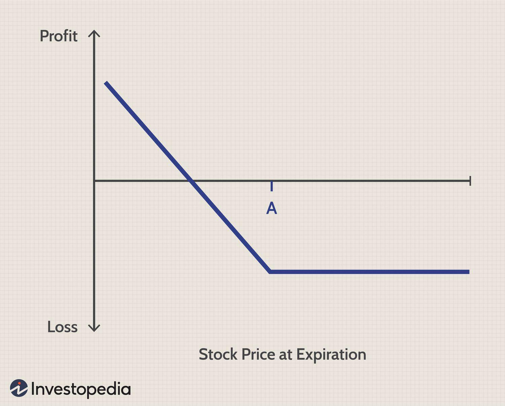

## Table of Contents

## What is a put option?

A put option is a type of financial contract that gives you the right, but not the obligation, to sell a specific asset, like a stock, at a set price before a certain date. Imagine you own a stock that's currently worth $50, and you think its price might drop. You can buy a put option with a strike price of $50. If the stock price falls below $50, you can use your put option to sell the stock at $50, even if the market price is lower.

For example, if the stock drops to $40, you can exercise your put option and sell it at $50, making a profit of $10 per share (minus the cost of the option). If the stock price stays above $50, you don't have to use the put option, and you only lose the money you paid for the option. Put options are useful for investors who want to protect their investments from falling prices or who think a stock's price will go down and want to make money from that drop.

## How does a put option work?

A put option is like a safety net for investors. It gives you the right to sell a stock at a certain price, called the strike price, before a specific date. Let's say you own a stock that's worth $100 now, but you're worried it might go down. You can buy a put option with a strike price of $100. If the stock price drops to $80, you can use your put option to sell the stock at $100, even though it's only worth $80 in the market. This way, you protect yourself from losing money.

On the other hand, if the stock price stays above $100, you don't have to use the put option. You just lose the money you paid for the option, which is called the premium. Buying a put option is like buying insurance for your stock. It costs you something upfront, but it can save you a lot if things go wrong. People use put options to protect their investments or to bet that a stock's price will go down, hoping to make money from the drop.

## What are the basic components of a put option?

A put option has a few key parts that you need to know. The first is the strike price. This is the price at which you can sell the stock if you use the put option. For example, if you have a put option with a strike price of $50, you can sell the stock at $50, even if it's worth less in the market. The second part is the expiration date. This is the last day you can use the put option. If the stock price hasn't dropped below the strike price by this date, the option becomes worthless.

The third part is the premium. This is the price you pay to buy the put option. It's like an insurance cost. If the stock price stays above the strike price, you lose the premium, but if the stock price falls, the premium can be a small price to pay for protecting your investment. The last part is the underlying asset. This is the stock or other asset that the put option is based on. When you buy a put option, you're betting on what will happen to the price of this asset.

## What is the difference between a put option and a call option?

A put option and a call option are both types of financial contracts, but they work in opposite ways. A put option gives you the right to sell a stock at a certain price before a specific date. It's like insurance for your stock. If you think the stock price will go down, you can buy a put option to protect yourself. If the stock price drops below the strike price, you can use the put option to sell the stock at the higher strike price, making a profit or reducing your loss.

On the other hand, a call option gives you the right to buy a stock at a certain price before a specific date. It's like a bet that the stock price will go up. If you think the stock price will rise, you can buy a call option. If the stock price goes above the strike price, you can use the call option to buy the stock at the lower strike price and then sell it at the higher market price, making a profit. Both put and call options have an expiration date and a premium you pay to buy the option, but they are used for different strategies based on what you think will happen to the stock price.

## Who typically buys put options?

People who buy put options are often investors who want to protect their stocks from losing value. Imagine you own a stock that's worth $100, but you're worried it might go down. You can buy a put option with a strike price of $100. If the stock price drops to $80, you can use the put option to sell the stock at $100, even though it's only worth $80 in the market. This way, you don't lose as much money. These investors are using put options like insurance to safeguard their investments.

Others who buy put options are people who think a stock's price will go down and want to make money from that drop. For example, if you believe a stock that's currently at $50 will fall to $40, you can buy a put option with a strike price of $50. If the stock does drop to $40, you can use the put option to sell the stock at $50, making a profit of $10 per share (minus the cost of the option). These investors are betting on the stock price falling and using put options to profit from their prediction.

## What are the potential benefits of buying put options?

Buying put options can help you protect your investments. If you own a stock and you're worried its price might go down, a put option acts like insurance. You pay a small fee, called a premium, to buy the put option. If the stock price does drop, you can use the put option to sell the stock at a higher price than the market value. This way, you don't lose as much money. It's like having a safety net that catches you if the stock price falls.

Put options can also be a way to make money if you think a stock's price will go down. If you believe a stock that's currently at $50 will drop to $40, you can buy a put option with a strike price of $50. If the stock does fall to $40, you can use the put option to sell the stock at $50, making a profit of $10 per share (minus the cost of the option). This means you can make money even when the market is going down, which can be a smart move if you think a stock is overvalued or if there's bad news about the company.

## What are the risks associated with put options?

Buying put options can be risky because you might lose the money you paid for the option, called the premium, if the stock price doesn't go down like you thought it would. The premium is like a fee you pay upfront, and if the stock stays above the strike price until the expiration date, the put option becomes worthless. You can't get that money back, so it's a risk you take when you buy a put option.

Another risk is that put options have an expiration date. If the stock price doesn't drop below the strike price before this date, you can't use the put option anymore. This means you need to be right about the timing of the stock price drop, not just the direction. If you're wrong about when the price will fall, you could lose the premium you paid for the option.

## How is the price of a put option determined?

The price of a put option, also called the premium, is based on a few important things. One is the difference between the current stock price and the strike price of the put option. If the stock price is a lot lower than the strike price, the put option is more valuable because it lets you sell the stock at a much higher price than it's worth now. Another thing that affects the price is how much time is left until the put option expires. The more time there is, the more valuable the put option can be because there's more chance for the stock price to drop below the strike price.

Other factors that influence the price of a put option include how much the stock price might change, called [volatility](/wiki/volatility-trading-strategies). If the stock price is expected to move a lot, the put option is more valuable because there's a higher chance the stock price will drop below the strike price. Interest rates and any dividends the stock might pay also play a role, but these are smaller factors compared to the others. All these things together help decide how much you have to pay for a put option.

## What is the break-even point for a put option?

The break-even point for a put option is the stock price where you neither make nor lose money after buying the option. To find this point, you start with the strike price of the put option and then subtract the premium you paid for the option. For example, if you bought a put option with a strike price of $50 and paid a premium of $2, your break-even point would be $48. This means the stock price needs to drop to $48 or lower for you to start making a profit when you use the put option.

If the stock price is above the break-even point at expiration, you will lose the money you paid for the premium. But if the stock price falls below the break-even point, you can use the put option to sell the stock at the strike price, making a profit. The difference between the strike price and the break-even point is what you need to cover the cost of the premium. So, understanding the break-even point helps you know how much the stock price needs to move for your put option to be profitable.

## How can put options be used for hedging?

Put options can be used for hedging to protect your investments from losing value. Imagine you own a stock that's worth $100, but you're worried it might go down. You can buy a put option with a strike price of $100. This put option acts like insurance for your stock. If the stock price does drop to $80, you can use the put option to sell the stock at $100, even though it's only worth $80 in the market. This way, you don't lose as much money. The cost of the put option, called the premium, is like an insurance fee you pay to protect your investment.

Hedging with put options is a common strategy for investors who want to limit their risk. If you think the stock market might go down but you don't want to sell your stocks, buying put options can help you sleep better at night. You know that even if the market falls, you can use the put options to sell your stocks at a set price. This way, you can keep your stocks and still be protected from big losses. It's a way to have your cake and eat it too, by balancing the potential for gains with protection against losses.

## What are some advanced strategies involving put options?

One advanced strategy involving put options is called a protective put. Imagine you own a stock and you're worried it might go down. You can buy a put option for that stock to protect yourself. This is like buying insurance for your stock. If the stock price drops, you can use the put option to sell the stock at a higher price than it's worth now. This way, you don't lose as much money. The cost of the put option, called the premium, is like the insurance fee. This strategy helps you keep your stock while limiting your risk if the stock price falls.

Another strategy is called a put spread. This involves buying one put option and selling another put option with a different strike price or expiration date. For example, you might buy a put option with a strike price of $50 and sell a put option with a strike price of $40. If the stock price drops below $50 but stays above $40, you can make money from the difference between the two strike prices. This strategy can help you make money if you think the stock price will go down, but it also limits your risk because you're selling one put option to offset the cost of buying the other.

A third strategy is called a married put. This is when you buy a stock and a put option at the same time. The put option acts like a safety net for the stock you just bought. If the stock price goes down right after you buy it, you can use the put option to sell the stock at a higher price than it's worth now. This strategy is useful if you want to own a stock but you're worried about short-term price drops. It's like buying the stock with a built-in insurance policy.

## How do taxes affect the profits from put options?

When you make money from put options, you have to pay taxes on your profits. The tax rate you pay depends on how long you held the put option before selling it or letting it expire. If you held the put option for less than a year, the profit is considered a short-term capital gain, and you'll pay your regular income tax rate on it. If you held it for more than a year, the profit is a long-term capital gain, and you'll pay a lower tax rate, usually between 0% and 20%, depending on your income.

Taxes can take a big bite out of your put option profits, so it's important to understand how they work. If you lose money on put options, you can use those losses to reduce your taxes. You can subtract your losses from your gains, and if you have more losses than gains, you can use up to $3,000 of those losses to lower your taxable income. Any losses beyond that can be carried over to future years. Keeping good records of your put option trades will help you figure out your taxes and make sure you're not paying more than you need to.

## References & Further Reading

[1]: Culp, C. L. (2010). ["The Risk Management Process: Business Strategy and Tactics."](https://www.wiley.com/en-us/The+Risk+Management+Process%3A+Business+Strategy+and+Tactics-p-9780471405542) Wiley.

[2]: Hull, J. C. (2017). ["Options, Futures, and Other Derivatives,"](https://www.semanticscholar.org/paper/Options%2C-Futures%2C-and-Other-Derivatives-Hull/89bdee500c8623864fc9eb7a471546aa713acc44) 10th Edition. Pearson.

[3]: Chan, E. P. (2009). ["Quantitative Trading: How to Build Your Own Algorithmic Trading Business."](https://github.com/ftvision/quant_trading_echan_book) Wiley.

[4]: Lopez de Prado, M. (2018). ["Advances in Financial Machine Learning."](https://www.amazon.com/Advances-Financial-Machine-Learning-Marcos/dp/1119482089) Wiley.

[5]: Black, F., & Scholes, M. (1973). ["The Pricing of Options and Corporate Liabilities."](https://www.cs.princeton.edu/courses/archive/fall09/cos323/papers/black_scholes73.pdf) Journal of Political Economy, 81(3), 637-654.

[6]: Jansen, S. (2020). ["Machine Learning for Algorithmic Trading: Predictive models to extract signals from market and alternative data for systematic trading strategies."](https://www.amazon.com/Machine-Learning-Algorithmic-Trading-alternative/dp/1839217715) Packt Publishing.