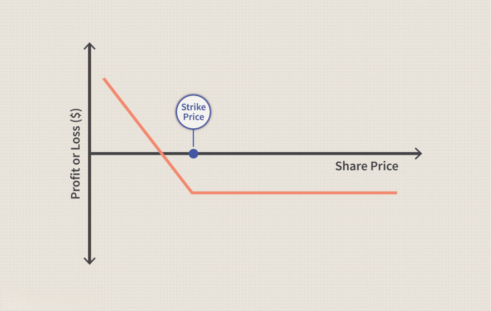

In today's fast-paced financial markets, investors have a plethora of options to choose from when it comes to investment strategies. As the trading landscape evolves, put options and algorithmic trading have garnered considerable attention due to their potential to enhance risk management and return optimization.

Put options, a type of financial derivative, grant investors the right, though not the obligation, to sell an underlying asset at a predetermined price. This mechanism serves as a protective measure against adverse price movements, effectively setting a minimum value for the asset. The use of put options as a risk mitigation tool has become increasingly prevalent, allowing investors to safeguard their portfolios from market volatility.



Simultaneously, algorithmic trading has revolutionized the way trades are executed. By utilizing advanced algorithms, trading decisions are made swiftly and systematically based on predefined criteria. This approach minimizes human error and emotional biases, enabling more precise execution of trading strategies. The integration of algorithmic trading with put options strategies presents a compelling synergy, where technology-driven insights can enhance decision-making processes.

This article aims to provide an in-depth examination of these investment strategies, emphasizing the utility of put options for hedging risks and the role of algorithmic trading in optimizing these strategies. By exploring these elements, readers will gain a comprehensive understanding of how these approaches are interconnected, offering valuable insights into modern trading methodologies.

## Table of Contents

## Understanding Put Options

Put options are a type of financial derivative that grants the holder the right, but not the obligation, to sell an underlying asset at a predetermined price, referred to as the strike price, on or before a specified expiration date. These instruments are primarily used as a means of hedging against potential declines in the asset's market value. By securing a guaranteed selling price for the asset, put options serve as a form of insurance for investors, setting a floor and thereby limiting potential losses.

The key components of a put option contract are the strike price, expiration date, and the underlying asset. The strike price is the set price at which the option holder can sell the asset. The expiration date determines the time frame within which the holder can exercise the option. The underlying asset is the item being traded, typically stocks, indices, or commodities.

Understanding the cost structure of put options is crucial for investors. The cost of a put option, known as the premium, is influenced by several factors, with [volatility](/wiki/volatility-trading-strategies) being a primary determinant. The higher the volatility of the underlying asset, the greater the likelihood of substantial price movements, which increases the option's premium. The relationship between the option's price and its factors can be estimated using the Black-Scholes model or the binomial options pricing model.

To further illustrate, assume an investor owns shares in a company and is concerned about potential short-term price declines. By purchasing a put option, they can secure the right to sell their shares at the strike price, even if the market price drops significantly. This strategy allows the investor to limit their potential losses while still retaining the upside potential if the share price increases.

In summary, put options provide essential tools for risk management in financial markets. They enable investors to protect their assets against adverse price movements while offering flexibility and strategic opportunities to optimize portfolio performance.

## Investment Strategies Involving Put Options

Investment strategies involving put options play a crucial role in managing portfolio risks and optimizing returns in fluctuating market conditions. One basic yet effective approach is the protective put strategy, where an investor purchases put options for stocks they already own. This strategy acts as a safety net, providing a predefined floor price for the stock, hence guarding against potential declines. For example, if an investor owns 100 shares of a stock currently priced at $50 and buys a put option with a strike price of $45, they are guaranteed to sell the stock at $45, even if the market price falls below this level, minus the cost of the premium paid for the option.

Beyond individual stock protection, advanced strategies such as put spreads and calendar spreads offer ways to optimize costs while retaining downside protection. A put spread involves buying and selling put options with different strike prices or expiration dates. This reduces the net premium paid but limits the potential benefit of the downside protection. Calendar spreads involve executing puts with the same strike price but different expiration dates to capitalize on differing volatility expectations over time.

Investors can also employ put options on index funds, offering a broad spectrum of market protection against systemic risks. This application becomes particularly useful during widespread market downturns, where single stock movements are insufficient for risk mitigation. By using index put options, investors can hedge their portfolio against overarching economic challenges that affect the entire market.

These strategies enable investors not only to mitigate potential losses during market downturns but also to strategically position themselves to profit from such movements. By effectively leveraging put options, traders can ensure a balanced approach to risk management and return optimization, maintaining the flexibility to adapt to market dynamics.

## Algorithmic Trading: A Game Changer

Algorithmic trading integrates financial markets with advanced technology to execute trades automatically based on pre-established criteria, streamlining the trading process. This method enables rapid decision-making, minimizing the psychological and emotional factors that often affect human traders. By implementing algorithmic systems, investors can adhere to their predefined strategies consistently, ensuring that their trading objectives are met even under volatile market conditions.

One significant advantage of [algorithmic trading](/wiki/algorithmic-trading) is its capacity to execute complex trading strategies such as volatility [arbitrage](/wiki/arbitrage). Volatility arbitrage exploits the discrepancy between an asset's implied volatility and its expected future volatility. Algorithms can efficiently identify and execute trades that take advantage of these disparities, optimizing both the timing and execution of these trades to maximize returns.

Furthermore, using automation allows traders to quickly respond to rapid market movements, thus optimizing their risk management processes. Algorithms can monitor multiple markets simultaneously and react quicker than human traders, enabling the capture of transient opportunities that may arise in high-speed trading environments. This capability is particularly beneficial in markets where prices are affected by frequent news releases or other rapid changes in market dynamics.

Python is a popular programming language for developing algorithmic trading strategies due to its extensive array of libraries and tools. For instance, using libraries such as `pandas` for data manipulation and `NumPy` for numerical calculations allows for robust and flexible development of trading algorithms. Here’s a simple demonstration of how one might use Python to implement a basic moving average crossover strategy, a common algorithmic trading technique:

```python
import pandas as pd
import numpy as np

# Sample data: prices is a DataFrame with historical price data
prices = pd.DataFrame(data={'Close': [100, 102, 101, 105, 107, 103, 106, 108]})

# Calculate short and long moving averages
short_window = 3
long_window = 5

prices['Short_MA'] = prices['Close'].rolling(window=short_window).mean()
prices['Long_MA'] = prices['Close'].rolling(window=long_window).mean()

# Generate buy/sell signals
prices['Signal'] = np.where(prices['Short_MA'] > prices['Long_MA'], 1.0, 0.0)

# Calculate trading positions
prices['Position'] = prices['Signal'].diff()

print(prices)
```

This example demonstrates automating a trading strategy where buy and sell signals are generated based on the crossover between short-term and long-term moving averages of an asset's price. While simplistic, this illustrates the fundamental structure of many algorithmic trading strategies, showcasing the potential to eliminate human error and biases while capitalizing on systematic approaches to trading. As technology advances, the scope for implementing increasingly intricate strategies grows, making algorithmic trading a transformative force in modern finance.

## The Role of Algo Trading in Put Options Strategies

Algorithms occupy a pivotal role in executing put options strategies by deploying real-time data analytics to inform trading decisions. This integration of technology and finance allows for sophisticated and efficient strategies that maximize investment outcomes.

One significant advantage of algorithmic trading is its capability for dynamic hedging, which involves automatically adjusting option portfolios in response to market shifts. This agility helps mitigate risks associated with market volatility, ensuring that the portfolio maintains optimal protection. By automating the hedging process, algorithms eliminate delays in decision-making that often arise from human intervention.

Moreover, algorithmic trading systems excel at handling vast datasets. This capacity allows traders to engage in back-testing, a process where strategies are tested against historical data to evaluate their effectiveness. Python is a highly useful tool for such operations. For instance, Python libraries like NumPy and pandas can be employed to analyze stock prices and market conditions, while libraries such as Backtrader can simulate an entire trading strategy.

```python
import pandas as pd
import numpy as np
import backtrader as bt

# Sample code for back-testing a put option strategy
class PutOptionStrategy(bt.Strategy):
    def __init__(self):
        self.dataclose = self.datas[0].close

    def next(self):
        # Hypothetical rule: if stock price is below a certain level, consider buying a put option
        if self.dataclose[0] < np.mean(self.dataclose):
            print(f"Considering put option at {self.dataclose[0]}")
```

Efficiency in execution is another key benefit provided by algorithms. Trades are executed with high precision and at speeds unattainable by human traders, leading to improved accuracy and enhanced risk management. Complex strategies such as volatility arbitrage can thus be implemented reliably and effectively, optimizing portfolio performance.

In summary, algorithmic trading advances the efficiency of put options strategies by incorporating real-time analytics, facilitating agile portfolio adjustments, and supporting robust back-testing and execution processes. These capabilities enable more sophisticated tactical maneuvers within financial markets, offering improved risk management and potentially greater returns.

## Challenges and Risks

Despite the significant advantages offered by algorithmic trading, there are inherent challenges and risks that market participants must address. One prominent challenge is the susceptibility to technical glitches. These glitches can arise from software bugs, network failures, or latency issues, potentially leading to erroneous trades or missed opportunities. For instance, a delay in executing a trade due to connectivity issues can result in unfavorable buying or selling conditions, impacting profitability.

Market unpredictability adds another layer of complexity to algorithmic trading. Although algorithms are designed to respond to specific patterns and conditions, unexpected market events can lead to significant deviations from expected results. Events such as geopolitical tensions or sudden economic announcements can trigger volatile market movements that algorithms may not be equipped to handle adaptively. This unpredictability also affects the pricing and effectiveness of put options.

Put options serve as a valuable tool for hedging against price declines, but they come with their own set of challenges. A critical risk is that a put option can expire worthless if the underlying asset's price remains above the strike price. Traders thus face the cost of the option premium without any hedging benefit if market conditions do not favor their position.

To effectively analyze and manage these complexities, traders often utilize option Greeks, which provide insights into the sensitivity of the option's price to various factors. The Greeks include:

- **Delta (Δ)**: Measures the rate of change of the option's price with respect to changes in the underlying asset's price.
- **Gamma (Γ)**: Represents the rate of change of Delta with respect to changes in the underlying asset's price, indicating how Delta will vary as the underlying price changes.
- **Theta (Θ)**: Reflects the rate of change of the option's price with the passage of time, commonly known as the time decay of the option.
- **Vega (ν)**: Quantifies the option's sensitivity to changes in the volatility of the underlying asset.

Considering these risks, effective risk management becomes paramount. This involves constant monitoring of both market conditions and the technical performance of trading systems. Traders need to ensure that their algorithms are robust and capable of adapting to rapid market changes. Additionally, maintaining backup systems and rigorous testing of trading strategies can help mitigate the impact of technical failures.

Ultimately, while put options and algorithmic trading provide numerous benefits, successfully navigating their challenges requires diligence and a comprehensive understanding of the underlying risks.

## Conclusion

Investors using put options and algorithmic trading can significantly optimize their portfolios by effectively mitigating risks while enhancing potential returns. These strategies have become essential components of contemporary trading, offering structured ways to navigate the complexities of volatile markets. The integration of these approaches allows for a strategic balance between risk management and return optimization, which is crucial for maintaining portfolio stability.

Understanding how these strategies intersect empowers traders to make informed decisions rooted in quantitative analysis and real-time data. This comprehension ensures better alignment with market conditions, providing the opportunity to adjust and recalibrate strategies dynamically. Algorithmic trading, in particular, strengthens the execution of complex strategies, reducing the time lag and emotional biases that could impact traditional trading approaches.

As technology continues to evolve, so too do opportunities for integrating increasingly sophisticated trading strategies. Machine learning and [artificial intelligence](/wiki/ai-artificial-intelligence) are likely to further enhance the precision and predictive power of trading algorithms, opening new dimensions for risk management and strategy optimization. Continuous advancements will likely introduce more refined tools that can provide even greater insights and efficiencies in trading decisions. This future outlook encourages investors and traders to remain adaptable and open to leveraging technological innovations to optimize their strategic approaches in trading environments.

## References & Further Reading

[1]: Culp, C. L. (2010). ["The Risk Management Process: Business Strategy and Tactics."](https://www.wiley.com/en-us/The+Risk+Management+Process%3A+Business+Strategy+and+Tactics-p-9780471405542) Wiley.

[2]: Hull, J. C. (2017). ["Options, Futures, and Other Derivatives,"](https://www.semanticscholar.org/paper/Options%2C-Futures%2C-and-Other-Derivatives-Hull/89bdee500c8623864fc9eb7a471546aa713acc44) 10th Edition. Pearson.

[3]: Chan, E. P. (2009). ["Quantitative Trading: How to Build Your Own Algorithmic Trading Business."](https://github.com/ftvision/quant_trading_echan_book) Wiley.

[4]: Lopez de Prado, M. (2018). ["Advances in Financial Machine Learning."](https://www.amazon.com/Advances-Financial-Machine-Learning-Marcos/dp/1119482089) Wiley.

[5]: Black, F., & Scholes, M. (1973). ["The Pricing of Options and Corporate Liabilities."](https://www.cs.princeton.edu/courses/archive/fall09/cos323/papers/black_scholes73.pdf) Journal of Political Economy, 81(3), 637-654.

[6]: Jansen, S. (2020). ["Machine Learning for Algorithmic Trading: Predictive models to extract signals from market and alternative data for systematic trading strategies."](https://www.amazon.com/Machine-Learning-Algorithmic-Trading-alternative/dp/1839217715) Packt Publishing.