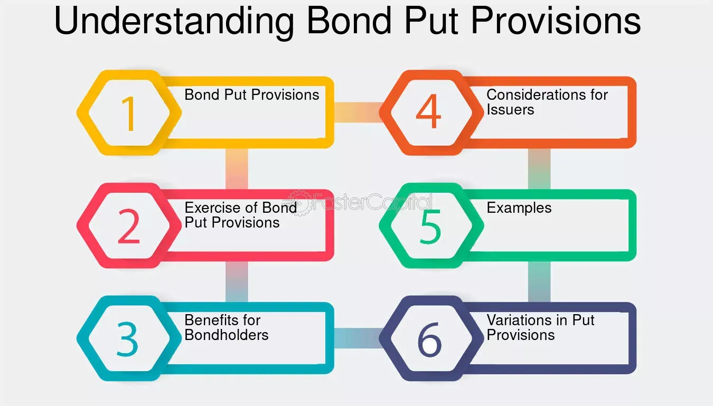

## Table of Contents

## What is a put provision in finance?

A put provision in finance is a feature in a bond or other financial instrument that allows the holder to sell it back to the issuer before it matures. This gives the bondholder more flexibility and security, because they can get their money back if they need it or if they think the bond's value might drop.

For example, imagine you buy a bond with a put provision. If interest rates go up after you buy the bond, its value might go down. But with the put provision, you can choose to sell the bond back to the issuer at a set price, instead of selling it on the market for less. This can be really helpful for managing risk and planning your finances.

## How does a put provision work in bonds?

A put provision in bonds is like a safety net for the person who buys the bond. It lets them sell the bond back to the company that issued it before the bond's official end date. This can be really useful if the bond's value goes down or if the buyer needs their money back sooner than expected. The price at which the bond can be sold back is usually set when the bond is first issued, so the buyer knows what to expect.

For example, if you buy a bond with a put provision and then interest rates go up, the value of your bond might drop because new bonds would offer higher interest. But with the put provision, you can choose to sell your bond back to the issuer at the agreed-upon price, instead of selling it on the open market for less. This helps protect your investment and gives you more control over your financial planning.

## What are the benefits of a put provision for bondholders?

A put provision in a bond gives the person who owns the bond a lot of flexibility. If they need their money back before the bond's official end date, they can use the put provision to sell the bond back to the company that issued it. This can be really helpful if the bondholder needs cash for something important, like buying a house or paying for an emergency.

Another big benefit is that the put provision helps protect the bondholder from losing money if the bond's value goes down. For example, if interest rates go up, the value of the bond might drop because new bonds would pay more interest. With a put provision, the bondholder can sell the bond back at a set price, instead of selling it on the market for less. This way, they can avoid losing money and keep their investment safe.

## Can you explain the difference between a put provision and a call provision?

A put provision and a call provision are two different features that can be included in bonds, and they work in opposite ways. A put provision is like a safety net for the person who buys the bond. It lets them sell the bond back to the company that issued it before the bond's official end date. This can be really helpful if the bondholder needs their money back sooner than expected or if the bond's value goes down.

On the other hand, a call provision is a feature that benefits the company that issued the bond. It allows the issuer to buy back the bond from the bondholder before it matures. The company might want to do this if interest rates go down, so they can issue new bonds at a lower [interest rate](/wiki/interest-rate-trading-strategies) and save money. So, while a put provision gives more control to the bondholder, a call provision gives more control to the issuer.

## In what types of securities are put provisions commonly found?

Put provisions are commonly found in bonds, especially in corporate bonds and municipal bonds. These provisions give the bondholder the right to sell the bond back to the issuer before it matures. This can be really helpful if the bondholder needs their money back sooner or if they think the bond's value might drop. For example, if interest rates go up, the value of the bond might go down, but the bondholder can use the put provision to get their money back at a set price.

Put provisions can also be found in other types of securities, like preferred stocks. In these cases, the holder of the preferred stock can sell it back to the issuing company at a predetermined price before the stock's maturity date. This gives the holder more flexibility and security, similar to how it works with bonds. Overall, put provisions are a valuable feature in many securities because they help investors manage risk and plan their finances better.

## How does a put provision affect the valuation of a bond?

A put provision can make a bond more valuable to the person who buys it. This is because it gives them the option to sell the bond back to the company that issued it before the bond's official end date. If the bondholder thinks the bond's value might go down, or if they need their money back sooner than expected, they can use the put provision to get their money back at a set price. This extra security and flexibility can make the bond more attractive, which might lead to a higher price for the bond when it's first sold.

On the other hand, a put provision can also make a bond less valuable to the company that issued it. This is because the company has to be ready to buy the bond back if the bondholder decides to use the put provision. This can be a risk for the company, especially if interest rates change or if they need to keep their money for other things. Because of this risk, the company might have to offer a lower interest rate on the bond to make it more appealing to investors, which can affect the bond's overall valuation.

## What are the potential risks associated with put provisions for issuers?

Put provisions can be risky for the company that issues the bond. If a lot of bondholders decide to use their put provision at the same time, the company has to buy back all those bonds. This means the company needs to have enough money ready to pay everyone back. If they don't have enough money, they might have to borrow more, which can be hard and expensive, especially if the economy is not doing well.

Another risk for the company is that put provisions can make it harder to predict their future cash needs. If interest rates go up, more bondholders might want to sell their bonds back to the company. This can create a sudden need for cash that the company wasn't expecting. If the company can't handle this extra demand for cash, it could face financial problems or even go bankrupt.

## How do put provisions influence the yield of a bond?

Put provisions can change the yield of a bond. Yield is like the interest rate you get for holding onto a bond. When a bond has a put provision, it might have a lower yield. This is because the put provision makes the bond safer for the person who buys it. They know they can sell the bond back if they need to, so they might be okay with getting a little less interest. The company that issues the bond might offer a lower yield to make up for the risk that people might want their money back early.

For the company that issues the bond, put provisions can make things a bit trickier. If lots of people decide to use their put provision at the same time, the company needs to have enough money to buy back all those bonds. This can be hard, especially if they weren't expecting it. So, to make the bond more appealing to investors and to manage this risk, the company might offer a lower yield. This way, the bond can still be attractive even though it has the put provision.

## What factors should investors consider before investing in bonds with put provisions?

Before investing in bonds with put provisions, investors should think about how much they need their money to be safe and flexible. A put provision lets you sell the bond back to the company that issued it before it's supposed to end. This can be really helpful if you need your money back sooner or if you think the bond's value might go down. But, because of this extra safety, the bond might offer a lower interest rate, which means you might earn less money over time. So, you need to decide if the safety and flexibility are worth getting a smaller return on your investment.

Another thing to consider is how the put provision might affect the company that issued the bond. If a lot of people decide to use their put provision at the same time, the company has to buy back all those bonds. This can be hard for the company if they don't have enough money ready. If the company can't handle this, it could face financial problems. As an investor, you need to think about how likely this is to happen and how it might affect the bond's value and your investment. So, it's important to look at the company's financial health and how they manage their money before deciding to invest in their bonds with put provisions.

## Can you discuss a real-world example where a put provision was exercised?

In 2008, during the financial crisis, many investors used put provisions in their bonds. One example was with Lehman Brothers, a big financial company that went bankrupt. Lehman Brothers had issued bonds with put provisions, and when the company started having serious money problems, a lot of bondholders got worried. They used their put provisions to sell their bonds back to Lehman Brothers before the company completely fell apart. This was a smart move because it let them get some of their money back before Lehman Brothers went bankrupt and their bonds became worthless.

This example shows how put provisions can be really helpful for investors during tough times. When Lehman Brothers was in trouble, the put provisions gave bondholders a way to protect their investments. They could sell their bonds back and avoid losing all their money when the company failed. It also shows how put provisions can put a lot of pressure on the company that issued the bonds. Lehman Brothers had to find money to buy back the bonds, which made their financial problems even worse.

## How do market conditions influence the decision to exercise a put provision?

Market conditions can really affect whether someone decides to use a put provision in a bond. If interest rates go up, the value of the bond might go down because new bonds would offer higher interest. In this case, a bondholder might want to use the put provision to sell the bond back to the company at a set price, instead of selling it on the market for less. This way, they can avoid losing money and get their investment back.

Another market condition that can influence the decision is if the economy is doing badly. If a lot of people are worried about the company that issued the bond going bankrupt, they might use the put provision to get their money back before the company's problems get worse. This can be a smart move to protect their investment, especially during times like the financial crisis when many companies were struggling. So, market conditions play a big role in deciding whether to use a put provision.

## What are the advanced strategies for using put provisions in portfolio management?

In portfolio management, using put provisions can be a smart way to manage risk and improve flexibility. One advanced strategy is to use put provisions to adjust the duration of your bond investments. If you think interest rates are going to go up, you can use the put provision to sell your bonds back to the issuer before they lose too much value. This lets you then invest in new bonds with higher interest rates, helping you make more money over time. Another strategy is to use put provisions as a way to get cash when you need it. If you know you might need money for something important in the future, like buying a house or paying for school, you can choose bonds with put provisions. This way, you can get your money back when you need it, without having to sell your bonds on the open market at a lower price.

Another advanced strategy is to use put provisions to diversify your portfolio. By choosing bonds from different companies or industries that have put provisions, you can spread out your risk. If one company starts having problems, you can use the put provision to get your money back and invest it in a safer place. This can help protect your overall investment and keep your portfolio balanced. Put provisions can also be used in combination with other financial tools, like options or swaps, to create more complex strategies. For example, you might use a put provision along with an interest rate swap to lock in a certain return on your investment, no matter what happens with interest rates. This kind of strategy can be more advanced, but it can also help you manage risk and potentially earn more money.

## References & Further Reading

[1]: Bergstra, J., Bardenet, R., Bengio, Y., & Kégl, B. (2011). ["Algorithms for Hyper-Parameter Optimization."](https://dl.acm.org/doi/10.5555/2986459.2986743) Advances in Neural Information Processing Systems 24.

[2]: ["Advances in Financial Machine Learning"](https://www.amazon.com/Advances-Financial-Machine-Learning-Marcos/dp/1119482089) by Marcos Lopez de Prado

[3]: ["Evidence-Based Technical Analysis: Applying the Scientific Method and Statistical Inference to Trading Signals"](https://www.amazon.com/Evidence-Based-Technical-Analysis-Scientific-Statistical/dp/0470008741) by David Aronson

[4]: ["Machine Learning for Algorithmic Trading"](https://github.com/stefan-jansen/machine-learning-for-trading) by Stefan Jansen

[5]: ["Quantitative Trading: How to Build Your Own Algorithmic Trading Business"](https://www.amazon.com/Quantitative-Trading-Build-Algorithmic-Business/dp/1119800064) by Ernest P. Chan