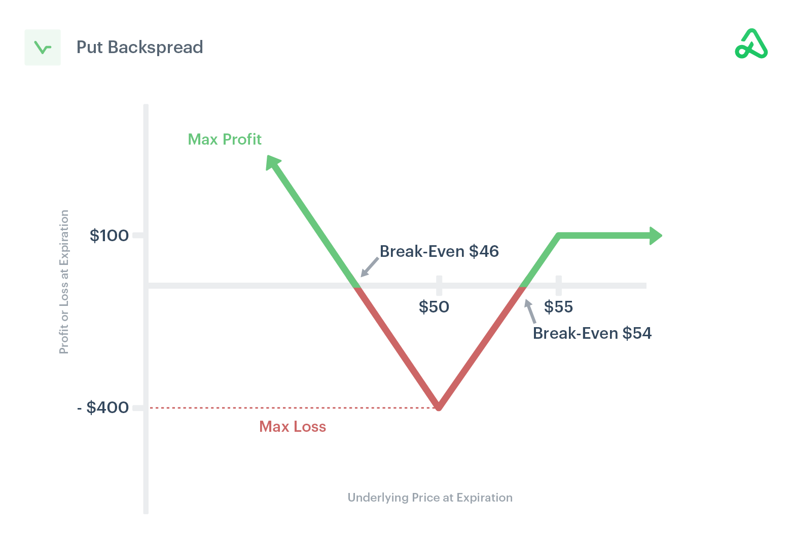

## Table of Contents

## What is a Put Ratio Backspread?

A Put Ratio Backspread is an options trading strategy where you buy more put options than you sell. It's used when you think the price of a stock will go down a lot. You sell put options at a higher strike price and buy more put options at a lower strike price. The goal is to make money if the stock price drops significantly.

This strategy can be a bit tricky because it involves selling some options, which means you could lose money if the stock price doesn't move much or goes up. But if the stock price falls a lot, the put options you bought at the lower strike price will increase in value more than the ones you sold, leading to a profit. It's a strategy for people who are willing to take on more risk for the chance of a bigger reward.

## How does a Put Ratio Backspread work?

A Put Ratio Backspread is a strategy used in options trading when you think a stock's price will drop a lot. You do this by selling some put options at a higher price and buying more put options at a lower price. For example, you might sell one put option at a $50 strike price and buy two put options at a $40 strike price. The idea is that if the stock price falls below the lower strike price, the value of the put options you bought will go up more than the value of the put option you sold, making you money.

This strategy can be risky because if the stock price doesn't move much or goes up, you could lose money on the put option you sold. The money you get from selling the put option at the higher strike price helps pay for the put options you buy at the lower strike price, but it's not enough to cover big losses if the stock price stays the same or goes up. So, a Put Ratio Backspread is for people who are okay with taking more risk for the chance of making a bigger profit if the stock price drops a lot.

## What are the key components of a Put Ratio Backspread?

A Put Ratio Backspread involves two main parts: selling put options at a higher strike price and buying more put options at a lower strike price. For example, you might sell one put option at a $50 strike price and buy two put options at a $40 strike price. The money you get from selling the put option at the higher price helps pay for the put options you buy at the lower price. This setup is used when you think the stock price will drop a lot.

The strategy can be risky because if the stock price doesn't move much or goes up, you could lose money on the put option you sold. The goal is to make money if the stock price falls below the lower strike price, because the value of the put options you bought will go up more than the value of the put option you sold. A Put Ratio Backspread is for people who are willing to take on more risk for the chance of a bigger reward if the stock price drops significantly.

## What are the potential benefits of using a Put Ratio Backspread?

One big benefit of using a Put Ratio Backspread is that it can make you a lot of money if the stock price drops a lot. When you set up the strategy, you sell some put options at a higher price and buy more put options at a lower price. If the stock price falls below the lower price, the put options you bought will go up in value a lot more than the ones you sold. This means you can make a big profit if your guess about the stock price going down is right.

Another benefit is that the money you get from selling the put options at the higher price helps pay for the put options you buy at the lower price. This can make the strategy cheaper to set up. But remember, it's still a risky strategy because if the stock price doesn't move much or goes up, you could lose money on the put options you sold. So, it's good for people who are okay with taking more risk for the chance of a bigger reward.

## What are the risks associated with a Put Ratio Backspread?

One of the main risks of using a Put Ratio Backspread is that you could lose money if the stock price doesn't go down as much as you expect. When you set up this strategy, you sell some put options at a higher price and buy more put options at a lower price. If the stock price stays the same or goes up, the put options you sold at the higher price could lose value, and you would have to pay for those losses. This means you could end up losing more money than you made from the put options you bought at the lower price.

Another risk is that the strategy can be complicated to manage. Because you're selling some options and buying more, you need to keep a close eye on the stock price and be ready to make changes if things don't go as planned. If the stock price moves in a way you didn't expect, you might need to buy back the put options you sold or sell the ones you bought, which can be tricky and might cost you more money. So, it's important to understand how to handle this strategy well to avoid big losses.

## How do you set up a Put Ratio Backspread?

To set up a Put Ratio Backspread, you need to do two main things. First, you sell put options at a higher strike price. For example, if you think a stock is going to drop a lot, you might sell one put option at a $50 strike price. This gives you some money right away, which you can use to help pay for the next step. Second, you buy more put options at a lower strike price. Using the same example, you might buy two put options at a $40 strike price. The idea is that if the stock price falls below $40, the put options you bought will go up in value a lot more than the one you sold.

The tricky part is making sure you get the right number of options. Usually, you buy more put options than you sell. The ratio could be 2:1 or 3:1, depending on how much you think the stock price will drop and how much risk you want to take. You also need to decide on the expiration dates for these options. They should be the same for both the put options you sell and the ones you buy. Setting up a Put Ratio Backspread can be complicated, so it's important to understand how it works and to keep a close eye on the stock price after you set it up.

## What are the optimal market conditions for a Put Ratio Backspread?

The best time to use a Put Ratio Backspread is when you think a stock's price will drop a lot. This strategy works well when there's a lot of uncertainty or bad news about a company, making its stock price likely to fall. For example, if a company is about to report earnings and you think the results will be bad, or if there's a big event coming up that could hurt the company's stock price, a Put Ratio Backspread could be a good choice.

However, this strategy can be risky if the stock price doesn't drop as much as you expect. If the stock price stays the same or goes up, you could lose money on the put options you sold. So, it's important to use this strategy when you're pretty sure the stock price will go down a lot. It's not for everyone because it involves more risk, but if you're right about the stock price dropping, it can lead to big profits.

## How does the choice of strike prices affect a Put Ratio Backspread?

The choice of strike prices is really important for a Put Ratio Backspread. When you set up this strategy, you sell some put options at a higher strike price and buy more put options at a lower strike price. The difference between these two prices can change how much money you can make or lose. If you pick a higher strike price for the puts you sell, you get more money right away, which helps pay for the puts you buy at the lower strike price. But, if the stock price doesn't drop below the lower strike price, you could lose money on the puts you sold.

The distance between the higher and lower strike prices also affects how much risk you're taking. If you choose a lower strike price that's far away from the higher strike price, you're betting that the stock will drop a lot. This can lead to bigger profits if you're right, but it's also riskier because the stock has to fall a lot for you to make money. On the other hand, if you choose a lower strike price that's closer to the higher strike price, the stock doesn't have to drop as much for you to start making money, but your potential profits won't be as big. So, [picking](/wiki/asset-class-picking) the right strike prices is key to balancing risk and reward with a Put Ratio Backspread.

## What is the impact of time decay on a Put Ratio Backspread?

Time decay, or theta, can affect a Put Ratio Backspread in a tricky way. When you set up this strategy, you sell some put options at a higher strike price and buy more put options at a lower strike price. The put options you sell at the higher price lose value over time because of time decay, which is good for you. But the put options you buy at the lower price also lose value over time, which is not so good. So, if the stock price doesn't move much or doesn't drop below the lower strike price before the options expire, time decay can hurt your position because the value of the options you bought will go down.

The impact of time decay on a Put Ratio Backspread depends a lot on how long you have until the options expire. If you set up the strategy with options that expire soon, time decay can happen faster, making it riskier. But if you use options with more time until they expire, time decay will be slower, giving the stock more time to move in the direction you want. So, it's important to think about how time decay will affect your strategy and pick the right expiration dates to balance the risks and rewards.

## How can you adjust a Put Ratio Backspread as market conditions change?

As market conditions change, you might need to adjust your Put Ratio Backspread to manage your risk and try to make the most money. If the stock price starts to go up instead of down, you could buy back the put options you sold at the higher strike price to stop any more losses. This can cost you money, but it's better than letting the losses get bigger. If the stock price stays the same or doesn't drop as much as you thought, you might want to sell some of the put options you bought at the lower strike price to cut your losses or at least get some money back.

Another way to adjust is if the stock price starts to drop like you hoped, but not as fast as you need. You could sell some of the put options you bought at the lower strike price to lock in some profits, or you could buy more put options at an even lower strike price to increase your potential gains if the stock price keeps falling. It's all about keeping an eye on the stock price and being ready to make changes to your strategy as things happen. Adjusting a Put Ratio Backspread can be tricky, but it's important to do if you want to manage your risk and try to make money no matter what the market does.

## What are some advanced strategies for managing a Put Ratio Backspread?

One advanced way to manage a Put Ratio Backspread is to use a technique called rolling. If the stock price doesn't move as much as you hoped, you can roll the put options you sold at the higher strike price to a later expiration date. This means you buy back the options you sold and sell new ones with a later expiration date. This can give the stock more time to drop like you want, but it costs money to do this, so you need to be careful. Another way to manage the strategy is to use stop-loss orders. You can set a stop-loss order on the put options you sold at the higher strike price. If the stock price goes up and the value of those options goes against you, the stop-loss order will automatically close your position to limit your losses.

Another advanced strategy is to adjust the ratio of the put options you're buying and selling. If the stock price starts to drop but not as fast as you need, you might want to buy more put options at an even lower strike price to increase your potential gains. This is called adding to your position. On the other hand, if the stock price is dropping like you hoped, you could sell some of the put options you bought at the lower strike price to lock in some profits. This is called taking profits. Both of these moves can help you manage the risk and reward of your Put Ratio Backspread as the market changes.

Managing a Put Ratio Backspread takes a lot of attention and quick thinking. You need to keep a close eye on the stock price and be ready to make changes to your strategy. Whether it's rolling options, using stop-loss orders, or adjusting the ratio of options you're buying and selling, the key is to be flexible and ready to act as the market moves. This way, you can try to make the most money while keeping your risk under control.

## How do you calculate the breakeven points for a Put Ratio Backspread?

To figure out the breakeven points for a Put Ratio Backspread, you need to think about the money you get from selling the put options at the higher strike price and the money you spend on buying more put options at the lower strike price. The first breakeven point happens when the stock price is just below the higher strike price. You find this by taking the higher strike price and subtracting the net cost of setting up the strategy. The net cost is what you pay for the put options you buy minus what you get from selling the put options.

The second breakeven point is when the stock price drops a lot, below the lower strike price. You find this by taking the lower strike price and adding the net credit you get from setting up the strategy. The net credit is what you get from selling the put options minus what you pay for the put options you buy. These two breakeven points help you see the range where you can make money or lose money with your Put Ratio Backspread.

## How does a Put Ratio Backspread work?

Consider a scenario where a stock is priced at $100, and a trader anticipates that the stock will experience a significant downward movement. The trader decides to implement a Put Ratio Backspread strategy to capitalize on this expected downturn.

**Put Options Strategy Setup:**

1. **Sell 1 In-the-Money Put Option:**
   - Strike Price: $100
   - Premium Received: $P_{100}$

2. **Buy 2 Out-of-the-Money Put Options:**
   - Strike Price: $90
   - Premium Paid per Option: $P_{90}$

**Net Cost or Credit:**

The net initial cash flow of this strategy, often resulting in a net credit or minimal cost, is determined by the balance between the premium received for selling the higher strike put and the total premium paid for purchasing the lower strike puts:

$$
\text{Net Cost} = P_{90} \times 2 - P_{100}
$$

**Potential Outcomes:**

- **Stock Price Falls Below $90:**  
  If the stock price falls significantly below $90 at expiration, the profit potential is theoretically unlimited. The trader gains from the two long puts, offset by the loss from the short put. The profit can be calculated as:
$$
  \text{Profit} = (100 - S_T) \times 2 - \text{Net Cost}

$$

  where $S_T$ is the stock price at expiration below $90.

- **Stock Price Between $90 and $100:**  
  When the stock price settles between $90 and $100, the trader incurs a loss. The long puts expire worthless, and the short put results in a loss, dictated by the price $S_T$:
$$
  \text{Loss} = (S_T - 100) + \text{Net Cost}

$$

- **Stock Price Above $100:**  
  If the stock price remains above $100, all puts expire worthless at a profit equal to the initial net credit, if any, received from the setup:
$$
  \text{Profit} = -\text{Net Cost}

$$

By structuring this options strategy, the trader exploits significant downward movements, balancing the risk of moderate declines or stagnation with the possibility of substantial gains if the anticipated market conditions are met.

## References & Further Reading

[1]: Hull, J. C. (2018). ["Options, Futures, and Other Derivatives"](https://www.semanticscholar.org/paper/Options%2C-Futures%2C-and-Other-Derivatives-Hull/89bdee500c8623864fc9eb7a471546aa713acc44) (9th ed.). Pearson.

[2]: Natenberg, S. (1994). ["Option Volatility and Pricing: Advanced Trading Strategies and Techniques"](https://www.amazon.com/Option-Volatility-Pricing-Strategies-Techniques/dp/0071818774) (2nd ed.). McGraw-Hill.

[3]: Black, F., & Scholes, M. (1973). ["The Pricing of Options and Corporate Liabilities,"](https://www.cs.princeton.edu/courses/archive/fall09/cos323/papers/black_scholes73.pdf) Journal of Political Economy, 81(3), 637-654.

[4]: Carr, P., & Wu, L. (2003). ["What Type of Process Underlies Options? A Simple Robust Test"](https://onlinelibrary.wiley.com/doi/10.1046/j.1540-6261.2003.00616.x) in The Review of Financial Studies, 16(1), 107-141.

[5]: Jabbour, R. E., & Budinger, J. C. (2018). ["The Handbook of Electronic Trading: A Guide to the Next Generation of Global Trading Markets,"](https://www.amazon.com/Handbook-Electronic-Trading-Generation-Markets/dp/0071457535) McGraw-Hill Education.