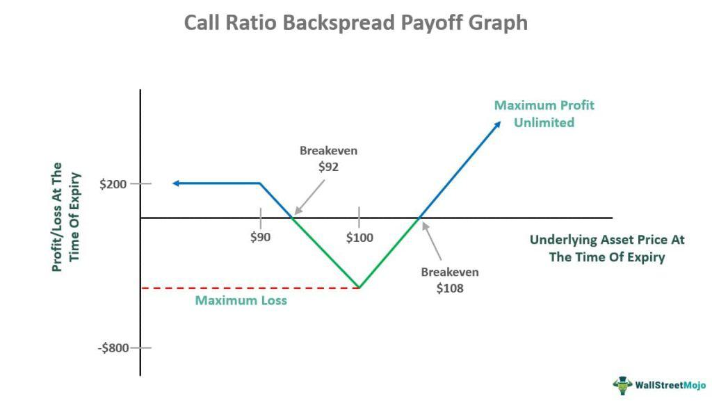

Options trading presents a multitude of strategies, each designed to cater to different market scenarios and trader preferences. Among these strategies is the Put Ratio Backspread, a sophisticated approach primarily targeting traders with a bearish perspective anticipating notable downward shifts in asset prices. The strategy is intriguing to algorithmic traders, as it seamlessly integrates into automated trading systems, maximizing the strategy's benefits through systematic execution and market analysis.

The Put Ratio Backspread is characterized by a balanced mix of risk and reward dynamics. At its core, this strategy is adept for traders seeking to capitalize on expected market volatility, particularly when they foresee substantial declines. By its design, the Put Ratio Backspread involves the sale and purchase of put options in an imbalanced ratio, where typically fewer higher strike options are sold while a greater number of lower strike options are purchased. This setup can potentially result in a strategy that involves either a net credit or minimal outlay, which is attractive for traders preferring efficient capital allocation.

Algorithmic traders are especially drawn to the Put Ratio Backspread due to its adaptability to quantitative trading models. The ability to automate trade execution and monitor market conditions in real-time enhances the precision and responsiveness of the strategy, allowing traders to optimize entry and exit points. This article explores the mechanics, merits, and considerations surrounding the Put Ratio Backspread, offering insights into its application within the automated trading landscape.

## Table of Contents

## Understanding Put Ratio Backspread

A Put Ratio Backspread is an advanced options trading strategy designed to benefit from significant downward movements in the price of an underlying asset. The structure involves selling a smaller quantity of put options at a higher strike price while purchasing a larger number of put options at a lower strike price. Typically, the ratio of buying to selling is either 2:1 or 3:1. This configuration aims to exploit volatility, potentially resulting in a setup that provides a small net credit or incurs minimal cost.

This strategy functions optimally in volatile markets where substantial declines are anticipated. By structuring the options in this manner, the trader may enjoy unrestricted profit potential on the downside. For instance, when the underlying asset's price falls significantly below the lower strike price, the purchased put options increase in value, leading to potentially unlimited profits. Conversely, if the price of the underlying asset rises, the trader’s losses are limited. This is because the premium received from selling the higher strike put options helps offset the cost, thereby capping potential losses.

The effectiveness of a Put Ratio Backspread is contingent on significant downward movement in the price of the underlying asset and overall market volatility. In less volatile or stable market conditions, price movements may not cover the net cost or result in the anticipated payoff, making strategy selection crucial for achieving desired trading outcomes.

## Mechanics of the Put Ratio Backspread

The Put Ratio Backspread is a strategic approach in options trading that employs both short and long put positions to create a structured risk-reward profile favorable to bearish market views. The mechanics involve selling higher-strike put options while simultaneously purchasing a greater number of lower-strike put options. This creates a net position where the trader is poised to benefit from significant downward movements in the underlying asset's price.

The ratio setup, typically formatted as 2:1 or 3:1, is pivotal to this strategy. For instance, a 2:1 ratio would involve selling one higher-strike put option for every two lower-strike puts purchased. This structure leverages the effects of [volatility](/wiki/volatility-trading-strategies) and sharp declines in the underlying price, allowing for potentially unlimited profit if the asset's price falls significantly below the lower strike. 

The selection of strike prices and the option ratio are critical to tailoring the strategy to the trader's market outlook and risk tolerance. To illustrate, consider a situation where the trader anticipates significant market drops. By selling a higher-strike put, the trader collects a premium, offsetting the cost of purchasing multiple lower-strike puts. This configuration can result in the initial setup being at minimal cost or even a net credit, providing a cushion against limited upward movements in the asset price.

The strategy’s profitability hinges on pronounced price declines. When the asset's price plummets well below the lower strike, the value of the purchased puts appreciates substantially, while the loss from the sold puts is capped. Conversely, if the market does not move significantly or if the asset price hovers between the two strike prices, the potential for loss increases, notably when the premium collected does not offset the purchase cost of the additional puts.

Overall, the Put Ratio Backspread is structured to maximize returns from downward price volatility while offering a hedge on initial cost exposure, though it does require careful consideration of market trajectories and strike selection to mitigate risks of insufficient price movement.

## Example: How Put Ratio Backspread Works

Consider a scenario where a stock is priced at $100, and a trader anticipates that the stock will experience a significant downward movement. The trader decides to implement a Put Ratio Backspread strategy to capitalize on this expected downturn.

**Put Options Strategy Setup:**

1. **Sell 1 In-the-Money Put Option:**
   - Strike Price: $100
   - Premium Received: $P_{100}$

2. **Buy 2 Out-of-the-Money Put Options:**
   - Strike Price: $90
   - Premium Paid per Option: $P_{90}$

**Net Cost or Credit:**

The net initial cash flow of this strategy, often resulting in a net credit or minimal cost, is determined by the balance between the premium received for selling the higher strike put and the total premium paid for purchasing the lower strike puts:

$$
\text{Net Cost} = P_{90} \times 2 - P_{100}
$$

**Potential Outcomes:**

- **Stock Price Falls Below $90:**  
  If the stock price falls significantly below $90 at expiration, the profit potential is theoretically unlimited. The trader gains from the two long puts, offset by the loss from the short put. The profit can be calculated as:
$$
  \text{Profit} = (100 - S_T) \times 2 - \text{Net Cost}

$$

  where $S_T$ is the stock price at expiration below $90.

- **Stock Price Between $90 and $100:**  
  When the stock price settles between $90 and $100, the trader incurs a loss. The long puts expire worthless, and the short put results in a loss, dictated by the price $S_T$:
$$
  \text{Loss} = (S_T - 100) + \text{Net Cost}

$$

- **Stock Price Above $100:**  
  If the stock price remains above $100, all puts expire worthless at a profit equal to the initial net credit, if any, received from the setup:
$$
  \text{Profit} = -\text{Net Cost}

$$

By structuring this options strategy, the trader exploits significant downward movements, balancing the risk of moderate declines or stagnation with the possibility of substantial gains if the anticipated market conditions are met.

## Advantages and Risks

The Put Ratio Backspread is an intriguing strategy for options traders seeking to capitalize on significant declines in asset prices. A major advantage is the potential for unlimited profit when the asset undergoes a substantial drop. This is particularly enticing for bearish traders as it permits significant gains with controlled risk on the upside.

### Advantages

1. **Unlimited Downside Profit**: If the underlying asset's price drops significantly below the lower strike price option, the Put Ratio Backspread can yield unlimited profits. This is due to the increasing intrinsic value of the purchased put options, which outnumber the sold puts.

2. **Controlled Upside Risk**: The strategy involves limited risk if the asset's price increases, making it less risky than simply holding long put positions. When the trade is set up for a net credit, or costs are minimized, any increase in the asset’s price results in a potential predetermined loss limited to the net premium paid, if any.

3. **Initial Net Credit**: Often, the strategy can be established with an initial net credit, meaning traders receive a small upfront profit if the asset's price increases or remains stable at expiration. This characteristic provides a cushion against minor adverse movements.

### Risks

1. **Moderate Price Drops**: If the asset's price declines only slightly and falls between the strike prices at expiration, the strategy can yield substantial losses. Here, the acquired puts gain minimal intrinsic value, while the sold put option may incur significant intrinsic loss.

2. **Stagnant Prices**: In situations where the asset’s price remains stagnant near the strike price of the sold puts, the potential price decay from the options and transaction costs could lead to a maximum loss scenario.

3. **Volatility Exposure**: The strategy is sensitive to changes in volatility; unexpected reductions in volatility could diminish potential profits or exacerbate losses, especially if the trader is reliant on significant price movements.

These advantages and risks highlight the critical need for options traders to conduct thorough analysis and maintain active risk management practices when employing the Put Ratio Backspread. Understanding market conditions and the behavior of implied volatility can significantly influence the success of this strategy.

## Algo Trading and Automated Execution

When incorporated into automated trading systems, the Put Ratio Backspread can be efficiently managed by algorithms designed to track market conditions and execute trades at optimal points. This sophisticated options strategy benefits significantly from the precision that [algorithmic trading](/wiki/algorithmic-trading) provides, enabling traders to respond swiftly to market changes and capitalize on favorable movements.

Algorithms can be calibrated to monitor market indicators, such as volatility indices and price movement patterns, and execute trades when specific conditions are met. This allows traders to optimize the timing of trade executions, which is crucial for the successful implementation of the Put Ratio Backspread, especially in volatile markets.

Backtesting is a critical aspect of implementing the Put Ratio Backspread within algo trading. Traders can utilize historical market data to test the performance of their algorithms in various scenarios, refining parameters to enhance profitability while reducing risk. For example, adjusting the ratio of sold to bought put options or the choice of strike prices can be optimized based on backtested results to suit different market conditions.

Platforms like AlgoTest facilitate these processes by providing traders with the tools necessary to automate trade execution and conduct real-time monitoring. AlgoTest enables users to set up predefined strategies, like the Put Ratio Backspread, and allows modifications to be made instantly in response to market changes. This flexibility and adaptability are essential for maintaining an edge in rapidly shifting markets.

By leveraging automated systems, traders can ensure that the execution of the Put Ratio Backspread is precise, consistent, and adheres to the optimal strategy parameters. As markets evolve, regular updates to the algorithm's parameters and strategy criteria can be conducted to maintain alignment with market dynamics, ensuring continued strategic performance.

## Conclusion

The Put Ratio Backspread represents a sophisticated options strategy, uniquely appealing to traders who possess a strong bearish outlook and expertise in navigating volatile markets. Its structure allows for potentially unlimited profit when significant downward movements occur, distinguishing it from other strategies that may have capped returns.

Integrating this strategy into algorithmic trading systems enhances both precision and operational efficiency. Algorithms can be programmed to execute trades based on predefined market conditions, ensuring timely responses to market shifts and optimizing both entry and [exit](/wiki/exit-strategy) points. This automated approach minimizes human error and takes advantage of rapid market changes, which are crucial for capitalizing on the Put Ratio Backspread's potential.

Traders aiming for successful application must stay keenly aware of market dynamics and volatility trends. This involves regular monitoring of market indicators and maintaining a disciplined trading approach to adjust strategies as conditions evolve. Awareness and adaptability are key to managing risk effectively and seizing opportunities as they arise.

In conclusion, mastery of the Put Ratio Backspread, coupled with strategic deployment in algo trading frameworks, allows traders to harness market volatility efficiently. By remaining vigilant in their market analysis and disciplined in execution, traders can optimize the strategy's benefits while managing associated risks.

## References & Further Reading

[1]: Hull, J. C. (2018). ["Options, Futures, and Other Derivatives"](https://www.semanticscholar.org/paper/Options%2C-Futures%2C-and-Other-Derivatives-Hull/89bdee500c8623864fc9eb7a471546aa713acc44) (9th ed.). Pearson.

[2]: Natenberg, S. (1994). ["Option Volatility and Pricing: Advanced Trading Strategies and Techniques"](https://www.amazon.com/Option-Volatility-Pricing-Strategies-Techniques/dp/0071818774) (2nd ed.). McGraw-Hill.

[3]: Black, F., & Scholes, M. (1973). ["The Pricing of Options and Corporate Liabilities,"](https://www.cs.princeton.edu/courses/archive/fall09/cos323/papers/black_scholes73.pdf) Journal of Political Economy, 81(3), 637-654.

[4]: Carr, P., & Wu, L. (2003). ["What Type of Process Underlies Options? A Simple Robust Test"](https://onlinelibrary.wiley.com/doi/10.1046/j.1540-6261.2003.00616.x) in The Review of Financial Studies, 16(1), 107-141.

[5]: Jabbour, R. E., & Budinger, J. C. (2018). ["The Handbook of Electronic Trading: A Guide to the Next Generation of Global Trading Markets,"](https://www.amazon.com/Handbook-Electronic-Trading-Generation-Markets/dp/0071457535) McGraw-Hill Education.