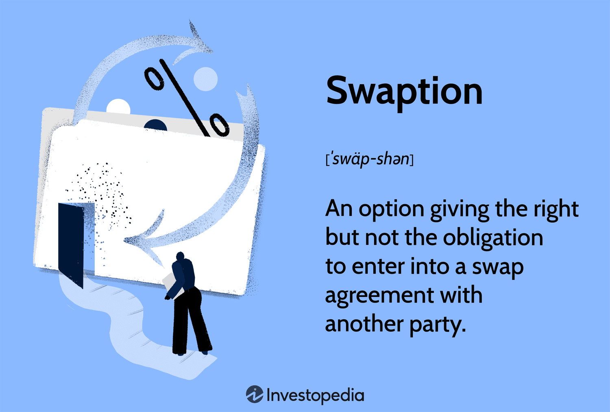

Financial derivatives represent a cornerstone of modern finance, facilitating various strategies for risk management, speculation, and arbitrage. Essentially, financial derivatives are contracts whose value derives from the performance of an underlying entity—be it an asset, index, or interest rate. These instruments are indispensable in financial markets, providing traders and institutional investors with tools to hedge risks, enhance returns, and achieve greater financial flexibility. 

The landscape of financial derivatives encompasses a variety of products, with options, put options, and swaptions standing out as pivotal instruments. Options provide the holder the right, but not the obligation, to buy or sell an asset at a predefined price on or before a specific date. Put options specifically grant the right to sell, allowing investors to hedge against potential declines in asset prices. Swaptions, or options on swaps, are sophisticated instruments that enable the holder to enter into a swap agreement in the future, commonly used to manage interest rate exposure.



Algorithmic trading represents a significant evolution in the derivatives markets, leveraging computer algorithms to automate trading decisions, enhance market liquidity, and improve the execution of trades. This practice is particularly impactful in the context of derivatives due to the complexity and speed required in managing these instruments effectively.

Understanding these financial instruments is crucial for investors seeking to navigate the modern financial landscape. Options and swaptions offer unique benefits and pose distinct risks, whereas algorithmic trading provides a powerful means to transact efficiently in increasingly competitive markets. This article outlines key aspects of options, put options, and swaptions, while exploring the role of algorithmic trading within derivatives, aiming to illuminate these advanced financial tools for informed investment decisions.

## Table of Contents

## Understanding Financial Derivatives

Financial derivatives are complex financial instruments whose value is derived from an underlying asset, index, or interest rate. These instruments are widely used for various purposes, including risk management, hedging, speculation, and gaining access to otherwise inaccessible markets or assets. The primary types of financial derivatives include options, futures, and swaps, each serving a different function in financial markets and portfolios.

### Role of Derivatives in Risk Management

Derivatives are essential tools for risk management. They allow investors to hedge against potential losses due to unfavorable movements in market prices. By using derivatives, companies and investors can lock in prices, interest rates, or exchange rates, thus minimizing the impact of [volatility](/wiki/volatility-trading-strategies) on their financial outcomes. For example, an airline company might use futures contracts to hedge against the volatility of fuel prices, ensuring more predictable financial results.

### Types of Derivatives

1. **Options**: An option provides the holder with the right, but not the obligation, to buy or sell an asset at a predetermined price before or at a specified expiration date. Options are classified into call options, which allow the purchase of an asset, and put options, which allow the sale of an asset. They are widely used for speculation and hedging strategies.

2. **Futures**: A futures contract obligates the buyer to purchase, and the seller to sell, an asset at a predetermined future date and price. Futures are standardized and traded on exchanges, offering liquidity and pricing transparency. These are common in commodities trading, where businesses hedge against price changes by locking in current prices.

3. **Swaps**: Swaps involve an exchange of cash flows or liabilities between two parties. The most common type is the interest rate swap, where cash flows based on fixed and floating interest rates are exchanged, allowing participants to manage exposure to fluctuations in interest rates.

### Derivatives for Speculation and Hedging

While derivatives are powerful tools for hedging risk, they are also employed for speculative purposes. Speculators seek to profit from the price movements of the underlying assets without intended use of the asset itself. These activities can lead to significant financial gains but come with commensurate risks. For instance, an investor might use options to speculate on stock price movements. If the investor anticipates a rise in the stock price, purchasing a call option can provide substantial returns if the market moves favorably.

Hedging, on the other hand, involves strategies designed to mitigate risk exposure. For example, a portfolio manager holding a substantial investment in foreign equities may use currency swaps to hedge against adverse currency exchange rate movements. This approach protects the portfolio from additional risk without significant changes to its composition.

### Real-World Applications

Derivatives are employed across various sectors. In agriculture, a farmer might use futures contracts to lock in a sale price for crops, thus ensuring revenue despite market fluctuations. In the energy sector, utilities might use derivatives like swaps to stabilize cash flows affected by volatile commodity prices. The financial industry extensively uses derivatives to manage [interest rate](/wiki/interest-rate-trading-strategies) risks, currency risks, and credit risks, reinforcing the stability of financial institutions.

In conclusion, financial derivatives are versatile instruments essential for modern finance's risk management, speculation, and market access. Understanding these tools is crucial for informed investment decisions and effective financial strategy implementation.

## Options and Put Options

Options are financial derivatives that confer the right, but not the obligation, to buy or sell an underlying asset at a predetermined price before or at a specified expiration date. These contracts are critical tools in financial markets for hedging risk and speculating on price movements. Options are categorized into two primary types: call options and put options.

**How Options Contracts Work**

An option contract consists of several components: the underlying asset, the strike price (the predetermined price), the expiration date, and the premium (the price paid for the option contract). The buyer of an option pays a premium to the seller (or writer) for the right to execute the contract. This risk arrangement allows investors to leverage their positions, requiring less capital than would be necessary for a direct purchase of the underlying asset.

**Call Options vs. Put Options**

Call options provide the holder the right to buy the underlying asset at the strike price, while put options grant the right to sell the asset at the strike price. If an investor anticipates that the price of an asset will rise, she may purchase a call option to benefit from the upward price movement. Conversely, if the expectation is that the asset's price will fall, a put option may be bought to profit from the decline.

**Strategic Use of Put Options**

Put options serve as important instruments for hedging and speculation. In hedging, investors use put options to protect themselves against a decline in the value of assets they own. For example, a shareholder worried about a potential fall in stock prices can purchase put options on that stock to limit potential losses. This protective strategy essentially functions as an insurance policy. On the speculative front, traders may acquire put options expecting that the price of the underlying asset will decrease, aiming to profit from owning the option at a lower strike price than the market price.

**Factors Affecting Option Pricing**

Several critical factors influence the pricing of options. The Black-Scholes model, a widely used mathematical model, describes these relationships. The key elements include:

- **Volatility**: The greater the volatility of the underlying asset, the higher the option premium. This is due to the increased likelihood of significant price movements.

- **Time to Expiry**: The longer the time until expiration, the higher the option's premium. This is because more time provides a greater opportunity for the asset's price to move favorably.

- **Interest Rates and Dividends**: These financial metrics can also impact option pricing, specifically through their influence on the cost of carry involved in holding or shorting the underlying asset.

In summary, options, particularly put options, are versatile financial derivatives utilized for a myriad of purposes including risk management and speculative activities. Their pricing intricacies are determined by multiple dynamic factors such as volatility and time to expiry, making them a sophisticated tool in an investor's arsenal.

 to Swaptions

Swaptions, short for swap options, are derivative instruments that grant the holder the right, but not the obligation, to enter into an interest rate swap agreement at a specified future date. In a typical swap agreement, two parties exchange cash flows based on differing interest rate structures. Swaptions provide flexibility to hedge against interest rate fluctuations before engaging in these longer-term financial commitments.

The distinction between swaptions and vanilla swaps lies primarily in the optionality. While standard swaps require commitment to the exchange of cash flows for a set period, swaptions allow the holder to decide whether to activate the swap at the expiration date of the option. This built-in flexibility provides financial entities with a powerful tool for interest rate management, especially in volatile or uncertain market conditions.

Swaptions are predominantly used for interest rate risk management. Financial institutions, such as banks and insurance companies, employ swaptions to hedge against adverse movements in interest rates that could impact their portfolios or liabilities. For example, a company anticipating a rise in interest rates might purchase a payer swaption, which allows them to enter into a swap where they pay a fixed rate and receive a floating rate. This effectively locks in a maximum borrowing cost, safeguarding against future rate increases.

Common strategies associated with swaptions include speculation on interest rate movements and constructing complex hedging structures like collars and straddles. These strategies enable traders and risk managers to capitalize on their predictions regarding rate changes or to minimize exposure to interest rate volatility.

Key determinants of swaption pricing include the current level of interest rates, the volatility of interest rates, time to expiration, and the strike rate of the swaption, which is the fixed rate that will be applied if the swaption is exercised. Mathematical models, often relying on the Black-Scholes framework or its adaptations, are commonly utilized to assess these variables and calculate a swaption's theoretical value. The formula typically used in swaption pricing resembles that of standard option pricing, taking into account differentials about interest rate scenarios and their respective volatilities.

By understanding these factors, investors and risk managers can better navigate the complexities of interest rate environments and make informed decisions that align with their financial strategies. Swaptions thus play a crucial role in expanding the toolkit for sophisticated financial risk management and speculative activities.

## Algorithmic Trading with Derivatives

Algorithmic trading, also known as algo trading, refers to the use of computer programs to automate trading activities based on pre-defined criteria. It is a significant trend in the financial derivatives markets, where it facilitates the rapid execution of trades, enhances [liquidity](/wiki/liquidity-risk-premium), and can potentially lead to better pricing of derivative instruments.

One of the critical benefits of [algorithmic trading](/wiki/algorithmic-trading) in the context of options and swaptions is the improved trading efficiency it provides. Algorithms can process vast amounts of market data and execute trades at speeds that are impossible for human traders. This high-speed execution helps in capturing profitable opportunities that arise from fleeting market movements, which are crucial in markets such as options, where timing can significantly affect profitability.

Algorithms also play a vital role in optimizing risk management strategies when trading derivatives. They can be programmed to manage complex portfolios, dynamically hedging exposures by adjusting positions in response to market changes. For instance, an algorithm might continually rebalance a portfolio of options to maintain a delta-neutral position, thereby mitigating the directional risk associated with price movements in the underlying asset.

Several popular algorithms are utilized in trading derivatives, including statistical [arbitrage](/wiki/arbitrage) algorithms, which exploit price discrepancies among related derivatives, and market-making algorithms, which provide liquidity by continuously quoting bid and ask prices. Machine learning algorithms are increasingly employed to enhance predictive capabilities regarding price movements or volatility patterns in derivative markets.

Despite the advantages, algorithmic trading in derivatives markets also presents challenges and risks. One prominent risk is the potential for algorithms to behave unpredictably in volatile market conditions, leading to significant financial losses. This can be exacerbated by a lack of transparency regarding the workings of certain algorithmic models, which can obscure potential weaknesses or biases. Moreover, the reliance on high-frequency data can lead to issues with latency and data quality, impacting the performance of trading algorithms negatively.

Additionally, algorithmic trading raises concerns regarding market stability and fairness. The amplification of rapid trading can sometimes lead to flash crashes or exacerbate market volatility. As a result, regulations have been implemented to address these risks, such as the requirement for circuit breakers to pause trading during extreme volatility and mandates for more transparent reporting of algorithmic trading activities.

In summary, while algorithmic trading offers significant benefits to derivatives markets by enhancing efficiency and risk management, it is accompanied by various challenges that necessitate careful consideration, regulation, and continuous monitoring to ensure stability and fairness in these complex financial arenas.

## The Future of Financial Derivatives and Algo Trading

The landscape of financial derivatives and algorithmic trading is set to undergo profound changes, driven by advancements in technology and evolving regulatory frameworks. Emerging technologies, particularly [artificial intelligence](/wiki/ai-artificial-intelligence) (AI) and [machine learning](/wiki/machine-learning) (ML), are becoming integral to the trading strategies in the derivatives markets. These technologies enable traders to analyze vast datasets to identify patterns and make predictions that were previously impossible. Machine learning algorithms can adapt to new information in real-time, leading to more accurate pricing models and risk assessments.

AI is increasingly used to automate complex trading strategies, optimizing both speed and efficiency. For example, [reinforcement learning](/wiki/reinforcement-learning), a subset of machine learning, can be employed to develop trading algorithms that continuously learn from market interactions and adapt strategies accordingly. The Python snippet below demonstrates a simple reinforcement learning model that could be applied in trading derivatives:

```python
import numpy as np

class SimpleTradingAgent:
    def __init__(self, learning_rate=0.1, discount_factor=0.9):
        self.states = []  # Track states visited
        self.actions = []  # Track decisions made
        self.learning_rate = learning_rate
        self.discount_factor = discount_factor
        self.q_table = {}  # Store Q-values for state-action pairs

    def choose_action(self, state):
        # Implement epsilon-greedy strategy
        if np.random.rand() < 0.1:  # Exploration
            return np.random.choice(['buy', 'sell', 'hold'])
        return max(self.q_table.get(state, {}), key=self.q_table.get(state, {}).get, default='hold')

    def update_q_table(self, state, action, reward, next_state):
        current_q = self.q_table.get(state, {}).get(action, 0.0)
        max_future_q = max(self.q_table.get(next_state, {}).values(), default=0.0)
        new_q = (1 - self.learning_rate) * current_q + self.learning_rate * (reward + self.discount_factor * max_future_q)
        self.q_table.setdefault(state, {})[action] = new_q

# Example usage
agent = SimpleTradingAgent()
state = ...  # Define the current market state
action = agent.choose_action(state)
# Simulate market response and reward calculation
reward = ...
next_state = ...
agent.update_q_table(state, action, reward, next_state)
```

Regulatory changes will also profoundly impact the derivatives market. The increasing emphasis on transparency and risk management could lead to stricter regulations governing algorithmic trading. Regulations like the European Union's Markets in Financial Instruments Directive II (MiFID II) require firms to maintain high standards of transparency, significantly affecting the execution and reporting of derivatives trades. These regulations are crucial for maintaining investor confidence but pose challenges for financial firms striving to comply without stifling innovation.

Moreover, technology plays a critical role in enhancing market transparency. Distributed ledger technology (DLT), commonly associated with blockchain, offers a promising solution for real-time data sharing and auditability of transactions. This could mitigate counterparty risk, ensure compliance with regulatory demands, and facilitate more efficient settlement processes.

Looking forward, one of the significant challenges will be balancing innovation with regulation. Firms must navigate emerging technologies' benefits while adhering to evolving legal frameworks. Opportunities lie in leveraging AI and DLT to achieve more efficient, transparent, and secure trading environments. As these technologies advance, they promise to redefine the competitive landscape of financial derivatives and algorithmic trading, offering enhanced opportunities for investors willing to embrace these changes responsibly.

## Conclusion

Financial derivatives, encompassing instruments such as options, put options, swaptions, and futures, play a crucial role in the modern financial landscape. These tools offer sophisticated means for managing risk, enabling speculation, and enhancing liquidity across global markets. Understanding the fundamental workings of these instruments can significantly benefit investors, providing them with robust strategies to hedge against potential losses or capitalize on market trends. 

Algorithmic trading, which has seen exponential growth, particularly in derivatives markets, is another pivotal aspect of contemporary finance. Through the use of smart algorithms, trading efficiency and risk management have been optimized, offering traders the speed and precision that human deliberation might lack. However, this technological advancement also necessitates a comprehensive understanding of how these programs operate to mitigate inherent risks associated with automation.

For investors and professionals in finance, a deep understanding of financial derivatives and algorithmic trading is indispensable. Staying informed about these advanced financial instruments not only aids in making better investment decisions but also equips them to navigate the complexities and volatilities of the market. Continuous learning is paramount, with numerous online courses, textbooks, and financial news platforms providing valuable insights and updates.

As we embrace these sophisticated trading techniques, it is vital to engage in responsible and informed trading. This involves constant education and awareness of market developments and regulatory changes, ensuring decisions are made based on sound analysis and strategic foresight. By committing to ongoing education and responsible practices, investors can harness the full potential of derivatives and algorithmic trading while safeguarding their financial interests.

## References & Further Reading

[1]: Black, F., & Scholes, M. (1973). ["The Pricing of Options and Corporate Liabilities."](https://www.cs.princeton.edu/courses/archive/fall09/cos323/papers/black_scholes73.pdf) The Journal of Political Economy, 81(3), 637-654.

[2]: Hull, J. C. (2018). ["Options, Futures, and Other Derivatives"](https://www.semanticscholar.org/paper/Options%2C-Futures%2C-and-Other-Derivatives-Hull/89bdee500c8623864fc9eb7a471546aa713acc44). Pearson Education.

[3]: Lopez de Prado, M. (2018). ["Advances in Financial Machine Learning."](https://www.amazon.com/Advances-Financial-Machine-Learning-Marcos/dp/1119482089) John Wiley & Sons.

[4]: Glasserman, P. (2004). ["Monte Carlo Methods in Financial Engineering."](https://link.springer.com/book/10.1007/978-0-387-21617-1) Springer.

[5]: Jansen, S. (2020). ["Machine Learning for Algorithmic Trading."](https://github.com/stefan-jansen/machine-learning-for-trading) 

[6]: Alexander, C. (2008). ["Market Risk Analysis Volume IV: Value at Risk Models."](https://pdfs.semanticscholar.org/afba/364297b19e15f646f9964a7f319225984fe9.pdf) John Wiley & Sons.

[7]: Chan, E. P. (2008). ["Quantitative Trading: How to Build Your Own Algorithmic Trading Business."](https://github.com/ftvision/quant_trading_echan_book) John Wiley & Sons.