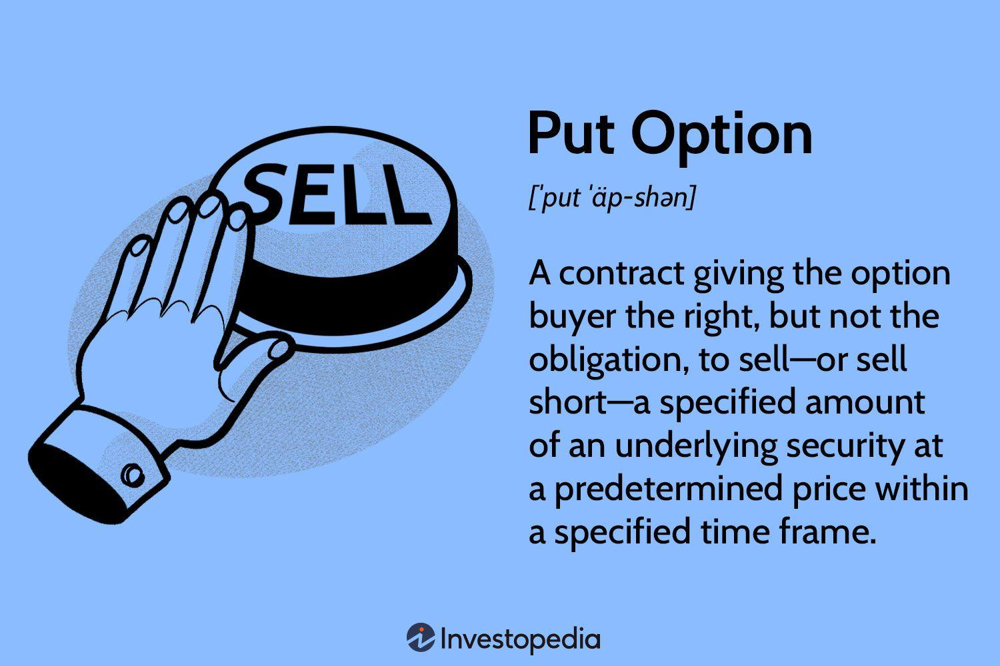

## Table of Contents

## What does 'Put to Seller' mean in simple terms?

When you see "Put to Seller" on a financial document, it means that the buyer of a put option has decided to use their right to sell the underlying asset to the seller of the option. In simple terms, if you bought a put option, you're betting that the price of the asset will go down. If it does, you can choose to sell it to the person who sold you the option at the price you agreed on, no matter what the current market price is.

This action is called "exercising" the put option. When you exercise it, the seller of the option is obligated to buy the asset from you at the agreed-upon price, even if the market price is lower. This can be a good strategy for the buyer if they want to limit their losses or make a profit from a falling market. For the seller, it means they have to be ready to buy the asset if the buyer decides to exercise their option.

## How does the 'Put to Seller' option work in trading?

When you trade options, a 'Put to Seller' happens when someone who bought a put option decides to use it. A put option is like a contract that gives you the right to sell a certain asset, like a stock, at a set price before a certain date. If you think the price of the stock is going to drop, you might buy a put option. If the stock price does go down, you can choose to 'put' the stock to the seller of the option. This means you sell the stock to them at the price you agreed on when you bought the option, even if the stock's market price is now lower.

When you decide to 'put' the stock to the seller, you are exercising your put option. The seller of the option, who might be another trader or an options writer, has to buy the stock from you at the agreed price. This can be a good move for you if you want to limit your losses or make a profit from the falling stock price. For the seller, it means they have to be ready to buy the stock if you decide to exercise your option. This is why sellers of put options usually get paid a premium when they sell the option, to cover the risk they take on.

## What are the basic requirements for a 'Put to Seller' transaction?

For a 'Put to Seller' transaction to happen, you need to have bought a put option first. This means you paid a certain amount, called a premium, to have the right to sell a specific asset, like a stock, at a set price before the option expires. The price you can sell at is called the strike price. You'll want to do this if you think the price of the asset is going to drop below the strike price before the option's expiration date.

When you decide it's time to use your put option, you 'put' the asset to the seller. This means you tell the person who sold you the option that you want to sell the asset to them at the strike price. The seller has to buy it from you at that price, even if the market price is lower now. This can help you make a profit or limit your losses if the asset's price has gone down. The seller gets the asset but has to pay the strike price, which they agreed to when they sold you the option.

## Can you explain the process of exercising a 'Put to Seller' option?

When you want to exercise a 'Put to Seller' option, you first need to have bought a put option. This means you paid a premium to get the right to sell a specific asset, like a stock, at a certain price, called the strike price, before the option's expiration date. If you think the price of the stock is going to drop below the strike price, you might decide to use your option. To do this, you tell your broker that you want to exercise your put option.

Once you exercise your put option, the seller of the option has to buy the stock from you at the strike price. This can be a good move for you if you want to make a profit or limit your losses because the stock's price has gone down. The seller, on the other hand, has to buy the stock at the agreed-upon price, even if the market price is lower now. This is why the seller got a premium when they sold you the option, to cover the risk they took on.

## What are the potential benefits of using a 'Put to Seller' option for a buyer?

Using a 'Put to Seller' option can help a buyer protect themselves if they think a stock's price will go down. When you buy a put option, you're basically buying the right to sell the stock at a certain price, no matter what happens to the stock's market price. If the stock does drop below that price, you can use your option to sell the stock to the seller at the higher price you agreed on. This can help you limit your losses because you're not stuck selling the stock at the lower market price.

Another benefit is that you can make a profit if the stock price falls. If you bought the put option and the stock's price goes down a lot, you can sell the stock to the seller at the higher strike price and then buy it back at the lower market price. This way, you make money from the difference. It's like betting that the stock will go down, and if you're right, you can come out ahead.

## What risks does a seller face when a 'Put to Seller' option is exercised?

When a seller of a put option has the option exercised against them, they face the risk of having to buy the stock at a higher price than the current market value. This happens if the buyer decides to 'put' the stock to the seller at the agreed-upon strike price, which could be higher than what the stock is worth now. The seller has to pay this higher price, which can lead to a loss if they then sell the stock at the lower market price.

Another risk for the seller is that they might have to come up with the money to buy the stock. If they don't have enough cash on hand, they might need to sell other investments or borrow money, which can be stressful and costly. The seller took on this risk when they sold the put option and received the premium, but if the stock price drops a lot, the premium might not be enough to cover the loss they face when the option is exercised.

## How does the pricing of a 'Put to Seller' option get determined?

The price of a 'Put to Seller' option, which is also called the premium, is figured out by looking at a few things. One big thing is how much the stock's price might change, which is called volatility. If the stock's price could go up or down a lot, the option will cost more because it's riskier for the seller. Another thing is how long the option lasts. The longer the time until the option expires, the more it will cost, because there's more time for the stock's price to move. The difference between the stock's current price and the strike price also matters. If the strike price is a lot higher than the stock's current price, the option will be cheaper because it's less likely the buyer will use it.

The overall mood of the market also plays a role in setting the price. If people are feeling worried and think stock prices might go down, put options might cost more because more people want to buy them. The interest rates can affect the price too, though this is a smaller factor. Higher interest rates can make the option a bit more expensive. All these things together help decide how much someone has to pay to buy a put option, and how much the seller gets for taking on the risk of having to buy the stock if the buyer decides to use the option.

## What are some common strategies involving 'Put to Seller' options?

One common strategy using 'Put to Seller' options is called protective puts. If you own a stock and you're worried its price might go down, you can buy a put option on that stock. This means you have the right to sell the stock at a set price, even if the market price drops. It's like buying insurance for your stock. If the stock price does fall, you can use your put option to sell the stock at the higher price you agreed on, which helps limit your losses. If the stock price stays the same or goes up, you only lose the money you paid for the put option, but you still have your stock.

Another strategy is called put selling or writing puts. If you think a stock's price will stay the same or go up, you can sell put options on that stock. When you sell a put, you get paid a premium right away, which is like getting paid to wait. If the stock price stays above the strike price, the buyer won't use their option, and you keep the premium as profit. But if the stock price falls below the strike price and the buyer uses their option, you have to buy the stock at the higher strike price. This can be a good way to buy a stock you like at a lower price, but it comes with the risk of having to buy the stock if the price drops.

A third strategy is called a put spread. This involves buying one put option and selling another put option with a different strike price on the same stock. For example, you might buy a put option with a higher strike price and sell a put option with a lower strike price. This can help you make money if the stock price goes down, but it also limits how much you can lose. The money you get from selling the lower strike put helps pay for the put you bought, making the overall cost lower. This strategy can be a bit more complex, but it's a way to manage risk while still trying to make a profit from a falling stock price.

## How do market conditions affect the decision to use a 'Put to Seller' option?

Market conditions play a big role in deciding whether to use a 'Put to Seller' option. If the market is feeling nervous and people think stock prices might go down, buying a put option can be a smart move. It's like buying insurance for your stock. If the stock price does drop, you can use your put option to sell the stock at a higher price than the market, which helps you limit your losses. On the other hand, if the market is feeling good and stock prices are going up, you might not want to buy a put option because it's less likely you'll need to use it, and you'll just lose the money you paid for the option.

The overall mood of the market also affects how much you have to pay for a put option. When people are worried and think stock prices might fall, more people want to buy put options, so the price goes up. If the market is calm and stock prices are stable, put options might be cheaper because fewer people want them. So, when deciding whether to use a 'Put to Seller' option, you need to think about what's happening in the market and how likely it is that the stock price will go down.

## What are the tax implications of exercising a 'Put to Seller' option?

When you exercise a 'Put to Seller' option, it can affect your taxes. If you use your put option to sell a stock, you might have to pay capital gains tax on any profit you make. The profit is the difference between the price you sell the stock at (the strike price) and the price you originally bought the stock for. If you held the stock for less than a year, you'll pay short-term capital gains tax, which is the same as your regular income tax rate. If you held it for more than a year, you'll pay long-term capital gains tax, which is usually lower.

The premium you paid for the put option also comes into play. You can't deduct the cost of the premium right away, but it can help lower your capital gains when you sell the stock. If you don't use your put option and it expires, you can usually deduct the cost of the premium as a capital loss on your taxes. This can help offset any other capital gains you have, or up to $3,000 of your regular income if you don't have any capital gains. Always talk to a tax professional to make sure you're handling your taxes the right way, because tax laws can change and be complicated.

## How can advanced traders use 'Put to Seller' options to hedge their portfolios?

Advanced traders often use 'Put to Seller' options as a way to protect their portfolios from big drops in the market. If a trader owns a lot of stocks and is worried that the prices might go down, they can buy put options on those stocks. This means they have the right to sell the stocks at a set price, even if the market price falls lower. It's like buying insurance for their stocks. If the market does drop, the trader can use the put options to sell the stocks at the higher price they agreed on, which helps limit their losses. This strategy is called a protective put, and it's a common way for traders to hedge their portfolios.

Another way advanced traders use put options is by selling them, which can also help manage risk. If a trader thinks a stock's price will stay the same or go up, they might sell put options on that stock. They get paid a premium right away, which is like getting paid to wait. If the stock price stays above the strike price, the buyer of the put option won't use it, and the trader keeps the premium as profit. But if the stock price falls below the strike price and the buyer uses their option, the trader has to buy the stock at the higher strike price. This can be a good way to buy a stock at a lower price, but it comes with the risk of having to buy the stock if the price drops. By carefully choosing which stocks to sell put options on, traders can hedge their portfolios while potentially making money from the premiums.

## What are some real-world examples of 'Put to Seller' options being used effectively?

Imagine you own shares in a company called ABC Corp, and you're worried that the stock price might drop because of some bad news coming up. To protect yourself, you buy a put option on ABC Corp with a strike price of $50. A few weeks later, the bad news hits, and the stock price falls to $40. You decide to use your put option and sell your shares to the seller at $50 each, even though the market price is only $40. This way, you limit your losses because you sold at a higher price than the market. You only lose the money you paid for the put option, but you saved yourself from a bigger loss.

Another example is when a trader named Sarah thinks that XYZ Inc.'s stock price will stay the same or go up. She decides to sell put options on XYZ Inc. with a strike price of $30. She gets paid a premium for selling these options. If the stock price stays above $30, the buyers of the put options won't use them, and Sarah keeps the premium as profit. But if the stock price falls below $30 and the buyers use their options, Sarah has to buy the stock at $30 per share. She was okay with this because she wanted to own XYZ Inc. at a lower price anyway. By selling the put options, she made some money from the premiums and got the stock at a price she was happy with.

## What is the understanding of financial instruments?

Financial instruments are foundational components of financial markets, representing contracts that create financial assets for one party and financial liabilities or equity instruments for another. They facilitate the transfer of funds in the economy and enable entities to manage consumption, investment, and risk. 

Common types of financial instruments include stocks, bonds, exchange-traded funds (ETFs), options, and derivatives. Each carries distinct risk profiles and potential returns, suitable for different investor goals and circumstances:

- **Stocks** represent ownership in a corporation, providing potential capital appreciation and dividends. Their value is directly linked to the company’s performance and market perception.
- **Bonds** are fixed-income instruments that represent loans made by an investor to a borrower. They typically offer regular interest payments and are perceived as lower-risk compared to stocks.
- **Exchange-Traded Funds (ETFs)** are investment funds traded on stock exchanges, similar to stocks, which hold assets such as stocks, commodities, or bonds. ETFs provide diversification and are an effective way for investors to gain exposure to a broad market index.
- **Options** are contracts that give the holder the right, but not the obligation, to buy or sell an asset at a predetermined price before a specified date. They are used for hedging and speculative purposes, introducing complex risk-reward scenarios.
- **Derivatives** are financial contracts whose value is dependent on an underlying asset or group of assets, such as futures and forwards. They are used for hedging, speculation, or gaining access to otherwise unavailable markets or assets.

Investors select financial instruments based on their risk tolerance, financial goals, and prevailing market conditions. High-risk instruments may offer higher returns but come with greater [volatility](/wiki/volatility-trading-strategies), while lower-risk instruments provide stability with modest returns.

Diversification, spreading investments across various financial instruments, is a widely used strategy to mitigate risk. By holding a mix of assets, investors can reduce the impact of a poor-performing asset on the overall portfolio. The principle behind diversification is that the performance of various investments will, on average, yield a higher cumulative return and pose a lower risk than any individual investment found within the portfolio.

Implementing diversification mathematically can involve calculating the portfolio variance, which is expressed as:

$$
\sigma_p^2 = \sum_{i=1}^{n}w_i^2\sigma_i^2 + \sum_{i=1}^{n}\sum_{j\neq i}w_iw_j\sigma_i\sigma_j\rho_{ij}
$$

where:
- $\sigma_p^2$ is the portfolio variance,
- $w_i$ is the weight of the $i$-th asset in the portfolio,
- $\sigma_i$ is the standard deviation of the $i$-th asset,
- $\rho_{ij}$ is the correlation coefficient between the returns of assets $i$ and $j$.

This equation underscores the importance of asset correlation in diversification, where less correlated assets contribute more effectively to reducing overall portfolio risk.

In conclusion, understanding and strategically employing a variety of financial instruments enable investors to optimize their portfolios in alignment with individual objectives and market dynamics. By balancing risk and return through diversification and informed selection, investors can enhance their potential for long-term financial success.

## What is the Put to Seller Investment Strategy?

A 'put to seller' investment strategy, commonly known as put selling, involves the writer selling put options with the intent to eventually buy the underlying asset, should the option be exercised. This strategy appeals to investors looking to acquire shares at a specified, reduced price, often below the current market value, while generating income through the option premium.

When an investor sells a put option, they receive a premium from the buyer. The option gives the purchaser the right, but not the obligation, to sell the underlying asset at a predetermined strike price before or on a specified expiration date. If the market price of the asset remains above the strike price until the option's expiration, the put option is likely to expire worthless, allowing the seller to retain the premium as profit without purchasing the asset. 

However, if the market price falls below the strike price, the buyer may exercise the put option, requiring the seller to purchase the asset at the strike price. This scenario benefits the seller if they initially intended to buy the asset at a lower price, as the effective purchase price is reduced by the premium received:

$$
\text{Effective Purchase Price} = \text{Strike Price} - \text{Premium Received}
$$

The put selling strategy can be particularly advantageous when investors are bullish on the underlying asset and are confident it will appreciate in value over time. It combines the potential for profit from the premium with the opportunity to own the stock at an attractive price point while also serving as a risk management tool.

To illustrate put selling, consider the following example:

```python
# Calculating potential profit from a put selling scenario
strike_price = 50  # Example strike price of the put option
market_price = 55  # Current market price
premium_received = 5  # Premium received per option

effective_purchase_price = strike_price - premium_received

if market_price < strike_price:
    # Option is exercised
    print(f"Buy the stock at effective price: {effective_purchase_price}")
else:
    # Option expires worthless
    print(f"Profit from premium: {premium_received}")
```

In this example, if the market price remains above the strike price, the investor profits from the premium. If the price falls below the strike, they purchase the stock at an effective price lower than the strike price.

Despite its advantages, put selling carries risks. The primary risk involves a significant drop in the asset's market price below the strike price, obligating the investor to purchase the asset at a loss when market conditions are unfavorable. Additionally, the seller must maintain sufficient capital to support the potential purchase of the underlying asset if exercised.

Overall, put selling is a strategic approach that aligns well with investors looking to combine income generation through options premiums with opportunities to acquire equity at lower costs. Successful implementation requires a thorough understanding of market trends, asset valuation, and potential risks associated with this investment strategy.

## References & Further Reading

[1]: Bergstra, J., Bardenet, R., Bengio, Y., & Kégl, B. (2011). ["Algorithms for Hyper-Parameter Optimization."](https://papers.nips.cc/paper/4443-algorithms-for-hyper-parameter-optimization) Advances in Neural Information Processing Systems 24.

[2]: ["Advances in Financial Machine Learning"](https://www.amazon.com/Advances-Financial-Machine-Learning-Marcos/dp/1119482089) by Marcos Lopez de Prado

[3]: ["Evidence-Based Technical Analysis: Applying the Scientific Method and Statistical Inference to Trading Signals"](https://www.amazon.com/Evidence-Based-Technical-Analysis-Scientific-Statistical/dp/0470008741) by David Aronson

[4]: ["Machine Learning for Algorithmic Trading"](https://github.com/stefan-jansen/machine-learning-for-trading) by Stefan Jansen

[5]: ["Quantitative Trading: How to Build Your Own Algorithmic Trading Business"](https://www.amazon.com/Quantitative-Trading-Build-Algorithmic-Business/dp/1119800064) by Ernest P. Chan