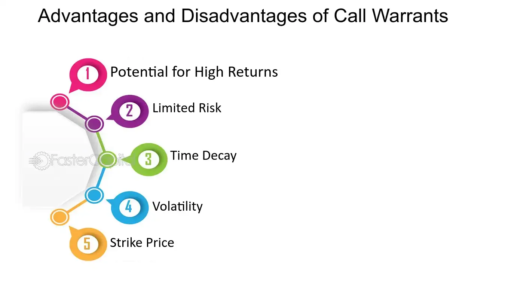

## Table of Contents

## What is a put warrant?

A put warrant is a financial tool that gives the buyer the right, but not the obligation, to sell a specific asset at a set price before a certain date. This asset could be a stock, a commodity, or another financial product. The set price is called the strike price, and the final date is known as the expiration date. If the market price of the asset falls below the strike price, the buyer can use the put warrant to sell the asset at the higher strike price, making a profit from the difference.

Put warrants are often used by investors to protect against falling prices in the market. For example, if an investor owns a stock and is worried that its price might drop, they can buy a put warrant on that stock. If the stock price does fall, the put warrant allows them to sell the stock at the higher strike price, reducing their losses. However, if the stock price stays the same or goes up, the investor can simply let the put warrant expire without using it, only losing the cost of the warrant itself.

## How does a put warrant work?

A put warrant is like a special ticket that lets you sell something at a certain price before a specific date. Imagine you have a toy, and you think its price might go down. You can buy a put warrant that says you can sell that toy for $10 even if the price drops to $5. If the price does go down, you can use your put warrant to sell the toy for $10 and make a profit. But if the price stays the same or goes up, you don't have to use the put warrant, and you just lose the small amount you paid for it.

People often use put warrants to protect their investments. If you own a stock and you're worried its price might fall, you can buy a put warrant for that stock. This way, if the stock price does drop, you can sell it at the higher price stated in the put warrant, which helps you lose less money. If the stock price doesn't fall, you don't have to use the put warrant, and you only lose the cost of buying it. It's like buying insurance for your investments.

## What are the key components of a put warrant?

A put warrant has a few important parts that you need to know about. The first part is the strike price, which is the price at which you can sell the asset. If the market price of the asset falls below this strike price, you can use the put warrant to sell it at the higher strike price and make a profit. The second part is the expiration date, which is the last day you can use the put warrant. If you don't use it by this date, the put warrant becomes worthless.

The third part is the premium, which is the price you pay to buy the put warrant. This is like an insurance cost, and it's the most you can lose if you decide not to use the put warrant. The last part is the underlying asset, which is what the put warrant is based on. This could be a stock, a commodity, or another financial product. Knowing these parts helps you understand how put warrants work and how they can protect your investments.

## What are the advantages of investing in put warrants?

Investing in put warrants can help protect your money when you think the price of something you own might go down. If you own a stock and you're worried its price will drop, you can buy a put warrant. This put warrant lets you sell the stock at a higher price than the market price if it falls. This way, you lose less money. It's like having insurance for your investment, which can give you peace of mind.

Another advantage is that put warrants can be a way to make money if you think the price of something will go down. If you believe a stock's price will drop, you can buy a put warrant and then sell the stock at the higher strike price when it falls. This can be a smart move if you're good at guessing market trends. However, remember that if the price doesn't go down, you'll lose the money you spent on the put warrant.

## How can put warrants be used for hedging?

Put warrants can be used for hedging to protect your investments from losing too much value. If you own a stock and you're worried its price might drop, you can buy a put warrant for that stock. The put warrant lets you sell the stock at a set price, called the strike price, even if the market price falls below that. This means if the stock's price does go down, you can use the put warrant to sell it at the higher strike price, which helps you lose less money. It's like buying insurance for your stock to protect it from big price drops.

Using put warrants for hedging can give you peace of mind. If you're worried about a big drop in the market, put warrants can help you feel more secure about your investments. You only lose the small amount you paid for the put warrant if the stock price doesn't drop. This way, you can keep your investment safe without worrying too much about short-term price changes.

## What are the risks associated with put warrants?

One risk of put warrants is that you might lose the money you paid for them. If the price of the stock doesn't fall below the strike price before the expiration date, the put warrant becomes worthless. You can only get back the money you spent on the put warrant if you sell it to someone else before it expires, but there's no guarantee you'll find a buyer.

Another risk is that put warrants can be complicated. They have a lot of parts like the strike price, expiration date, and premium, which can be hard to understand. If you don't fully understand how put warrants work, you might make a mistake and lose money. It's important to learn about them or talk to a financial advisor before you start using them.

## How do put warrants differ from put options?

Put warrants and put options both give you the right to sell something at a set price before a certain date, but they have some key differences. One big difference is who issues them. Put options are usually issued by an options exchange, while put warrants are issued by financial institutions like banks. This means that put warrants can be more customized to fit specific needs, while put options are standardized and easier to trade.

Another difference is how long they last. Put options typically have shorter expiration dates, often ranging from a few weeks to a few months. Put warrants, on the other hand, can last much longer, sometimes up to several years. This longer duration can be useful if you want to protect your investment for a longer time. However, because of these differences, put warrants might be less liquid than put options, meaning it can be harder to buy or sell them quickly.

## What are the tax implications of trading put warrants?

When you trade put warrants, you need to think about taxes. If you make money from put warrants, you have to pay taxes on your profits. The tax you pay depends on how long you held the put warrant before selling it. If you held it for a year or less, it's considered a short-term capital gain, and you'll pay taxes at your regular income tax rate. If you held it for more than a year, it's a long-term capital gain, and the tax rate is usually lower.

On the other hand, if you lose money on put warrants, you might be able to use those losses to lower your taxes. You can use these losses to offset any gains you made from other investments. If your losses are more than your gains, you can deduct up to $3,000 of those losses from your regular income each year. Any leftover losses can be carried over to future years. It's a good idea to talk to a tax advisor to make sure you're doing everything right with your taxes when trading put warrants.

## How do market conditions affect the value of put warrants?

Market conditions can really change the value of put warrants. If the price of the stock or asset that the put warrant is based on starts to go down, the value of the put warrant goes up. This is because the put warrant gives you the right to sell the asset at a higher price than what it's worth in the market. So, if people think the price will keep falling, they'll pay more for the put warrant. On the other hand, if the price of the asset goes up or stays the same, the value of the put warrant goes down because it's less likely you'll want to use it.

Another thing that affects put warrants is how much time is left before they expire. If there's a lot of time left, the put warrant can be worth more because there's more chance for the price to change. But as the expiration date gets closer, the value can drop quickly if the price of the asset hasn't moved in the way you hoped. Also, if the market is very unsure and prices are moving a lot, put warrants can be worth more because they help protect against big price drops.

## What strategies can be employed using put warrants?

One strategy you can use with put warrants is to protect your investments. If you own a stock and you're worried its price might go down, you can buy a put warrant for that stock. This way, if the stock's price does drop, you can sell it at the higher price set by the put warrant, which helps you lose less money. It's like buying insurance for your stock. If the stock's price stays the same or goes up, you don't have to use the put warrant, and you only lose the small amount you paid for it.

Another strategy is to make money if you think a stock's price will go down. If you believe a stock's price will fall, you can buy a put warrant and then sell the stock at the higher strike price when it drops. This can be a good way to make money if you're good at guessing market trends. But remember, if the stock's price doesn't go down, you'll lose the money you spent on the put warrant.

## How does the expiration date impact the value of a put warrant?

The expiration date of a put warrant is really important because it decides how long you have to use it. If there's a lot of time left before the put warrant expires, it can be worth more. This is because you have more time for the price of the stock to go down, which would make the put warrant useful. But if the expiration date is coming up soon, the value of the put warrant can drop quickly, especially if the stock's price hasn't moved in the way you hoped.

As the expiration date gets closer, the value of the put warrant can change a lot. If the stock's price is still above the strike price as the expiration date nears, the put warrant becomes less valuable because there's less time for the price to drop below the strike price. On the other hand, if the stock's price is already below the strike price, the put warrant can still be valuable, but you'll need to decide whether to use it or sell it before it expires.

## What criticisms are commonly leveled against put warrants?

Some people say that put warrants can be too complicated. They have a lot of parts like the strike price, expiration date, and premium, which can be hard to understand. If you don't know how put warrants work, you might make a mistake and lose money. Also, put warrants can be less easy to buy and sell compared to other investments, which can make them riskier.

Another criticism is that put warrants can be expensive. You have to pay a premium to buy them, and if the stock's price doesn't go down like you hoped, you lose that money. Some people think that the cost of the put warrant might be more than the protection it gives. Plus, if you're wrong about the stock's price going down, you don't get that money back.

## What are put warrants?

A put warrant is a financial instrument offering the holder the right, but not the obligation, to sell an underlying asset at a predetermined price before a specified expiration date. This financial tool serves as a mechanism for investors to hedge against potential declines in the market price of the underlying asset, similar to the function of standard put options. The primary advantage of put warrants is their capacity to provide protection from downward price movements, giving investors a strategic tool to mitigate risk.

Put warrants are frequently issued by the same company that underlies the asset, which differentiates them from standard put options that are typically traded on exchanges and written by independent entities. This issuance by the asset-owning company implies that put warrants may have more extended durations compared to those of typical options, which can be appealing for long-term investment strategies. The longer duration allows for more flexibility in planning and executing investment strategies, as investors are not pressured by short-term expirations. 

Understanding the structure and terms of a put warrant is critical, as it influences its functional use and the risks associated with it. When evaluating a put warrant, investors should assess the strike price and expiration date relative to the current market conditions and their expectations for future price movements. The intrinsic value is calculated by the formula:

$$
\text{Intrinsic Value} = \max(0, \text{Strike Price} - \text{Current Market Price})
$$

where the intrinsic value represents the immediate exercise value. Additionally, the time value reflects the uncertainty and potential for favorable movement before expiration. 

In practice, integrating put warrants into an investment strategy allows for sophisticated hedging techniques, enabling investors to safeguard against losses while maintaining the potential for gains. This is particularly valuable in volatile market environments where price fluctuations are unpredictable and abrupt.

## References & Further Reading

[1]: Bergstra, J., Bardenet, R., Bengio, Y., & Kégl, B. (2011). ["Algorithms for Hyper-Parameter Optimization."](https://papers.nips.cc/paper/4443-algorithms-for-hyper-parameter-optimization) Advances in Neural Information Processing Systems 24.

[2]: ["Advances in Financial Machine Learning"](https://www.amazon.com/Advances-Financial-Machine-Learning-Marcos/dp/1119482089) by Marcos Lopez de Prado

[3]: ["Evidence-Based Technical Analysis: Applying the Scientific Method and Statistical Inference to Trading Signals"](https://www.amazon.com/Evidence-Based-Technical-Analysis-Scientific-Statistical/dp/0470008741) by David Aronson

[4]: ["Machine Learning for Algorithmic Trading"](https://github.com/stefan-jansen/machine-learning-for-trading) by Stefan Jansen

[5]: ["Quantitative Trading: How to Build Your Own Algorithmic Trading Business"](https://github.com/LucindaYa/quant-resources/blob/master/Quantitative%20Trading%20How%20to%20Build%20Your%20Own%20Algorithmic%20Trading%20Business.pdf) by Ernest P. Chan