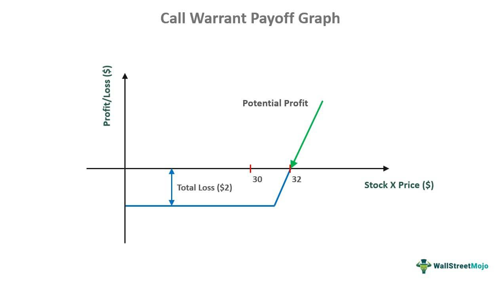

In the volatile world of financial investments, various securities such as put warrants and innovative strategies like algorithmic trading have significantly transformed the investment landscape. The ever-evolving dynamics of financial markets demand robust tools and techniques that can enhance decision-making processes and provide strategic advantages. This article focuses on investment financial securities, with a particular emphasis on put warrants, and examines the role of algorithmic trading in optimizing financial returns.

Put warrants are intricate financial instruments that provide investors the right to sell an asset at a set price, offering protective measures against market downturns. By enabling investors to hedge risks associated with declines in asset prices, put warrants become vital components in diversified portfolios. Understanding their mechanisms, associated risks, and benefits can empower investors to make informed decisions that align with their financial goals.



Concurrently, algorithmic trading has emerged as a groundbreaking strategy that leverages advanced computational algorithms to automate trade execution. The precision and speed of algorithmic trading surpass human capabilities, allowing for quick adaptation to market changes and the identification of profitable trading opportunities. This technological advancement not only supports enhanced risk management but also allows for strategic optimization of investment portfolios.

By demystifying these complex financial instruments and strategies, investors can better leverage them to bolster their portfolios. The synergy between traditional securities like put warrants and modern computational strategies heralds a new era of investment possibilities, allowing for increased flexibility and resilience in managing financial assets. As the investment landscape continues to evolve, harnessing the full potential of these tools becomes essential for achieving sustainable financial success.

## Table of Contents

## Understanding Financial Securities

Financial securities are tradable financial instruments that hold some form of monetary value. These instruments are crucial components of the financial markets, reflecting the financial health and expectations of companies, governments, and other institutions. They serve as a bridge between entities needing funds and those with surplus capital seeking returns on investment.

### Types of Financial Securities

#### Stocks
Stocks, or equities, represent ownership in a corporation, giving shareholders a claim on part of the company's assets and earnings. Investors buy stocks primarily for capital appreciation and income generation through dividends. Stocks are categorized broadly into common and preferred stocks. Common stockholders have voting rights in the company and receive dividends that fluctuate based on company performance, whereas preferred stockholders have a higher claim on assets and earnings but typically do not have voting rights.

#### Bonds
Bonds are fixed-income securities that represent a loan made by an investor to a borrower, typically corporate or governmental. Bonds are used by these entities to finance projects and operations. They pay periodic interest and return the principal at maturity. The main appeal of bonds is their relatively stable returns compared to more volatile equities, making them an essential tool for income generation and risk mitigation. Types of bonds include treasury bonds, corporate bonds, municipal bonds, and high-yield or "junk" bonds.

#### Derivatives
Derivatives are complex financial contracts whose value is dependent on, or derived from, an underlying asset or group of assets. These include options, futures, forwards, and swaps. Derivatives are used in financial markets to hedge risks, speculate on price movements, or enhance investment returns. While they provide strategic flexibility, they also come with significant risk, requiring a deep understanding from investors.

### Roles in Capital Markets and Corporate Financing

In capital markets, these securities facilitate efficient allocation of resources by connecting investors with businesses or governments in need of funding. They enable [liquidity](/wiki/liquidity-risk-premium), allowing for the quick conversion of securities to cash, and price discovery, helping determine the fair value of assets. For corporations, issuing securities is a critical avenue for raising capital. Stocks provide permanent capital without fixed obligations, while bonds and other fixed-income instruments typically offer lower financing costs compared to bank loans.

### Investor Goals

Each type of financial security caters to specific investor objectives:

- **Income Generation:** Bonds and certain stocks provide regular income through interest payments or dividends, appealing to income-focused investors such as retirees.

- **Hedging Risks:** Derivatives are extensively used for hedging purposes, allowing investors to protect against adverse price movements in stocks, commodities, or currencies.

- **Capital Appreciation:** Investors seek growth through equities, aiming for increased stock value over time based on company performance and market conditions.

Understanding these financial securities is foundational for investors aiming to diversify their portfolio, optimize returns, and manage risks effectively in varied economic climates.

## What Are Put Warrants?

A put warrant is a financial instrument offering the holder the right, but not the obligation, to sell an underlying asset at a predetermined price before a specified expiration date. This financial tool serves as a mechanism for investors to hedge against potential declines in the market price of the underlying asset, similar to the function of standard put options. The primary advantage of put warrants is their capacity to provide protection from downward price movements, giving investors a strategic tool to mitigate risk.

Put warrants are frequently issued by the same company that underlies the asset, which differentiates them from standard put options that are typically traded on exchanges and written by independent entities. This issuance by the asset-owning company implies that put warrants may have more extended durations compared to those of typical options, which can be appealing for long-term investment strategies. The longer duration allows for more flexibility in planning and executing investment strategies, as investors are not pressured by short-term expirations. 

Understanding the structure and terms of a put warrant is critical, as it influences its functional use and the risks associated with it. When evaluating a put warrant, investors should assess the strike price and expiration date relative to the current market conditions and their expectations for future price movements. The intrinsic value is calculated by the formula:

$$
\text{Intrinsic Value} = \max(0, \text{Strike Price} - \text{Current Market Price})
$$

where the intrinsic value represents the immediate exercise value. Additionally, the time value reflects the uncertainty and potential for favorable movement before expiration. 

In practice, integrating put warrants into an investment strategy allows for sophisticated hedging techniques, enabling investors to safeguard against losses while maintaining the potential for gains. This is particularly valuable in volatile market environments where price fluctuations are unpredictable and abrupt.

## Benefits and Criticisms of Put Warrants

Put warrants are financial instruments that offer particular benefits to investors, notably through their hedging capabilities and the flexibility of an extended time frame for execution. These attributes make put warrants attractive to investors seeking to protect against downward price movements in the underlying asset. Unlike standard put options, which typically have shorter durations, put warrants may be issued with longer lifespans, enhancing their utility in strategic financial planning.

Investors use put warrants primarily for hedging against declines in asset prices. By securing the right to sell at a predetermined strike price, investors can safeguard their portfolios against adverse market conditions. This hedging mechanism is beneficial for managing risk, particularly during periods of market [volatility](/wiki/volatility-trading-strategies) or economic uncertainty.

Another advantage of put warrants is their ability to attract substantial investments to issuing companies. When a company provides put warrants on its own stock, it signals a commitment to shareholder value and confidence in its long-term financial health. This can appeal to a broad spectrum of investors, ranging from individual retail investors to large institutional entities, by providing assurance regarding potential downside protection.

However, despite these benefits, put warrants are not devoid of criticisms. One significant issue is the potential conflict of interest stemming from the issuer's ability to honor the warrants, especially if their stock prices drop drastically. In scenarios where a company's stock price plummets, fulfilling the obligations of the warrants might place a financial strain on the issuer, possibly leading to situations where warrants are not honored as expected. This risk underscores the necessity for investors to meticulously assess the issuer's financial stability and the terms of the warrants.

To mitigate these inherent risks, understanding the collateral terms associated with the put warrants and evaluating the issuer's financial health is crucial. Investors need to perform thorough due diligence, which includes analyzing the company's balance sheets, cash flow statements, and overall market position. By doing so, they can make informed investment decisions and avoid potential pitfalls associated with the issuer's financial incapacity or unwillingness to meet its obligations.

Overall, while put warrants offer substantial advantages as hedging tools and instruments for investor attraction, they also [carry](/wiki/carry-trading) risks linked to issuer reliability. Consequently, a well-rounded investment approach necessitates careful consideration and analysis of both the benefits and potential drawbacks.

## Algorithmic Trading: Revolutionizing Investment Strategies

Algorithmic trading is a methodology that employs computer algorithms to execute trades with outstanding speed and precision, far surpassing the capabilities of human traders. These algorithms are designed to analyze a wide range of market data — including historical prices, trading volumes, and broad economic indicators — to identify lucrative trading opportunities. By systematically sifting through large volumes of data, algorithms can pinpoint optimal entry and [exit](/wiki/exit-strategy) points, thus maximizing profits while minimizing risks.

The efficiency of [algorithmic trading](/wiki/algorithmic-trading) comes from its ability to process information and execute trades in real time, often completing transactions in milliseconds. This speed allows traders to capitalize on transient market inefficiencies that would be impossible to exploit with manual trading. Algorithmic systems often incorporate a mix of technical analysis, statistical [arbitrage](/wiki/arbitrage), and predictive modeling to ensure that trades are executed at the most opportune times.

One of the most compelling applications of algorithmic trading is its integration with traditional financial securities, such as put warrants. Put warrants, which give holders the right to sell an asset at a specified price before a certain date, can benefit significantly from algorithmic trading systems. The algorithms can be programmed to track market conditions continuously, adjusting strategies as needed to ensure that the warrants are exercised under optimal circumstances. This could involve analyzing market signals to forecast downward trends, allowing investors to make informed decisions about when to execute their sell rights.

Algorithmic trading’s capacity to enhance the performance of securities like put warrants lies in its systematic approach to investment decisions. By utilizing [machine learning](/wiki/machine-learning) techniques and complex statistical models, these systems can predict market movements and adjust trading strategies dynamically. For example, a simple algorithmic trading strategy for put warrants might involve monitoring the underlying asset's volatility and executing a sell order when a specified threshold is reached. This is achieved through code like the following Python snippet:

```python
import numpy as np

def should_execute_put_warrant(price_changes, threshold=0.05):
    volatility = np.std(price_changes)
    if volatility > threshold:
        return True
    return False

# Example usage
price_changes = [0.02, -0.01, 0.04, -0.03, 0.05]
execute = should_execute_put_warrant(price_changes)
```

In this example, the function `should_execute_put_warrant` calculates the volatility of recent price changes and checks whether it exceeds a pre-defined threshold, indicating significant market shifts that might warrant executing the put warrant.

Moreover, algorithmic trading facilitates improved risk management. By automating the trading process, these algorithms reduce the potential for human error and emotional decision-making, which can often lead to suboptimal investment outcomes. The precision and reliability of algorithmic trading systems provide investors with greater confidence in executing complex strategies, secure in the knowledge that they are based on robust data analysis.

In conclusion, algorithmic trading represents a profound shift in investment strategies, offering unparalleled speed, precision, and analytical power. Its integration with financial instruments like put warrants not only enhances performance and risk management but also provides investors with a potent tool for navigating the complexities of today's financial markets.

## Synergy Between Put Warrants and Algorithmic Trading

Algorithmic trading, characterized by the use of sophisticated algorithms to automate trade execution, can significantly enhance the trading of put warrants. By leveraging technological advancements, it is possible to align trading strategies with optimal market conditions, thereby maximizing the potential benefits of put warrants.

One of the primary advantages of algorithmic trading is its data-driven approach. Algorithms process vast amounts of market data in real-time, allowing investors to make well-informed decisions regarding when to exercise put warrants and when to enter or exit the market. This capability is crucial because the value of put warrants, like other derivatives, is highly sensitive to fluctuations in the underlying asset's price. By continuously monitoring these price movements, algorithms can propose optimal trade actions that align with market trends and investor strategies.

The use of algorithms also facilitates the identification of favorable trading conditions. Through pattern recognition and predictive analytics, algorithms can forecast potential market shifts and adjust trading strategies accordingly. For instance, an algorithm might suggest exercising a put warrant when market conditions indicate a probable downturn in the underlying asset price, thus allowing investors to capitalize on the hedge provided by the warrant.

Furthermore, algorithmic strategies enhance risk management by executing trades with precision and speed, reducing the potential for human error and emotional decision-making. For example, consider a Python script designed to automatically execute a put warrant sale when certain technical indicators reach predefined thresholds:

```python
import numpy as np
import pandas as pd

def calculate_moving_average(data, window_size):
    return data.rolling(window=window_size).mean()

def execute_trade(signals, data):
    for i in range(len(signals)):
        if signals[i] == 'sell':
            print(f"Executing sale on day {i} at price {data[i]}")

# Simulated price data
price_data = pd.Series([100, 102, 98, 95, 97, 96, 92, 93, 90, 88])

# Calculate indicators (e.g., moving average)
moving_average = calculate_moving_average(price_data, window_size=3)

# Generate trade signals based on moving average
signals = ['sell' if price_data[i] < moving_average[i] else 'hold' for i in range(len(price_data))]

# Execute trades
execute_trade(signals, price_data)
```

By integrating such automated systems, investors can substantially improve their execution strategy when trading put warrants, ensuring trades are made at optimal times with minimal latency.

In essence, the combination of algorithmic trading and put warrants provides an enhanced framework for investment strategies. This integration enables investors to potentially achieve higher returns while effectively minimizing losses in volatile markets, thereby adding a layer of strategic flexibility and sophistication to their investment portfolios. As financial markets continue to evolve, the synergy between technological innovation and complex financial instruments like put warrants is likely to become increasingly pivotal.

## Conclusion

Put warrants and algorithmic trading each offer unique advantages within investment strategies, providing tools for risk management, hedging, and opportunity capitalization. Put warrants grant investors the right to sell an asset at a predetermined price, affording a safety net against potential market downturns. This hedge is crucial for maintaining a balanced portfolio, particularly in volatile market conditions. Algorithmic trading, on the other hand, brings in the precision of automation, analyzing vast datasets to execute trades with speed and accuracy that is unattainable by human traders. Algorithms offer an edge by evaluating market trends and executing trades based on quantitative models swiftly, thus optimizing transaction efficiency and reducing human error.

By understanding and appropriately employing these financial instruments and technologies, investors can enhance their strategic flexibility and portfolio resilience. Put warrants allow for strategic exits and securing profits or minimizing losses in fluctuating markets. Concurrently, algorithmic trading can automate the buying or selling of these warrants, ensuring optimal timing and pricing. The synergy between these elements supports investors in crafting robust strategies by providing data-driven insights and timely executions, key factors in navigating today's complex financial markets.

Future trends suggest continued innovation and integration of algorithmic solutions within the broader landscape of financial securities. As technology evolves, the capacity for more sophisticated algorithms will grow, potentially accommodating a wider array of complex securities and fostering a deeper understanding of market dynamics. Investors who adapt to these advancements and integrate them into their strategic frameworks stand to benefit significantly from enhanced profitability and reduced risk. Consequently, ongoing education and adaptation in these domains are imperative for sustaining competitive investment strategies.

## References & Further Reading

[1]: Bergstra, J., Bardenet, R., Bengio, Y., & Kégl, B. (2011). ["Algorithms for Hyper-Parameter Optimization."](https://papers.nips.cc/paper/4443-algorithms-for-hyper-parameter-optimization) Advances in Neural Information Processing Systems 24.

[2]: ["Advances in Financial Machine Learning"](https://www.amazon.com/Advances-Financial-Machine-Learning-Marcos/dp/1119482089) by Marcos Lopez de Prado

[3]: ["Evidence-Based Technical Analysis: Applying the Scientific Method and Statistical Inference to Trading Signals"](https://www.amazon.com/Evidence-Based-Technical-Analysis-Scientific-Statistical/dp/0470008741) by David Aronson

[4]: ["Machine Learning for Algorithmic Trading"](https://github.com/stefan-jansen/machine-learning-for-trading) by Stefan Jansen

[5]: ["Quantitative Trading: How to Build Your Own Algorithmic Trading Business"](https://github.com/LucindaYa/quant-resources/blob/master/Quantitative%20Trading%20How%20to%20Build%20Your%20Own%20Algorithmic%20Trading%20Business.pdf) by Ernest P. Chan