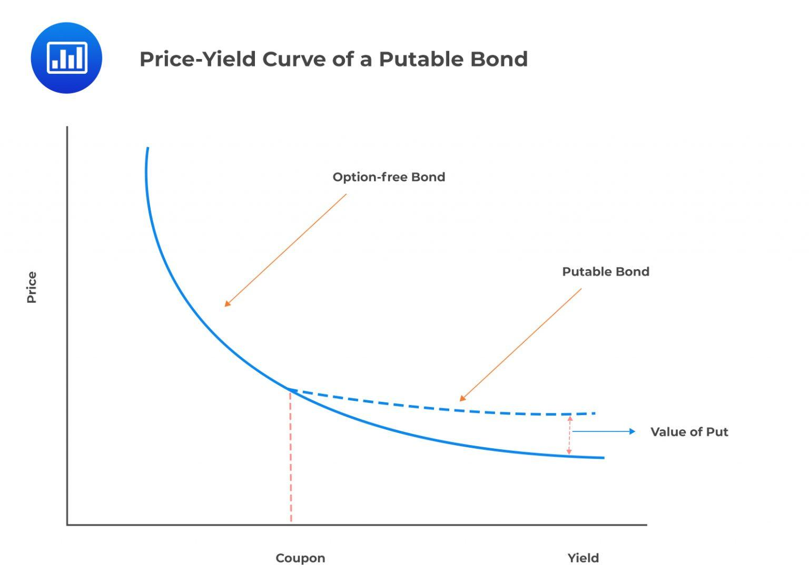

## Table of Contents

## What is putable common stock?

Putable common stock is a type of stock that gives the shareholder the right to sell the stock back to the company at a certain price. This is different from regular common stock, where the shareholder does not have this option. The price at which the stock can be sold back is usually set when the stock is issued. This feature can be attractive to investors because it gives them more control over their investment.

Companies might issue putable common stock to make their shares more appealing to investors. By offering this option, the company can potentially attract more buyers, especially those who want some protection against falling stock prices. However, it also means the company has to be ready to buy back the shares if shareholders decide to use their put option, which can be a financial burden.

## How does putable common stock differ from regular common stock?

Putable common stock and regular common stock are both types of shares in a company, but they have a key difference. With putable common stock, the shareholder has the right to sell the stock back to the company at a set price. This is called a put option. Regular common stock does not come with this right. So, if you own regular common stock, you can't force the company to buy it back from you at a specific price.

This difference can make putable common stock more attractive to some investors. They like the extra control it gives them. If the stock price drops below the set price, they can sell it back to the company and limit their losses. On the other hand, regular common stock doesn't offer this protection. Investors have to sell their shares on the open market, no matter the price. This makes putable common stock a bit safer but can be more costly for the company because they might have to buy back shares.

## What are the benefits of investing in putable common stock?

Investing in putable common stock can give you more control over your investment. If the stock price goes down a lot, you can sell it back to the company at a set price. This can help you limit your losses. It's like having a safety net. If the stock price drops below the price you can sell it back for, you don't have to worry as much because you can get out of the investment without losing too much money.

Another benefit is that putable common stock can be more attractive to investors who are worried about risk. Knowing you have the option to sell the stock back can make you feel more secure. This might make you more willing to invest in the company. It's a way to balance the risk and reward of investing in stocks.

## What are the potential risks associated with putable common stock?

Investing in putable common stock can be risky for the company. If a lot of shareholders decide to sell their stock back to the company at the same time, it can be a big financial burden. The company needs to have enough money to buy back all those shares. If they don't, it could cause problems for the company's finances. This is a big risk that companies need to think about before they decide to issue putable common stock.

For investors, there are risks too. Even though you can sell the stock back to the company, the price you get might not be as high as you want. If the stock price goes way up, you might miss out on making more money because you sold it back at the set price. Also, if the company is having money problems, they might not be able to buy the stock back when you want to sell it. This means you could be stuck with the stock and lose money if the company's situation gets worse.

## How can an investor exercise the put option on putable common stock?

To exercise the put option on putable common stock, an investor needs to follow the rules set by the company when the stock was issued. Usually, this means telling the company that you want to sell your shares back to them. You might need to do this in writing or through a special form. The company will then buy the shares back from you at the set price.

It's important to check the specific terms of the put option because they can be different for each company. Some might have a time limit for when you can exercise the put option, or they might only let you do it during certain times of the year. Make sure you know these details so you can use the put option when you need to.

## What are the typical terms and conditions of the put option in putable common stock?

The terms and conditions of the put option in putable common stock can vary from one company to another, but they usually include a few common elements. One key term is the put price, which is the price at which the shareholder can sell the stock back to the company. This price is set when the stock is issued and might be based on the stock's initial price or some other formula. Another important term is the exercise period, which tells you when you can use the put option. Some companies might let you exercise the option at any time, while others might only allow it during specific times, like once a year or at the end of a certain period.

There are also conditions about how you need to notify the company if you want to exercise the put option. Usually, you have to give written notice, which might need to be done through a special form or letter. The company might also set a deadline for how far in advance you need to notify them. It's important to follow these rules exactly, or you might not be able to sell your stock back. Knowing these terms and conditions helps you understand when and how you can use the put option to protect your investment.

## How does the valuation of putable common stock differ from that of regular common stock?

The valuation of putable common stock is different from regular common stock because of the put option. Putable common stock gives the shareholder the right to sell the stock back to the company at a set price. This makes the stock more valuable because it offers a safety net. If the stock's market price drops below the put price, the shareholder can still sell it back at the higher set price. This reduces the risk for the investor, which can make the stock worth more than regular common stock, where there's no such protection.

To figure out the value of putable common stock, you need to think about both the value of the stock itself and the value of the put option. The stock's value is based on things like the company's earnings, growth, and market conditions, just like regular common stock. But you also have to add the value of the put option, which depends on how likely it is that the stock price will fall below the put price. The more likely this is, the more valuable the put option becomes. This means that putable common stock might be valued higher than regular common stock, especially in uncertain market conditions.

## What impact does the put feature have on the company's financial statements?

The put feature in putable common stock can affect a company's financial statements in a big way. When shareholders can sell their stock back to the company, the company might need to show a liability on its balance sheet. This liability is the money the company might have to pay if shareholders decide to use their put option. If a lot of shareholders want to sell their stock back at the same time, it can make the company's debt look higher. This can make the company seem riskier to investors and lenders.

The put feature can also affect the company's cash flow and income statement. If the company has to buy back a lot of stock, it can use up a lot of cash. This can make it harder for the company to pay for other things it needs, like new projects or paying off other debts. Also, if the company has to buy back stock at a price higher than the current market price, it might have to report a loss on its income statement. This can make the company's profits look lower, which can worry investors.

## How common is putable common stock in the market, and which industries typically use it?

Putable common stock is not very common in the market. Most companies issue regular common stock because it's simpler and doesn't come with the extra costs and risks of having to buy back shares. However, some companies do use putable common stock to make their shares more attractive to investors who want more control and protection against falling stock prices.

The industries that typically use putable common stock are those that might be seen as riskier or more volatile. For example, smaller companies or those in new industries like technology or biotech might offer putable common stock to attract investors. These companies want to show that they are willing to give investors a safety net, which can be a big draw for people who are nervous about investing in something new or uncertain.

## Can you provide historical examples of companies that have issued putable common stock?

One historical example of a company that issued putable common stock is the biotech firm Genzyme Corporation. Back in the early 2000s, Genzyme offered putable common stock to investors as a way to attract more investment. The biotech industry can be very risky because it takes a long time and a lot of money to develop new drugs. By offering putable common stock, Genzyme gave investors a way to feel safer about their investment. If the stock price dropped, investors could sell their shares back to the company at a set price, which helped reduce the risk.

Another example is the tech company Sun Microsystems. In the late 1990s, Sun Microsystems issued putable common stock to help raise money for growth. The tech industry can be very unpredictable, with stock prices going up and down a lot. By offering putable common stock, Sun Microsystems made their shares more appealing to investors who were worried about the ups and downs of the market. This allowed investors to sell their shares back to the company if the stock price fell too low, giving them more control over their investment.

## What are the regulatory considerations for issuing putable common stock?

When a company wants to issue putable common stock, it has to follow certain rules set by financial regulators. These rules can be different depending on the country, but they usually focus on making sure that investors get all the important information they need. The company has to tell investors about the put option, like the price they can sell the stock back for and when they can do it. This helps investors understand the risks and benefits before they buy the stock. The company might also need to get the putable common stock approved by a financial authority, like the Securities and Exchange Commission (SEC) in the United States.

Another thing to think about is how the put feature can affect the company's financial statements. Regulators want to make sure that the company shows the possible costs of buying back the stock correctly. This means the company might need to report a liability on its balance sheet for the money it could have to pay if shareholders use their put option. The company also has to be careful about how it explains the put feature to investors, so they don't make false or misleading statements. Following these rules helps protect investors and keeps the market fair and transparent.

## How do market conditions affect the attractiveness of putable common stock to both issuers and investors?

Market conditions can make putable common stock more or less attractive to issuers. When the market is uncertain or going down, companies might want to issue putable common stock to attract investors. This is because the put feature gives investors a way to feel safer about their investment. If the stock price drops, investors can sell it back to the company at a set price. This can be a big draw for investors who are worried about losing money. But if the market is doing well and stock prices are going up, companies might not need to offer putable common stock. Regular common stock might be enough to attract investors when the market is strong.

For investors, putable common stock can be more attractive when the market is risky or unpredictable. If stock prices are going down or might go down, the put feature lets investors limit their losses. They can sell the stock back to the company at the set price instead of selling it on the open market for less. This can make putable common stock a good choice for investors who want to be careful. But when the market is doing well and stock prices are going up, investors might not care as much about the put feature. They might be more willing to take risks and invest in regular common stock to try to make more money.

## What is the process of decoding stock options?

Stock options are versatile financial instruments that provide investors with the right, but not the obligation, to buy or sell a stock at a predetermined price, known as the strike price. These options come in two primary forms: call options and put options.

### Call and Put Options

Call options give the holder the right to purchase shares at the strike price before or on the expiration date. Investors typically purchase call options when they anticipate an increase in the underlying stock's price. Conversely, put options grant the holder the right to sell shares at the strike price, serving as a hedge against a potential decline in stock value.

Both types of options can be employed for various strategies. For example, investors might use calls for leveraging positions in upward-trending markets or puts to mitigate risks in portfolios. Moreover, these options can cater to speculative interests, allowing investors to capitalize on short-term market movements without the need to own the underlying assets.

### Mechanics of Stock Options

The valuation of options is primarily derived from factors like the underlying stock's current price, the strike price, time until expiration, [volatility](/wiki/volatility-trading-strategies), and interest rates. The Black-Scholes model is a common method for calculating theoretical option prices, emphasizing the complexity and sophistication of options trading. The model's formula is:

$$
C = S_0 \cdot N(d_1) - X \cdot e^{-rt} \cdot N(d_2)
$$

where:

- $C$ is the call option price.
- $S_0$ is the current price of the stock.
- $X$ is the strike price of the option.
- $e$ is the base of the natural logarithm.
- $r$ is the risk-free interest rate.
- $t$ is the time to expiration (in years).
- $N(d)$ is the cumulative distribution function of the standard normal distribution.
- $d_1$ and $d_2$ are determined by specific calculation formulas within the model.

### Hedging and Speculative Purposes

Options are crucial tools for hedging and speculative strategies. Hedging involves taking a position in an option to offset potential losses in another investment. For example, owning put options can protect the downside risk of a portfolio heavily invested in equities. On the speculative side, traders often engage in options trading to profit from price volatility with limited capital exposure compared to trading the underlying stock outright.

### Risks and Rewards of Trading Stock Options

The potential for substantial rewards in options trading comes with significant risks. The primary risk is the chance of losing the entire premium paid for the option if the underlying asset does not move in the anticipated direction. Additionally, options can expire worthless if they're not exercised within the specified timeframe, unlike stocks that do not have expiration dates.

Options trading requires a detailed understanding of the market and the instruments. Therefore, while they present opportunities for strategic advancements in trading, they also demand comprehensive risk assessments and management to prevent potential financial setbacks. Understanding the fundamental mechanics and strategic applications of stock options is essential for investors looking to enhance the robustness and versatility of their investment portfolios.

## References & Further Reading

[1]: ["Quantitative Trading: How to Build Your Own Algorithmic Trading Business"](https://www.amazon.com/Quantitative-Trading-Build-Algorithmic-Business/dp/1119800064) by Ernest P. Chan

[2]: ["Machine Learning for Algorithmic Trading"](https://www.amazon.com/Machine-Learning-Algorithmic-Trading-alternative/dp/1839217715) by Stefan Jansen

[3]: ["Advances in Financial Machine Learning"](https://www.amazon.com/Advances-Financial-Machine-Learning-Marcos/dp/1119482089) by Marcos Lopez de Prado

[4]: Bergstra, J., Bardenet, R., Bengio, Y., & Kégl, B. (2011). ["Algorithms for Hyper-Parameter Optimization."](https://dl.acm.org/doi/10.5555/2986459.2986743) Advances in Neural Information Processing Systems 24.

[5]: ["Evidence-Based Technical Analysis: Applying the Scientific Method and Statistical Inference to Trading Signals"](https://www.amazon.com/Evidence-Based-Technical-Analysis-Scientific-Statistical/dp/0470008741) by David Aronson