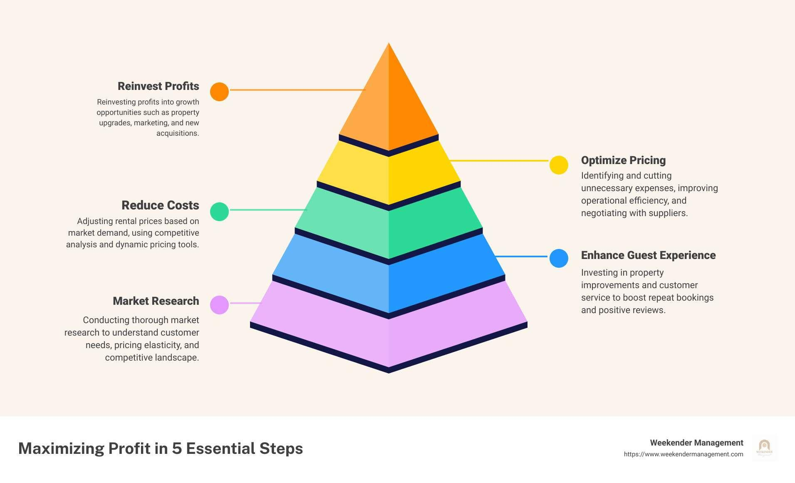

## Table of Contents

## What are pyramid strategies in the context of profit maximization?

Pyramid strategies in the context of profit maximization involve increasing the amount of investment or resources as profits grow. Imagine you start with a small investment, and as you make money, you use those profits to make even bigger investments. This way, your profits can grow faster and faster, like building a pyramid where each layer is larger than the one below it. The idea is to start small and safe, then use the gains to take on bigger opportunities, aiming for bigger rewards.

However, pyramid strategies can be risky. If the early investments don't pay off, you might not have enough money to keep going, and the whole pyramid could collapse. It's important to be careful and make sure each step is solid before moving to the next one. This strategy works best when you have a good understanding of the market and can predict where the next big opportunity will be. It's like climbing a ladder; you need to make sure each rung is strong before stepping up.

## How do pyramid strategies differ from other investment strategies?

Pyramid strategies are different from other investment strategies because they focus on using the profits from earlier investments to make bigger investments later. It's like starting with a small snowball and rolling it down a hill, hoping it gets bigger and bigger as it goes. Other strategies might spread out investments across different things to lower risk, or they might focus on steady, slow growth instead of trying to grow quickly. With pyramid strategies, you're betting on being able to make more money faster by taking bigger risks as you go along.

Another way pyramid strategies differ is in their approach to risk. Many other strategies try to manage or reduce risk by diversifying or choosing safer investments. For example, a balanced portfolio might include a mix of stocks, bonds, and other assets to protect against big losses. Pyramid strategies, on the other hand, can increase risk because they rely on early wins to fund later, larger investments. If those early investments don't pay off, the whole strategy can fall apart. So, while other strategies might aim for steady, reliable growth, pyramid strategies aim for rapid growth but come with higher risk.

## What are the basic principles behind pyramid strategies?

The main idea behind pyramid strategies is to start small and use the money you make to make even bigger investments later. Imagine you start with a little bit of money and put it into something that could grow. If it works out, you take the money you made and put it into something even bigger. This way, your money can grow faster and faster, like building a pyramid where each layer is bigger than the one below it.

But pyramid strategies can be risky. If your first few investments don't go well, you might not have enough money to keep going, and the whole thing could fall apart. It's important to be careful and make sure each step is solid before moving to the next one. This strategy works best if you know a lot about the market and can guess where the next big opportunity will be. It's like climbing a ladder; you need to make sure each rung is strong before stepping up.

## Can you explain the step-by-step process of implementing a pyramid strategy?

To start using a pyramid strategy, you begin with a small investment in something you think will grow. This could be buying a few shares of a stock or putting money into a small business. The key is to choose something that you believe has a good chance of making money. If your first investment does well, you take the profits and use them to make a bigger investment. This could mean buying more shares or investing in another business that you think will do even better.

As you keep making money, you keep using those profits to make even bigger investments. Each step should be bigger than the last, like adding layers to a pyramid. But you have to be careful because if one of your investments doesn't work out, it can mess up your whole plan. That's why it's important to do your homework and make sure each new investment is a good choice before you put more money into it. If you do it right, your money can grow really fast, but it's a bit like walking a tightrope – you need to keep your balance and not take too many risks.

## What are the potential risks associated with using pyramid strategies for profit maximization?

Pyramid strategies can be risky because they depend a lot on early investments doing well. If your first few investments don't make money, you won't have enough to keep going with bigger investments. This can make the whole strategy fall apart. It's like trying to build a tower with blocks, but if the bottom blocks aren't strong, the whole thing can collapse.

Another risk is that pyramid strategies can make you take bigger and bigger risks as you go along. When you use your profits to make bigger investments, you might end up putting money into things that are less safe. If one of these bigger investments fails, it can hurt a lot more because you've put more money into it. It's important to be careful and make sure each new step is a good choice, or you could lose a lot of money.

## How can beginners safely start using pyramid strategies?

If you're new to pyramid strategies, it's important to start small and safe. Begin with a tiny investment in something you understand well, like a stock or a small business. Make sure you do your homework and pick something that you think has a good chance of making money. Don't rush into bigger investments right away. Wait until your first investment makes some profit before you think about putting more money into something else.

As you start to make money, you can use those profits to make slightly bigger investments. But always be careful and take your time. Don't jump into big risks too quickly. Keep learning about the market and make sure each new investment is a good choice before you put more money into it. Remember, pyramid strategies can be risky, so it's important to go slow and steady, like building a tower one block at a time.

## What are some common mistakes to avoid when applying pyramid strategies?

One common mistake people make with pyramid strategies is rushing into bigger investments too quickly. They might see a small profit and think they can make a lot more money fast by putting it all into something bigger. But if they don't wait and make sure each step is solid, they could lose everything. It's like trying to run before you can walk. You need to take your time and make sure each investment is a good choice before moving on to the next one.

Another mistake is not doing enough research. People might get excited about a new opportunity and jump in without really understanding it. This can lead to bad decisions and big losses. It's important to learn about the market and make sure you know what you're getting into before you invest. If you don't, you might end up putting money into something that's too risky or not a good fit for your strategy.

Lastly, some people forget to manage their risk. Pyramid strategies can become more risky as you go along because you're using your profits to make bigger investments. If you're not careful, you could lose a lot of money on one bad investment. Always think about how much you can afford to lose and don't put all your eggs in one basket. It's better to grow slowly and safely than to try to get rich quick and end up losing everything.

## How can intermediate investors optimize their pyramid strategies for better returns?

Intermediate investors can optimize their pyramid strategies by focusing on diversification within their investments. Instead of putting all their profits into one big investment, they can spread the money across different opportunities. This way, if one investment doesn't do well, the others might still make money. It's like having a few different ladders to climb instead of just one. By choosing a mix of stocks, bonds, or other assets, they can lower the risk and still aim for good returns.

Another way to optimize pyramid strategies is by doing more research and staying updated on market trends. Intermediate investors should spend time learning about new opportunities and understanding how different markets work. This can help them make smarter choices about where to put their money. For example, if they see that a certain industry is growing fast, they might decide to invest more in that area. By keeping an eye on the market and making informed decisions, they can increase their chances of getting better returns.

## What advanced techniques can be used to enhance pyramid strategies?

Advanced investors can use something called leverage to make their pyramid strategies even better. Leverage means using borrowed money to make bigger investments. If you think an investment will do really well, you can borrow money to put more into it. This can make your profits grow even faster, but it's also riskier because if the investment doesn't work out, you could lose more money than you started with. It's like using a lever to lift a heavy weight; it can make things easier, but you have to be careful not to lose your balance.

Another advanced technique is to use stop-loss orders. This is a way to protect your money by setting a limit on how much you're willing to lose. If an investment starts to go down, a stop-loss order can automatically sell it before you lose too much money. This can help you keep your pyramid strategy going even if one investment doesn't work out. It's like having a safety net that catches you if you fall, so you can keep climbing without starting over from the bottom.

## How do market conditions affect the effectiveness of pyramid strategies?

Market conditions can really change how well pyramid strategies work. If the market is doing well and lots of things are growing, pyramid strategies can be great because you can keep making bigger and bigger investments. When everyone is making money, it's easier to find good opportunities to put your profits into. But if the market is shaky or going down, pyramid strategies can be really risky. If your early investments lose money, you might not have anything left to keep building your pyramid, and the whole thing could fall apart.

It's also important to know that different kinds of markets can affect pyramid strategies differently. For example, if you're investing in stocks, a bull market where stock prices are going up can make pyramid strategies work really well. But if it's a bear market and stock prices are falling, it can be hard to make money and keep your strategy going. So, it's a good idea to keep an eye on what's happening in the market and be ready to change your plans if things start to go the wrong way.

## Can you provide case studies of successful implementations of pyramid strategies?

One successful case of a pyramid strategy was used by an investor named Warren Buffett. He started investing in the stock market when he was just a teenager. He began with small investments in companies he believed in, like Coca-Cola. As those investments grew, he used the profits to buy even more shares and invest in other companies. Over time, his pyramid strategy helped him build a huge fortune. He was careful to choose good investments and didn't rush into big risks. This slow and steady approach made his pyramid strategy work really well.

Another example is a tech startup founder who used a pyramid strategy to grow her business. She started with a small amount of money to develop her app. When the app started making money, she used those profits to hire more people and improve the app. As the business grew, she used the bigger profits to expand into new markets and develop new products. This pyramid strategy helped her turn a small idea into a big company. She was careful to make sure each step was solid before moving on to the next one, which helped her avoid big risks and keep growing.

## What future trends might impact the use of pyramid strategies in profit maximization?

In the future, technology and data analysis could make pyramid strategies even better. With more data and better tools, investors might be able to pick good investments more easily. This could make it easier to use pyramid strategies because you could know more about where to put your money. Also, new kinds of investments, like cryptocurrencies, might change how pyramid strategies work. If these new investments become popular and start making a lot of money, more people might use pyramid strategies to try to get rich quick.

On the other hand, changes in the economy and rules about investing could make pyramid strategies harder to use. If the economy goes through a lot of ups and downs, it might be riskier to keep making bigger and bigger investments. Also, if governments make new rules about how you can invest, it might be harder to use pyramid strategies the way people do now. So, while new technology could help, other things might make pyramid strategies trickier to use in the future.

## References & Further Reading

[1]: Bergstra, J., Bardenet, R., Bengio, Y., & Kégl, B. (2011). ["Algorithms for Hyper-Parameter Optimization."](https://papers.nips.cc/paper/4443-algorithms-for-hyper-parameter-optimization) Advances in Neural Information Processing Systems 24.

[2]: ["Advances in Financial Machine Learning"](https://www.amazon.com/Advances-Financial-Machine-Learning-Marcos/dp/1119482089) by Marcos Lopez de Prado

[3]: ["Evidence-Based Technical Analysis: Applying the Scientific Method and Statistical Inference to Trading Signals"](https://www.amazon.com/Evidence-Based-Technical-Analysis-Scientific-Statistical/dp/0470008741) by David Aronson

[4]: ["Machine Learning for Algorithmic Trading"](https://github.com/stefan-jansen/machine-learning-for-trading) by Stefan Jansen

[5]: ["Quantitative Trading: How to Build Your Own Algorithmic Trading Business"](https://www.amazon.com/Quantitative-Trading-Build-Algorithmic-Business/dp/1119800064) by Ernest P. Chan