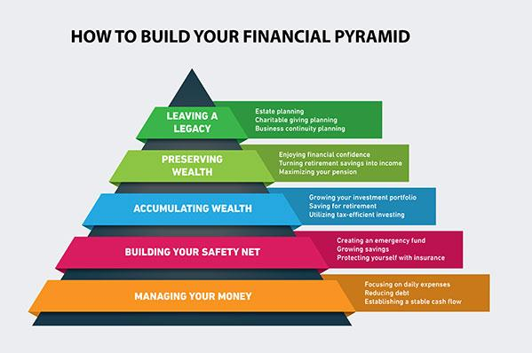

## Table of Contents

## What is pyramiding in finance?

Pyramiding in finance is a strategy where an investor increases their position in a stock or asset as its price goes up. Instead of buying all at once, the investor buys more shares each time the price rises. This method allows the investor to use the unrealized profits from the initial investment to buy more of the asset, potentially increasing their returns if the price keeps going up.

However, pyramiding can be risky. If the price of the asset starts to fall, the investor could end up losing more money because they have bought more shares at higher prices. It's important for investors to carefully manage their risk and have a clear exit strategy when using pyramiding, as the potential for higher returns comes with the potential for higher losses.

## How does pyramiding differ from other investment strategies?

Pyramiding is different from other investment strategies because it involves adding to a position as the price goes up. In other strategies, like buying and holding, an investor might buy a stock and keep it no matter what happens to the price. With pyramiding, the investor uses the money they would make if they sold their stock at the current price to buy more of the same stock. This can lead to bigger profits if the price keeps going up, but it's also riskier.

Other strategies, like dollar-cost averaging, involve investing a fixed amount of money at regular intervals, regardless of the price. This helps spread out the risk over time. Pyramiding is the opposite; it concentrates the investment at higher prices, hoping for even higher prices in the future. Unlike pyramiding, strategies like stop-loss orders focus on limiting losses by selling when the price drops to a certain level, rather than buying more.

In summary, pyramiding is a more aggressive approach that aims to increase gains by adding to a winning position, while other strategies might focus on reducing risk or spreading investments over time. Each strategy has its own benefits and risks, and the choice depends on the investor's goals, risk tolerance, and market conditions.

## What are the basic steps to start pyramiding?

To start pyramiding, first pick a stock or asset you think will go up in price. Buy some shares to start your position. This is your base investment. Make sure you have a plan for how much you want to invest and at what price points you will buy more.

As the price of the stock goes up, you can buy more shares. Each time you buy more, you are adding to your position using the unrealized profits from your initial investment. Keep track of the price and stick to your plan. Decide ahead of time how much you are willing to risk and when you will stop buying more if the price starts to fall.

Remember, pyramiding can make you more money if the price keeps going up, but it can also lead to bigger losses if the price goes down. Always have an [exit](/wiki/exit-strategy) strategy in case things don't go as planned. This might mean setting a point at which you will sell your shares to cut your losses.

## What are the potential benefits of using pyramiding in trading?

Pyramiding can help you make more money if the price of the stock keeps going up. When you use pyramiding, you buy more shares as the price rises, so you're using the money you would make if you sold at that price to buy more. This means you could end up with a lot more shares than if you just bought once. If the price keeps going up, your profits could be a lot bigger than if you had just bought and held.

But pyramiding isn't just about making more money. It can also help you feel more confident about your investment. When you see the price going up and you're adding to your position, it can make you feel like you're making smart choices. This can keep you motivated and focused on your trading plan. Just remember, while pyramiding can lead to bigger gains, it also comes with bigger risks, so you need to be careful and have a good plan.

## What are the risks associated with pyramiding?

Pyramiding can be risky because it means you're buying more of a stock as the price goes up. If the price suddenly drops, you could lose a lot more money than if you had just bought once. That's because you bought more shares at higher prices, so if the price falls, you're losing money on all those extra shares too. It's like climbing higher and higher on a ladder, but if you fall, you fall from a lot higher up.

Another risk is that pyramiding can make you feel too confident. When you keep buying more and the price keeps going up, it's easy to think you can't lose. But the stock market can be unpredictable, and what goes up can come down fast. If you're not careful and don't stick to your plan, you might keep buying even when you should be selling. It's important to have a clear exit strategy to know when to stop buying and when to sell, so you don't end up losing more than you can handle.

## How can one manage risk while implementing a pyramiding strategy?

To manage risk while using a pyramiding strategy, it's important to set clear rules for when to buy more shares and when to stop. Decide ahead of time at what price points you will add to your position, and stick to those rules. Don't let emotions or the excitement of rising prices make you buy more than you planned. Also, make sure you only use a small part of your total investment money for pyramiding, so you don't risk too much on one stock.

Another way to manage risk is to use stop-loss orders. A stop-loss order is like a safety net that automatically sells your shares if the price drops to a certain level. This can help you limit your losses if the stock price starts to fall after you've been buying more. It's also a good idea to keep an eye on the market and be ready to change your plan if things don't go as expected. By setting clear rules and using stop-loss orders, you can enjoy the potential benefits of pyramiding while keeping your risk under control.

## Can pyramiding be applied to both stocks and forex markets?

Yes, pyramiding can be used in both the stock and [forex](/wiki/forex-system) markets. In the stock market, you can start by buying some shares of a company you think will go up in price. As the price rises, you can buy more shares with the unrealized profits from your initial investment. This way, if the stock keeps going up, you can make more money. The same idea works in the forex market, where you trade currencies. If you think a currency pair will go up in value, you can start by trading a small amount. As the value goes up, you can add to your position, hoping to make more money as the value keeps rising.

The main thing to remember is that while pyramiding can help you make more money if prices keep going up, it also means you could lose more if prices go down. In both stocks and forex, it's important to have a plan for when to buy more and when to stop. Using stop-loss orders can help you limit your losses if the market turns against you. So, whether you're trading stocks or forex, make sure you understand the risks and have a clear strategy to manage them.

## What are some common indicators used to decide when to add to a position in pyramiding?

When using pyramiding, traders often look at certain indicators to decide when to buy more of a stock or currency. One common indicator is the moving average, which helps show the trend of the price over time. If the price stays above the moving average and keeps going up, it might be a good time to add to your position. Another useful indicator is the relative strength index (RSI), which measures how fast the price is moving. If the RSI is high but not yet overbought, it could mean the price will keep rising, so it might be a good time to buy more.

Another indicator traders use is the price itself. If the price hits new highs, it can be a sign to add to your position because it shows strong demand. Some traders also use [volume](/wiki/volume-trading-strategy) as an indicator. If the trading volume is high when the price goes up, it means a lot of people are buying, which can be a good sign to buy more too. The key is to use these indicators together with a clear plan to decide when to add to your position, and always be ready to change your plan if the market changes.

## How does the timing of adding positions affect the success of a pyramiding strategy?

The timing of adding positions is very important in a pyramiding strategy. If you add to your position too early, before the price has really started to go up, you might buy more shares at a price that doesn't go much higher. This can make your overall cost higher and reduce your profits if the price doesn't keep going up. On the other hand, if you wait too long to add to your position, you might miss out on the chance to buy more shares at a good price. The price could go up a lot before you decide to buy more, and then you won't have as many shares to benefit from the increase.

Getting the timing right means watching the market closely and using indicators like moving averages, RSI, and volume to help you decide when to buy more. If the price is going up steadily and the indicators show strong buying interest, it might be a good time to add to your position. But you need to be careful and stick to your plan. If the market changes and the price starts to go down, you need to be ready to stop buying more and maybe even sell some of your shares to limit your losses. The key is to balance the chance to make more money with the risk of losing more if the timing isn't right.

## What are advanced techniques for optimizing a pyramiding approach?

One advanced technique for optimizing a pyramiding approach is to use a tiered entry strategy. Instead of adding to your position all at once, you can break it into smaller parts and buy at different price levels. For example, you might decide to buy more shares every time the price goes up by a certain amount. This can help spread out your risk and give you a chance to buy more if the price keeps going up, but without putting all your money in at once. Another technique is to use technical analysis tools like Fibonacci retracement levels. These levels can help you find good times to add to your position by showing where the price might go up again after a small drop.

Another way to optimize pyramiding is by setting dynamic stop-loss orders. Instead of using a fixed stop-loss, you can move your stop-loss higher as the price goes up. This helps protect your profits and limits your losses if the price suddenly drops. You can also use trailing stops, which automatically adjust as the price moves in your favor. This means you can keep your gains safe while still having the chance to make more money if the price keeps going up. By combining these techniques, you can make your pyramiding strategy more effective and manage your risk better.

## How can one backtest a pyramiding strategy to evaluate its effectiveness?

To backtest a pyramiding strategy, you need to use historical data to see how your strategy would have worked in the past. Start by choosing a stock or asset and looking at its price history over a long period, like several years. Then, apply your pyramiding rules to this data. For example, if your rule is to buy more shares every time the price goes up by 5%, you would pretend to do this with the historical prices. Keep track of how much money you would have made or lost at each step. This can help you see if your strategy would have been successful and where you might need to make changes.

It's important to be as detailed as possible when [backtesting](/wiki/backtesting). Use the same indicators and rules you plan to use in real trading, like moving averages or RSI. Make sure to include costs like trading fees and taxes, as these can affect your profits. Also, try backtesting your strategy with different stocks or assets to see if it works well in different situations. By doing this, you can get a better idea of how effective your pyramiding strategy might be and make any necessary adjustments before you start using it with real money.

## What are expert opinions on the long-term sustainability of pyramiding in various market conditions?

Experts have mixed opinions about the long-term sustainability of pyramiding. Some say it can work well in a strong bull market, where prices keep going up for a long time. In these conditions, pyramiding can help you make more money because you're buying more shares as the price rises. But, these experts also warn that pyramiding is risky and might not be good for the long term. If the market changes and prices start to fall, you could lose a lot of money because you bought more shares at higher prices.

Other experts think that pyramiding is not a good strategy for the long term, no matter what the market is doing. They say it's too risky because it depends on prices always going up. In real markets, prices can go up and down a lot, and if you're not careful, pyramiding can lead to big losses. These experts suggest using other strategies that are less risky and more focused on keeping your money safe over time. They believe that while pyramiding can make you more money in the short term, it's not a good way to invest for the long term.

## What are the risks and considerations?

Combining pyramiding, leverage, and [algorithmic trading](/wiki/algorithmic-trading) presents a formidable opportunity for optimizing trading returns, but it is not without substantial risks. One of the foremost concerns is market [volatility](/wiki/volatility-trading-strategies). Fluctuations in asset prices can lead not only to potential gains but also to rapid and unexpected losses, particularly when positions are magnified through leverage. This risk is exacerbated when trading algorithms are involved, as they may execute trades faster than a human can react to changing market conditions.

Algorithm errors, including coding mistakes or incorrect assumptions in the trading model, pose another significant risk. These errors can lead to trades being executed incorrectly or at improper times, potentially resulting in sizeable financial losses. Robust programming practices, thorough testing, and validation of algorithms are necessary to mitigate these risks.

To safeguard against such pitfalls, continuous monitoring and updating of trading algorithms are imperative. Algorithms should not only be backtested against historical data but also regularly updated to reflect current market conditions and dynamics. This ensures that they remain effective and responsive to the latest market trends. Incorporating [machine learning](/wiki/machine-learning) techniques can help adapt algorithms to new patterns, but this requires ongoing data analysis and parameter tuning.

A robust risk management strategy is essential to protect capital when engaging in pyramiding and leveraged trading. Key components of such a strategy include setting strict stop-loss limits, maintaining appropriate margin levels, and using diversification to spread risk across multiple asset classes. Moreover, employing position sizing techniques based on the Kelly Criterion, which determines the optimal size of a series of bets, can help manage the amount of leverage used in each trade.

Mathematically, the Kelly Criterion can be expressed as:

$$
f^* = \frac{bp - q}{b}
$$

where:
- $f^*$ is the fraction of capital to invest in the next trade.
- $b$ is the odds received on the wager (net ratio of profits to risk).
- $p$ is the probability of winning.
- $q$ is the probability of losing, equal to $1 - p$.

Using such formulas in your trading strategy aids in optimizing returns while controlling for risk.

In conclusion, while the confluence of pyramiding, leverage, and algorithmic trading can yield significant financial rewards, it demands a disciplined approach to risk management. Vigilant oversight, along with flexible and adaptive trading systems, can help in navigating the inherent risks, thus safeguarding traders against potential financial setbacks.

## References & Further Reading

[1]: Bergstra, J., Bardenet, R., Bengio, Y., & Kégl, B. (2011). ["Algorithms for Hyper-Parameter Optimization."](https://papers.nips.cc/paper/4443-algorithms-for-hyper-parameter-optimization) Advances in Neural Information Processing Systems 24.

[2]: ["Advances in Financial Machine Learning"](https://www.amazon.com/Advances-Financial-Machine-Learning-Marcos/dp/1119482089) by Marcos Lopez de Prado

[3]: ["Evidence-Based Technical Analysis: Applying the Scientific Method and Statistical Inference to Trading Signals"](https://www.amazon.com/Evidence-Based-Technical-Analysis-Scientific-Statistical/dp/0470008741) by David Aronson

[4]: ["Machine Learning for Algorithmic Trading"](https://github.com/stefan-jansen/machine-learning-for-trading) by Stefan Jansen

[5]: ["Quantitative Trading: How to Build Your Own Algorithmic Trading Business"](https://www.amazon.com/Quantitative-Trading-Build-Algorithmic-Business/dp/1119800064) by Ernest P. Chan