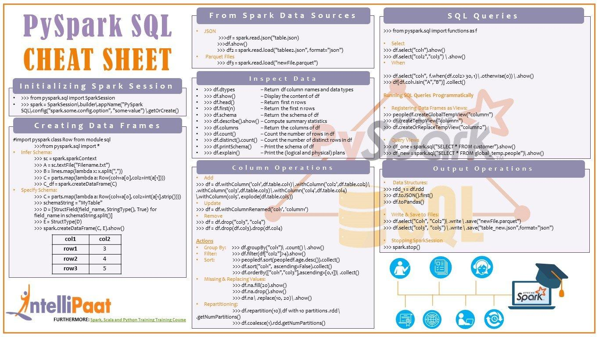

## Table of Contents

## What is PySpark and why is it used?

PySpark is a tool that helps people work with big data using the Python programming language. It's part of the Apache Spark platform, which is designed to handle and process large amounts of data quickly. PySpark makes it easier for people who know Python to use Spark's powerful features without having to learn a new language like Scala or Java.

People use PySpark because it can process data much faster than traditional methods, especially when dealing with huge datasets. It can spread the work across many computers, making it very efficient. This is really helpful for businesses and researchers who need to analyze big data quickly to make decisions or find patterns. Plus, since it uses Python, a lot of people can start using it without needing to learn a new programming language.

## How do you set up PySpark on a local machine?

To set up PySpark on your local machine, you first need to have Java installed because PySpark relies on it. Download and install Java from the official Oracle website if you don't already have it. Next, download the latest version of Apache Spark from the Apache Spark website. Make sure to pick the right version for your operating system. After downloading, unzip the file to a folder on your computer, like your home directory. This folder is where you'll find all the Spark files.

Once you have Spark installed, you need to set up your environment. Open your command line or terminal and navigate to the Spark folder you just unzipped. Go into the 'bin' folder and run the command './pyspark' on Unix-based systems or 'pyspark' on Windows to start PySpark. If it doesn't work, you might need to set up some environment variables. For example, you might need to set the 'JAVA_HOME' variable to point to your Java installation and the 'SPARK_HOME' variable to point to your Spark folder. After setting these up, you should be able to run PySpark and start using it to work with big data.

## What are the basic data structures in PySpark?

In PySpark, the main data structure you'll work with is called a DataFrame. A DataFrame is like a table in a database or a spreadsheet. It has rows and columns, and each column can hold different types of data, like numbers or text. DataFrames are really good at handling big data because they can spread the work across many computers. This makes them fast and efficient, even when you're dealing with millions of rows of data.

Another important data structure in PySpark is the RDD, or Resilient Distributed Dataset. RDDs are the core of Spark and are more low-level than DataFrames. They're like lists that can be split up and processed on different computers. RDDs are useful when you need more control over how your data is processed, but they're not as easy to use as DataFrames. Most of the time, you'll use DataFrames because they're simpler and faster, but RDDs are there if you need them.

The third data structure to know about is the Dataset. Datasets are like DataFrames but with more strict typing, which means you can be more specific about the type of data each column can hold. They're only available if you're using Scala or Java with Spark, though. In PySpark, you'll mostly work with DataFrames, but it's good to know that Datasets exist and offer more type safety if you ever move to another Spark language.

## How do you create and manipulate RDDs in PySpark?

To create an RDD in PySpark, you first need to start a Spark session. You can do this by running some code to set up Spark. Once your Spark session is ready, you can make an RDD from a list or from a file. For example, if you have a list of numbers, you can turn it into an RDD by using a method called `parallelize`. If you want to use data from a file, you can use a method called `textFile` to read the file and turn it into an RDD. It's like taking a bunch of data and spreading it out so Spark can work on it faster.

After you have an RDD, you can do lots of things with it. You can use methods like `map` to change each item in the RDD, `filter` to keep only the items you want, and `reduce` to combine all the items into one result. For example, if you have an RDD of numbers, you can use `map` to double each number, `filter` to keep only the even numbers, and `reduce` to add them all up. These methods help you process big data quickly because Spark can do the work on many computers at the same time.

## What is a DataFrame in PySpark and how is it different from an RDD?

A DataFrame in PySpark is like a table in a database or a spreadsheet. It has rows and columns, and each column can hold different types of data, like numbers or text. DataFrames are really good at handling big data because they can spread the work across many computers. This makes them fast and efficient, even when you're dealing with millions of rows of data. You can do things like filter rows, group data, and join tables with DataFrames, which makes them really useful for analyzing big datasets.

The main difference between a DataFrame and an RDD is how they handle data. An RDD, or Resilient Distributed Dataset, is more low-level and gives you more control over how your data is processed. RDDs are like lists that can be split up and worked on by different computers. They're useful when you need to do something specific with your data, but they're not as easy to use as DataFrames. DataFrames, on the other hand, are easier to work with because they come with built-in ways to do common tasks, like filtering or grouping data. They also work better with other tools and languages, making them a better choice for most people who want to analyze big data quickly and easily.

## How can you perform basic operations on DataFrames in PySpark?

In PySpark, you can do basic operations on DataFrames easily. For example, if you want to pick out certain rows, you can use the `filter` method. Imagine you have a DataFrame with people's names and ages, and you want to see only the people who are older than 30. You can use `filter` to do that. Another common thing is to change the data. You can use the `withColumn` method to add a new column or change an existing one. For instance, if you want to add a column that says whether someone is an adult based on their age, you can do that with `withColumn`.

You can also group data together using the `groupBy` method. This is useful if you want to see totals or averages for different groups. For example, if you want to know the average age of people in different cities, you can group by the city column and then use the `avg` function to find the average age. Joining DataFrames is another important operation. If you have two DataFrames with related information, you can use the `join` method to combine them. For example, if one DataFrame has people's names and ages, and another has their names and addresses, you can join them on the name column to get a DataFrame with all the information together.

## What are the key transformations and actions in PySpark?

In PySpark, transformations are operations that change your data but don't show you the results right away. They create a new DataFrame or RDD based on the old one. Some common transformations are `map`, which changes each item in your data, `filter`, which keeps only the items you want, and `flatMap`, which can turn one item into many. Another useful transformation is `groupBy`, which groups your data by a certain column so you can do things like count or average. Transformations are like instructions that PySpark keeps in mind but doesn't follow until you tell it to.

Actions, on the other hand, are operations that make PySpark do the work and show you the results. They trigger the execution of all the transformations you've set up. Some common actions are `collect`, which brings all your data to one place so you can see it, `count`, which tells you how many items are in your data, and `take`, which shows you a few items from your data. Another important action is `reduce`, which combines all your data into one result, like adding up all the numbers. Actions are what make PySpark actually process your data and give you the results you're looking for.

## How do you optimize PySpark jobs for better performance?

To make your PySpark jobs run faster, you need to think about a few things. First, make sure you're using the right amount of memory and cores. PySpark can spread your data across many computers, so if you give it more resources, it can work faster. Also, try to keep your data in memory as much as possible. If PySpark has to read data from a disk, it takes longer. You can use something called caching to keep important data in memory. Another tip is to make your transformations more efficient. For example, instead of using a lot of small transformations, try to combine them into bigger ones. This reduces the number of times PySpark has to shuffle data around, which can slow things down.

Another way to speed up your PySpark jobs is to think about how you're organizing your data. If you can split your data into smaller chunks, or partitions, PySpark can work on them at the same time. But, you don't want too many partitions because that can also slow things down. Finding the right balance is key. Also, if you're doing a lot of joins or aggregations, make sure you're using the right keys. The wrong keys can make PySpark do a lot more work than it needs to. Finally, always keep an eye on your job's performance. PySpark has tools that can help you see where it's spending the most time, so you can focus on making those parts faster.

## What is the role of Spark SQL in PySpark and how is it used?

Spark SQL is a part of PySpark that lets you work with structured data using SQL-like commands. It's like having a powerful tool to query and analyze your data in a way that's familiar if you know SQL. With Spark SQL, you can write SQL queries directly on your DataFrames, which makes it easier to do things like filtering, grouping, and joining data. This is really helpful because many people already know SQL, so they can start using Spark SQL without learning a whole new way to work with data.

You can use Spark SQL by creating a temporary view from your DataFrame and then running SQL queries on that view. For example, if you have a DataFrame with information about customers, you can create a temporary view called "customers" and then use a SQL query like "SELECT * FROM customers WHERE age > 30" to find all customers older than 30. This way, you can combine the power of PySpark's distributed computing with the simplicity of SQL to analyze big data quickly and easily.

## How can you integrate PySpark with machine learning libraries like MLlib?

PySpark can be used with MLlib, which is Spark's machine learning library, to do things like predicting data or finding patterns. MLlib has a lot of tools that can work with PySpark's DataFrames. For example, if you have a DataFrame with data about houses, like their size and price, you can use MLlib to build a model that predicts house prices. You start by turning your DataFrame into something MLlib can use, like a feature vector. Then, you pick a model from MLlib, like a linear regression model, and train it with your data. After training, you can use the model to make predictions on new data.

Using PySpark with MLlib is helpful because it can handle big data quickly. If you have a lot of data, PySpark can spread it across many computers to make the machine learning process faster. This is really useful for businesses or researchers who need to analyze big datasets to make decisions or find insights. By combining PySpark and MLlib, you can do powerful machine learning tasks without needing to move your data around a lot, which saves time and makes everything more efficient.

## What are the best practices for handling large datasets in PySpark?

When you're working with big datasets in PySpark, it's important to think about how you're using your resources. Make sure you're giving PySpark enough memory and cores to work with. If you have a lot of data, spreading it across more computers can make things go faster. Also, try to keep your data in memory as much as you can. If PySpark has to read data from a disk, it takes longer. You can use something called caching to keep important data in memory. Another good idea is to make your transformations more efficient. Instead of using a lot of small transformations, try to combine them into bigger ones. This reduces the number of times PySpark has to shuffle data around, which can slow things down.

Another way to handle large datasets better is to think about how you're organizing your data. If you can split your data into smaller chunks, or partitions, PySpark can work on them at the same time. But, you don't want too many partitions because that can also slow things down. Finding the right balance is key. Also, if you're doing a lot of joins or aggregations, make sure you're using the right keys. The wrong keys can make PySpark do a lot more work than it needs to. Finally, always keep an eye on your job's performance. PySpark has tools that can help you see where it's spending the most time, so you can focus on making those parts faster.

## How do you implement advanced analytics and streaming in PySpark?

To do advanced analytics in PySpark, you can use its machine learning library called MLlib. This library has tools that let you build models to predict things or find patterns in your data. For example, if you have a lot of data about customers, you can use MLlib to predict what they might buy next. You start by turning your data into something MLlib can use, like a feature vector. Then, you choose a model, like a decision tree or a neural network, and train it with your data. After training, you can use the model to make predictions on new data. PySpark is good for this because it can handle big data quickly by spreading the work across many computers.

For streaming data, PySpark has something called Structured Streaming. This lets you work with data that's coming in all the time, like social media posts or sensor readings. With Structured Streaming, you can set up a query that keeps running and processes new data as it comes in. For example, if you want to count how many times a certain word is used on Twitter every minute, you can set up a streaming job to do that. PySpark makes this easy because it treats streaming data just like regular data in a DataFrame. This means you can use the same tools and commands you use for regular data to analyze streaming data, which makes it simpler to work with big, constantly updating datasets.

## References & Further Reading

[1]: Zaharia, M., Chowdhury, M., Franklin, M. J., Shenker, S., & Stoica, I. (2010). ["Spark: Cluster Computing with Working Sets."](https://people.csail.mit.edu/matei/papers/2010/hotcloud_spark.pdf) Proceedings of the 2nd USENIX Conference on Hot Topics in Cloud Computing.

[2]: Lopez de Prado, M. (2018). ["Advances in Financial Machine Learning."](https://www.amazon.com/Advances-Financial-Machine-Learning-Marcos/dp/1119482089) Wiley.

[3]: "Apache Spark: A Unified Analytics Engine for Big Data Processing." [Apache Spark Documentation](https://github.com/apache/spark)

[4]: Chan, E. P. (2009). ["Quantitative Trading: How to Build Your Own Algorithmic Trading Business."](https://github.com/ftvision/quant_trading_echan_book) Wiley.

[5]: Jansen, S. (2020). ["Machine Learning for Algorithmic Trading: Predictive Models to Extract Signals from Market and Alternative Data for Systematic Trading Strategies with Python."](https://www.amazon.com/Machine-Learning-Algorithmic-Trading-alternative/dp/1839217715) Packt Publishing. 

[6]: Aronson, D. (2006). ["Evidence-Based Technical Analysis: Applying the Scientific Method and Statistical Inference to Trading Signals."](https://www.wiley.com/en-us/Evidence+Based+Technical+Analysis%3A+Applying+the+Scientific+Method+and+Statistical+Inference+to+Trading+Signals-p-9780470008744) Wiley.

[7]: Meng, X., Bradley, J., Yavuz, B., Sparks, E., Venkataraman, S., Liu, D., ... & Zadeh, R. (2016). ["MLlib: Machine Learning in Apache Spark."](https://arxiv.org/abs/1505.06807) Journal of Machine Learning Research.