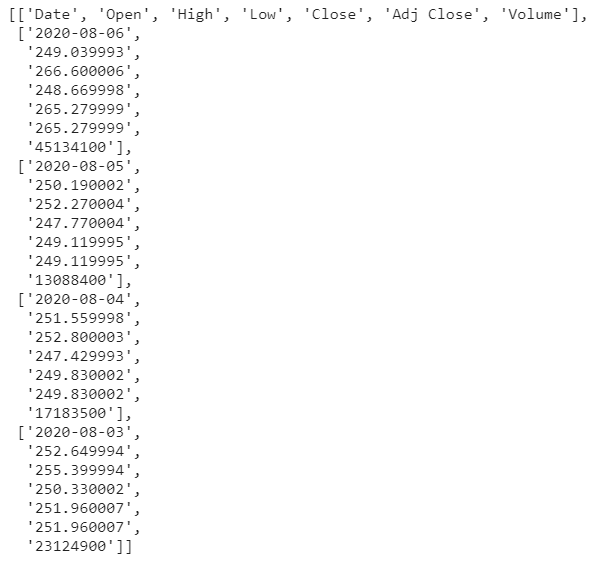

Algorithmic trading refers to the use of computer algorithms to automate and optimize trading decisions in the financial markets. These algorithms rely on pre-defined criteria and mathematical models to execute transactions at optimal times and prices, reducing human error and increasing trading efficiency. The significance of algorithmic trading has grown substantially in modern financial markets due to its ability to process vast amounts of data and execute trades at speeds and volumes unachievable by human traders. As a result, algorithmic trading accounts for a significant portion of trading activity in global financial markets.

PySpark, a Python interface for Apache Spark, emerges as a powerful tool for handling the large volumes of data inherent in algorithmic trading. Apache Spark is known for its ability to facilitate big data processing tasks with exceptional speed and efficiency. PySpark extends this capability to the Python programming language, enabling traders and data scientists to leverage Spark's distributed computing power while writing in a language renowned for its readability and ease of use. This capability is especially beneficial when dealing with the high-frequency trading data and complex algorithms characteristic of algorithmic trading.



The scope of this article is to explore the integration of PySpark in algorithmic trading, highlighting how its unique features contribute to more efficient trading strategies. By harnessing PySpark's abilities, traders can enhance data cleaning, transformation, and feature extraction processes critical in developing robust trading strategies. The article further discusses how PySpark facilitates real-time processing and analysis of financial data, allowing for timely and informed trading decisions.

The primary purpose of using PySpark in the context of algorithmic trading is to efficiently execute trading strategies by managing and processing large datasets with speed and accuracy. PySpark's parallel processing and in-memory computation capabilities make it ideally suited to the high demands of algo trading environments. Additionally, its seamless integration with various data sources and APIs enhances its versatility in accessing and processing market data.

Key topics covered in this article include an understanding of algorithmic trading and its impact on the markets, the role of PySpark in big data processing, the benefits of using PySpark in algorithmic trading, and the process of implementing trading strategies with PySpark. Furthermore, we will explore the challenges and considerations specific to using PySpark in this domain, examine future prospects, and conclude with insights into the adoption of PySpark in the financial industry.

## Table of Contents

## Understanding Algorithmic Trading

Algorithmic trading, often referred to as algo trading, employs computer algorithms to execute trading orders with precision and speed that human traders cannot match. It has revolutionized financial markets by enabling high-frequency trading, subtle [arbitrage](/wiki/arbitrage) opportunities, and advanced market analysis. Algorithms are programmed to make decisions based on various market signals, predefined conditions, and statistical models, executing trades at speeds measured in microseconds or even nanoseconds.

Algorithms used in trading can be broadly categorized into several types. Trend-following strategies involve algorithms that identify and capitalize on market trends, investing in upward-trending assets and shorting downward-trending ones. These strategies often rely on technical indicators such as moving averages and [momentum](/wiki/momentum) indicators. Arbitrage strategies exploit price discrepancies between related securities, differing across markets or exchanges, to lock in risk-free profits. Market timing algorithms aim to predict future market movements based on historical data, news sentiment, or other predictive indicators.

The data requirements for [algorithmic trading](/wiki/algorithmic-trading) are extensive and complex. Traders need access to high-frequency data feeds, encompassing bid and ask prices, trade volumes, and other market indicators. This data must be processed in real time, necessitating robust computational infrastructure capable of handling massive datasets and performing rapid analysis.

One of the primary computational challenges in algorithmic trading lies in processing and analyzing the enormous volumes of financial data generated every second. Efficient execution of trading strategies requires the ability to seamlessly handle high-frequency data, execute orders with minimal latency, and continuously update predictions based on live market conditions. Real-time data processing and analysis are thus critical to avoid slippage, ensure precision, and gain competitive advantage in the market.

Achieving such real-time processing capabilities demands the use of advanced technologies and architectures that can handle distributed data storage and parallel computation. This enables the quick ingestion, transformation, and analysis of large datasets, ensuring that trading algorithms can respond instantly to changing market conditions and optimize their performance over time.

## The Role of PySpark in Big Data Processing

Apache Spark is an open-source distributed computing system designed for processing large-scale data efficiently. At its core, Spark provides an interface for programming entire clusters with implicit data parallelism and fault tolerance. PySpark, the Python API for Spark, allows developers to write Spark applications using Python, thus providing a bridge between Spark's powerful engine and Python's extensive ecosystem of libraries and tools.

PySpark is particularly adept at handling large datasets due to its ability to distribute computations across a cluster of machines. It splits data into smaller chunks, which are processed in parallel, significantly reducing execution time compared to sequential data processing. This parallel processing capability is combined with in-memory computation, which means it avoids the high latency and I/O bottlenecks associated with disk-based data processing systems. By performing computations in memory as much as possible, PySpark accelerates data processing tasks.

Key components of PySpark contribute to its efficiency and speed. The Resilient Distributed Dataset (RDD) is the fundamental data structure of PySpark. It is a distributed collection of objects that can be operated on in parallel across a cluster. RDDs are fault-tolerant, which means that they can automatically recover from node failures, ensuring reliability in distributed processing. PySpark also supports other data abstractions like DataFrames and Datasets, which provide a more user-friendly API for handling structured data and enable optimization techniques such as catalyst query optimization.

Additionally, PySpark's scalability makes it an ideal choice for algorithmic trading applications, which require processing substantial volumes of market data and executing trading strategies based on this data. As trading data increases in [volume](/wiki/volume-trading-strategy) and complexity, the ability to scale applications seamlessly over numerous nodes is crucial. PySpark allows for the horizontal scaling of both data storage and computational power without the need for significant architectural changes.

In summary, PySpark stands out as a robust tool for big data processing, thanks to its parallel processing capabilities, in-memory computations, and scalability. These attributes provide significant advantages in algorithmic trading, where the timely processing and analysis of vast datasets are essential for optimizing trading strategies and achieving superior market performance.

## Benefits of Using PySpark in Algorithmic Trading

PySpark offers a notable array of benefits for algorithmic trading, particularly in terms of data pre-processing tasks such as data cleaning, transformation, and feature extraction. Its inherent capabilities in parallel processing and distributed computing considerably enhance these processes, allowing for the efficient handling of large volumes of financial data. PySpark’s DataFrame API provides an easy-to-use structure similar to Python’s pandas library but optimized for big data, enabling swift manipulation and cleaning of datasets. For instance, removing outliers, handling missing values, and normalizing data can be efficiently accomplished using PySpark's built-in functions and operations.

PySpark's integration abilities extend to popular data sources and APIs, critical for algo trading which often necessitates the collection and processing of real-time data from diverse sources. Through connectors and libraries, PySpark allows seamless access to databases such as MySQL or PostgreSQL, data lakes, and cloud storage solutions like Amazon S3 or Google Cloud Storage. These integrations facilitate the ingestion and real-time processing of vast datasets, crucial for developing and testing trading algorithms.

In terms of performance, PySpark significantly enhances trading algorithms by leveraging distributed computing. By distributing data across a cluster, PySpark can parallelize the execution of tasks, thus speeding up computations that would typically be bottlenecked on a single machine. This capability is particularly advantageous in algorithmic trading, where the speed and efficiency of data processing directly impact the performance and profitability of trading strategies.

The cost-effectiveness of using PySpark arises from its open-source nature and its ability to run on commodity hardware using frameworks like Hadoop. Unlike traditional high-cost data processing systems, PySpark provides a scalable solution that can be tailored to the needs and scale of the trading strategies being employed. Additionally, by optimizing resource use across distributed systems, PySpark minimizes the computational costs associated with data-intensive operations.

In summary, PySpark's capabilities for data management, efficient computation through distributed processing, and cost-effectiveness make it a potent tool for algorithmic trading. Its adaptability and performance can significantly contribute to the development and improvement of trading strategies, ensuring relevance in the fast-paced financial markets.

## Implementing Trading Strategies with PySpark

To implement trading strategies using PySpark, it is essential to set up an efficient environment, ingest and preprocess financial data, and develop and backtest these strategies.

### Setting Up a PySpark Environment for Algorithmic Trading

1. **Install Apache Spark**: Download Apache Spark from the official website and extract the content. Ensure Java and Python are installed, as Spark requires these dependencies.

2. **Configure PySpark**: Set the `SPARK_HOME` environment variable to the Spark installation directory. Add `$SPARK_HOME/bin` to your system's `PATH` to allow running Spark commands in the terminal.

3. **Install PySpark**: Use a package manager like `pip` to install PySpark:
   ```bash
   pip install pyspark
   ```

4. **Set up the IDE**: Consider using an IDE like Jupyter Notebook, where you can leverage the interactive nature of PySpark for exploratory data analysis.

### Ingesting and Preprocessing Financial Data

1. **Data Sources**: Financial data can be ingested from various sources such as Quandl, Yahoo Finance, or directly via APIs from brokers. PySpark supports the integration with these sources using libraries like `pandas-datareader` for fetching data.

2. **Reading Data**: Use PySpark's `DataFrame` API to load data:
   ```python
   from pyspark.sql import SparkSession

   spark = SparkSession.builder.appName('AlgoTrading').getOrCreate()
   data = spark.read.csv("financial_data.csv", header=True, inferSchema=True)
   ```

3. **Data Cleaning and Transformation**: Handle missing values, standardize formats, and transform the data to a usable form:
   ```python
   from pyspark.sql.functions import col

   # Fill missing values
   data = data.fillna(0)

   # Convert to appropriate data types
   data = data.withColumn("date", col("date").cast("date"))
   ```

### Developing and Backtesting Trading Strategies

1. **Strategy Development**: Define your trading logic. For instance, a simple moving average crossover strategy:
   ```python
   from pyspark.sql.functions import avg

   short_window = 40
   long_window = 100

   short_mavg = data.withColumn("short_mavg", avg(col("price")).over(Window.partitionBy().orderBy("date").rowsBetween(-short_window, 0)))
   long_mavg = data.withColumn("long_mavg", avg(col("price")).over(Window.partitionBy().orderBy("date").rowsBetween(-long_window, 0)))

   # Generate buy/sell signals
   signals = short_mavg.join(long_mavg, 'date').withColumn("signal", col("short_mavg") > col("long_mavg"))
   ```

2. **Backtesting**: Simulate the strategy over historical data to evaluate performance:
   ```python
   results = signals.select("date", "signal").toPandas()

   # Initialize portfolio values and calculate returns
   initial_capital = 10000
   portfolio = [initial_capital]

   for i in range(1, len(results)):
       if results['signal'][i] != results['signal'][i-1]:
           # Simulate buying/selling
           if results['signal'][i]:
               portfolio.append(portfolio[-1] * 1.01)  # Assume 1% gain
           else:
               portfolio.append(portfolio[-1] * 0.99)  # Assume 1% loss
       else:
           portfolio.append(portfolio[-1])  # No change

   results['portfolio'] = portfolio
   ```

### Case Study: Moving Average Crossover Strategy

In this example, we implemented a moving average crossover strategy using a 40-day short moving average and a 100-day long moving average. The strategy generated buy signals when the short average was above the long average and sell signals otherwise. The results illustrated an example of portfolio growth, demonstrating the efficacy (or limitations) of the strategy over historical data.

By using PySpark, the algorithm could efficiently handle large datasets and employ real-time computation, which is crucial for adjusting strategies based on market conditions. This setup provides a scalable foundation for more complex algorithmic trading strategies.

## Challenges and Considerations

When employing PySpark for algorithmic trading, several challenges warrant consideration. One primary concern is resource management. PySpark's distributed nature requires careful allocation of computational resources to prevent inefficiencies that could result from either underutilization or over-provisioning of resources. This can lead to increased operational costs or performance bottlenecks. Efficient cluster management, possibly leveraging the dynamic allocation of executors, is crucial to optimizing resource usage.

Latency is another critical challenge. PySpark is designed for batch processing, which can introduce latency issues when real-time data processing is required in high-frequency trading environments. The time taken for data to travel through the network and the processing times at various nodes can contribute to this latency, which is detrimental to trades requiring rapid execution. To mitigate this, integrating solutions such as Apache Kafka for event streaming can reduce delays, while employing memory optimization techniques can enhance processing speed.

In trading, data security and compliance are non-negotiable. Financial data contains sensitive information, and ensuring its protection is vital. PySpark environments should be secured against unauthorized access, with encryption employed for data at rest and in transit. Furthermore, compliance with regulations such as the General Data Protection Regulation (GDPR) or the Dodd-Frank Act in the U.S. is essential, requiring regular audits and careful data handling protocols.

Addressing these challenges can involve adopting several strategies. To manage resources effectively, developers should monitor system performance and adjust configurations dynamically based on workload demands. Tools such as Ganglia or Apache Ambari can provide insights into cluster performance metrics for informed decision-making. Implementing [machine learning](/wiki/machine-learning) models for predictive scaling can also anticipate resource needs based on historical data patterns.

Optimizing PySpark performance involves leveraging its core features. In-memory computation can significantly reduce data retrieval times compared to disk-based approaches. Using DataFrames instead of RDDs ensures enhanced query optimization and better execution plans. Developers should also consider code optimizations, such as using broadcast variables to reduce data shuffling and avoiding wide transformations that necessitate extensive data movement across nodes.

In conclusion, while PySpark presents formidable capabilities for processing large volumes of data in algorithmic trading, addressing its inherent challenges is key to harnessing its full potential. By focusing on resource management, minimizing latency, ensuring data security and compliance, and optimizing performance, traders can effectively leverage PySpark to execute more efficient and profitable trading strategies.

## Future Prospects of PySpark in Algo Trading

The integration of PySpark in algorithmic trading is expected to grow significantly, driven by advancing technologies and evolving market demands. PySpark, a Python API for Apache Spark, offers a robust framework for managing vast datasets, enabling traders to process and analyze data more efficiently. This section explores the future potential of PySpark in enhancing trading strategies and automated solutions.

One promising direction is the incorporation of machine learning models. PySpark facilitates seamless integration with machine learning libraries such as MLlib, allowing traders to build predictive models on large datasets with relative ease. This capability is especially relevant for creating models such as classification and regression trees, support vector machines, and neural networks, which can predict price movements or optimize trading execution. For instance, implementing a Random Forest classifier to predict stock movement can be efficiently handled using PySpark's MLlib. This distributed machine learning capability ensures scalability and speed, even with growing datasets.

PySpark’s role in facilitating automated and AI-driven trading solutions cannot be overstated. Its real-time processing capabilities allow for the rapid analysis of streaming market data, a crucial requirement for automated trading systems. As AI techniques such as [deep learning](/wiki/deep-learning) become more sophisticated, PySpark can act as the backbone for executing these complex models at scale, ensuring timely responses to market changes. Additionally, the use of advanced algorithms for anomaly detection and sentiment analysis can further enhance decision-making processes, making them more responsive and adaptive.

The evolution of algorithmic trading, driven by technological advances, is likely to see PySpark as a cornerstone technology. With ongoing developments in areas like quantum computing and blockchain, the potential for integrating these technologies with PySpark could lead to unprecedented advancements in trading strategies. Quantum computing, for instance, could significantly reduce the time required for computation-heavy tasks, making real-time optimizations more feasible. Meanwhile, blockchain's transparent and secure data-management capabilities might complement PySpark’s data processing strengths, offering enhanced security and compliance for financial transactions.

As the landscape of financial markets continues to evolve, PySpark's capabilities in handling big data and supporting real-time analytics position it as a critical technology in the future of algorithmic trading. Its adaptability in incorporating machine learning models, supporting AI-driven strategies, and integrating with emerging technologies underscores its potential to transform trading operations. Traders and financial institutions that leverage PySpark will likely have a competitive edge in efficiency, speed, and strategic execution.

## Conclusion

In conclusion, the integration of PySpark into algorithmic trading frameworks offers considerable advantages. PySpark's ability to handle large datasets with efficiency ensures that trading systems can process vast amounts of financial data in real-time, thus allowing traders to respond quickly to market changes. The parallel processing capabilities and in-memory computation features of PySpark significantly improve the performance of trading algorithms, enabling the execution of complex strategies with reduced latency.

PySpark also provides robust solutions for data cleaning, transformation, and feature extraction, making it an indispensable tool for the development of accurate trading models. Its seamless integration with popular data sources and APIs facilitates a streamlined data ingestion process, which is essential for the dynamic environments of financial markets.

Given these benefits, financial institutions and independent traders alike are encouraged to explore PySpark further. By adopting PySpark, they can significantly enhance their data processing capabilities and achieve better performance in algorithmic trading strategies. For those looking to get started, focusing on understanding PySpark's core components, setting up a conducive environment, and experimenting with data processing tasks are crucial steps. Engaging with the PySpark community and accessing available resources, such as online courses and documentation, can aid newcomers in their journey to harness PySpark’s full potential in the field of algorithmic trading.

## References & Further Reading

[1]: Zaharia, M., Chowdhury, M., Franklin, M. J., Shenker, S., & Stoica, I. (2010). ["Spark: Cluster Computing with Working Sets."](https://people.csail.mit.edu/matei/papers/2010/hotcloud_spark.pdf) Proceedings of the 2nd USENIX Conference on Hot Topics in Cloud Computing.

[2]: Lopez de Prado, M. (2018). ["Advances in Financial Machine Learning."](https://www.amazon.com/Advances-Financial-Machine-Learning-Marcos/dp/1119482089) Wiley.

[3]: "Apache Spark: A Unified Analytics Engine for Big Data Processing." [Apache Spark Documentation](https://github.com/apache/spark)

[4]: Chan, E. P. (2009). ["Quantitative Trading: How to Build Your Own Algorithmic Trading Business."](https://github.com/ftvision/quant_trading_echan_book) Wiley.

[5]: Jansen, S. (2020). ["Machine Learning for Algorithmic Trading: Predictive Models to Extract Signals from Market and Alternative Data for Systematic Trading Strategies with Python."](https://www.amazon.com/Machine-Learning-Algorithmic-Trading-alternative/dp/1839217715) Packt Publishing. 

[6]: Aronson, D. (2006). ["Evidence-Based Technical Analysis: Applying the Scientific Method and Statistical Inference to Trading Signals."](https://www.wiley.com/en-us/Evidence+Based+Technical+Analysis%3A+Applying+the+Scientific+Method+and+Statistical+Inference+to+Trading+Signals-p-9780470008744) Wiley.

[7]: Meng, X., Bradley, J., Yavuz, B., Sparks, E., Venkataraman, S., Liu, D., ... & Zadeh, R. (2016). ["MLlib: Machine Learning in Apache Spark."](https://arxiv.org/abs/1505.06807) Journal of Machine Learning Research.