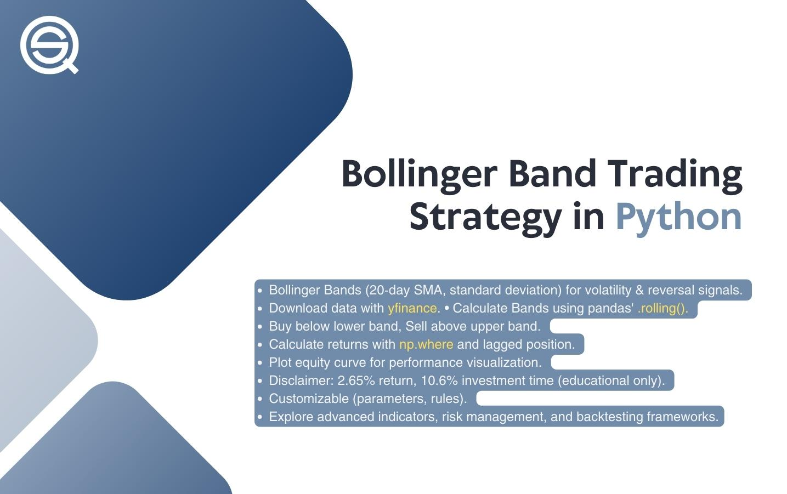

## Table of Contents

## What is a Bollinger Band and how does it work in trading?

A Bollinger Band is a tool used in trading to help understand how a stock or other financial thing is moving. It was created by a person named John Bollinger. It has three lines: a middle line, which is usually the average price of the thing over a certain time, and two outer lines. These outer lines are set above and below the middle line, and they show how much the price can go up or down before it's considered unusual.

Bollinger Bands work by showing if a price is too high or too low compared to what it usually does. When the price touches or goes past the top line, it might mean the price is too high and could go down soon. When it touches or goes past the bottom line, it might mean the price is too low and could go up soon. Traders use this information to decide when to buy or sell. But, it's important to use Bollinger Bands with other tools because they don't always predict the future perfectly.

## How can Python be used to implement a Bollinger Band trading strategy?

To implement a Bollinger Band trading strategy using Python, you can use libraries like Pandas for data manipulation and TA-Lib for technical analysis. First, you'll need to import your data, which could be historical price data for a stock or any other financial instrument. Then, you calculate the moving average for the middle band, typically using a 20-day simple moving average (SMA). After that, you calculate the standard deviation of the price over the same period. The upper band is calculated by adding two times the standard deviation to the moving average, and the lower band is calculated by subtracting two times the standard deviation from the moving average.

Once you have the Bollinger Bands calculated, you can start implementing your trading strategy. A common approach is to buy when the price touches the lower band, suggesting the price is oversold and might go up, and sell when the price touches the upper band, suggesting the price is overbought and might go down. You can code this logic in Python by checking if the current price is at or below the lower band to trigger a buy signal, or at or above the upper band to trigger a sell signal. It's important to backtest this strategy using historical data to see how it would have performed in the past, and to consider other factors like transaction costs and market conditions.

Remember, while this strategy can be coded in Python and backtested, it's not a guaranteed way to make money. Markets can be unpredictable, and Bollinger Bands should be used alongside other indicators and analysis methods to make more informed trading decisions. Python's flexibility and the availability of financial libraries make it a powerful tool for developing and testing trading strategies, but successful trading also requires understanding the broader market context and managing risk effectively.

## What are the basic components needed to calculate Bollinger Bands?

To calculate Bollinger Bands, you need three main things: the middle band, the upper band, and the lower band. The middle band is usually the simple moving average (SMA) of the price over a certain number of days, often 20 days. This SMA shows the average price of the thing you are looking at over that time.

The upper and lower bands are calculated using the middle band and something called standard deviation. Standard deviation tells you how much the price moves around its average. To find the upper band, you add two times the standard deviation to the middle band. To find the lower band, you subtract two times the standard deviation from the middle band. These bands create a channel around the price, showing if it's moving unusually high or low.

## How do you set up a simple trading environment in Python for Bollinger Band strategy?

To set up a simple trading environment in Python for a Bollinger Band strategy, you first need to install and import the necessary libraries. You'll need Pandas to handle data, NumPy for numerical calculations, and possibly TA-Lib or another library for technical indicators. Start by installing these libraries using pip, then import them at the beginning of your Python script. Next, you'll need to load your historical price data, which can be from a CSV file or an API. Use Pandas to read and organize this data into a DataFrame, making sure it includes the dates and closing prices of the asset you're analyzing.

Once your data is ready, you can calculate the Bollinger Bands. First, compute the 20-day simple moving average (SMA) of the closing prices to get the middle band. Then, calculate the standard deviation of the closing prices over the same 20-day period. The upper band is the SMA plus two times the standard deviation, and the lower band is the SMA minus two times the standard deviation. With these bands calculated, you can start implementing your trading strategy. For example, you might decide to buy when the price touches the lower band and sell when it touches the upper band. You can write a function to check these conditions and generate buy or sell signals based on where the current price is relative to the bands.

## What Python libraries are essential for implementing Bollinger Bands?

To implement Bollinger Bands in Python, you will need a few key libraries. Pandas is very important because it helps you work with data easily. You can use it to read data from files and organize it into a table called a DataFrame. NumPy is also crucial because it helps with math stuff like calculating averages and standard deviations, which you need for Bollinger Bands.

Another library you might want is TA-Lib. It's specifically made for technical analysis and makes it easier to calculate things like Bollinger Bands. But if you don't want to use TA-Lib, you can still do the calculations yourself using Pandas and NumPy. These libraries together make it possible to set up and test a trading strategy using Bollinger Bands in Python.

## How do you calculate the moving average for Bollinger Bands in Python?

To calculate the moving average for Bollinger Bands in Python, you'll use the Pandas library. You start by loading your data into a Pandas DataFrame. This data should include the dates and closing prices of the stock or whatever you're looking at. Then, you use Pandas to calculate the simple moving average (SMA) over a set number of days, usually 20 days. You can do this with the `rolling` function in Pandas, which lets you look at a certain number of past values. You set the window to 20 days and use the `mean` function to find the average of those 20 days. This gives you the middle band of the Bollinger Bands.

Once you have the moving average, you can use it to make the upper and lower bands. The upper band is the moving average plus two times the standard deviation of the prices over those 20 days. The lower band is the moving average minus two times the standard deviation. You can use NumPy to help with these calculations. With these three lines - the moving average in the middle, and the upper and lower bands around it - you've got your Bollinger Bands ready to use in your trading strategy.

## What is the significance of the standard deviation in Bollinger Bands and how to compute it in Python?

The standard deviation in Bollinger Bands is important because it helps show how much the price of a stock or other thing is moving around its average price. It's like a measure of how wild or calm the price is being. In Bollinger Bands, we use the standard deviation to draw the upper and lower lines around the middle line, which is the average price. If the price is moving a lot, the standard deviation will be big, making the upper and lower lines further apart. If the price is moving less, the standard deviation will be smaller, and the lines will be closer together. This helps traders see if the price is acting unusually high or low.

To compute the standard deviation in Python, you first need to get your data ready in a table called a DataFrame using the Pandas library. After that, you pick how many days you want to look at, usually 20 days. You then use Pandas to look at the closing prices over these 20 days with the `rolling` function. Once you have these 20 days of prices, you can use the `std` function in Pandas to find the standard deviation of those prices. This number tells you how much the prices are spread out around their average. With this standard deviation, you can then calculate the upper and lower Bollinger Bands by adding or subtracting two times the standard deviation from the average price.

## How can you use Bollinger Bands to generate buy and sell signals in Python?

To use Bollinger Bands to make buy and sell signals in Python, you first need to calculate the bands. You do this by finding the middle line, which is the average price over a set number of days, usually 20 days. Then, you figure out the upper and lower lines by adding or subtracting two times the standard deviation from the middle line. The standard deviation shows how much the price is moving around its average. Once you have these three lines, you can start looking for signals. A buy signal happens when the price touches or goes below the lower line, suggesting the price might be too low and could go up soon. A sell signal happens when the price touches or goes above the upper line, suggesting the price might be too high and could go down soon.

You can write a Python program to check these conditions and give you signals. Start by getting your price data into a table using the Pandas library. Calculate the Bollinger Bands like we talked about before. Then, make a rule in your program that says if the current price is at or below the lower line, it's time to buy. If the current price is at or above the upper line, it's time to sell. You can use loops to check this every day or every time new data comes in. Remember, these signals are just suggestions, and you should use them with other tools and your own research to make better trading choices.

## What are common pitfalls and how to avoid them when using Bollinger Bands in Python trading?

One common pitfall when using Bollinger Bands in Python trading is relying too much on the signals without considering other factors. Bollinger Bands can give you buy and sell signals, but they don't work perfectly all the time. Prices can keep going up even after touching the upper band or keep going down after touching the lower band. To avoid this, you should use Bollinger Bands with other tools like moving averages, volume indicators, or even news and market trends. This way, you get a fuller picture of what's happening and can make smarter trading decisions.

Another pitfall is not accounting for transaction costs and market conditions. Every time you buy or sell, you pay fees, and these can add up quickly if you're trading a lot based on Bollinger Band signals. Also, markets can be unpredictable, and what worked in the past might not work in the future. To avoid these issues, always include transaction costs in your strategy testing and be ready to adjust your strategy if market conditions change. Remember, no trading strategy, including one based on Bollinger Bands, is foolproof, so always manage your risk and don't put all your money into one trade.

## How can you backtest a Bollinger Band strategy in Python to assess its effectiveness?

To backtest a Bollinger Band strategy in Python, you first need to gather historical price data for the stock or asset you're interested in. You can use libraries like Pandas to load this data into a table called a DataFrame. Once you have the data, you calculate the Bollinger Bands using the moving average and standard deviation of the prices over a certain period, usually 20 days. Then, you write a program that checks if the price touches the upper or lower band and generates buy or sell signals based on these touches. You run your strategy over the historical data to see how it would have performed if you had used it in the past.

After running your strategy, you need to look at how well it did. You can use measures like total return, how much risk you took, and how often you were right or wrong to see if the strategy worked well. You might find that your strategy made money overall, but it's important to also see if it did better than just holding onto the stock. If the strategy didn't do well, you can change things like the number of days you use for the moving average or how many times the standard deviation you use for the bands. Backtesting helps you see what works and what doesn't before you start using the strategy with real money.

## What advanced techniques can be applied to enhance a Bollinger Band strategy in Python?

To make a Bollinger Band strategy better in Python, you can use something called "bandwidth." Bandwidth is the space between the upper and lower bands of the Bollinger Bands. When this space gets smaller, it means the price is not moving much, and when it gets bigger, the price is moving a lot. You can use this to add to your strategy. For example, if the bandwidth is very small and then the price breaks out of the bands, it might be a strong signal to buy or sell. You can code this in Python by calculating the bandwidth and adding it to your trading rules.

Another way to improve your Bollinger Band strategy is by using other indicators along with it. One popular indicator is the Relative Strength Index (RSI), which tells you if a stock is overbought or oversold. If the price touches the lower Bollinger Band and the RSI is low, it might be a good time to buy because the stock could be very oversold. On the other hand, if the price touches the upper Bollinger Band and the RSI is high, it might be a good time to sell because the stock could be overbought. You can use libraries like TA-Lib in Python to calculate RSI and combine it with your Bollinger Band strategy to make better trading decisions.

## How can machine learning be integrated with Bollinger Bands in Python for improved trading decisions?

Machine learning can be added to a Bollinger Band strategy in Python to make better trading decisions by using past data to predict future price movements. You can train a machine learning model to look at the Bollinger Bands and other data like volume and price changes to figure out patterns that might be hard for a person to see. For example, you might use a model to predict if the price will keep going up after touching the upper band or if it will go down after touching the lower band. By using machine learning, you can make your trading rules smarter and more accurate, helping you decide when to buy or sell based on what the model thinks will happen next.

To do this in Python, you would start by gathering lots of past price data and any other information you want to use, like volume or other indicators. Then, you use a library like scikit-learn to train a model on this data. You can try different types of models, like decision trees or neural networks, to see which one works best for predicting price movements based on Bollinger Bands. Once your model is trained, you can use it in real-time to get predictions that help you make better trading decisions. Remember, though, that even with machine learning, trading is risky and you should always think carefully about your choices.

## References & Further Reading

[1]: Bollinger, J. (2001). ["Bollinger on Bollinger Bands."](https://www.amazon.com/Bollinger-Bands-John/dp/0071373683) McGraw-Hill.

[2]: Hilpisch, Y. (2018). ["Python for Finance: Mastering Data-Driven Finance."](https://books.google.com/books/about/Python_for_Finance.html?id=2qd9DwAAQBAJ) O'Reilly Media.

[3]: Chan, E. (2009). ["Quantitative Trading: How to Build Your Own Algorithmic Trading Business."](https://rickorford.com/quantitative-trading/) Wiley.

[4]: Lopez de Prado, M. (2018). ["Advances in Financial Machine Learning."](https://www.amazon.com/Advances-Financial-Machine-Learning-Marcos/dp/1119482089) Wiley.

[5]: Aronson, D. (2006). ["Evidence-Based Technical Analysis: Applying the Scientific Method and Statistical Inference to Trading Signals."](https://www.amazon.com/Evidence-Based-Technical-Analysis-Scientific-Statistical/dp/0470008741) Wiley.

[6]: Reddit Algorithmic Trading - ["Python Backtrader and QuantConnect Resources."](https://www.reddit.com/r/algotrading/comments/vhvvlj/which_python_libraries_i_should_use_for_algo/) 

[7]: Jansen, S. (2020). ["Machine Learning for Algorithmic Trading."](https://github.com/stefan-jansen/machine-learning-for-trading) Packt Publishing.