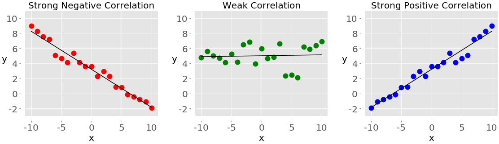

## Table of Contents

## What is correlation in the context of data analysis?

Correlation in data analysis is a way to measure how two different things change together. Imagine you have two sets of numbers, like the amount of ice cream sold and the temperature outside. If you find that when the temperature goes up, ice cream sales also go up, these two things are correlated. Correlation helps us see patterns and relationships between different pieces of data.

However, just because two things are correlated doesn't mean one causes the other. For example, ice cream sales and temperature might be correlated, but eating ice cream doesn't make the temperature rise. It's important to be careful and not jump to conclusions about cause and effect just because we see a correlation. Correlation is a useful tool, but it's just the first step in understanding the relationships in data.

## How can correlation be used in Python for data analysis?

In Python, you can use correlation to see how two sets of numbers relate to each other. A common way to do this is by using a library called Pandas. Pandas has a function called `corr()` that you can use on your data. Imagine you have data about the number of hours students study and their exam scores. You can put this data into a Pandas DataFrame and then use `corr()` to find out if studying more hours is related to getting higher scores. The result will be a number between -1 and 1. If it's close to 1, it means when one number goes up, the other does too. If it's close to -1, it means when one goes up, the other goes down. If it's close to 0, there's not much of a relationship.

Another useful thing in Python is making a visual called a scatter plot to see the correlation. You can use a library called Matplotlib to create this. If you plot the hours studied on one axis and the exam scores on the other, you'll see dots on the graph. If the dots form a line going up from left to right, it shows a positive correlation. If the line goes down, it's a negative correlation. And if the dots are all over the place, there's little to no correlation. This visual helps you understand the relationship between the data in a way that's easy to see.

## What are the different types of correlation coefficients?

There are several types of correlation coefficients, but the most common ones are Pearson, Spearman, and Kendall. The Pearson correlation coefficient measures the linear relationship between two sets of data. It's the one you'll see most often because it's good for checking if there's a straight-line relationship between things like the temperature and ice cream sales. The Pearson coefficient is a number between -1 and 1, where 1 means a perfect positive linear relationship, -1 means a perfect negative linear relationship, and 0 means no linear relationship.

The Spearman correlation coefficient, on the other hand, looks at the rank order of the data rather than the actual values. It's useful when your data isn't normally distributed or if you have outliers that could mess up the Pearson correlation. The Spearman coefficient also gives you a number between -1 and 1, but it tells you about the monotonic relationship, which means if one thing goes up, the other tends to go up too, but not necessarily in a straight line. 

Lastly, the Kendall correlation coefficient is another rank-based measure, similar to Spearman but often used when you have smaller datasets. It measures the strength of the relationship between two variables by looking at the number of concordant and discordant pairs. Like the other coefficients, Kendall's tau also ranges from -1 to 1, with higher values indicating stronger associations. Each of these coefficients helps us understand different aspects of how two sets of data relate to each other.

## How do you calculate Pearson's correlation coefficient in Python?

To calculate Pearson's correlation coefficient in Python, you can use the Pandas library. Imagine you have two lists of numbers, like the hours students study and their exam scores. First, you put these numbers into a Pandas DataFrame. Then, you use the `corr()` function on your DataFrame. If you want to find the correlation between the hours studied and the exam scores, you can use `DataFrame['hours_studied'].corr(DataFrame['exam_scores'])`. This will give you a number between -1 and 1, which tells you how strong the linear relationship is between the two sets of numbers.

For example, if the result is close to 1, it means that as the hours studied go up, the exam scores also go up. If it's close to -1, it means that as the hours studied go up, the exam scores go down. And if it's close to 0, it means there's not much of a relationship between the hours studied and the exam scores. This number helps you understand if there's a straight-line pattern between the two sets of data.

## What is Spearman's rank correlation and how is it calculated in Python?

Spearman's rank correlation is a way to see how two sets of numbers relate to each other when you look at their order instead of their actual values. Imagine you have two lists of numbers, like the hours students study and their exam scores. Instead of using the exact numbers, you rank them from lowest to highest. For example, if a student studied the least, they get rank 1, and if they studied the most, they get the highest rank. Spearman's correlation then checks if the ranks of one list go up or down together with the ranks of the other list. It's useful when the actual numbers might not be normally spread out or if there are some unusual numbers that could mess up other kinds of correlation checks.

To calculate Spearman's rank correlation in Python, you use the Pandas library. If you have your data in a Pandas DataFrame, you can use the `corr()` function with the method set to 'spearman'. For example, if you want to find the correlation between the hours studied and the exam scores, you would use `DataFrame['hours_studied'].corr(DataFrame['exam_scores'], method='spearman')`. This gives you a number between -1 and 1. A number close to 1 means that as the rank of hours studied goes up, the rank of exam scores also goes up. A number close to -1 means that as the rank of hours studied goes up, the rank of exam scores goes down. And a number close to 0 means there's not much of a relationship between the ranks of the two sets of numbers.

## How can you visualize correlation in Python using libraries like Matplotlib or Seaborn?

To visualize correlation in Python, you can use libraries like Matplotlib or Seaborn. One common way to do this is by making a scatter plot. With Matplotlib, you can use the `scatter()` function to plot your data points. Imagine you have two lists of numbers, like the hours students study and their exam scores. You can plot the hours studied on the x-axis and the exam scores on the y-axis. If you see the dots forming a line that goes up from left to right, it shows a positive correlation. If the line goes down, it shows a negative correlation. And if the dots are all over the place, there's little to no correlation. This helps you see the relationship between the two sets of numbers in a way that's easy to understand.

Another useful tool for visualizing correlation is Seaborn, which has a function called `regplot()`. This function not only plots the scatter of your data points but also adds a line that shows the best fit for the relationship between the two sets of numbers. This line makes it easier to see if there's a linear relationship. For example, if you use `regplot()` to look at the hours studied and the exam scores, the line will show you if more studying tends to lead to higher scores. Seaborn can also create a heatmap with the `heatmap()` function, which is great for looking at the correlation between many different sets of numbers at once. The colors in the heatmap show you how strong the relationships are, making it easy to spot patterns in your data.

## What are the common pitfalls when interpreting correlation results?

One common pitfall when looking at correlation results is thinking that just because two things are related, one causes the other. For example, if you see that ice cream sales go up when the temperature rises, it's easy to think that buying ice cream makes the temperature go up. But that's not true. It's important to remember that correlation doesn't mean causation. There might be other reasons why both things happen at the same time, like people buying more ice cream because they're hot, not because they're causing the heat.

Another mistake people make is not checking if the data fits the type of correlation they're using. For instance, Pearson's correlation works best with data that follows a straight line. If your data doesn't do that, using Pearson's correlation might give you the wrong idea about the relationship. It's important to pick the right kind of correlation, like Spearman's for data that doesn't follow a straight line, to get a true picture of how your numbers relate to each other.

## How do you handle missing data when calculating correlation in Python?

When you want to find out how two sets of numbers relate to each other using correlation in Python, missing data can be a problem. If some numbers are missing, it can mess up your results. But Python's Pandas library has a way to deal with this. When you use the `corr()` function to calculate correlation, Pandas will automatically ignore any rows that have missing data. This means you don't have to worry about those missing numbers messing up your correlation results.

However, it's still important to think about why your data might be missing. Sometimes, missing data can tell you something important about your numbers. If you just ignore it without thinking, you might miss out on understanding your data better. So, before you calculate the correlation, take a look at your data and think about what the missing parts might mean. This way, you can make sure you're getting the most accurate picture of how your numbers relate to each other.

## Can you explain partial correlation and how to compute it in Python?

Partial correlation is a way to look at how two things are related to each other while taking away the effect of a third thing. Imagine you want to see if studying more hours helps students get better exam scores, but you also know that how smart a student is can affect both how much they study and how well they do on exams. Partial correlation lets you see the relationship between hours studied and exam scores without the influence of the student's intelligence getting in the way. It helps you understand if there's a true connection between the two things you're looking at, even when other factors are involved.

To compute partial correlation in Python, you can use the `pingouin` library, which has a function called `partial_corr()`. First, you need to install the library by running `pip install pingouin`. Then, if you have your data in a Pandas DataFrame, you can use `pg.partial_corr(data=df, x='hours_studied', y='exam_scores', covar='intelligence')`. This function will give you a number that shows how hours studied and exam scores are related, without the effect of intelligence. The number will be between -1 and 1, just like with regular correlation. A number close to 1 means a strong positive relationship, close to -1 means a strong negative relationship, and close to 0 means little to no relationship.

## What are some advanced techniques for analyzing correlation in time series data using Python?

When you're looking at time series data, which is data that changes over time, like stock prices or daily temperatures, you can use special techniques to see how things are related. One common method is called cross-correlation. This helps you see if changes in one time series, like stock prices, are related to changes in another time series, like trading volume, but with a delay. In Python, you can use the `numpy` library to calculate cross-correlation with the function `numpy.correlate()`. This function will give you numbers that show how the two series are related at different time lags. If you see a peak at a certain lag, it means the two series are most strongly related when one is shifted by that amount of time.

Another useful technique is to use a method called Granger causality. This method helps you figure out if one time series can help predict another. For example, you might want to know if past values of stock prices can help you predict future trading volumes. In Python, you can use the `statsmodels` library to do this. The `grangercausalitytests()` function will test if one series can help predict another, and it will give you a bunch of numbers and statistics to help you understand the relationship. Both cross-correlation and Granger causality are powerful tools that can give you a deeper understanding of how different time series data are connected to each other.

## How do you test the significance of a correlation coefficient in Python?

To test if a correlation coefficient is significant in Python, you can use the `scipy` library. Imagine you found a correlation between the hours students study and their exam scores, and you want to know if this relationship is real or just happened by chance. You can use the `pearsonr()` function from `scipy.stats` to calculate the Pearson correlation and also get a p-value. The p-value tells you how likely it is that the correlation you found is just a coincidence. If the p-value is small, usually less than 0.05, it means the correlation is probably real and not just a fluke.

For example, if you have your data in a Pandas DataFrame, you can use `scipy.stats.pearsonr(DataFrame['hours_studied'], DataFrame['exam_scores'])`. This function will give you two numbers: the correlation coefficient and the p-value. If the p-value is less than 0.05, you can say that the correlation is statistically significant. This means you can be pretty sure that there's a real relationship between the hours studied and the exam scores, and it's not just something that happened by chance.

## What are the best practices for reporting correlation results in a research paper or data analysis report?

When you write about correlation results in a research paper or data analysis report, it's important to be clear and easy to understand. Start by saying what kind of correlation you used, like Pearson, Spearman, or Kendall. Then, tell your readers the correlation coefficient, which is a number between -1 and 1. Explain what this number means. For example, if it's close to 1, it means when one thing goes up, the other thing goes up too. If it's close to -1, it means when one thing goes up, the other thing goes down. Also, mention the p-value, which shows if the correlation is real or just happened by chance. A small p-value, usually less than 0.05, means the correlation is probably real.

It's also helpful to use visuals like scatter plots or heatmaps to show the correlation. This makes it easier for people to see the relationship between the numbers. When you talk about the results, be careful not to say that one thing causes the other just because they're correlated. Remember, correlation doesn't mean causation. If you have other factors that might affect the relationship, like using partial correlation, make sure to explain that too. This way, your readers can understand the full picture of how your data is related.

## Question: Why should one use Python for correlation analysis?

Python serves as an effective tool for correlation analysis in [algorithmic trading](/wiki/algorithmic-trading) due to its extensive collection of libraries tailored for data manipulation and statistical computation. Among these, Pandas and NumPy stand out for their efficiency and ease of use. Pandas, with its powerful DataFrame structure, simplifies the handling and processing of large datasets. It provides functions such as `corr()`, which can compute correlation matrices directly from DataFrames, allowing traders to quickly assess the relationships between multiple assets.

NumPy complements Pandas by offering a high-performance multidimensional array object and various mathematical functions. For instance, using NumPy, a trader can calculate the Pearson correlation coefficient—one of the most common measures of correlation. The formula for Pearson correlation is:

$$
r = \frac{\sum{(X_i - \overline{X})(Y_i - \overline{Y})}}{\sqrt{\sum{(X_i - \overline{X})^2} \cdot \sum{(Y_i - \overline{Y})^2}}}
$$

Here $X$ and $Y$ represent the data points of two variables, and $\overline{X}$ and $\overline{Y}$ are their respective means. This can be implemented in Python using NumPy as follows:

```python
import numpy as np

# Sample data
X = np.array([1, 2, 3, 4, 5])
Y = np.array([2, 4, 6, 8, 10])

# Correlation calculation
r = np.corrcoef(X, Y)[0, 1]
print(f"Pearson correlation coefficient: {r}")
```

The appeal of Python extends beyond its functional libraries. Its widespread adoption in the trading community stems from the availability of comprehensive online resources and active community support, which make troubleshooting and learning more accessible. Furthermore, Python's straightforward syntax enhances readability and reduces the learning curve associated with mastering complex statistical concepts, making it easier for traders to transition from prototyping to implementation of sophisticated models.

Python's ecosystem continues to grow, with continual updates and new tools emerging to address evolving market needs. This adaptability is crucial in trading, where strategies must evolve to remain effective. Consequently, Python's combination of robust libraries, supportive community, and development infrastructure makes it an optimal choice for traders seeking to integrate correlation analysis into their trading processes efficiently.

## How do you implement correlation in Python?

To effectively implement correlation analysis in Python, a well-configured environment with the correct libraries is essential. For statistical computation and data manipulation, installing Pandas, NumPy, and SciPy is a fundamental step. These libraries offer powerful tools to handle large datasets and perform statistical operations efficiently.

```python
# Sample setup in Python
import pandas as pd
import numpy as np
import scipy.stats as stats
```

For acquiring financial data, APIs such as Yahoo Finance provide a reliable source. The library `yfinance` can be utilized for this purpose. It allows fetching historical data for various financial instruments directly into a Pandas DataFrame, facilitating seamless analysis.

```python
# Importing financial data
import yfinance as yf  # For more datasets, visit: https://paperswithbacktest.com/datasets

# Fetch data for two assets
data = yf.download(['AAPL', 'MSFT'], start='2022-01-01', end='2022-12-31')

# Display the first few rows of the dataset
print(data.head())
```

Once the data is imported, calculating the correlation between asset prices involves using the Pandas `DataFrame.corr()` method. This computes the Pearson correlation coefficient, which measures linear correlation between two variables.

```python
# Calculate correlation matrix
correlation_matrix = data['Adj Close'].corr()

# Output the correlation coefficients
print(correlation_matrix)
```

The correlation coefficient ranges from -1 to 1. A value closer to 1 implies a strong positive correlation, meaning that as one asset's price increases, so does the other's. Conversely, a value closer to -1 indicates a strong negative correlation, suggesting that one asset's price increase leads to the other's decrease. A coefficient near 0 indicates no linear correlation.

For instance, the Pearson correlation coefficient $r$ between two variables $X$ and $Y$ is calculated as:

$$
r = \frac{\sum{(x_i - \bar{x})(y_i - \bar{y})}}{\sqrt{\sum{(x_i - \bar{x})^2} \sum{(y_i - \bar{y})^2}}}
$$

where $x_i$ and $y_i$ are the individual sample points, and $\bar{x}$ and $\bar{y}$ are the means of $X$ and $Y$, respectively.

Here's an example of calculating the Pearson correlation manually using NumPy for deeper understanding:

```python
# Extract price data for computation
prices_a = data['Adj Close']['AAPL']
prices_b = data['Adj Close']['MSFT']

# Calculate means
mean_a = np.mean(prices_a)
mean_b = np.mean(prices_b)

# Compute the Pearson correlation coefficient
numerator = np.sum((prices_a - mean_a) * (prices_b - mean_b))
denominator = np.sqrt(np.sum((prices_a - mean_a)**2) * np.sum((prices_b - mean_b)**2))
pearson_correlation = numerator / denominator

print("Pearson Correlation Coefficient:", pearson_correlation)
```

The interpretation of these findings can guide decision-making in trading strategies, considering how different assets interact with each other. Properly understanding and utilizing correlation can be immensely beneficial in diversifying and managing risk within a trading portfolio.

## What are Correlation Strategies in Algorithmic Trading?

Pairs trading is a popular strategy that capitalizes on the correlation between two related securities. When the price divergence between the two securities widens from their historical correlation, a trader enters two simultaneous trades: going long on the underperforming security and short on the outperforming one. The expectation is that the prices will revert to their historical relationship, yielding a profit from the convergence. The strategy can be mathematically represented using the z-score formula to identify entry and [exit](/wiki/exit-strategy) points:

$$
z = \frac{(P_A - P_B) - \mu}{\sigma}
$$

where $P_A$ and $P_B$ are the prices of the two securities, $\mu$ is the mean of the price differences, and $\sigma$ is the standard deviation.

Risk management is another crucial application of correlation analysis. Traders assess the correlation between assets in a portfolio to determine potential risks. Highly correlated assets imply similar price movements, which can increase the portfolio's risk during adverse market conditions. By including assets with low or negative correlations, traders can mitigate risks through diversification. Correlation matrices and heatmaps generated using Python libraries such as Pandas and Seaborn offer visual insights into the relationships between different assets, guiding diversification strategies.

In market analysis, correlation aids in understanding market sentiment and forecasting price movements. By analyzing historical correlations, traders can deduce which sectors or securities are likely to move together in response to economic events or market shifts. This analysis serves as a foundation for developing predictive models to anticipate future price actions.

The integration of correlation analysis within [machine learning](/wiki/machine-learning) models enhances the prediction of market trends. Using machine learning techniques such as regression analysis or neural networks, traders can input historical correlation data to train models that predict future price movements. For instance, the combination of feature engineering techniques with correlation analysis bolsters the performance of these models, improving predictive accuracy.

Incorporating these strategies requires a balanced understanding of both statistical principles and market dynamics. Correlation, while powerful, should be complemented with other analytical tools to develop robust trading strategies.

## References & Further Reading

[1]: McKinney, W. (2012). ["Python for Data Analysis."](https://wesmckinney.com/book/) O'Reilly Media. 

[2]: Harris, C. R., Millman, K. J., van der Walt, S. J., Gommers, R., Virtanen, P., Cournapeau, D., ... & Oliphant, T. E. (2020). ["Array programming with NumPy."](https://pubmed.ncbi.nlm.nih.gov/32939066/) Nature, 585(7825), 357-362.

[3]: Granger, C. W. J., & Engle, R. F. (1987). ["Cointegration and Error Correction: Representation, Estimation, and Testing."](https://www.jstor.org/stable/1913236?read-now=1) Econometrica, 55(2), 251-276.

[4]: Wes McKinney. (2010). ["Data Structures for Statistical Computing in Python."](http://conference.scipy.org.s3-website-us-east-1.amazonaws.com/proceedings/scipy2010/pdfs/mckinney.pdf) Proceedings of the 9th Python in Science Conference.

[5]: Chan, E. P. (2009). ["Quantitative Trading: How to Build Your Own Algorithmic Trading Business."](https://github.com/ftvision/quant_trading_echan_book) Wiley.