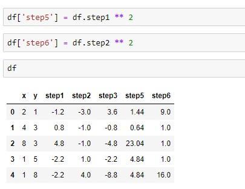

In algorithmic trading, data analysis plays a pivotal role in decision making. As markets evolve and grow increasingly complex, traders rely heavily on quantitative methods to gain an edge. Correlation, a fundamental statistical measure, helps traders understand how different assets move in relation to one another, providing insights into possible future market movements. Incorporating correlation analysis into trading strategies allows for more informed asset allocation, risk management, and market prediction.

Python, widely adopted in data science, offers robust tools for computing correlation efficiently. Libraries such as Pandas and NumPy simplify handling large datasets, allowing traders to quickly compute correlation coefficients and interpret the results. These capabilities make Python an invaluable resource for traders aiming to integrate statistical analysis into their strategies.



This article explores correlation within the context of algorithmic trading and discusses how Python can be leveraged to develop and implement effective correlation strategies. Regardless of experience level, embracing correlation analysis as part of one's trading toolkit can enhance trading strategies, offering fresh perspectives on market dynamics. Understanding correlation not only aids in predicting price movements but also in constructing diversified portfolios that can withstand market volatility.

## Table of Contents

## Understanding Correlation in Trading

Correlation measures the relationship between two or more variables and is crucial in understanding how different assets in financial markets move relative to each other. In trading, correlation helps predict and analyze market behavior, enabling traders to make informed decisions.

A positive correlation indicates that the prices of two assets move in the same direction. For example, if the prices of both gold and silver tend to increase or decrease together, they are positively correlated. Conversely, a negative correlation implies that the prices move in opposite directions. For instance, if an increase in the price of oil typically coincides with a decrease in airline stocks, these assets are negatively correlated.

Using correlation, traders can devise strategies to diversify their portfolios effectively. By including assets with low or negative correlations, traders can reduce portfolio risk. When assets are not perfectly correlated, the overall portfolio variance can decrease, leading to a more stable investment return. Moreover, correlation aids in hedging risks. By understanding the correlation between different market instruments, traders can take offsetting positions to protect against potential price movements.

Additionally, correlation assists in identifying market opportunities. By analyzing how assets correlate with one another, traders can detect market anomalies or mispricing that may present lucrative trading opportunities. For example, a trader might examine currency pairs and use correlation to anticipate movements in the [forex](/wiki/forex-system) market or leverage sector-specific correlations to predict equity movements.

Understanding correlation dynamics is crucial for developing robust trading strategies. Correlations are not static; they can change with market conditions. Continuously monitoring correlations helps traders adjust their strategies to maintain an optimal risk-reward balance. Employing mathematical tools, such as the Pearson correlation coefficient, facilitates the quantitative analysis necessary for accurate correlation measurements.

In conclusion, a firm grasp of correlation dynamics enhances a trader's ability to navigate the complexities of financial markets, offering the potential for improved risk management and the discovery of new market opportunities.

## Why Use Python for Correlation Analysis?

Python serves as an effective tool for correlation analysis in [algorithmic trading](/wiki/algorithmic-trading) due to its extensive collection of libraries tailored for data manipulation and statistical computation. Among these, Pandas and NumPy stand out for their efficiency and ease of use. Pandas, with its powerful DataFrame structure, simplifies the handling and processing of large datasets. It provides functions such as `corr()`, which can compute correlation matrices directly from DataFrames, allowing traders to quickly assess the relationships between multiple assets.

NumPy complements Pandas by offering a high-performance multidimensional array object and various mathematical functions. For instance, using NumPy, a trader can calculate the Pearson correlation coefficient—one of the most common measures of correlation. The formula for Pearson correlation is:

$$
r = \frac{\sum{(X_i - \overline{X})(Y_i - \overline{Y})}}{\sqrt{\sum{(X_i - \overline{X})^2} \cdot \sum{(Y_i - \overline{Y})^2}}}
$$

Here $X$ and $Y$ represent the data points of two variables, and $\overline{X}$ and $\overline{Y}$ are their respective means. This can be implemented in Python using NumPy as follows:

```python
import numpy as np

# Sample data
X = np.array([1, 2, 3, 4, 5])
Y = np.array([2, 4, 6, 8, 10])

# Correlation calculation
r = np.corrcoef(X, Y)[0, 1]
print(f"Pearson correlation coefficient: {r}")
```

The appeal of Python extends beyond its functional libraries. Its widespread adoption in the trading community stems from the availability of comprehensive online resources and active community support, which make troubleshooting and learning more accessible. Furthermore, Python's straightforward syntax enhances readability and reduces the learning curve associated with mastering complex statistical concepts, making it easier for traders to transition from prototyping to implementation of sophisticated models.

Python's ecosystem continues to grow, with continual updates and new tools emerging to address evolving market needs. This adaptability is crucial in trading, where strategies must evolve to remain effective. Consequently, Python's combination of robust libraries, supportive community, and development infrastructure makes it an optimal choice for traders seeking to integrate correlation analysis into their trading processes efficiently.

## Implementing Correlation in Python

To effectively implement correlation analysis in Python, a well-configured environment with the correct libraries is essential. For statistical computation and data manipulation, installing Pandas, NumPy, and SciPy is a fundamental step. These libraries offer powerful tools to handle large datasets and perform statistical operations efficiently.

```python
# Sample setup in Python
import pandas as pd
import numpy as np
import scipy.stats as stats
```

For acquiring financial data, APIs such as Yahoo Finance provide a reliable source. The library `yfinance` can be utilized for this purpose. It allows fetching historical data for various financial instruments directly into a Pandas DataFrame, facilitating seamless analysis.

```python
# Importing financial data
import yfinance as yf  # For more datasets, visit: https://paperswithbacktest.com/datasets

# Fetch data for two assets
data = yf.download(['AAPL', 'MSFT'], start='2022-01-01', end='2022-12-31')

# Display the first few rows of the dataset
print(data.head())
```

Once the data is imported, calculating the correlation between asset prices involves using the Pandas `DataFrame.corr()` method. This computes the Pearson correlation coefficient, which measures linear correlation between two variables.

```python
# Calculate correlation matrix
correlation_matrix = data['Adj Close'].corr()

# Output the correlation coefficients
print(correlation_matrix)
```

The correlation coefficient ranges from -1 to 1. A value closer to 1 implies a strong positive correlation, meaning that as one asset's price increases, so does the other's. Conversely, a value closer to -1 indicates a strong negative correlation, suggesting that one asset's price increase leads to the other's decrease. A coefficient near 0 indicates no linear correlation.

For instance, the Pearson correlation coefficient $r$ between two variables $X$ and $Y$ is calculated as:

$$
r = \frac{\sum{(x_i - \bar{x})(y_i - \bar{y})}}{\sqrt{\sum{(x_i - \bar{x})^2} \sum{(y_i - \bar{y})^2}}}
$$

where $x_i$ and $y_i$ are the individual sample points, and $\bar{x}$ and $\bar{y}$ are the means of $X$ and $Y$, respectively.

Here's an example of calculating the Pearson correlation manually using NumPy for deeper understanding:

```python
# Extract price data for computation
prices_a = data['Adj Close']['AAPL']
prices_b = data['Adj Close']['MSFT']

# Calculate means
mean_a = np.mean(prices_a)
mean_b = np.mean(prices_b)

# Compute the Pearson correlation coefficient
numerator = np.sum((prices_a - mean_a) * (prices_b - mean_b))
denominator = np.sqrt(np.sum((prices_a - mean_a)**2) * np.sum((prices_b - mean_b)**2))
pearson_correlation = numerator / denominator

print("Pearson Correlation Coefficient:", pearson_correlation)
```

The interpretation of these findings can guide decision-making in trading strategies, considering how different assets interact with each other. Properly understanding and utilizing correlation can be immensely beneficial in diversifying and managing risk within a trading portfolio.

## Correlation Strategies in Algorithmic Trading

Pairs trading is a popular strategy that capitalizes on the correlation between two related securities. When the price divergence between the two securities widens from their historical correlation, a trader enters two simultaneous trades: going long on the underperforming security and short on the outperforming one. The expectation is that the prices will revert to their historical relationship, yielding a profit from the convergence. The strategy can be mathematically represented using the z-score formula to identify entry and [exit](/wiki/exit-strategy) points:

$$
z = \frac{(P_A - P_B) - \mu}{\sigma}
$$

where $P_A$ and $P_B$ are the prices of the two securities, $\mu$ is the mean of the price differences, and $\sigma$ is the standard deviation.

Risk management is another crucial application of correlation analysis. Traders assess the correlation between assets in a portfolio to determine potential risks. Highly correlated assets imply similar price movements, which can increase the portfolio's risk during adverse market conditions. By including assets with low or negative correlations, traders can mitigate risks through diversification. Correlation matrices and heatmaps generated using Python libraries such as Pandas and Seaborn offer visual insights into the relationships between different assets, guiding diversification strategies.

In market analysis, correlation aids in understanding market sentiment and forecasting price movements. By analyzing historical correlations, traders can deduce which sectors or securities are likely to move together in response to economic events or market shifts. This analysis serves as a foundation for developing predictive models to anticipate future price actions.

The integration of correlation analysis within [machine learning](/wiki/machine-learning) models enhances the prediction of market trends. Using machine learning techniques such as regression analysis or neural networks, traders can input historical correlation data to train models that predict future price movements. For instance, the combination of feature engineering techniques with correlation analysis bolsters the performance of these models, improving predictive accuracy.

Incorporating these strategies requires a balanced understanding of both statistical principles and market dynamics. Correlation, while powerful, should be complemented with other analytical tools to develop robust trading strategies.

## Challenges and Considerations

Dynamic correlations present significant considerations for traders who utilize correlation analysis in algorithmic trading. Unlike static correlations, dynamic correlations fluctuate over time in response to market conditions and economic events. This variability can impact the effectiveness of trading strategies, necessitating adaptive approaches that account for temporal changes in asset relationships. For instance, a strategy based on a previously observed strong correlation may fail if that correlation diminishes or reverses due to shifts in market dynamics.

One common challenge in correlation analysis is over-fitting, which occurs when a model is excessively complex and captures noise rather than the underlying relationship. Over-fitting can lead to misleading correlation assumptions, resulting in suboptimal trading decisions. Traders should implement techniques such as cross-validation to ensure their models generalize well to unseen data and do not merely exploit random patterns present in historical datasets.

Data quality is another critical [factor](/wiki/factor-investing) affecting correlation analysis. Missing or incorrect data can distort correlation calculations, leading to erroneous conclusions. Traders should employ rigorous data cleaning processes, such as handling missing values with interpolation or removing outliers, to improve data integrity and the reliability of correlation results. Utilizing high-quality, reputable data sources is also crucial in minimizing these risks.

It's important to note that correlation does not imply causation. Two assets may exhibit a high correlation due to common external factors rather than a direct relationship. Misinterpreting correlation as causation can lead to flawed trading strategies. Therefore, traders should complement correlation analysis with other methods, such as [fundamental analysis](/wiki/fundamental-analysis) or causal inference techniques, to gain a more comprehensive understanding of market dynamics.

In conclusion, successful application of correlation analysis in trading strategies requires an awareness of its dynamic nature, the avoidance of over-fitting, meticulous attention to data quality, and a cautious interpretation of correlation results. By acknowledging these challenges and considerations, traders can enhance their ability to make informed decisions in the financial markets.

## Conclusion

Correlation analysis serves as a fundamental component in algorithmic trading, providing traders with essential insights into the relationships and movements within the financial markets. By understanding how different assets behave in relation to one another, traders can make informed decisions that align with their strategic objectives.

Python's extensive suite of libraries—including Pandas, NumPy, and SciPy—offers powerful tools that simplify the computation of correlation, enabling traders to assess these relationships effectively. Its straightforward syntax and readability allow for rapid prototyping and complex data analysis without demanding a steep learning curve, making it a favored choice among traders for designing and implementing trading strategies.

Grasping the subtleties of correlation is vital for gaining a competitive edge in the financial markets. Traders who can accurately interpret correlation data are better equipped to diversify portfolios and mitigate risk, all while identifying lucrative opportunities based on market sentiment. However, merely recognizing correlations is insufficient; effective traders must also remain vigilant and adaptive, given the dynamic nature of market conditions. Correlations are not static and can fluctuate due to a myriad of factors, necessitating continuous evaluation and adjustment of strategies.

Embracing continual learning and remaining flexible to market dynamics is essential for anyone aiming to harness the full potential of correlation analysis in trading. By doing so, traders not only ensure the robustness of their strategies but also position themselves favorably in the ever-evolving landscape of algorithmic trading.

## References & Further Reading

[1]: McKinney, W. (2012). ["Python for Data Analysis."](https://wesmckinney.com/book/) O'Reilly Media. 

[2]: Harris, C. R., Millman, K. J., van der Walt, S. J., Gommers, R., Virtanen, P., Cournapeau, D., ... & Oliphant, T. E. (2020). ["Array programming with NumPy."](https://pubmed.ncbi.nlm.nih.gov/32939066/) Nature, 585(7825), 357-362.

[3]: Granger, C. W. J., & Engle, R. F. (1987). ["Cointegration and Error Correction: Representation, Estimation, and Testing."](https://www.jstor.org/stable/1913236?read-now=1) Econometrica, 55(2), 251-276.

[4]: Wes McKinney. (2010). ["Data Structures for Statistical Computing in Python."](http://conference.scipy.org.s3-website-us-east-1.amazonaws.com/proceedings/scipy2010/pdfs/mckinney.pdf) Proceedings of the 9th Python in Science Conference.

[5]: Chan, E. P. (2009). ["Quantitative Trading: How to Build Your Own Algorithmic Trading Business."](https://github.com/ftvision/quant_trading_echan_book) Wiley.