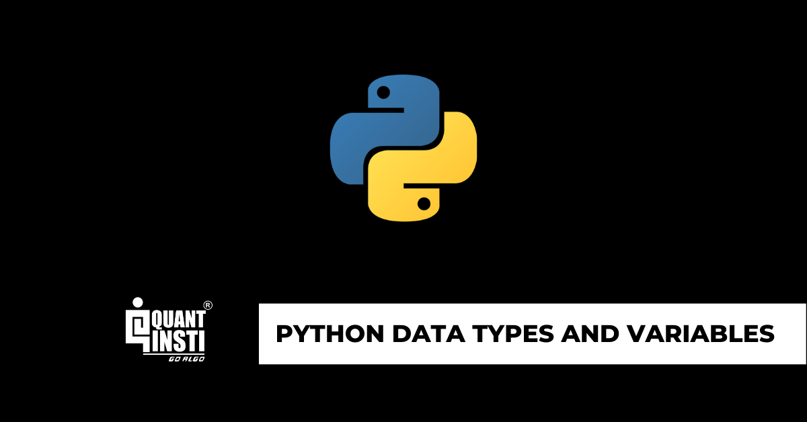

In algorithmic trading, Python's popularity is on an upward trajectory, primarily due to its simplicity and versatility. Known for its readable syntax and extensive library support, Python offers an attractive platform for traders looking to automate their trading strategies. Key among the foundational elements that make Python indispensable in this domain are variables and data types.

Understanding the basic building blocks of Python, such as variables and data types, is crucial for anyone aiming to automate trading strategies. Variables in Python serve as vital constructs that store data, allowing traders to manipulate and assess vast datasets efficiently. Unlike many programming languages, Python simplifies the assignment of variables by not demanding explicit data type declarations. This characteristic not only streamlines the coding process but also provides flexibility essential for adjusting trading algorithms without significant structural changes.



Python's data types, including integers, floats, strings, and booleans, play a significant role in crafting precise trading algorithms. Integers and floats are commonly utilised to handle trade volumes, prices, and perform mathematical computations crucial for decision-making in trading. Strings serve a pivotal function in managing textual data, such as stock symbols, while booleans are indispensable for executing control flows and evaluating logical conditions within trading models.

This article seeks to examine how these fundamental concepts are applied in the context of algorithmic trading. By mastering these elements, traders can design efficient algorithms capable of adapting swiftly to market fluctuations, thereby maximizing trading performance.

## Table of Contents

## Understanding Python Variables

Variables in Python are fundamental constructs that allow programmers to store data values for use throughout a program. Unlike most traditional programming languages, Python does not necessitate an explicit declaration of data types for its variables. This flexibility is a significant advantage in algorithmic trading, where rapid adaptation to market conditions is often required.

In Python, a variable is created the moment you first assign a value to it. For example:

```python
trade_volume = 100
stock_symbol = 'AAPL'
price = 150.75
```

In the example above, the variables `trade_volume`, `stock_symbol`, and `price` are automatically assigned the data types integer, string, and float, respectively. The dynamic typing system in Python allows these assignments without the need for specifying types, thus enabling developers to focus on the logic of their trading strategies rather than language-specific syntax.

This feature plays a crucial role in algorithm implementation within trading strategies. For instance, a variable initially used to store a trade [volume](/wiki/volume-trading-strategy) as an integer could later be transitioned to handle trade size changes without structural modifications to the algorithm:

```python
trade_volume = 100   # Starts as an integer
trade_volume = 100.5 # Now a float
```

This adaptability allows algorithms to be more fluid and responsive to dynamic data inputs. Developers can alter the variables as per real-time data without re-engineering the base code structure, a necessity in fast-paced trading environments. The flexibility of Python variables also facilitates the use of various types of financial calculations, from simple mathematical operations to complex data manipulations.

Python's lack of variable-type declarations simplifies the code and reduces the potential for errors during variable transformations. This feature is particularly beneficial in a trading context where minimal latency and high throughput are critical to success. The ability to modify variables and adjust strategies on the fly, without downtime, adds significant value to traders aiming for agility and precision in execution.

## Data Types in Python

Python, known for its robust handling of various data forms, provides a set of built-in data types vital for [algorithmic trading](/wiki/algorithmic-trading). Among these, integers, floats, strings, and booleans stand out as foundational components that facilitate efficient trading algorithms.

Integers and floats are integral to managing trade volumes, prices, and conducting precise mathematical operations. Integers, which are whole numbers without a fractional part, are typically used when counting items such as the number of stocks or trades. For instance, if a trading algorithm needs to evaluate the total number of assets in a portfolio, integers are employed. In contrast, floats handle numbers with decimal points, crucial for financial applications requiring precision with pricing data. For example, a stock price might be $371.45, which necessitates the use of a float to maintain accuracy in financial computations.

```python
# Example: Using integers and floats to calculate a trade
number_of_shares = 100  # Integer
stock_price = 371.45    # Float
total_trade_value = number_of_shares * stock_price
```

Strings in Python are used for non-numeric data, storing information such as stock symbols or companies' names. This data type is vital for uniquely identifying financial instruments within trading algorithms. For instance, a string can store the symbol 'AAPL' for Apple Inc., allowing the trading system to execute operations based on text-based identifiers.

```python
# Example: Storing stock symbol as a string
stock_symbol = "AAPL"
print(f"The stock symbol is: {stock_symbol}")
```

Booleans, which represent true or false values, are indispensable for control flows and logical decision-making within trading strategies. In algorithmic trading, these data types typically evaluate conditions like whether a trade should be executed or if a certain threshold has been met.

```python
# Example: Using booleans to decide whether to execute a trade
price_threshold_crossed = True  # Boolean
if price_threshold_crossed:
    print("Execute trade.")
else:
    print("Hold position.")
```

These fundamental data types—integers, floats, strings, and booleans—form the core of Python's utility in constructing trading algorithms. By effectively leveraging these types, traders ensure seamless management and execution within their automatic trading systems.

## Practical Use of Variables and Data Types in Algo Trading

In algorithmic trading, variables and data types play a crucial role in handling and processing large volumes of data efficiently. Python's dynamic nature allows traders to adapt their algorithms rapidly to real-time market data changes.

Stock prices, trading volumes, and other relevant financial metrics are commonly stored in variables. Variables in Python can hold any data type, which means that they can easily store and update values, making them ideal for scenarios like storing real-time market data. For instance, consider a Python script that captures and stores the current price of a stock:

```python
# Example of storing and updating stock prices
stock_symbol = "AAPL"
current_price = 150.75  # Initial price
# Updating price with new market data
current_price = 152.35
```

In algorithmic trading strategies, evaluating trading conditions often involves various logical and mathematical operations that make extensive use of Python’s data types. For example, integers and floats are used to perform operations on trade volumes and prices, which can be crucial in deciding trading actions such as buy or sell signals. The use of strings is essential for holding asset symbols or market conditions, and booleans are used for control flow, determining whether certain conditions are true or false.

Python’s dynamic typing also contributes significantly to the adaptability of trading algorithms. Traders can modify variable types based on incoming data without changing the broader structure of their algorithm. Consider a scenario where a price might be captured as a string from a data feed and then converted to a float for computation:

```python
# Handling data conversion
price_string = "153.45"
# Convert string to float for calculations
price_float = float(price_string)
# Proceed with arithmetic operations
if price_float > 150.0:
    print("Price is greater than $150")
```

Efficient management of large data sets is a typical requirement in algorithmic trading. Python’s data types, like lists and dictionaries, allow for the organization of market data in an accessible format, making it easy to retrieve relevant information when needed. For instance, tracking multiple stocks and their prices may involve a dictionary structure:

```python
# Storing multiple stock prices
market_data = {
    "AAPL": 152.35,
    "GOOGL": 2728.12,
    "MSFT": 299.30
}
# Accessing a specific stock's price
print(market_data["AAPL"])
```

Variables and data types in Python facilitate the continuous assignment and reassignment of values based on market shifts, allowing for real-time iteration over strategies. The flexibility and ease of use offered by Python's variable handling are invaluable in developing responsive and effective trading strategies.

## Python Data Type Conversion

Python's data type conversion plays an integral role in the field of algorithmic trading, particularly when it comes to ensuring that trading signals and calculations are performed accurately. Python facilitates two main types of conversions: implicit and explicit.

Implicit conversion, also known as type coercion, occurs automatically when Python converts data types without explicit direction from the user. This feature is particularly beneficial in algorithmic trading when operations involve multiple data types. For instance, when a float is combined with an integer in an arithmetic operation, Python automatically converts the integer to a float to prevent loss of precision. This is crucial in trading operations where exact calculations can impact financial outcomes. 

```python
price_per_share = 250.75  # float
number_of_shares = 10     # integer
total_investment = price_per_share * number_of_shares
# Python implicitly converts 'number_of_shares' to a float
```

Explicit conversion, also known as type casting, requires manually converting a data type to another. This becomes necessary when data is sourced from external feeds, such as APIs, which often provide numeric data in string format. Converting strings to floats or integers is essential to allow operations like summation or multiplication, which are often used to calculate total investments or returns.

```python
stock_price_str = "150.25"
stock_price_float = float(stock_price_str)
```

For algorithmic trading, precise type conversions ensure that calculations are accurate and trading decisions are based on correct data. For example, consider a scenario where trading strategies depend on various thresholds. If market data thresholds are stored as strings, converting them to floats is necessary for mathematical comparisons that drive trading signals. An error in this step could lead to incorrect strategy execution and financial loss.

Type conversion is also significant when handling time-series data, which often involves date and time expressions. Dates as strings need to be converted to Python's `datetime` objects for time-based calculations and trading strategies, such as evaluating historical price trends or executing trades at specific times.

```python
from datetime import datetime

timestamp_str = "2023-04-01 09:30:00"
timestamp_dt = datetime.strptime(timestamp_str, "%Y-%m-%d %H:%M:%S")
```

In summary, proper management of data type conversion is essential to the accuracy and robustness of trading algorithms. By ensuring all data is in the correct format before performing operations, traders can mitigate errors and enhance their algorithmic decision-making capabilities, ultimately contributing to successful trading strategies.

## Best Practices for Using Variables and Data Types in Algo Trading

Adopting meaningful variable names is a fundamental practice that enhances the readability and maintainability of code in algorithmic trading. By choosing descriptive variable names, developers can convey the purpose and usage of stored data more effectively, reducing the cognitive load on themselves and others who might work with the code in the future. For example, a variable named `stock_price` is far more informative than arbitrary names such as `x` or `temp`, particularly in complex trading algorithms where multiple data points are analyzed simultaneously.

Ensuring data integrity by selecting appropriate data types from the outset is essential to minimize errors and enhance performance. In Python, this involves choosing between data types such as integers, floats, and strings based on the nature of the data. For instance, when dealing with quantities and prices, floats might be a more appropriate choice than integers to accurately handle decimal values. Similarly, using strings for alphanumeric data, like stock tickers, ensures that operations aren't inadvertently performed on text data. This upfront decision-making helps maintain data accuracy across various operations and prevents undesirable outcomes like data truncation.

Implementing exception handling mechanisms is vital to avoid runtime errors, especially during data conversions that might disrupt trading operations. Python provides robust error handling through the `try-except` block, which can be used to catch conversion errors and handle them gracefully. For example:

```python
try:
    price_string = "100.5"
    price_float = float(price_string)
except ValueError as e:
    print(f"Error converting price: {e}")
```

In this snippet, a string representation of a price is converted to a float. The `try-except` structure ensures that if the conversion fails (for example, if `price_string` contains non-numeric characters), the program can handle the error without crashing, thus maintaining the continuity of trading operations. By anticipating potential points of failure, such as incorrect data formats or unexpected input, traders can design algorithms that are robust against unexpected disruptions.

## Conclusion

Mastering variables and data types in Python is essential for traders aiming to create efficient and adaptable trading algorithms. These fundamental concepts empower traders to handle diverse data forms and computational challenges seamlessly, providing a robust foundation for algorithmic trading strategies. Python’s simplicity and dynamic nature make it an ideal choice for quick adaptations in trading algorithms, responding swiftly to volatile market conditions.

The versatility of Python's extensive libraries, such as Pandas for data manipulation and NumPy for numerical operations, enhances the capabilities of trading algorithms. These libraries offer pre-built functions and methods, allowing traders to automate complex trading strategies effectively. For instance, traders can leverage these tools to implement real-time data analysis, execute trades based on pre-determined conditions, and optimize performance through [backtesting](/wiki/backtesting) and [machine learning](/wiki/machine-learning).

Staying current with advancements in Python ensures that traders can consistently refine their strategies and incorporate cutting-edge techniques into their operations. As the Python language and its ecosystem evolve, new libraries and tools can provide additional avenues for innovation in trading algorithms. Continuous learning and adaptation are vital as they enable traders to remain competitive, exploiting the full potential of Python's capabilities to edge over market challenges efficiently.

In conclusion, by honing skills in Python's variables and data types, and by embracing continuous learning within the evolving Python landscape, traders can develop sophisticated, flexible, and powerful algorithmic trading strategies that are crucial for achieving sustained success.

## References & Further Reading

[1]: Bergstra, J., Bardenet, R., Bengio, Y., & Kégl, B. (2011). ["Algorithms for Hyper-Parameter Optimization."](https://papers.nips.cc/paper/4443-algorithms-for-hyper-parameter-optimization) Advances in Neural Information Processing Systems 24.

[2]: ["Advances in Financial Machine Learning"](https://www.amazon.com/Advances-Financial-Machine-Learning-Marcos/dp/1119482089) by Marcos Lopez de Prado

[3]: ["Evidence-Based Technical Analysis: Applying the Scientific Method and Statistical Inference to Trading Signals"](https://www.amazon.com/Evidence-Based-Technical-Analysis-Scientific-Statistical/dp/0470008741) by David Aronson

[4]: ["Machine Learning for Algorithmic Trading"](https://github.com/stefan-jansen/machine-learning-for-trading) by Stefan Jansen

[5]: ["Quantitative Trading: How to Build Your Own Algorithmic Trading Business"](https://books.google.com/books/about/Quantitative_Trading.html?id=j70yEAAAQBAJ) by Ernest P. Chan