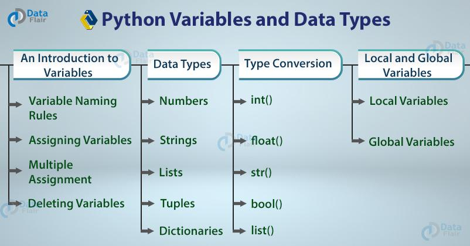

## Table of Contents

## What are the basic data types in Python?

In Python, there are several basic data types that you can use to store different kinds of information. The most common ones are integers, which are whole numbers like 1, 2, or 3; floats, which are numbers with a decimal point like 3.14 or 2.5; and strings, which are sequences of characters like "hello" or "Python". These data types help you work with numbers and text in your programs.

Another important data type is the boolean, which can be either True or False. Booleans are useful for making decisions in your code. You can also use lists, which are collections of items that can be of any data type, like [1, 2, 3] or ["apple", "banana", "cherry"]. Lists are great for storing multiple values in one place.

Lastly, there are tuples and dictionaries. Tuples are similar to lists but they cannot be changed once created, like (1, 2, 3). Dictionaries store key-value pairs, like {"name": "Alice", "age": 30}, which makes it easy to look up information quickly. These data types give you more ways to organize and manage data in your Python programs.

## How do you declare and use variables in Python?

In Python, you declare a variable by simply giving it a name and assigning a value to it using the equals sign (=). For example, if you want to store the number 5 in a variable called 'number', you would write `number = 5`. You can use any name you like for your variables, but it's good to choose names that describe what the variable is for, like `age = 25` or `name = "Alice"`. Python figures out the type of the variable from the value you assign to it, so you don't need to specify if it's a number, a string, or something else.

Once you've declared a variable, you can use it in your code. For instance, if you've set `number = 5`, you can print it with `print(number)`, or use it in calculations like `result = number * 2`. You can also change the value of a variable later in your program. If you want to update `number` to 10, you just write `number = 10`. This flexibility makes it easy to work with variables in Python, allowing you to store and manipulate data as your program runs.

## What is the difference between integers and floating-point numbers in Python?

In Python, integers are whole numbers without any decimal points. They can be positive, like 1, 2, or 3, or negative, like -1, -2, or -3. Integers are used when you need to count things or work with numbers that don't need a fraction. For example, if you're counting the number of apples in a basket, you would use an integer because you can't have half an apple in the count.

Floating-point numbers, or floats, are numbers that have a decimal point. They can represent values like 3.14, 2.5, or even -0.75. Floats are used when you need to work with numbers that have fractions or need more precision. For instance, if you're measuring the height of a person, you might use a float because people's heights are often not whole numbers. In Python, you can tell the difference because integers don't have a decimal point, while floats do.

## How do strings work in Python, and what are their common operations?

In Python, strings are sequences of characters, like letters, numbers, or symbols. You can create a string by putting text inside single quotes ('') or double quotes (""). For example, 'hello' and "world" are both strings. You can also use triple quotes (''' or """) for multi-line strings. Strings are really useful for working with text in your programs. You can store names, sentences, or any text you want as a string.

There are many common operations you can do with strings. You can combine strings using the plus sign (+), like 'hello' + 'world' which makes 'helloworld'. You can also repeat a string with the multiply sign (*), like 'hi' * 3 which gives 'hihihi'. To get a part of a string, you can use slicing, like 'hello'[1:4] which gives 'ell'. You can also find the length of a string with the `len()` function, like `len('hello')` which returns 5. These operations help you manipulate and work with text in your Python programs.

## What are lists in Python, and how are they different from tuples?

Lists in Python are like containers where you can put different things, like numbers, words, or even other lists. You make a list by putting things inside square brackets, like [1, 2, 3] or ["apple", "banana"]. You can change the things inside a list, add new things, or take things out. This makes lists really useful when you need to keep track of a bunch of stuff that might change. For example, if you're making a shopping list, you can add items as you think of them or remove them as you buy them.

Tuples are similar to lists, but they're different in one big way: once you make a tuple, you can't change it. You create a tuple by putting things inside parentheses, like (1, 2, 3) or ("apple", "banana"). Because tuples can't be changed, they're good for storing information that shouldn't be messed with, like the coordinates of a point on a map. If you need to keep a list of things that won't change, like the days of the week, a tuple is a good choice.

## How do you use dictionaries in Python, and what are their advantages?

In Python, dictionaries are like special containers where you store things using keys and values. Imagine a dictionary as a real book where you look up words to find their meanings. In Python, instead of words, you use keys, and instead of meanings, you use values. You make a dictionary by putting key-value pairs inside curly braces, like {"name": "Alice", "age": 30}. To get information from a dictionary, you use the key, like my_dict["name"] which would give you "Alice". You can also add new key-value pairs or change existing ones easily, making dictionaries very flexible.

Dictionaries have some big advantages. First, they're really fast when you need to find something. If you know the key, you can get the value quickly, no matter how big the dictionary is. This makes them great for looking up information. Second, dictionaries let you use any type of thing as a key or value, not just numbers or words. You can use numbers, strings, or even other dictionaries as keys or values. This makes them very useful for organizing and storing all kinds of data in a way that's easy to work with.

## What is type conversion in Python, and how is it performed?

Type conversion in Python is when you change one type of data into another type. For example, you might want to turn a number into a string so you can print it with other text, or you might need to turn a string into a number so you can do math with it. Python has special functions to help you do this easily.

To convert data from one type to another, you use functions like `int()`, `float()`, `str()`, and `bool()`. If you have a number stored as a string, like "5", and you want to use it in a calculation, you can turn it into an integer with `int("5")`, which gives you the number 5. If you want to turn a number into a string so you can combine it with other text, you use `str(5)` which gives you the string "5". These functions make it simple to switch between different types of data as you need to in your programs.

## How can you use sets in Python, and what are their unique features?

In Python, sets are like special collections where you can put different things, but each thing can only be in the set once. You make a set by putting things inside curly braces, like {1, 2, 3} or {"apple", "banana"}. Sets are good when you want to keep track of a bunch of stuff without worrying about the order or if something is in there more than once. For example, if you're keeping track of what fruits you have, you can use a set to make sure you don't count the same fruit twice.

Sets have some cool features that make them different from lists or tuples. One big thing is that you can do math-like operations with sets, like finding things that are in both sets (using &), things that are in one set but not the other (using -), or things that are in either set (using |). Also, sets are really fast when you want to check if something is in the set or not. This makes them great for when you need to look up things quickly or do things like finding what's common between two groups of stuff.

## What are mutable and immutable data types in Python?

In Python, mutable data types are things you can change after you make them. Lists, dictionaries, and sets are examples of mutable data types. Imagine you have a list of your favorite fruits. You can add a new fruit, take one away, or change the order of the fruits in the list. Because you can do these things, lists are mutable. This is helpful when you need to update information as your program runs.

On the other hand, immutable data types are things you can't change once you make them. Numbers, strings, and tuples are examples of immutable data types. If you have a string like "hello", you can't change it to "hi" without making a new string. You can use the old string to make a new one, but the original "hello" stays the same. This can be good for when you want to make sure certain information doesn't change accidentally.

## How do you handle complex data types like datetime and time in Python?

In Python, you can work with dates and times using the `datetime` module. This module helps you create, manipulate, and format dates and times easily. To use it, you first need to import it with `import datetime`. Once you have it, you can make a date or time object. For example, `my_date = datetime.date(2023, 10, 5)` makes a date for October 5, 2023. You can do things like adding days to a date with `new_date = my_date + datetime.timedelta(days=7)`, which adds a week to the original date.

The `datetime` module also lets you work with times. You can create a time object with `my_time = datetime.time(14, 30)`, which means 2:30 PM. If you want to combine a date and time, you can use `datetime.datetime(2023, 10, 5, 14, 30)` to get October 5, 2023, at 2:30 PM. You can also change how dates and times look when you print them. For example, `formatted_date = my_date.strftime("%Y-%m-%d")` turns the date into a string like "2023-10-05". This makes it easy to show dates and times the way you want in your programs.

## What are the best practices for naming variables in Python?

When you name variables in Python, it's good to use names that tell you what the variable is for. This makes your code easier to read and understand. For example, if you're storing someone's age, you might call the variable `age` instead of something like `x`. It's also a good idea to use lowercase letters and underscores for names with more than one word, like `first_name` or `total_price`. This style is called snake_case and it's what most Python programmers use.

Another important rule is to avoid using Python's reserved words, like `if`, `else`, or `for`, as variable names. These words have special meanings in Python, and using them for variables can cause errors. Also, try to keep your variable names short but meaningful. A name like `current_temperature` is better than `ct` because it's clear what it means, but it's not so long that it's hard to type or read. Following these simple rules will make your code clearer and easier for others to work with.

## How can advanced users leverage type hinting and annotations in Python?

Type hinting and annotations in Python help advanced users make their code clearer and easier to understand. They let you add extra information to your code that tells other programmers what types of data your variables, function parameters, and return values should be. For example, if you have a function that adds two numbers, you can use type hints to show that it takes two integers and returns an integer. This makes it easier for other people to use your functions correctly and can help catch mistakes early. Many modern tools and IDEs can use these hints to give you better suggestions and warnings, making your coding experience smoother.

Using type hints also helps when you're working on big projects or with other people. They act like a guide that shows how different parts of your code should work together. This can be really helpful when you're trying to understand someone else's code or when you come back to your own code after a while. Even though Python doesn't force you to use type hints, adding them can make your code more reliable and easier to maintain. Plus, they can make your code run faster if you use them with tools like mypy, which checks your code for type-related errors before you run it.

## References & Further Reading

[1]: Bergstra, J., Bardenet, R., Bengio, Y., & Kégl, B. (2011). ["Algorithms for Hyper-Parameter Optimization."](https://papers.nips.cc/paper/4443-algorithms-for-hyper-parameter-optimization) Advances in Neural Information Processing Systems 24.

[2]: ["Advances in Financial Machine Learning"](https://www.amazon.com/Advances-Financial-Machine-Learning-Marcos/dp/1119482089) by Marcos Lopez de Prado

[3]: ["Evidence-Based Technical Analysis: Applying the Scientific Method and Statistical Inference to Trading Signals"](https://www.amazon.com/Evidence-Based-Technical-Analysis-Scientific-Statistical/dp/0470008741) by David Aronson

[4]: ["Machine Learning for Algorithmic Trading"](https://github.com/stefan-jansen/machine-learning-for-trading) by Stefan Jansen

[5]: ["Quantitative Trading: How to Build Your Own Algorithmic Trading Business"](https://books.google.com/books/about/Quantitative_Trading.html?id=j70yEAAAQBAJ) by Ernest P. Chan