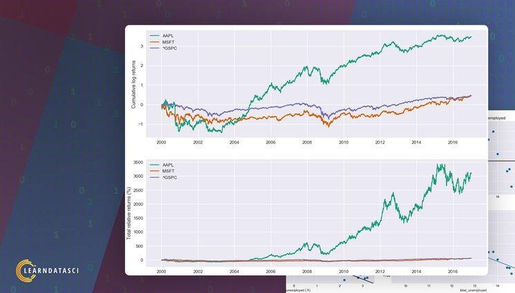

## Table of Contents

## What is quantitative finance and how does Python fit into it?

Quantitative finance is a field where math and computers are used to make decisions about money, like investing or trading. People who work in this area use numbers and data to predict how markets will move and to find the best ways to make money. They use special math formulas and computer programs to analyze information and make smart choices.

Python fits into quantitative finance really well because it's easy to use and has a lot of tools that are perfect for this kind of work. Python has libraries, which are like sets of tools, that help with math, data analysis, and even making charts and graphs. Many people in quantitative finance use Python because it can handle big amounts of data quickly and it's good for making models and running simulations to test ideas before using them in real life.

## What are the basic Python libraries used in quantitative finance?

In quantitative finance, Python is popular because it has many libraries that help with math and data work. One of the most basic libraries is NumPy, which is great for doing math with numbers and arrays. It's like a calculator that can handle big lists of numbers quickly. Another important library is Pandas, which is used for organizing and analyzing data. It's like a spreadsheet that you can control with code, making it easy to clean up data and do calculations.

Another key library is SciPy, which works well with NumPy and adds more advanced math tools. It's useful for things like solving equations or doing statistics, which are important in finance. For making charts and graphs, people often use Matplotlib. It helps to see data visually, which can make it easier to understand and explain to others. These libraries together form a strong base for doing quantitative finance work in Python.

Lastly, there's a library called Statsmodels, which is used for statistical modeling. It helps to create models that can predict things like stock prices or market trends. These models are very important in quantitative finance because they help make decisions based on data. With these libraries, Python becomes a powerful tool for anyone working in this field.

## How can Python be used to analyze financial data?

Python can be used to analyze financial data by helping to organize, clean, and make sense of numbers. With libraries like Pandas, you can take big lists of financial information, like stock prices or company earnings, and put them into a neat table. This makes it easy to see patterns or changes over time. You can also use Pandas to clean up the data, getting rid of mistakes or missing numbers, so your analysis is based on good information.

Once the data is ready, Python's NumPy and SciPy libraries help with the math part of the analysis. You can use these tools to do calculations, like finding averages or figuring out how much risk there is in an investment. These libraries let you do complex math quickly, which is important when you're working with a lot of financial data. With these tools, you can create models that predict how the market might move or how much money you might make from an investment.

Finally, Python can help you understand and share your findings with others. Using Matplotlib, you can make charts and graphs that show your data in a way that's easy to understand. This is helpful when you need to explain your analysis to someone else, like a boss or a client. By using Python to analyze financial data, you can make better decisions about money and investments.

## What are some common statistical models used in Python for finance?

In finance, people use Python to make models that help predict things like stock prices or how much risk there is in an investment. One common model is called linear regression. It's like drawing a line through a bunch of data points to see if there's a pattern. For example, you might use linear regression to see if a company's stock price goes up when they make more money. Another model is the ARIMA model, which stands for AutoRegressive Integrated Moving Average. This model is used to predict future values in a time series, like how a stock price might change over the next few days.

Another useful model is the GARCH model, which stands for Generalized Autoregressive Conditional Heteroskedasticity. This model is good for understanding how much risk there is in an investment over time. It helps to see if the ups and downs of a stock's price get bigger or smaller. Lastly, there's the Monte Carlo simulation. This model uses random numbers to run many different scenarios and see what might happen. It's like playing out a bunch of possible futures to see how likely different outcomes are. All these models can be made and used in Python to help make smart decisions about money.

## How do you implement time series analysis in Python for financial forecasting?

To do time series analysis in Python for financial forecasting, you start by getting your data ready. You can use the Pandas library to load and organize your financial data, like stock prices or sales numbers, into a time series. Once your data is in a neat table, you can clean it up by filling in missing numbers or getting rid of mistakes. After that, you can use Pandas to look at your data over time and see if there are any patterns or trends. This helps you understand how things have changed in the past, which is important for making guesses about the future.

Next, you can use models to make predictions. One common model is called ARIMA, which stands for AutoRegressive Integrated Moving Average. You can use the Statsmodels library in Python to make an ARIMA model. This model looks at past data to predict what might happen next. For example, it can help you guess what a stock's price might be in the future. Another model you might use is called Prophet, which is made by Facebook and is good for making forecasts with time series data. You can use the Prophet library to make these predictions. By using these models in Python, you can make better guesses about what might happen in the financial world.

## What is algorithmic trading and how can it be implemented using Python?

Algorithmic trading is when computers use math and rules to buy and sell things like stocks automatically. Instead of people making all the decisions, a computer program follows a set of instructions to decide when to trade. This can happen very quickly and can look at a lot of information at once, which can be hard for a person to do. The goal is often to make money by finding the best times to buy and sell, based on patterns or other data.

To do algorithmic trading with Python, you start by writing a program that can connect to a place where you can buy and sell stocks, like a stock exchange. Libraries like `ccxt` or `alpaca-trade-api` can help with this. Then, you use other libraries like Pandas and NumPy to look at data and find patterns. You might use a model, like the ones we talked about before, to decide when to trade. Once your program is ready, it can run on its own, making trades based on the rules you set up. This way, Python helps you do algorithmic trading by handling the math and the trading for you.

## How can Python be used to develop and backtest trading strategies?

To develop and backtest trading strategies using Python, you start by writing a program that uses historical data to see how well your strategy would have worked in the past. You can use libraries like Pandas to load and organize this data, which might include things like stock prices or other financial information. Then, you write code that follows your trading rules, like buying a stock when its price goes up by a certain amount or selling it when it goes down. This part of the program is your trading strategy. You can use libraries like NumPy to help with the math needed to make these decisions.

Once you have your strategy written in code, you can backtest it. Backtesting means running your strategy on old data to see how it would have done if you had used it in the past. You can use libraries like Backtrader or Zipline to help with this. These libraries let you run your strategy over many years of data quickly and see how much money you would have made or lost. By looking at the results, you can see if your strategy works well or if you need to change it. This way, Python helps you test your trading ideas before you use them with real money.

## What are risk management techniques in Python for financial applications?

In financial applications, risk management is about figuring out how much you could lose and trying to keep that loss small. Python can help with this by using numbers and data to understand risk. One way to do this is by using a model called Value at Risk (VaR). With Python, you can use libraries like NumPy and Pandas to calculate VaR. This model looks at past data to guess how much money you might lose on a bad day. By knowing this, you can make better choices about how much risk to take.

Another way Python helps with risk management is by using simulations. A common method is the Monte Carlo simulation, which you can do with libraries like SciPy. This simulation runs many different scenarios to see what might happen in the future. It helps you understand how likely it is that you'll lose money and how big that loss might be. By running these simulations, you can plan for different outcomes and make your financial decisions safer.

## How do you use Python to perform portfolio optimization?

To do portfolio optimization with Python, you start by using numbers and data to figure out the best way to put your money into different investments. You can use a library called Pandas to organize all your data about stocks, bonds, or other things you might invest in. Then, you use a model called mean-variance optimization, which helps you find the mix of investments that gives you the most return for the least risk. This model uses math to balance how much you might make with how much you might lose. You can use a library called SciPy to do the math part of this model.

Once you have your data ready and your model set up, you run the optimization. This means you let the computer figure out the best way to spread your money across different investments. The goal is to make as much money as possible while keeping the risk low. After the computer does its work, it tells you how much to put into each investment. You can then use this information to make your portfolio better. By using Python for portfolio optimization, you can make smarter choices about where to put your money.

## What advanced machine learning techniques can be applied to quantitative finance using Python?

In quantitative finance, people use advanced machine learning techniques to make better predictions about money and markets. One technique is called deep learning, which uses something called neural networks. These are like computer brains that can learn from a lot of data. With Python, you can use libraries like TensorFlow or PyTorch to build these neural networks. They can look at things like stock prices or company news to guess what might happen next. This can be really helpful for deciding when to buy or sell investments.

Another technique is called reinforcement learning. It's like teaching a computer to play a game where the goal is to make the most money. The computer tries different ways of investing and learns from its mistakes. Over time, it gets better at making choices that lead to more money. You can use Python's library called Gym to set up these kinds of learning environments. By using reinforcement learning, you can create trading strategies that adapt to changing markets and help you make smarter financial decisions.

## How can Python be integrated with other financial systems and databases?

Python can be used to connect with other financial systems and databases to make working with money easier. You can use Python to talk to stock exchanges or trading platforms. Libraries like `ccxt` or `alpaca-trade-api` help you do this. They let you send orders to buy or sell stocks and get back information about prices and trades. This way, Python can be part of a bigger system that helps you make decisions about money.

Python also works well with databases, which are like big storage places for information. You can use libraries like `SQLAlchemy` to connect Python to databases like MySQL or PostgreSQL. This lets you save and get financial data, like stock prices or company earnings, quickly and easily. By using Python with these databases, you can keep all your financial information in one place and use it to make smart choices about investing or trading.

## What are the latest trends and future directions in Python for quantitative finance?

In the world of quantitative finance, Python is becoming more and more important. One big trend is the use of machine learning and artificial intelligence to make better predictions about money and markets. People are using Python to build models that can learn from a lot of data and make smart choices about when to buy or sell investments. Another trend is the use of cloud computing, which lets people run big calculations and store a lot of data without needing expensive computers. This makes it easier for more people to use Python for finance work.

Looking to the future, Python will likely keep growing in quantitative finance. More people will use it because it's easy to learn and has a lot of tools that help with money work. We might see more use of things like quantum computing, which could make calculations even faster and help solve really hard problems in finance. Also, as more data becomes available, Python will be used to make even better models and predictions. This means that people working in finance will keep finding new ways to use Python to make smarter decisions about money.

## References & Further Reading

[1]: ["Python for Finance"](https://www.amazon.com/Python-Finance-Mastering-Data-Driven/dp/1492024333) by Yves Hilpisch

[2]: ["Algorithmic Trading with Python"](https://www.amazon.com/Algorithmic-Trading-Python-Quantitative-Development/dp/B086Y6H6YG) by Chris Conlan

[3]: ["Advances in Financial Machine Learning"](https://www.amazon.com/Advances-Financial-Machine-Learning-Marcos/dp/1119482089) by Marcos López de Prado