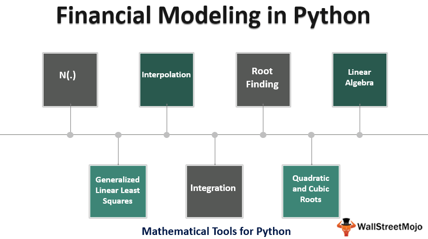

## Table of Contents

## What is Python and why is it popular for finance applications?

Python is a computer programming language that is easy to learn and use. It is used for many different things, like making websites, analyzing data, and even creating games. In the world of finance, Python is very popular because it helps people do their jobs better and faster. It has many tools and libraries that are specifically made for finance tasks, like calculating risks, managing investments, and analyzing financial data.

One reason Python is popular in finance is because it can handle large amounts of data quickly. Finance professionals often need to look at a lot of numbers and information to make smart decisions. Python makes this easier by letting them process and analyze data very fast. Another reason is that Python is free to use and has a big community of people who help each other. This means that if someone has a problem, they can often find a solution from other users. This support and the ability to do complex financial tasks make Python a top choice for finance applications.

## How do you install Python and set up a development environment for finance?

To install Python, start by going to the official Python website at python.org. Look for the download section and choose the latest version of Python for your computer, whether it's Windows, Mac, or Linux. Once you download the file, open it and follow the instructions to install Python. Make sure to check the box that says "Add Python to PATH" during installation. This makes it easier to use Python from anywhere on your computer. After installation, you can open a command prompt or terminal and type "python" to check if it's working. You should see the Python version number and a prompt where you can start writing code.

Setting up a development environment for finance involves a few more steps. First, you'll want to install an Integrated Development Environment (IDE) like PyCharm or Visual Studio Code. These tools make coding easier with features like auto-completion and debugging. Next, you need to install libraries that are useful for finance. Some popular ones are Pandas for data analysis, NumPy for numerical computing, and yfinance for fetching financial data. You can install these using a tool called pip, which comes with Python. Just open a command prompt, and type "pip install pandas numpy yfinance" to get them. With these tools and libraries set up, you're ready to start working on finance applications using Python.

## What are the basic data types in Python that are useful for financial computations?

In Python, the basic data types that are useful for financial computations are integers, floats, and strings. Integers are whole numbers like 1, 2, or 100, which you might use to count things like the number of stocks you own. Floats are numbers with decimal points, like 1.5 or 3.14, which are great for representing prices or rates that are not whole numbers. Strings are sequences of characters, like "stock" or "100.50", and they're useful for storing things like stock names or formatted numbers.

Another important data type for financial computations is the boolean, which can be either True or False. Booleans are useful for making decisions in your code, like checking if a stock price is above a certain threshold. You might also use lists and dictionaries, which are not basic data types but are very useful for organizing data. Lists can hold multiple values, like a list of stock prices, and dictionaries can store data with keys and values, like a stock's name and its price. These data types help you manage and analyze financial information effectively.

## How can you use Python to perform basic financial calculations like present value and future value?

To calculate the present value of money, you can use Python to figure out how much a future amount of money is worth today. You need to know the future value, the interest rate, and how many periods you're looking at. In Python, you can use a formula like this: present_value = future_value / (1 + interest_rate) ^ number_of_periods. For example, if you want to know the present value of $1000 that you'll get in 5 years with an interest rate of 5%, you can write a Python program to calculate it. This helps you understand if it's worth waiting for that money or if you should do something else with it now.

For future value, you're figuring out how much money you'll have in the future if you invest a certain amount today. The formula in Python would be: future_value = present_value * (1 + interest_rate) ^ number_of_periods. So, if you invest $1000 today at an interest rate of 5% for 5 years, you can use Python to find out how much that will grow to. This is useful for planning your investments and seeing how your money could grow over time. Both these calculations are simple to do in Python, making it easy to handle your financial planning.

## What Python libraries are essential for financial analysis and modeling?

For financial analysis and modeling, Python has some really helpful libraries that make things easier. One of the most important is Pandas, which is great for working with data. It lets you read data from different places, like Excel files or databases, and then you can clean it, sort it, and do all sorts of calculations on it. This is super useful for analyzing stock prices, financial statements, or any other financial data you might have. Another key library is NumPy, which is good for doing math on big sets of numbers. It's fast and can handle things like calculating averages, standard deviations, and other statistics that are important in finance.

Another essential library is Matplotlib, which helps you make charts and graphs. This is really helpful when you want to show your financial data in a way that's easy to understand, like plotting stock prices over time or showing how different investments are doing. For fetching financial data, like stock prices or economic indicators, you can use yfinance or quandl. These libraries let you pull in real-time or historical data, which you can then use for your analysis or models. Together, these libraries make Python a powerful tool for anyone working in finance.

## How do you use Pandas to manipulate and analyze financial data?

Pandas is a great tool for working with financial data because it helps you organize and look at numbers easily. Imagine you have a bunch of stock prices in an Excel file. With Pandas, you can read that file into Python and turn it into something called a DataFrame. A DataFrame is like a big table where each row can be a different day, and each column can be a different stock's price. Once you have your data in a DataFrame, you can do things like sort the prices from highest to lowest, or find the average price over time. This makes it easy to see trends and patterns in the data, which is really helpful for making decisions in finance.

After you've organized your data, Pandas lets you do more advanced analysis. For example, you can calculate how much a stock's price has gone up or down over a certain period, or figure out how risky an investment might be by looking at how much the price moves around. You can also combine data from different sources, like adding stock prices to company financials, to get a fuller picture. Pandas has functions that make these calculations simple, so you don't need to write a lot of code. This means you can spend more time thinking about what the numbers mean and less time worrying about how to get them.

## How can you implement risk management models in Python?

To implement risk management models in Python, you can use libraries like NumPy and Pandas to handle the data and calculations. For example, you might want to calculate the Value at Risk (VaR) for a portfolio of stocks. VaR helps you understand the most you could lose on an investment over a certain time. With NumPy, you can do the math needed to figure out VaR, like finding the standard deviation of stock returns. Pandas helps you organize the stock price data and make it easy to work with. You can also use libraries like SciPy for more advanced statistical calculations that are part of risk models.

Another way to manage risk is by using Monte Carlo simulations. These simulations let you see how your investments might do under different scenarios. In Python, you can use NumPy to generate random numbers that represent different possible future stock prices. Then, you can run many simulations to see all the different ways your portfolio might perform. This helps you understand the risks better because you can see a range of outcomes, not just one. By using Python and these libraries, you can build models that help you make smarter decisions about managing risk in your investments.

## What are some advanced Python techniques for time series analysis in finance?

Time series analysis in finance is about looking at data over time, like stock prices or interest rates, to find patterns and make predictions. In Python, you can use advanced techniques like ARIMA models to do this. ARIMA stands for AutoRegressive Integrated Moving Average, which sounds complicated but basically helps you predict future values based on past ones. To use ARIMA in Python, you can use the statsmodels library. This library lets you fit an ARIMA model to your data, which means you're telling the computer to learn from the past data and guess what might happen next. This is useful for things like forecasting stock prices or figuring out how much a company's earnings might grow in the future.

Another advanced technique is using machine learning for time series analysis. You can use libraries like scikit-learn to build models that learn from historical data to make predictions. For example, you might use a Long Short-Term Memory (LSTM) model, which is a type of neural network good at remembering past data. This can be really helpful for predicting stock prices because it can capture complex patterns in the data. To do this in Python, you'd first need to prepare your data, then train the LSTM model on it, and finally use the model to make predictions. This approach can give you more accurate forecasts than simpler methods, helping you make better investment decisions.

## How do you use Python to develop and backtest trading strategies?

To develop and backtest trading strategies in Python, you can use libraries like Pandas and NumPy to handle and analyze financial data. Start by getting historical data for the stocks or assets you're interested in. You can use libraries like yfinance to download this data. Once you have the data, you can use Pandas to organize it into a DataFrame, which makes it easy to look at past prices and other information. Then, you can write code to create your trading rules. For example, you might decide to buy a stock when its price goes above its 50-day moving average and sell when it drops below. This is your trading strategy.

After you've created your strategy, you can backtest it using Python to see how it would have worked in the past. This involves running your strategy on historical data to see how it would have performed if you had used it back then. You can use libraries like Backtrader or Zipline to do this. These libraries let you simulate trading with your strategy and see how much money you would have made or lost. By backtesting, you can find out if your strategy is good or if it needs changes. This helps you improve your strategy before you use it with real money, making sure it's as effective as possible.

## What are the best practices for securing financial data in Python applications?

When working with financial data in Python, it's really important to keep it safe. One good way to do this is by using encryption. Encryption is like putting your data in a secret code that only you can understand. In Python, you can use libraries like cryptography to encrypt your data before saving it or sending it over the internet. This makes sure that if someone else gets their hands on your data, they won't be able to read it. Another important thing is to use strong passwords and keep them safe. Don't share your passwords with anyone, and use different passwords for different accounts. This helps stop people from getting into your financial data without permission.

Another practice is to limit who can see or change your data. In Python, you can use access controls to make sure only certain people can look at or edit your financial information. This means setting up rules about who can do what with your data. Also, always keep your Python libraries and software up to date. When new versions come out, they often fix security problems that could let someone steal or mess with your data. By following these simple steps, you can help keep your financial data safe when using Python.

## How can you integrate Python with other financial systems and databases?

To connect Python with other financial systems and databases, you can use special libraries that help Python talk to these systems. For example, if you want to get data from a database like MySQL or PostgreSQL, you can use libraries like SQLAlchemy or psycopg2. These libraries let Python send requests to the database and get back the information you need. This is really helpful if you're working with a lot of financial data stored in a database. You can also use APIs (Application Programming Interfaces) to connect to financial systems. APIs are like messengers that let different software systems talk to each other. For example, you might use the Bloomberg API or the Yahoo Finance API to pull in real-time stock prices or other financial data into your Python program.

Once you have the data in Python, you can do all sorts of things with it, like analyzing it or making charts. But sometimes, you need to send data back to the financial system or database. You can do this by using the same libraries or APIs to send information from Python to the system. For example, after analyzing some stock data, you might want to save your findings back into a database or update a financial system with new information. By using these tools, you can make sure that Python works well with other systems, making it easier to manage and analyze financial data.

## What are the latest trends in Python programming for finance and how can one stay updated?

The latest trends in Python programming for finance include the use of machine learning and artificial intelligence for better predictions and decision-making. Many finance professionals are using Python to build models that can learn from past data and forecast future trends, like stock prices or market movements. Another big trend is the use of cloud computing. This means running Python programs on the internet instead of on your own computer, which can handle bigger data sets and make things faster. Also, there's a growing interest in using Python for blockchain and cryptocurrency, as it helps in creating and managing digital currencies and smart contracts.

To stay updated with these trends, it's a good idea to join online communities and forums where people talk about Python and finance. Websites like Stack Overflow, GitHub, and Reddit have groups where you can ask questions and learn from others. Reading blogs and watching videos from experts can also help. There are many finance and tech blogs that share the latest news and tips on using Python. Lastly, taking courses or attending workshops can keep you in the loop. Many online platforms offer courses on Python for finance, and attending events or webinars can give you hands-on experience with the newest tools and techniques.

## How can you develop your first trading strategy?

A popular initial strategy in algorithmic trading is the Simple Moving Average (SMA) Crossover. This method involves monitoring two SMA lines on a stock's price chart: one representing the short-term price movement and the other depicting the long-term trend. The SMA is calculated by averaging the closing prices over a specified number of periods. The formula for an SMA at time $t$ is:

$$

SMA_t = \frac{\sum_{i=0}^{N-1} P_{t-i}}{N} 
$$

where $P$ is the closing price and $N$ is the number of periods. A crossover event occurs when the short-term SMA crosses the long-term SMA, signaling potential buy or sell opportunities. A common interpretation is to buy when the short-term SMA crosses above the long-term SMA and to sell when it falls below.

Python provides an efficient way to implement this strategy through libraries like Pandas and NumPy. Here is a sample code to illustrate a basic implementation of the SMA Crossover strategy:

```python
import pandas as pd
import numpy as np

# Example function to calculate SMA
def calculate_sma(prices, window):
    return prices.rolling(window=window).mean()

# Sample data: a DataFrame with a 'Close' column
data = pd.DataFrame({'Close': [1, 2, 3, 4, 5, 6, 7, 8, 9, 10]})

# Specify window periods
short_window = 3
long_window = 5

# Calculate SMAs
data['SMA_Short'] = calculate_sma(data['Close'], short_window)
data['SMA_Long'] = calculate_sma(data['Close'], long_window)

# Generate Buy/Sell signals
data['Signal'] = 0
data['Signal'][short_window:] = np.where(data['SMA_Short'][short_window:] > data['SMA_Long'][short_window:], 1, -1)
data['Position'] = data['Signal'].diff()

print(data)
```

After implementing the strategy, [backtesting](/wiki/backtesting) against historical data is crucial to evaluate its effectiveness. Backtesting involves applying the strategy to past market data to see how it would have performed. It helps in understanding the potential profitability and risks associated with the strategy. Python provides several frameworks and libraries like Backtrader for conducting robust backtests.

The financial markets are dynamic and ever-changing, so continuous adaptation and refinement of strategies are vital. Traders should regularly optimize their parameters and adjust their models to align with current market conditions. Developing a solid strategy is not just about initial implementation but also about making iterative improvements based on feedback from backtesting and real-world performance. This ability to adapt distinguishes successful traders from the rest and is a critical aspect of algorithmic trading with Python.

## References & Further Reading

[1]: ["Python for Finance: Analyze Big Financial Data"](https://books.google.com/books/about/Python_for_Finance.html?id=E93SBQAAQBAJ) by Yves Hilpisch

[2]: ["Quantitative Finance with Python: A Practical Guide to Investment Analysis"](https://www.tandfonline.com/doi/full/10.1080/14697688.2023.2179939) by Chris Brooks and Nick Webber

[3]: ["Elegant SciPy: The Art of Scientific Python"](https://www.oreilly.com/library/view/elegant-scipy/9781491922927/) by Juan Nunez-Iglesias, Stéfan van der Walt, and Harriet Dashnow

[4]: McKinney, Wes. ["Python for Data Analysis: Data Wrangling with Pandas, NumPy, and IPython"](https://wesmckinney.com/book/)

[5]: ["Algorithmic Trading: Winning Strategies and Their Rationale"](https://www.wiley.com/en-us/Algorithmic+Trading%3A+Winning+Strategies+and+Their+Rationale-p-9781118460146) by Ernie Chan