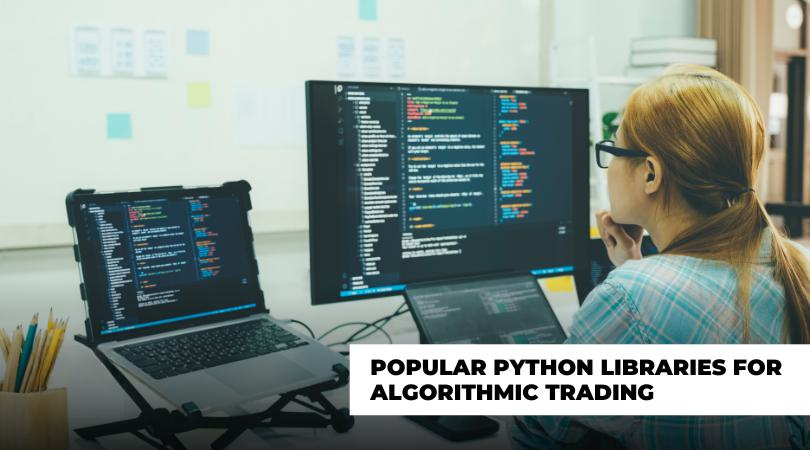

In this article, we explore the use of Python in algorithmic trading, focusing on its role in creating and optimizing trading strategies. Python has gained traction in the financial industry owing to its simplicity, versatility, and the extensive ecosystem of libraries designed for financial modeling and analysis. The language's readability and ease of use make it accessible for developers and traders alike, enabling them to develop complex trading algorithms without excessive overhead.

Python's flexibility is further enhanced by its interoperability, allowing seamless integration with various financial platforms and APIs. This facilitates the retrieval of real-time and historical financial data, which is crucial for effective algorithmic trading. Furthermore, Python offers an impressive suite of libraries like Pandas for data manipulation, NumPy for numerical computations, and Matplotlib for data visualization, all of which are fundamental in helping traders analyze market trends and craft robust trading strategies.



Our objective is to equip readers with a comprehensive understanding of Python's application in algorithmic trading, focusing on the essential libraries that power this ecosystem. Whether you're a beginner or an experienced trader, this article aims to enhance your trading strategies by demonstrating the power and capabilities of Python. By leveraging Python's rich library support and easy-to-use syntax, traders can transition towards data-driven decision-making, thus optimizing their trading strategies and increasing their potential for return on investment.

## Table of Contents

## Understanding Algorithmic Trading

Algorithmic trading refers to the practice of using computer algorithms to automate the process of making trading decisions and executing orders in financial markets. These algorithms are designed to analyze large volumes of data at high speeds, allowing traders to act on market opportunities that would be impractical to capture manually due to their rapid nature.

The foundation of algorithmic trading lies in the use of predefined rules and mathematical models that analyze historical data to identify patterns and signals. This analysis is often conducted using statistical methods and quantitative techniques, which can include time series analysis, regression analysis, and probabilistic modeling. The goal is to develop a strategy that can effectively anticipate market movements and optimize trade execution to maximize returns while minimizing risks.

Algorithmic trading strategies can be broad and multifaceted, often incorporating elements such as market trends, price movements, volume data, and economic indicators. For example, a simple moving average crossover strategy might buy a stock when a short-term moving average crosses above a long-term moving average and sell when the reverse occurs. This kind of strategy can be easily coded in Python:

```python
import pandas as pd

# Sample data: closing prices in a DataFrame
data = pd.DataFrame({
    'date': pd.date_range(start='2023-01-01', periods=100),
    'close': [round(100 + i*0.1 + (-1)**i*i*0.5, 2) for i in range(100)]  # Simulated prices
})

# Calculate moving averages
data['short_mavg'] = data['close'].rolling(window=5, min_periods=1).mean()
data['long_mavg'] = data['close'].rolling(window=20, min_periods=1).mean()

# Generate buy/sell signals
data['signal'] = 0
data.loc[data['short_mavg'] > data['long_mavg'], 'signal'] = 1
data.loc[data['short_mavg'] < data['long_mavg'], 'signal'] = -1

# Display signals
data[['date', 'close', 'short_mavg', 'long_mavg', 'signal']]
```

The effectiveness of [algorithmic trading](/wiki/algorithmic-trading) is often assessed through [backtesting](/wiki/backtesting), a process where the strategy is tested against historical data to evaluate its potential performance in real market conditions. This allows traders to refine their models before deploying them in live trading environments.

As financial markets continue to evolve, algorithmic trading stands as a testament to the synergy between technology and finance, enabling traders to harness computational power for enhanced decision-making and execution.

## Why Python for Algorithmic Trading?

Python has become a preferred language for algorithmic trading due to its simplicity, readability, and comprehensive range of libraries which assist in data analysis, data fetching, and backtesting. One of Python’s significant advantages is its user-friendly syntax, which ensures accessibility for both beginners and experienced programmers. This feature allows traders to focus more on developing and optimizing their trading strategies rather than on complex programming intricacies.

Python’s strength lies in its extensive ecosystem of libraries, which are essential for efficient data management. For instance, the Pandas library is fundamental for data manipulation, offering data structures and operations for manipulating numerical tables and time series. It provides functionality that is essential for handling and analyzing financial data, such as data alignment, reshaping, and splitting-application-combination of data. Similarly, NumPy, another core library, facilitates numerical calculations by providing support for large, multi-dimensional arrays and matrices, alongside a collection of mathematical functions to operate on these arrays.

Python’s compatibility with various Application Programming Interfaces (APIs) is another reason for its preference in algorithmic trading. API integration supports real-time financial data collection and allows traders to execute high-frequency trading, where speed and efficiency are critical. Moreover, Python's ability to interact seamlessly with web services and extract data makes it invaluable for traders who rely on timely and accurate data for decision-making.

For data visualization, Matplotlib is a versatile library used to create static, animated, and interactive visualizations in Python. It helps traders visualize data patterns and insights effectively, aiding in the interpretation and analysis of complex data sets that inform trading decisions.

The flexibility and efficiency python provides through its libraries make it an attractive option for developers of algorithmic trading systems. These libraries enable traders to implement and refine trading algorithms efficiently while providing the necessary tools to adapt to rapidly changing financial environments. Thus, coupled with its powerful ecosystem, Python remains an integral tool for both innovative and practical applications in algorithmic trading.

## Key Python Libraries for Algorithmic Trading

In algorithmic trading, the choice of tools can significantly impact the efficiency and success of trading strategies. Python, with its robust ecosystem of libraries, provides extensive capabilities for gathering, analyzing, and leveraging financial data. Here are some key Python libraries that are particularly useful for algorithmic trading:

**yFinance and Alpha Vantage**  
These libraries simplify the process of fetching historical and real-time financial data. `yFinance` provides an easy interface to access data from Yahoo Finance, whereas `Alpha Vantage` offers a rich suite of APIs to obtain stock historical data, fundamental data, and real-time prices. Both libraries offer efficient data retrieval, making them essential for traders who rely on timely market data.

```python
import yfinance as yf  # For more datasets, visit: https://paperswithbacktest.com/datasets

# Fetch historical market data for Apple
data = yf.download('AAPL', start='2022-01-01', end='2022-12-31')
```

**Pandas and NumPy**  
`Pandas` and `NumPy` are foundational libraries for data manipulation and numerical computation, respectively. Pandas provides data structures like DataFrames to efficiently handle large datasets, enabling traders to perform operations such as filtering, sorting, and aggregating data with ease. `NumPy`, with its array-focused operations, supports high-performance mathematical computations essential in quantitative analysis.

```python
import pandas as pd
import numpy as np

# Example of using Pandas and NumPy for data manipulation
returns = data['Close'].pct_change()
mean_return = np.mean(returns)
```

**TA-Lib**  
The Technical Analysis Library (`TA-Lib`) is specifically designed for technical analysis. It offers over 150 indicators such as moving averages, RSI, MACD, and stochastics. These indicators are crucial for traders who use chart patterns and indicators to make trading decisions. TA-Lib's efficient C++ implementation ensures performance, even when working with large datasets.

```python
import talib

# Calculate the Relative Strength Index
rsi = talib.RSI(data['Close'])
```

**Backtrader**  
`Backtrader` is a comprehensive library that allows traders to backtest their trading strategies on historical data. It provides functionalities to test the viability of strategies before deploying them in live markets. Backtrader simulates the application of a strategy across historical data, providing insights into performance metrics like win rates, risk-adjusted returns, and drawdowns.

```python
import backtrader as bt

# Simple moving average strategy implementation
class SmaCross(bt.SignalStrategy):
    def __init__(self):
        sma1, sma2 = bt.ind.SMA(period=10), bt.ind.SMA(period=30)
        self.signal_add(bt.SIGNAL_LONG, sma1 - sma2)
```

**Scikit-learn and TensorFlow**  
Libraries like `Scikit-learn` and `TensorFlow` facilitate the integration of [machine learning](/wiki/machine-learning) into trading strategies. Scikit-learn offers tools for predictive modeling, including regression, classification, and clustering algorithms. TensorFlow provides advanced capabilities for [deep learning](/wiki/deep-learning), enabling the development of complex models like neural networks, suitable for uncovering intricate market patterns.

```python
from sklearn.ensemble import RandomForestClassifier

# Example of using Scikit-learn for predictive modeling
model = RandomForestClassifier()
model.fit(X_train, y_train)
predictions = model.predict(X_test)
```

Together, these libraries create a powerful suite that allows traders to construct, test, and optimize trading strategies comprehensively. By leveraging these tools, traders can enhance their algorithmic trading processes, ultimately making data-driven decisions more effectively.

## Developing Algorithmic Trading Strategies with Python

To start developing an algorithmic trading strategy with Python, it is imperative to understand market indicators and trends, which are foundational elements of any trading strategy. Market indicators such as moving averages, [momentum](/wiki/momentum) indicators, and [volume](/wiki/volume-trading-strategy) indicators provide insights into potential future price movements. Understanding these indicators enables traders to identify patterns and develop quantitative strategies that can be automated.

Python allows traders to leverage data-driven strategies by backtesting them using historical data, which involves simulating how a strategy would have performed in the past. This approach requires significant data manipulation and analysis, tasks well-suited to Python's robust libraries such as Pandas and NumPy. A basic example of a backtesting setup in Python might involve:

```python
import pandas as pd
import numpy as np

# Load historical data
data = pd.read_csv('historical_stock_data.csv')

# Calculate moving averages
data['SMA50'] = data['Close'].rolling(window=50).mean()
data['SMA200'] = data['Close'].rolling(window=200).mean()

# Define buy and sell signals
data['Buy_Signal'] = np.where(data['SMA50'] > data['SMA200'], 1, 0)
data['Sell_Signal'] = np.where(data['SMA50'] < data['SMA200'], 1, 0)

# Backtest strategy performance
data['Strategy_Return'] = np.log(data['Close'] / data['Close'].shift(1)) * data['Buy_Signal']
cumulative_return = data['Strategy_Return'].cumsum().apply(np.exp)
```

In the above code, a simple moving average crossover strategy is constructed where buy signals are generated when the 50-day moving average crosses above the 200-day moving average. Conversely, sell signals occur when the opposite happens. The strategy's performance is assessed by calculating the logarithmic returns during periods where the buy signal is active.

Backtesting not only allows traders to evaluate the effectiveness of a strategy but also aids in optimizing it. By analyzing the results, traders can refine their strategies, adjusting parameters such as the duration for moving averages, to improve profitability. Importantly, this optimization process must also incorporate live market conditions to adapt to the ever-evolving market dynamics.

Incorporating these real-time adaptations is facilitated by Python's integration capabilities with various data sources and APIs, allowing for seamless updates to trading strategies. Moreover, optimization often involves machine learning techniques, where libraries such as Scikit-learn or TensorFlow can be used for predictive modeling, enhancing the strategy's predictive power.

Effective development of algorithmic trading strategies with Python, therefore, involves a continuous cycle of backtesting, performance evaluation, and optimization to enhance strategy robustness and adaptiveness in real-time markets.

## Challenges and Limitations

Python is widely acclaimed for its versatility and ease of use, making it a favored language for algorithmic trading. However, it also presents certain challenges and limitations, especially when employed for high-frequency trading ([HFT](/wiki/high-frequency-trading-strategies)). Due to Python's interpreted nature, it typically executes code slower than compiled languages like C++ or Java. This slower execution can hinder performance when microseconds can make a difference in trading. As such, Python may not always be the optimal choice for strategies requiring ultra-low latency.

Financial trading strategies are underpinned by complex algorithms and financial theories. A thorough understanding of these is crucial, as poorly designed strategies can potentially lead to significant financial losses. For instance, while implementing a statistical [arbitrage](/wiki/arbitrage) strategy, incorrect assumptions in mean reversion models could result in unintended exposures to market risk. Therefore, traders must possess a solid grasp of both quantitative modeling and the domain-specific intricacies of financial markets to develop robust trading algorithms.

Another pressing challenge is regulatory compliance. Algorithmic trading is subject to strict regulations that differ across jurisdictions. Compliance requires traders to ensure their algorithms adhere to applicable trading laws and regulations. This might involve maintaining detailed audit trails of algorithmic decisions, limits on order types, and implementing features that mitigate market manipulation risks. Non-compliance could result in severe penalties, making it imperative for algorithmic traders to incorporate regulatory checks within their strategies.

In summary, while Python is a powerful tool for developing trading algorithms, its performance limitations in high-frequency settings, the necessity of profound domain knowledge, and the complexities of regulatory compliance present notable challenges that must be carefully managed.

## Future of Python in Algorithmic Trading

The integration and evolution of Python libraries within the financial ecosystem suggest a promising trajectory for algorithmic trading. As Python libraries continuously advance, they enable seamless data analysis, fetching, backtesting, and machine learning, all vital components for robust algorithmic trading systems. This improvement extends to enhanced data handling, better analysis tools, and more efficient algorithms, facilitating the development of sophisticated trading strategies.

Moreover, the landscape of algorithmic trading is being reshaped by advancements in hardware and cloud computing. These technologies have the potential to alleviate Python's innate performance constraints, primarily associated with its status as an interpreted language. By leveraging the computational power of high-performance hardware and scalable cloud-based solutions, traders can execute strategies with greater speed and precision, enabling Python to support a wider array of trading activities, potentially even those requiring high-frequency execution.

Python is expected to continue its pivotal role in financial technology innovation. Its ability to support rapid prototyping and agile development processes is highly valued, allowing traders and developers to quickly create, test, and deploy algorithmic strategies. The language's simplicity not only facilitates the swift conversion of trading ideas into functional prototypes but also promotes the integration of complex machine learning models into trading algorithms, enhancing predictive accuracy and decision-making capabilities.

In summary, the future of Python in algorithmic trading looks intrinsic to the evolving landscape of financial markets. As libraries mature and integrate more deeply with financial systems, Python's versatility and efficiency will likely become even more pronounced, fortifying its standing as a critical tool for traders seeking to optimize their algorithmic strategies and maintain a competitive edge in the market.

## Conclusion

Python's capabilities and extensive library support make it an excellent choice for algorithmic trading, offering flexibility and ease of use. The language's user-friendly syntax and extensive range of libraries allow traders to efficiently build, test, and implement trading strategies. This creates a lower barrier to entry for newcomers to the financial industry and provides experienced traders with robust tools to enhance their trading systems.

As traders increasingly adopt data-driven approaches, Python's role in the financial market is expected to grow. Market participants are recognizing the value of harnessing vast amounts of data and applying advanced analysis techniques to gain insights and make informed trading decisions. Python’s libraries, such as Pandas for data manipulation and Scikit-learn for implementing machine learning models, enable these developments by providing essential tools for processing and analyzing large datasets effectively.

Furthermore, Python can significantly enhance trading efficiency and effectiveness when used correctly, yielding substantial advantages over manual trading methods. Automation reduces human errors and allows trades to be executed at speeds and scales that manual processes cannot match. The capacity to backtest strategies with historical data further aids in optimizing these strategies before committing capital in live market conditions. This capability minimizes risk and maximizes potential returns, making Python an invaluable asset in algorithmic trading.

In conclusion, Python's dynamic ecosystem and ease of integration with other systems make it a worthwhile investment for traders seeking to leverage technology for improved trading outcomes. As the financial landscape evolves, the adoption of Python is likely to increase, cementing its position as a key facilitator of innovation in trading.

## References & Further Reading

[1]: Bergstra, J., Bardenet, R., Bengio, Y., & Kégl, B. (2011). ["Algorithms for Hyper-Parameter Optimization."](https://papers.nips.cc/paper/4443-algorithms-for-hyper-parameter-optimization) Advances in Neural Information Processing Systems 24.

[2]: ["Advances in Financial Machine Learning"](https://www.amazon.com/Advances-Financial-Machine-Learning-Marcos/dp/1119482089) by Marcos Lopez de Prado

[3]: ["Evidence-Based Technical Analysis: Applying the Scientific Method and Statistical Inference to Trading Signals"](https://www.amazon.com/Evidence-Based-Technical-Analysis-Scientific-Statistical/dp/0470008741) by David Aronson

[4]: ["Machine Learning for Algorithmic Trading"](https://github.com/stefan-jansen/machine-learning-for-trading) by Stefan Jansen

[5]: ["Quantitative Trading: How to Build Your Own Algorithmic Trading Business"](https://books.google.com/books/about/Quantitative_Trading.html?id=j70yEAAAQBAJ) by Ernest P. Chan