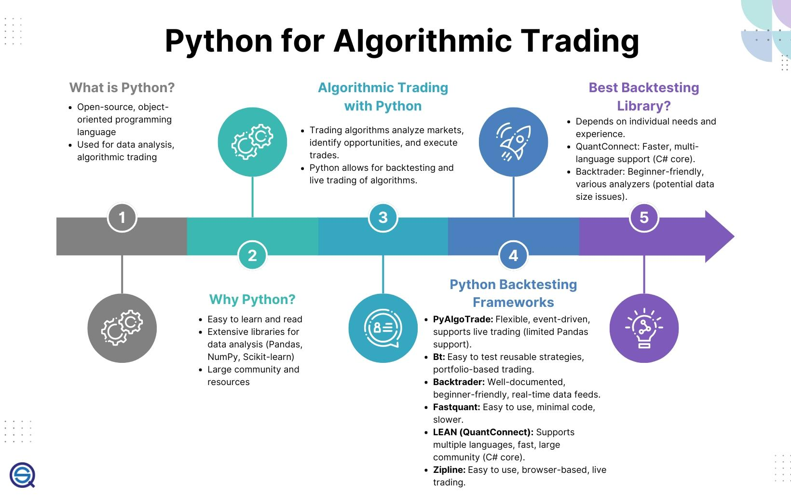

## Table of Contents

## What is a trading strategy in the context of Python programming?

A trading strategy in the context of Python programming is a set of rules and conditions that a program follows to buy and sell financial assets like stocks, currencies, or commodities. These strategies are coded in Python, which is a popular programming language because it's easy to use and has many tools and libraries for financial analysis. When you write a trading strategy in Python, you tell the computer exactly when to buy or sell based on things like price movements, market trends, or other data you choose.

To create a trading strategy, you might use Python libraries like pandas for data manipulation, numpy for numerical operations, and matplotlib for plotting graphs. You can also use specialized libraries like Backtrader or Zipline, which are designed specifically for developing and testing trading strategies. Once your strategy is coded, you can test it using historical data to see how it would have performed in the past. This helps you refine the strategy before using it with real money, making sure it's as effective as possible.

## How can beginners start implementing a simple trading strategy using Python?

To start implementing a simple trading strategy using Python, beginners should first get familiar with the basics of Python programming. They need to learn how to install and use Python, and get comfortable with libraries like pandas and numpy. Pandas is great for working with data, like stock prices, while numpy helps with math operations. Once they have these basics down, beginners can start by writing a simple script that reads in stock price data from a CSV file or an online source like Yahoo Finance. This data will be the foundation of their trading decisions.

Next, they can create a simple rule-based strategy. For example, they might decide to buy a stock when its price goes above a certain moving average and sell it when it drops below that average. To do this, they'll use pandas to calculate the moving average and then write conditions in their script to trigger buy and sell actions based on this calculation. It's important for beginners to test their strategy using historical data to see how it would have worked in the past. This process is called backtesting, and it helps them refine their strategy before using real money. By starting with these simple steps, beginners can gradually build more complex and effective trading strategies.

## What are the essential libraries for developing trading strategies in Python?

To develop trading strategies in Python, you need to know about some essential libraries. One important library is pandas. Pandas helps you work with data, like stock prices. You can use it to read data from files, clean it up, and calculate things like moving averages. Another useful library is numpy. Numpy is great for doing math operations quickly. It can help you with calculations that are important for your trading strategy.

Another key library is matplotlib. Matplotlib lets you make charts and graphs, which are helpful for seeing how your strategy is working. You can plot stock prices, moving averages, and other indicators to understand market trends better. For more specific trading tasks, libraries like Backtrader and Zipline are very useful. These libraries are made just for building and testing trading strategies. They help you automate the process of backtesting, which means checking how your strategy would have done in the past.

By using these libraries, you can create a strong foundation for your trading strategy. They make it easier to handle data, do calculations, and test your ideas. As you get more comfortable with these tools, you can start adding more complex rules to your strategy and improve it over time.

## How do you use historical data to backtest a trading strategy in Python?

To backtest a trading strategy in Python, you first need to get historical data for the stocks or other assets you want to trade. You can download this data from sources like Yahoo Finance or use a library like pandas-datareader to fetch it directly into your Python script. Once you have the data, you can use pandas to organize it into a DataFrame, which makes it easy to work with. This data will include things like the opening and closing prices of the stock, which you'll use to test your strategy.

Next, you'll write your trading strategy as a set of rules in Python. For example, you might decide to buy a stock when its price goes above its 50-day moving average and sell it when it drops below. You can use pandas to calculate the moving average from your historical data. Then, you'll loop through the data day by day, applying your rules to see when your strategy would have told you to buy or sell. Libraries like Backtrader or Zipline can make this process easier by automating the backtesting. After running your backtest, you'll look at how your strategy would have performed in the past, checking things like how much money you would have made or lost. This helps you see if your strategy works well and where you might need to make changes.

## What are common performance metrics used to evaluate a trading strategy?

When you want to see how good your trading strategy is, you look at some common performance metrics. One important metric is the total return, which shows how much money your strategy would have made or lost over time. Another key metric is the Sharpe Ratio, which tells you if the returns are good compared to the risk you're taking. A higher Sharpe Ratio means your strategy is doing well for the amount of risk involved. You also look at the maximum drawdown, which is the biggest loss your strategy would have had from its highest point to its lowest point. This helps you understand the worst-case scenario and how much you might lose.

Another useful metric is the win rate, which is the percentage of trades that make money. If your win rate is high, it means more of your trades are successful. You also need to look at the average win and average loss, which tell you how much you typically gain or lose on winning and losing trades. The profit factor, which is the total wins divided by the total losses, gives you an idea of how profitable your strategy is overall. By looking at these metrics, you can get a good picture of how your trading strategy performs and where you might need to make improvements.

## How can you incorporate risk management into a Python trading strategy?

To incorporate risk management into a Python trading strategy, you need to set rules that help control how much you could lose. One way to do this is by using stop-loss orders. In your Python code, you can write a rule that automatically sells a stock if its price drops to a certain level. This stops you from losing too much money on a single trade. Another way is to limit the size of each trade. You can write code to make sure you never put more than a certain percentage of your total money into one trade. This way, even if a trade goes bad, it won't hurt your whole strategy too much.

You can also use position sizing in your Python script to manage risk. Position sizing means deciding how much of your money to use for each trade based on how risky it is. For example, if a stock is very volatile, your code can tell you to use less money for that trade. Another important thing is to diversify. In your Python strategy, you can write rules to spread your money across different stocks or other assets. This way, if one investment goes down, the others might still do well, balancing out your risk. By adding these rules to your Python trading strategy, you can make sure you're not taking on too much risk and protect your money better.

## What advanced techniques can be used to optimize a trading strategy in Python?

To make your trading strategy better in Python, you can use a technique called genetic algorithms. These are like nature's way of improving things over time. You start with a bunch of different versions of your strategy, kind of like a population. Then, you see how well each version does using historical data. The best ones get to "have kids" and create new versions that are a mix of the good parts from their "parents." Over many rounds, this process helps you find the best strategy. It's like survival of the fittest, but for trading rules.

Another advanced technique is machine learning. You can teach a computer to find patterns in stock prices or other data that you might not see easily. For example, you can use a type of machine learning called reinforcement learning, where the computer learns by trying different actions and seeing what works best. This can help your strategy adapt to new market conditions. To use these techniques in Python, you'll need to learn about libraries like scikit-learn for machine learning and DEAP for genetic algorithms. By using these advanced methods, you can make your trading strategy smarter and more effective.

## How do machine learning models enhance trading strategies in Python?

Machine learning models can make trading strategies better by finding patterns in data that are hard for people to see. For example, a model can look at lots of past stock prices and other information to figure out when it's a good time to buy or sell. This is called predictive modeling. By using machine learning, your trading strategy can learn from the past and make smarter decisions. It's like having a smart friend who can spot trends and help you make better trades.

Another way machine learning helps is by adapting to new market conditions. Markets change all the time, and what worked yesterday might not work today. With machine learning, your strategy can keep learning and adjusting. This is called reinforcement learning. The model tries different actions and learns from the results, getting better over time. By using machine learning in Python, you can create a trading strategy that not only uses past data but also gets smarter as it goes along, helping you make more money and take less risk.

## What are the challenges of real-time trading strategy execution using Python?

Real-time trading strategy execution using Python can be tricky because it needs to happen very quickly. When you're trading in real time, you need to get the latest stock prices and make decisions in just a few seconds. If your Python code is slow, you might miss good trading chances or make bad trades. Also, you need to make sure your computer and internet are fast enough to keep up with the markets. If they're not, your strategy won't work well.

Another challenge is dealing with lots of data at the same time. Real-time trading means you're always getting new information, and your Python script has to handle it without getting overwhelmed. You need to write your code in a way that it can process data quickly and make decisions on the spot. Plus, you have to be careful about mistakes in your code. If there's a bug, it could cause you to make wrong trades, which can be costly. So, you need to test your strategy a lot to make sure it works right in real time.

## How can you integrate Python trading strategies with financial APIs and data feeds?

To use Python trading strategies with financial APIs and data feeds, you first need to connect your Python code to these sources of information. APIs, or Application Programming Interfaces, let you get real-time data from places like stock exchanges or financial data providers. You can use libraries like `yfinance` or `pandas-datareader` to pull in this data easily. For example, you might use `yfinance` to get the latest stock prices from Yahoo Finance. Once you have this data in your Python script, you can use it to make trading decisions based on your strategy.

After you get the data, you need to make sure your trading strategy can handle it in real time. This means your code has to be fast enough to process the new data as it comes in and make quick decisions. You might use libraries like `ccxt` to connect to different cryptocurrency exchanges and execute trades automatically. It's important to test your strategy a lot to make sure it works well with the real-time data. By connecting your Python trading strategies to financial APIs and data feeds, you can make your trades based on the most up-to-date information, which can help you make better decisions.

## What are the best practices for maintaining and scaling a Python trading strategy?

To keep your Python trading strategy working well and growing over time, it's important to always check and update your code. You need to make sure your strategy is still working with the latest market conditions. This means you should test your strategy often with new data to see if it's still making good trades. If you find problems, fix them quickly. It's also a good idea to use version control, like Git, to keep track of changes you make to your code. This way, if something goes wrong, you can go back to an earlier version that worked better.

Scaling your trading strategy means making it handle more trades and bigger amounts of money. To do this, you need to make sure your code can work faster and handle more data. You might need to use more powerful computers or cloud services to run your strategy. Also, think about how to make your strategy work with different markets or types of assets. This can help you spread your risk and make more money. By following these steps, you can keep your trading strategy strong and ready to grow.

## How do regulatory considerations affect the deployment of Python trading strategies?

When you want to use your Python trading strategy in the real world, you need to think about the rules that govern trading. Different countries have different laws about trading, like how much money you can trade with or what kind of information you need to share. For example, some places might say you need a special license to trade, or you might have to report your trades to a government agency. If your Python code doesn't follow these rules, you could get in trouble or lose money. So, it's important to make sure your strategy fits within the legal limits of where you're trading.

Also, you need to think about how to keep your trading strategy safe and fair. Some rules are there to stop people from cheating or using secret information to make money. Your Python code should be set up to avoid doing anything that might look like insider trading or market manipulation. This means you might need to add checks in your code to make sure you're following these rules. By understanding and following the regulations, you can use your Python trading strategy in a way that's both effective and legal.

## How can moving averages be used in trading strategies?

Moving averages are integral components of many trading strategies due to their ability to smooth out price data and highlight underlying trends. By reducing the 'noise' in daily price movements, moving averages help traders make more informed decisions about potential buy or sell signals.

A moving average is calculated by averaging the closing prices of a financial asset over a specified number of periods. The simplest form is the Simple Moving Average (SMA), which calculates the arithmetic mean of a set number of past prices. The formula for SMA over $n$ periods is expressed as:

$$
\text{SMA}_n = \frac{P_1 + P_2 + \ldots + P_n}{n}
$$

where $P_1, P_2, \ldots, P_n$ are the closing prices for $n$ periods.

Another popular type is the Exponential Moving Average (EMA), which gives more weight to recent prices, making it more responsive to new information. The EMA is calculated using the formula:

$$
\text{EMA}_t = \alpha \times P_t + (1 - \alpha) \times \text{EMA}_{t-1}
$$

Where:
- $P_t$ is the current price,
- $\alpha$ is the smoothing factor, calculated as $\frac{2}{n+1}$,
- $\text{EMA}_{t-1}$ is the EMA of the previous period.

### Implementing Moving Averages in Python

Python provides several libraries that facilitate the computation and analysis of moving averages. Let's see how moving averages can be implemented using Pandas, a powerful data manipulation library:

```python
import pandas as pd

# Sample data: a Pandas DataFrame with a 'Close' column representing the closing prices
data = {
    'Close': [150, 152, 153, 151, 154, 156, 157, 158, 159, 160]
}
df = pd.DataFrame(data)

# Calculate Simple Moving Average (SMA) for a 3-day window
df['SMA_3'] = df['Close'].rolling(window=3).mean()

# Calculate Exponential Moving Average (EMA) for a 3-day window
df['EMA_3'] = df['Close'].ewm(span=3, adjust=False).mean()

print(df)
```

### Application of Moving Averages in Detecting Trends

Moving averages are employed in diverse strategies to identify trends. A common approach is the usage of moving average crossovers. For instance, in the Simple Moving Average Crossover (SMAC) strategy, a short-term SMA crossing above a long-term SMA can indicate a buy signal, while crossing below may signal a sell opportunity.

Visualizing these crossovers helps traders to spot entry and [exit](/wiki/exit-strategy) points efficiently:

```python
import matplotlib.pyplot as plt

plt.figure(figsize=(10,5))
plt.plot(df['Close'], label='Closing Prices')
plt.plot(df['SMA_3'], label='3-day SMA', linestyle='--')
plt.plot(df['EMA_3'], label='3-day EMA', linestyle=':')
plt.title('Stock Prices with Moving Averages')
plt.xlabel('Days')
plt.ylabel('Price')
plt.legend()
plt.show()
```

By plotting moving averages alongside stock prices, traders can observe how these lines intersect and use these interactions to guide trading decisions. The robustness of this tool in smoothing data and highlighting trends makes moving averages a cornerstone of algorithmic trading strategies.

## What are the methods for backtesting and optimizing trading strategies?

Backtesting is an essential process in developing and optimizing trading strategies, providing a means to evaluate how a strategy would have performed based on historical data. This practice is crucial for assessing the feasibility and effectiveness of a trading strategy before committing real capital. Quantopian, which was a popular platform for algorithmic trading, offered tools to backtest and refine strategies by simulating their performance against historical financial data (Note: Quantopian ceased operations in 2020, but similar platforms and tools exist such as QuantConnect or local backtest frameworks).

**The Role of Key Metrics in Backtesting**

Analyzing specific metrics during [backtesting](/wiki/backtesting) is crucial for understanding the potential risk and reward dynamics of a trading strategy. Three primary metrics used are:

1. **Total Return**: This metric represents the overall gain or loss generated by the trading strategy over the backtesting period. It is calculated by the formula:
$$
   \text{Total Return} = \frac{\text{Final Portfolio Value} - \text{Initial Portfolio Value}}{\text{Initial Portfolio Value}} \times 100\%

$$

   A positive total return indicates profitability, while a negative return reflects a loss.

2. **Sharpe Ratio**: This metric gauges the risk-adjusted return of a trading strategy. It measures how many units of return you receive per unit of risk, with the risk defined as the standard deviation of the strategy's excess return (returns above the risk-free rate). The formula is:
$$
   \text{Sharpe Ratio} = \frac{E[R_p - R_f]}{\sigma_p}

$$

   where $E[R_p - R_f]$ is the expected excess return and $\sigma_p$ is the standard deviation of the portfolio's excess return. A higher Sharpe Ratio is preferable as it signifies a more efficient risk-return trade-off.

3. **Max Drawdown**: This metric measures the largest peak-to-trough decline in the portfolio value over the backtesting period, providing insight into the worst potential loss. It is expressed as:
$$
   \text{Max Drawdown} = \frac{\text{Trough Value - Peak Value}}{\text{Peak Value}}

$$

   A smaller max drawdown is favorable as it indicates less severe potential losses in adverse market conditions.

**Python Code for Backtesting**

To demonstrate backtesting with Python, consider a simple moving average crossover strategy. The following is an example of using Python with the `Backtrader` library to backtest a strategy:

```python
import backtrader as bt

class SMACrossover(bt.SignalStrategy):
    def __init__(self):
        sma1 = bt.ind.SMA(period=10)
        sma2 = bt.ind.SMA(period=20)
        crossover = bt.ind.CrossOver(sma1, sma2)
        self.signal_add(bt.SIGNAL_LONG, crossover)

cerebro = bt.Cerebro()
cerebro.addstrategy(SMACrossover)

data = bt.feeds.YahooFinanceData(dataname='AAPL', fromdate=datetime(2015, 1, 1), todate=datetime(2020, 1, 1))
cerebro.adddata(data)

cerebro.run()
cerebro.plot()
```

This code sets up a simple moving average crossover strategy, backtests it on historical data from Yahoo Finance for Apple Inc., and plots the results.

**Conclusion**

Backtesting enables traders to evaluate the historical performance of trading strategies, offering data-driven insights into their effectiveness and risk profiles. By scrutinizing metrics such as total return, Sharpe ratios, and max drawdown, traders can gain an understanding of a strategy's potential profitability and drawdowns. Additionally, utilizing Python and backtesting libraries provides flexibility and power in refining trading strategies for robust performance in live markets.

## References & Further Reading

[1]: Bergstra, J., Bardenet, R., Bengio, Y., & Kégl, B. (2011). ["Algorithms for Hyper-Parameter Optimization."](https://papers.nips.cc/paper/4443-algorithms-for-hyper-parameter-optimization) Advances in Neural Information Processing Systems 24.

[2]: ["Advances in Financial Machine Learning"](https://www.amazon.com/Advances-Financial-Machine-Learning-Marcos/dp/1119482089) by Marcos Lopez de Prado

[3]: ["Evidence-Based Technical Analysis: Applying the Scientific Method and Statistical Inference to Trading Signals"](https://www.amazon.com/Evidence-Based-Technical-Analysis-Scientific-Statistical/dp/0470008741) by David Aronson

[4]: ["Machine Learning for Algorithmic Trading"](https://github.com/stefan-jansen/machine-learning-for-trading) by Stefan Jansen

[5]: ["Quantitative Trading: How to Build Your Own Algorithmic Trading Business"](https://books.google.com/books/about/Quantitative_Trading.html?id=j70yEAAAQBAJ) by Ernest P. Chan