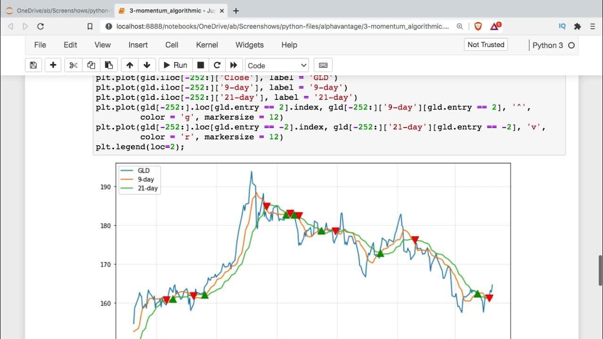

## Table of Contents

## What is Python and why is it popular for trading?

Python is a computer programming language that is easy to learn and use. It is used for many things, like making websites, analyzing data, and even creating games. In trading, Python is popular because it can handle numbers and data very well. Traders use Python to write programs that can quickly look at lots of information about stocks, currencies, and other things they trade.

One reason Python is popular for trading is that it has many tools and libraries that are made just for finance and trading. These tools help traders do things like predict how prices might change or manage their money better. Also, Python is free to use, which means anyone can start using it without spending money. This makes it easier for new traders to get started and for experienced traders to try new ideas without worrying about costs.

Another reason Python is popular is that it is supported by a big community of people who use it and help each other. This means if you have a problem or a question, you can often find help online. This community also creates and shares new tools and ideas, which keeps Python useful and up-to-date for trading. Overall, Python's ease of use, powerful tools, and supportive community make it a favorite choice for traders.

## How can beginners start using Python for trading?

To start using Python for trading, beginners should first learn the basics of Python programming. There are many free resources online, like tutorials and courses, that can help you learn how to write Python code. Once you feel comfortable with the basics, you can start looking at how Python is used in trading. A good next step is to find and use libraries like Pandas and NumPy, which are great for handling and analyzing data. These libraries are like special tools that make it easier to work with numbers and data, which is very important in trading.

After getting familiar with these libraries, beginners can start exploring trading-specific libraries like Backtrader or Zipline. These libraries are designed to help you test trading strategies using past data, which is called backtesting. This is a safe way to practice trading without risking real money. As you get more comfortable, you can join online communities where other traders share their experiences and code. This can help you learn faster and get ideas for your own trading strategies. Remember, starting with Python for trading takes time and practice, but with patience and the right resources, you can make good progress.

## What are the essential Python libraries for trading?

For trading with Python, some essential libraries are Pandas, NumPy, and Matplotlib. Pandas is great for handling and organizing data. It lets you easily read data from different places like files or the internet, and then sort, filter, or group it. NumPy is another important library that helps with math and numbers. It's fast and can handle big calculations, which is useful when you're working with lots of trading data. Matplotlib is used for making charts and graphs. It helps you see your data visually, which can make it easier to understand trends and patterns in the market.

Another set of important libraries for trading are Backtrader and Zipline. These are specifically made for testing trading strategies. Backtrader lets you write your trading rules and then see how they would have worked in the past. This is called backtesting, and it's a safe way to practice without losing real money. Zipline is similar but also lets you test your strategies in real-time, which can be helpful when you're ready to start trading for real. Both libraries are powerful tools that can help you learn and improve your trading skills.

Lastly, libraries like yfinance and ccxt are useful for getting data from financial markets. yfinance helps you pull data from Yahoo Finance, which is a popular place to get stock and other financial data. ccxt is great if you're interested in trading cryptocurrencies because it connects to many different crypto exchanges. These libraries make it easier to get the data you need to analyze and make trading decisions.

## How do you set up a trading environment with Python?

To set up a trading environment with Python, you first need to install Python on your computer. You can download it for free from the official Python website. Once Python is installed, you'll need to set up a place to write and run your code. A good choice is to use an Integrated Development Environment (IDE) like PyCharm or Visual Studio Code. These tools make it easier to write, test, and run your Python programs. After setting up your IDE, you'll need to install the essential libraries for trading. You can do this using a tool called pip, which comes with Python. For example, you can install Pandas by opening a command line and typing "pip install pandas".

Next, you'll want to start using these libraries to build your trading environment. Begin by learning how to use Pandas to handle and organize your trading data. You can practice by downloading some stock data from a website like Yahoo Finance and then using Pandas to look at it. After you're comfortable with Pandas, you can move on to using NumPy for calculations and Matplotlib for making charts. These tools will help you analyze your data and see trends. Once you're ready, you can start using libraries like Backtrader or Zipline to test your trading strategies. These libraries let you see how your strategies would have worked in the past, which is a safe way to practice trading without risking real money.

## What are the basic concepts of algorithmic trading using Python?

Algorithmic trading using Python involves using computer programs to make trading decisions based on data and rules. You write code that tells the computer what to look for in the market, like certain price patterns or trends. The computer then uses this code to decide when to buy or sell. This can be faster and more accurate than making decisions by hand. To do this, you need to learn how to use Python to handle data, make calculations, and test your strategies. Libraries like Pandas help you organize and analyze data, while NumPy helps with math. You can also use libraries like Backtrader or Zipline to test your strategies on past data, which is called backtesting.

Once you have your strategy coded, you can run it in real-time to see how it performs in the actual market. This is where libraries like yfinance or ccxt come in handy, as they help you get the latest market data. You can set up your program to automatically buy or sell based on the rules you've written. It's important to keep an eye on how your strategy is doing and make changes if needed. Algorithmic trading can be a powerful tool, but it takes time to learn and practice. Starting with simple strategies and gradually making them more complex can help you get better at it.

## How can you use Python to analyze financial data?

Python is a great tool for analyzing financial data because it can handle numbers and data very well. You can use libraries like Pandas to organize and look at your data. For example, if you have a list of stock prices, Pandas can help you sort them by date or find the highest and lowest prices. You can also use Pandas to calculate things like the average price or how much the price has changed over time. This makes it easier to see patterns and trends in the data, which is important for making good trading decisions.

Another useful library for analyzing financial data is NumPy, which helps with math and calculations. With NumPy, you can do things like find the standard deviation of stock prices, which tells you how much the prices move around. This can help you understand how risky a stock might be. You can also use Matplotlib to make charts and graphs of your data. Seeing your data in a visual way can make it easier to spot trends and patterns that you might miss just by looking at numbers. By using these libraries together, you can get a good understanding of your financial data and make better trading choices.

## What are some common trading strategies that can be implemented with Python?

One common trading strategy that can be implemented with Python is the Moving Average Crossover strategy. This strategy uses two moving averages, one short-term and one long-term, to decide when to buy or sell. When the short-term average goes above the long-term average, it's a signal to buy because the price is going up. When the short-term average goes below the long-term average, it's a signal to sell because the price is going down. You can use Python libraries like Pandas to calculate these moving averages and Matplotlib to see them on a chart. This strategy is simple but can be effective for beginners.

Another strategy is the Mean Reversion strategy. This strategy is based on the idea that prices will eventually return to their average value. If a stock's price goes much higher than its average, you might sell it because you think it will go back down. If the price goes much lower than its average, you might buy it because you think it will go back up. You can use Python to calculate the average price over time and compare it to the current price. Libraries like NumPy can help with these calculations, and you can use Backtrader to test how this strategy would have worked in the past.

A third strategy is the Trend Following strategy. This strategy tries to make money by following the direction of the market. If the market is going up, you buy and hold until it starts going down. If the market is going down, you sell or short sell until it starts going up. You can use Python to identify trends by looking at the slope of a moving average or using other indicators like the Relative Strength Index (RSI). Libraries like Pandas and NumPy can help you calculate these indicators, and you can use Zipline to test your trend-following strategy on historical data.

## How do you backtest trading strategies in Python?

To backtest trading strategies in Python, you first need to write your strategy as a set of rules in a Python program. These rules tell the computer when to buy or sell based on the data you give it. You can use libraries like Backtrader or Zipline to help you do this. These libraries let you load historical data, like past stock prices, and then run your strategy on that data to see how it would have worked. This is called backtesting, and it's a safe way to test your ideas without losing real money.

Once you have your strategy coded, you run the backtest using the library. The library will go through the historical data day by day, applying your rules to decide when to buy or sell. At the end, it will show you how much money you would have made or lost if you had used your strategy in the past. This helps you see if your strategy is good or if you need to make changes. You can keep tweaking your strategy and running more backtests until you're happy with the results.

## What are the advanced techniques for optimizing trading algorithms in Python?

To optimize trading algorithms in Python, one advanced technique is to use machine learning. Machine learning can help you find patterns in the data that you might not see otherwise. You can use libraries like scikit-learn to train models that predict how prices might change. For example, you can use a model to predict if a stock's price will go up or down based on past data. Once you have a good model, you can use it in your trading strategy to make better decisions. This can make your algorithm more accurate and help you make more money.

Another technique is to use genetic algorithms. These are like a way of making your strategy evolve over time. You start with a bunch of different versions of your strategy, and then you test them all to see which ones work best. The best ones get to "have babies" and make new versions that are a mix of the good parts of the parents. You keep doing this over and over, and the strategies get better and better. This can help you find the best possible version of your trading algorithm. It's like natural selection, but for trading strategies.

## How can Python be integrated with trading platforms and APIs?

Python can be integrated with trading platforms and APIs to make trading easier and more automatic. APIs, or Application Programming Interfaces, are like special tools that let your Python program talk to trading platforms. For example, you can use the API from a platform like Interactive Brokers or Binance to get real-time data about stock or cryptocurrency prices. You can also use these APIs to send orders to buy or sell, all from your Python program. This means you can write code that automatically makes trades based on the rules you set, without having to do it by hand.

To use these APIs, you first need to sign up for an account with the trading platform and get an API key. This key is like a special password that lets your Python program connect to the platform. Once you have the key, you can use libraries like ccxt or the platform's own library to write code that uses the API. For example, you can write a program that checks the price of a stock every minute and buys it if the price goes below a certain level. This way, you can set up your trading strategy to run automatically, which can save you time and help you make better trading decisions.

## What are the considerations for real-time trading with Python?

When you want to do real-time trading with Python, you need to think about how fast your program can run. Real-time trading means your program needs to make decisions very quickly, so it's important that your code is fast and efficient. You should use libraries like NumPy and Pandas that are good at handling data quickly. Also, make sure your computer is fast enough to run your program without slowing down. If your program takes too long to make a decision, you might miss good trading opportunities.

Another thing to consider is how you connect to the trading platform. You'll need to use an API to get real-time data and send orders. Make sure the API you choose is reliable and fast. Sometimes APIs can be slow or stop working, which can cause problems. It's a good idea to have a backup plan, like using more than one API or having a way to trade by hand if the API fails. Also, think about how much data you need to process. Real-time trading can create a lot of data, so you need to make sure your program can handle it without getting overwhelmed.

## How do experts use machine learning and AI in Python for trading?

Experts use machine learning and AI in Python for trading to make better predictions and decisions. They use libraries like scikit-learn to train models that can find patterns in past data, like stock prices or market trends. These models can then predict how prices might change in the future. For example, they might use a model to predict if a stock's price will go up or down based on things like news, economic reports, or even social media sentiment. By using these predictions, experts can make smarter trading choices and potentially make more money.

Another way experts use machine learning and AI is by using reinforcement learning. This is a type of AI where the computer learns by trying different actions and seeing what works best. In trading, the computer can try different strategies and see which ones make the most money. Over time, the computer gets better at choosing the best actions. This can help experts find new and better ways to trade that they might not have thought of before. By using these advanced techniques, experts can create trading algorithms that are more accurate and effective.

## References & Further Reading

[1]: ["Algorithmic Trading and DMA: An Introduction to Direct Access Trading Strategies"](https://www.amazon.com/Algorithmic-Trading-DMA-introduction-strategies/dp/0956399207) by Barry Johnson

[2]: ["Python for Data Analysis"](https://wesmckinney.com/book/) by Wes McKinney

[3]: ["Advances in Financial Machine Learning"](https://www.amazon.com/Advances-Financial-Machine-Learning-Marcos/dp/1119482089) by Marcos Lopez de Prado

[4]: ["Machine Learning for Algorithmic Trading"](https://github.com/stefan-jansen/machine-learning-for-trading) by Stefan Jansen

[5]: ["Python for Finance: Mastering Data-Driven Finance"](https://books.google.com/books/about/Python_for_Finance.html?id=2qd9DwAAQBAJ) by Yves Hilpisch

[6]: ["Quantitative Trading: How to Build Your Own Algorithmic Trading Business"](https://books.google.com/books/about/Quantitative_Trading.html?id=j70yEAAAQBAJ) by Ernest P. Chan

[7]: ["Evidence-Based Technical Analysis: Applying the Scientific Method and Statistical Inference to Trading Signals"](https://www.amazon.com/Evidence-Based-Technical-Analysis-Scientific-Statistical/dp/0470008741) by David Aronson

[8]: VanderPlas, J. (2016). ["Python Data Science Handbook: Essential Tools for Working with Data."](https://jakevdp.github.io/PythonDataScienceHandbook/)